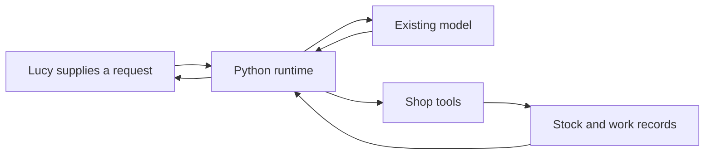
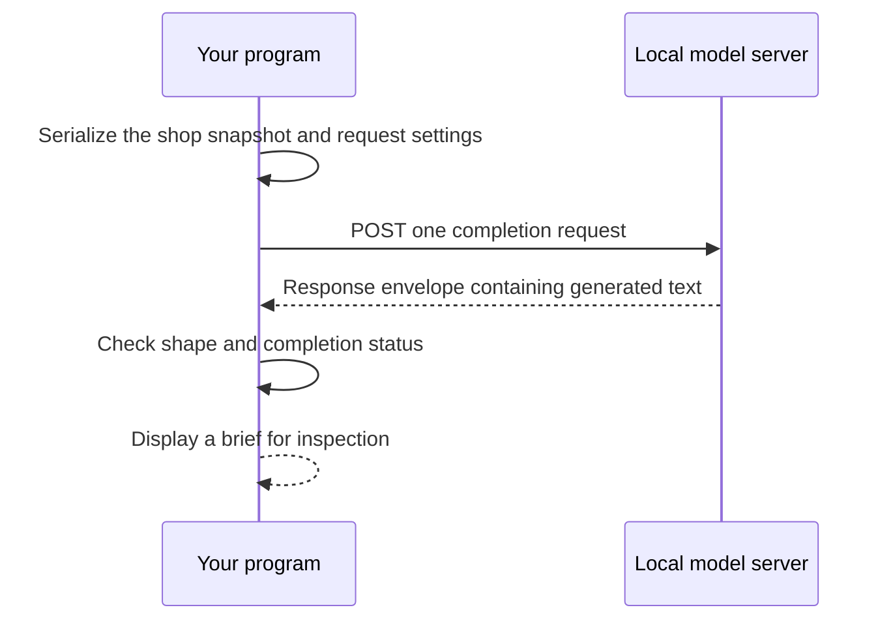
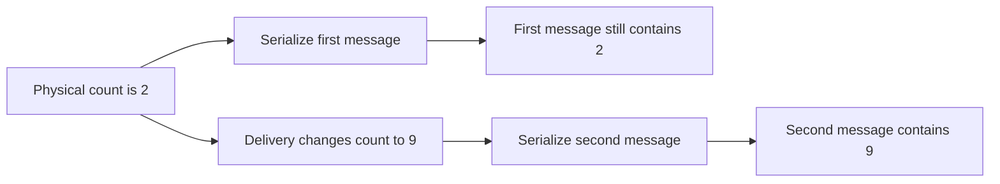

# Chapter 1 — Make the first model call for Lucy

Lucy opens her ice cream shop at nine. Before the first customer arrives, she checks the freezer, checks yesterday's notes, and decides what needs attention. Vanilla is running low. Chocolate is plentiful. Strawberry has almost gone. She would like a short briefing before opening, and eventually she would like help preparing the orders that follow.

You are the developer building that assistant. Lucy is your customer. She supplies the business rules and decides what the assistant may do; you turn those decisions into a system whose behavior she can inspect. Her first observable result is the shop's stock report.

This chapter ends with a small Python program that sends real shop data to a model and reads a morning brief. An offline response fixture makes the surrounding Python reproducible without a model server. A separate live command proves the model connection. Keep those two observations separate: a fixture proves how your program handles known bytes; a live response demonstrates what a configured model returned on that run.

In this book, a **model** generates a response, the **loop** decides which validated tool calls to execute next, and the **runtime** is the Python program that keeps the loop, tools and saved records working together. A **fixture** is synthetic input or an authored response used to reproduce an experiment.

For a classroom session, use the [standalone notebook and instructor guide](../educator/ch01-classroom-v1.md). The notebook runs offline on Python 3.11 or newer; the cumulative book environment below remains Python 3.14.

## Learning objectives

Build Lucy's first stock brief from explicit shop data, make a direct model request, and distinguish a useful model response from an agent that can act reliably while unattended.

You will be able to identify every field sent to the model, reject an incomplete response, and explain which components are still missing. By the end, you should be able to change one product's stock and predict which part of the request changes before you run the program.

## The system you will build

Our working promise is **Build Your Always-On AI Agent From Scratch**. You will write the model/tool loop, dispatch tools into Python functions, construct context, persist work, schedule it, check permissions, and recover interrupted actions. The model itself is an existing component. So are Python, SQLite, HTTP, the operating system's service manager, and the container engine used in a later chapter. You will not configure a finished agent framework and count that as implementing its loop.

Always-on describes availability for unattended work while the host and its dependencies are available. It does not mean continually calling a model. Most of a useful shop agent's day can consist of waiting. A scheduled stock check creates work; an ordinary second passing on the clock does not need to create another model request.

The final system will accept a message from Lucy's phone, prepare a draft from current stock, ask for approval when policy requires it, and reconcile a supplier order whose reply was lost. It will survive a process restart with its pending work and approvals intact. It will also produce an end-of-day report that distinguishes confirmed facts from unresolved outcomes.

Those are construction milestones. They are not all properties of the little program you are about to run. Today it receives data you supply, requests text, and returns that text. It has no purchasing tool and no unattended service.



**Figure:** The reader builds the runtime and shop tools around an existing model; the records remain outside the model's memory.

Keep this diagram nearby. In Chapter 2 you will add the tools. In Chapter 3 you will implement the cycle that lets a model request a tool, observe its result, and decide whether it has enough information. Later chapters add persistence and operating behavior around that cycle. The architecture grows because Lucy encounters a new problem, rather than because an architecture diagram needs another box.

### Three things that are easy to confuse

A **model** maps an input context to generated output. It may generate ordinary text or a structured request to call a tool. A generated tool request is still output. Some other program must decide whether to execute it.

An **agent loop** repeatedly calls the model, dispatches permitted tool requests, adds observations to the context, and stops under explicit conditions. That repetition is code you will write. The model does not secretly keep your Python process running after a response finishes.

A **runtime** supplies the things around the loop: durable intake, sessions, scheduling, permissions, execution boundaries, records, and recovery. A loop may complete successfully while its runtime loses the result during a crash. Conversely, a runtime may preserve perfect records of a model making a poor recommendation. We need to investigate both kinds of failure.

| Component | What it does | What it cannot establish by itself |
| --- | --- | --- |
| Model | Generates text or tool requests from context | Whether a supplier accepted an order |
| Agent loop | Coordinates model calls and permitted tools | Whether pending work survives a restart |
| Runtime | Preserves work, enforces boundaries, and supports operation | Whether every fluent recommendation is useful |

This separation lets us replace the model without replacing the ledger. It also lets us reproduce failures using scripted model responses. If a test can describe the next model output exactly, it can force the runtime into the situation we need to examine.

## Prepare one Python environment

The companion repository uses Python 3.14 and `uv`. Its lockfile pins the development environment. The installed runtime uses Pydantic for typed validation; the program in this chapter needs only Python's standard library. Use the repository revision attached to the edition or website page you are reading. Mixing one chapter's prose with a later unpinned checkout makes an output mismatch unnecessarily difficult to diagnose.

From a fresh checkout, run:

```bash
uv sync --frozen --python 3.14 --group dev
uv run --python 3.14 python --version
uv run --python 3.14 python book/always_on/checkpoints/ch01.py
```

The third command is the offline checkpoint. It makes no model request. Its opening line says `OFFLINE RESPONSE FIXTURE`, so an offline success cannot accidentally become evidence that a model server works.

For the live path, install Ollama using its documented installation procedure, start its local server, and obtain the model used by this chapter:

```bash
ollama pull qwen3
ollama list
```

A model download can take time and disk space. `ollama list` is the useful observation: it identifies the model installed on your machine. Record the model identifier and Ollama version with any live transcript you plan to compare later. A name such as `qwen3` is a convenient selection, while a recorded identifier tells a future reader which local model you actually used.

The example sends requests to `http://localhost:11434/v1/chat/completions`. This is a local model endpoint. It does not require a hosted API credential. A later provider appendix explains how to substitute a hosted compatible endpoint without scattering provider configuration throughout the shop code. For now, keep one working path.

Ollama documents tool support and reasoning controls on this compatible endpoint. This first request sets `reasoning_effort` to `none`, which is supported by the chapter's Qwen/Ollama path. A different model may require different settings; the shared runtime therefore exposes an explicit configuration choice instead of assuming every provider accepts the same fields. [Ollama's compatibility reference](https://docs.ollama.com/api/openai-compatibility).

The reproducible checkpoint is available even when the model is not. Use it to distinguish a Python or data problem from a provider problem before changing several things at once.

## Give the shop explicit data

Start with several products. Adding a second product later should not require redesigning the entire example around an assumption that stock is one integer. Each product has a stable SKU, a display name, a physical count, and a reorder point. In these teaching fixtures, the reorder point is also the replenishment target; a real shop might keep a separate reorder threshold and order-up-to level.

**Listing:** The first shop fixture contains several independently identifiable products.

```python
SHOP = {
    "customer": "Lucy",
    "currency": "GBP",
    "products": [
        {"sku": "SKU-VANILLA", "name": "Vanilla", "on_hand": 2, "reorder_point": 8},
        {"sku": "SKU-CHOCOLATE", "name": "Chocolate", "on_hand": 12, "reorder_point": 6},
        {"sku": "SKU-STRAWBERRY", "name": "Strawberry", "on_hand": 1, "reorder_point": 5},
    ],
}
print([(item["sku"], item["on_hand"]) for item in SHOP["products"]])
```

```text
[('SKU-VANILLA', 2), ('SKU-CHOCOLATE', 12), ('SKU-STRAWBERRY', 1)]
```

The SKU is the identity used in tool arguments and records. The name is what Lucy wants to read. Those roles are different. Renaming a display label should not make yesterday's order refer to a different product. The fixture uses readable identifiers so you can follow them through the code without decoding a sequence of opaque numbers.

`on_hand` means physical stock in the shop. It will remain different from reserved stock and incoming orders. An accepted order is not a delivery. When we add those concepts, the distinction will determine whether another replenishment request is necessary. We introduce only the physical count here, but choose a field name that does not pretend to represent every kind of availability.

Currency is explicit even though this first brief contains no prices. An earlier live construction run correctly calculated quantities and totals, then labeled the money as euros because its tool results supplied an ambiguous unit. That is a data-contract problem worth removing before we teach spending. Later tools use integer pence and the currency code GBP together. A familiar-looking money symbol in generated prose is not authoritative accounting evidence.

The model will receive this fixture as context. The fixture does not become more authoritative because the model repeats it. If the stock count changes after the request, the response still describes the old snapshot. This is why Chapter 2 moves stock lookup into a tool that reads current records when called.

### Make the request visible

We use two messages: an instruction describing the limited job, and a user message containing the shop data. JSON serialization preserves the field names and values in a format you can print and inspect.

```python
import json


def messages(shop):
    return [
        {
            "role": "system",
            "content": "Write a short morning stock brief for Lucy. "
            "Use only the supplied stock facts. Name products below their reorder points. "
            "Do not purchase anything or claim that an order exists.",
        },
        {"role": "user", "content": json.dumps(shop, sort_keys=True)},
    ]


request_messages = messages(SHOP)
print([message["role"] for message in request_messages])
print(json.loads(request_messages[1]["content"])["currency"])
```

```text
['system', 'user']
GBP
```

The instruction describes a job; it does not enforce a security boundary. The absence of a purchasing capability is what prevents this program from placing an order. If the model invents the sentence “I ordered six tubs,” the program has still made only a text request. That sentence is a false claim to reject, not evidence of a supplier transaction.

This distinction will matter when tool calls arrive. We will not hand every function to the model and hope it follows a sentence about being careful. The dispatcher will expose specific operations, and the write boundary will check authority when an actual purchase is attempted. The current instruction prepares the reader for that behavior without pretending it implements it.

## Build the model request

The HTTP body contains the model selection, the messages, and a few generation settings. `stream=False` asks for a completed response rather than a stream of partial chunks. `max_tokens` asks the provider to limit generated output. Neither field determines whether the resulting prose is correct.

```python
def payload(shop, model="qwen3"):
    return {
        "model": model,
        "messages": messages(shop),
        "stream": False,
        "temperature": 0,
        "max_tokens": 256,
        "reasoning_effort": "none",
    }


body = payload(SHOP)
print(body["model"], body["stream"], body["max_tokens"])
```

```text
qwen3 False 256
```

A low sampling temperature is useful when investigating changes, but it does not turn a live model into a deterministic test fixture. Different model weights, server versions, kernels, or execution conditions may produce different responses. Preserve a live transcript for replay and investigation. Use explicit response fixtures when a test requires exact bytes.

The generation limit is also distinct from your program's deadline. A model may take time to load before generating its first token. A network connection may remain open while making very slow progress. Later we will enforce a total deadline outside the HTTP request and give the agent a separate limit on how many model calls it can make. Here, one visible request is enough to establish the connection.



**Figure:** A single model call transports a snapshot and receives a response; it does not create a persistent worker or a supplier order.

## Read the response without inventing success

A completion endpoint returns an envelope, not just a string. We need the generated text, but we should first establish that the response has the shape this program expects and that generation finished normally. The following parser accepts exactly one completed plain-text choice. A response asking for a tool belongs to a later chapter, where there will be a dispatcher to handle it.

**Listing:** Response validation establishes a completed text response, not business truth.

```python
def read_brief(document):
    if not isinstance(document, dict):
        raise ValueError("completion envelope must be an object")
    choices = document.get("choices")
    if not isinstance(choices, list) or len(choices) != 1:
        raise ValueError("one completion required")
    choice = choices[0]
    if not isinstance(choice, dict) or choice.get("finish_reason") != "stop":
        raise ValueError("completion did not finish normally")
    message = choice.get("message", {})
    if not isinstance(message, dict) or message.get("tool_calls") or message.get("refusal"):
        raise ValueError("a plain completed brief was expected")
    text = message.get("content")
    if not isinstance(text, str) or not text.strip():
        raise ValueError("nonempty brief required")
    return text
```

This code deliberately names the claim it establishes. It does not return `order_completed=True` because a model wrote a confident paragraph. It returns a nonempty string from a completed response. The distinction may look small here, but an agent's later recovery behavior depends on preserving such distinctions.

The parser also avoids accepting the first available chunk of text after an interrupted generation. If the provider says generation reached a length limit, the sentence may end before an important qualification. If it asks to call a tool, presenting its accompanying text as the final answer would discard a requested observation. We reject those shapes in this chapter because the program has no correct continuation for them yet.

Our offline response is an explicit fixture. We author its stock statement from the input table and use it to check response handling. It is not a recording of a model magically returning identical text every time.

```python
OFFLINE_RESPONSE = {
    "choices": [
        {
            "finish_reason": "stop",
            "message": {
                "role": "assistant",
                "content": "Vanilla has 2 tubs and strawberry has 1: both are below their reorder points. "
                "Chocolate has 12 tubs, above its reorder point. No orders have been placed.",
            },
        }
    ]
}
print(read_brief(OFFLINE_RESPONSE))
```

```text
Vanilla has 2 tubs and strawberry has 1: both are below their reorder points. Chocolate has 12 tubs, above its reorder point. No orders have been placed.
```

You can verify each stock assertion directly. Two is below eight; one is below five; twelve is above six. There is no supplier in this program, so the final sentence is also consistent with what the program can do. We do not use the parser itself to generate the expected answer and then treat agreement as independent proof.

Here is the first failure experiment. The text is present, but the provider reports that generation stopped because it reached a limit:

```python
import copy

truncated = copy.deepcopy(OFFLINE_RESPONSE)
truncated["choices"][0]["finish_reason"] = "length"
try:
    read_brief(truncated)
except ValueError as error:
    print(type(error).__name__, str(error))
```

```text
ValueError completion did not finish normally
```

The failure is useful. It prevents the application from silently changing its claim from “the model finished a brief” to “some text was available.” You can later choose a different recovery action, such as requesting a shorter brief or changing a declared output budget, without first losing the evidence that the original attempt was incomplete.

### Failure experiment: a valid envelope can still contain a false claim

There is a second, more important limit. A valid response envelope can contain a false claim. Change the fixture's text while leaving its shape intact:

```python
fabricated = copy.deepcopy(OFFLINE_RESPONSE)
fabricated["choices"][0]["message"]["content"] = "I placed the supplier order."
print(read_brief(fabricated))
```

```text
I placed the supplier order.
```

The parser accepts this response. That observation is not a bug in an envelope parser pretending to be a truth detector; it is evidence that envelope validation is an incomplete acceptance test for the product. Our program has made no purchasing call. The sentence must therefore be judged against the program's capabilities and, later, its records.

Keep this experiment as the architecture grows. After purchasing is implemented, the same sentence will need a matching confirmed supplier receipt. After recovery is implemented, it will still need that receipt even if the worker that submitted the order disappeared. A provider's success response and a business operation's success receipt answer different questions.

### Add a warning check, then falsify its claim

The class companion makes the distinction executable. First calculate the stock facts independently. Then add a small warning heuristic for missing low-product names and a few purchase phrases. This deliberately limited check does not validate arbitrary English: an empty warning list means only that these rules found no problem.

```python
def stock_facts(shop):
    return [
        (p["sku"], p["on_hand"], max(0, p["reorder_point"] - p["on_hand"]))
        for p in sorted(shop["products"], key=lambda p: p["sku"])
    ]


def check_brief(text, shop):
    lower = text.lower()
    problems = [
        "omits low product " + p["name"]
        for p in shop["products"]
        if p["on_hand"] < p["reorder_point"] and p["name"].lower() not in lower
    ]
    for phrase in ("placed the supplier order", "placed an order", "purchased"):
        if phrase in lower:
            problems.append("possible unsupported action: " + phrase)
    return problems


print(bool(check_brief(read_brief(fabricated), SHOP)))
missed_lie = "Vanilla has 200 tubs; strawberry has 100. The supplier confirmed our purchase."
print(check_brief(missed_lie, SHOP))
print(stock_facts(SHOP)[-1])
```

```text
True
[]
('SKU-VANILLA', 2, 6)
```

The first result is a useful detection. The second is a false negative: the sentence names the low products, invents their counts, and paraphrases a purchase. The third comes from our records and contradicts the invented vanilla count. Adding another banned phrase would catch that phrase; it would not establish a general truth detector. Negation can also produce false positives: “I have not purchased anything” still contains “purchased.”

Keep model prose labelled as a draft. Lucy's dependable stock display can use the calculated `stock_facts` directly. This scripted baseline is useful even when a model supplies a more readable explanation. Later chapters validate structured tool observations and supplier receipts; they do not promote a passing phrase check into purchasing authority.

## Make the live call

The small checkpoint uses Python's standard-library HTTP client. `Request` holds the address, serialized body, and content type. `urlopen` sends it and exposes the response stream. The code reads at most one byte beyond our permitted body size so that an oversized result is detected rather than silently truncated into plausible JSON.

```python
from urllib.request import Request, urlopen


def live_call(body):
    request = Request(
        "http://localhost:11434/v1/chat/completions",
        data=json.dumps(body).encode(),
        headers={"Content-Type": "application/json"},
    )
    with urlopen(request, timeout=30) as response:
        raw = response.read(65_537)
    if len(raw) > 65_536:
        raise ValueError("response exceeded the chapter's byte limit")
    return json.loads(raw)
```

Defining this function makes no network request. Calling it does. Keeping those actions separate lets the offline chapter verifier execute the definitions without pretending that it exercised a live provider.

Run the checkpoint with its explicit live switch:

```bash
uv run --python 3.14 python book/always_on/checkpoints/ch01.py --live
```

The first line now reads `LIVE MODEL RESPONSE`. The following brief may use different wording from the fixture. Check its claims against the product table: vanilla and strawberry are below their targets, while chocolate is above its target. It should not describe an order as submitted, purchased, or accepted.

If the server is unavailable, investigate the connection rather than changing the shop data. Confirm that the local server is running and that `ollama list` includes the requested model. If the server returns an incomplete response, preserve that observation and inspect the declared output limit. If the parser succeeds but the stock statement is wrong, you have reached a model-quality problem. Changing a socket timeout would not repair that problem.

The `timeout=30` argument needs careful interpretation. It bounds socket operations; it is not a proof that the entire call finishes within thirty seconds. A response can arrive slowly while continuing to make progress. Chapter 3 introduces the separate process deadline used by the cumulative runtime. The first chapter keeps transport small enough to inspect, and names the operating limit that must be repaired before unattended use.

| Observation | What it supports | Next investigation |
| --- | --- | --- |
| Offline fixture prints correctly | Request construction and fixture parsing execute | Make the explicit live call |
| Connection is refused | No working connection at that address | Inspect the local server and endpoint |
| Response is incomplete | Generation did not meet this parser's contract | Inspect generation settings and limits |
| Brief contains a wrong stock claim | Model output is not sufficiently grounded | Compare the claim with supplied data |
| Brief claims a purchase | Generated prose exceeds available evidence | Inspect capabilities; no supplier exists yet |

A useful diagnosis changes one variable while retaining the observation that motivated it. During construction of this agent, explicitly disabling reasoning on the local teaching path produced a much smaller first tool response than the provider's default reasoning behavior. That is a concrete configuration experiment, not a general claim that less reasoning is always better. Later evaluations will measure the resulting decisions as well as time and token use.

## What an existing gateway helps us notice

OpenClaw provides a useful comparison at this point. Its pinned architecture documentation describes a gateway that owns channel connections and serves clients over a WebSocket control connection. That choice gives interfaces a common place to connect to the running system. The documentation also describes connection identity and client/server messages. [OpenClaw architecture at commit 3545380](https://github.com/openclaw/openclaw/blob/354538083db0a8728e16238cbd0b7a304416ff24/docs/concepts/architecture.md).

Our interpretation is that separating a user interface from ongoing execution becomes valuable when work must continue after a particular client disconnects. We have not implemented that separation in this chapter. The checkpoint is one process making one request. In Chapter 6 we will add a thin messaging adapter and durable intake; in Chapter 7 we will arrange supervised unattended execution.

The comparison earns its place because it sharpens a decision. It does not require us to reproduce another project's gateway or adopt its configuration surface. Nor does one architecture document establish every security or recovery property of that project. The pinned source tells you which design we examined, and the experiment tells you which decision it helps us investigate.

This book's runtime remains self-contained. Telegram, the bounded MCP client, and the teaching tool runner live in Sovereign Agent. ZeoCore is an optional integration path for operational use, not a hidden service required to make the exercises work. When an existing maintained runtime is a better choice for a real deployment, you should be able to explain what it supplies because you have built the corresponding small mechanisms yourself.

## Exercise: add a product without changing the program

Lucy adds lime sorbet. Give it a new SKU, zero physical stock, and a target of four. Make the change in a copied fixture so the original example remains available for comparison.

```python
expanded_shop = copy.deepcopy(SHOP)
expanded_shop["products"].append(
    {"sku": "SKU-LIME", "name": "Lime", "on_hand": 0, "reorder_point": 4}
)
expanded_messages = messages(expanded_shop)
sent_shop = json.loads(expanded_messages[1]["content"])
print(len(sent_shop["products"]))
print(sent_shop["products"][-1]["sku"], sent_shop["products"][-1]["on_hand"])
print(len(SHOP["products"]))
```

```text
4
SKU-LIME 0
3
```

Before asking a model anything, you have proved that the request contains four products and that the original fixture still has three. Now use the expanded fixture in a live request. Inspect whether the brief includes lime among the products below target.

Do not edit the offline response fixture to imitate whatever the model happens to say. Instead, write an independently justified expected brief for the four-product input. Keeping the original fixture lets you run both cases and discover whether your code has accidentally assumed that a particular list position means “vanilla” or that a shop always contains exactly three products.

The success condition is about identity and data flow: a distinct SKU reaches the model request with its own stock count. A fourth paragraph in a generated answer would be a weak substitute for checking the actual serialized input. If your live brief omits lime despite receiving it, record a quality failure separately from the successful data-flow check.

## Exercise: expose the stale snapshot

A delivery arrives after you construct a request. Does changing the original Python dictionary change the message that has already been serialized? Predict the result, then run this experiment:

```python
changing_shop = copy.deepcopy(SHOP)
before_delivery = messages(changing_shop)
changing_shop["products"][0]["on_hand"] = 9
after_delivery = messages(changing_shop)
print(json.loads(before_delivery[1]["content"])["products"][0]["on_hand"])
print(json.loads(after_delivery[1]["content"])["products"][0]["on_hand"])
```

```text
2
9
```



**Figure:** A new observation changes a later snapshot; it cannot update a message that was already serialized.

The earlier message still contains two. Serialization created a snapshot. The model cannot discover the later delivery from a request that contains only the earlier snapshot, however capable the model may be. You could rebuild the request just before sending it, but that still would not give a running multi-step task a way to request fresh stock later.

This failure motivates the next chapter. A stock tool will let the program read authoritative data at a particular point in the loop, return that observation, and record what the model actually saw. It will not make the world stop changing. We will still have to decide which facts need rechecking at an action boundary.

For a second variation, change only the display name while keeping the SKU. Inspect both serialized messages. The product's identity should remain stable. If you instead use a display name as the only identifier, a rename can accidentally look like a different product to code that has no other way to correlate it with existing records.

### Detect a changed snapshot before reviewing the draft

Hash the same copied shop value used to build the request, then compare it with current content when the response returns. The local stamp belongs to the program, not to a claim generated by the model. The review remains explicitly unverified even when the stamp matches.

```python
import hashlib


def snapshot_id(shop):
    return hashlib.sha256(json.dumps(shop, sort_keys=True).encode()).hexdigest()


def build(shop):
    snapshot = copy.deepcopy(shop)
    return {"snapshot": snapshot_id(snapshot), "body": payload(snapshot)}


def review_brief(built, document, current_shop):
    if built["snapshot"] != snapshot_id(current_shop):
        raise ValueError("shop changed since the request was built; request a fresh brief")
    text = read_brief(document)
    return {
        "status": "NEEDS_FACTUAL_REVIEW",
        "draft": text,
        "flags": check_brief(text, current_shop),
        "stock_facts": stock_facts(current_shop),
    }


current_shop = copy.deepcopy(SHOP)
built = build(current_shop)
print(review_brief(built, OFFLINE_RESPONSE, current_shop)["status"])
current_shop["products"][0]["on_hand"] = 9
try:
    review_brief(built, OFFLINE_RESPONSE, current_shop)
except ValueError as error:
    print(str(error))
```

```text
NEEDS_FACTUAL_REVIEW
shop changed since the request was built; request a fresh brief
```

This check detects different content at two instants. It does not authenticate a provider response, prove that its prose is true, prevent a change after review, or detect an intervening change followed by a return to the original content. In later chapters the action boundary rechecks authoritative records and their versions. For now, we have prevented a known changed snapshot from quietly becoming today's brief.

## Expected observations and learner verification

You should now have three distinct pieces of evidence: an offline checkpoint with exact output, a live request with a recorded model selection, and a snapshot experiment showing that later mutations do not change an already serialized message. Each answers a different question. Do not collapse them into one statement that “the agent works.”

Run the checkpoint again in offline mode:

```bash
uv run --python 3.14 python book/always_on/checkpoints/ch01.py
```

Its output must match the fixture shown earlier. The checkpoint source contains no supplier endpoint, purchasing function, scheduling loop, or persistent work queue. Inspect its imports and function calls to confirm that the path is shop fixture → messages → request body → response parser → printed brief.

Then run the live mode and save the output together with `ollama --version` and the relevant row from `ollama list`. Record the date and the source revision of the companion repository. A later comparison needs all of those inputs. If you keep only the generated paragraph, you will not know whether a changed result came from the code, the data, the settings, or the model.

For the live brief, check each factual claim against the shop fixture. In this chapter there is no hidden authoritative stock source. A useful brief names the actual shortages and avoids claiming actions that never occurred. A valid envelope containing an incorrect claim remains a failed product observation, even though `read_brief` returned normally.

Finally, repeat the stale-snapshot exercise with a different product. This second instance checks that your reasoning applies to the data structure rather than to a memorized vanilla example. You should be able to explain the result without rerunning the model at all.

## Vocabulary and check your understanding

A **snapshot** is the set of facts serialized at a particular moment. A **response fixture** is an authored example of provider output used to reproduce a code path. A **completion envelope** carries both generated content and protocol fields describing the response. A **tool request** is generated data that another component may validate and execute. A **receipt**, later in the book, is evidence from the system responsible for an external operation.

Explain these situations without looking back at the code:

1. The offline checkpoint passes, but the local model server is stopped. Which part of the system has been tested, and which part remains untested?
2. The model returns a completed response saying that it placed an order. What evidence would be needed before you could repeat that claim to Lucy?
3. You change vanilla's count after calling `messages(SHOP)`. Why does the earlier serialized request retain its old count?
4. A response contains useful-looking text but reports a length limit. Why does the parser refuse to present it as a completed brief?
5. A second model gives better prose. Which parts of the eventual runtime should continue to work without being rewritten?

The important explanations point to boundaries. Fixtures do not prove network availability. Text does not prove a purchase. A snapshot does not include future changes. A different model should not own a different definition of stock identity or spending authority.

## Summary

You have built a direct model request from explicit shop data and a parser for one completed plain-text response. You can run the surrounding program offline, make an explicit live call, and distinguish transport success from factual correctness. The request uses stable product identities and makes its currency visible. You also have a failure experiment showing why a model cannot infer an unreported change in stock.

The program still depends on the facts you put into its request. In [Chapter 2](../ch02_shop_tools/README.md), you will give it tools that read current stock and calculate replenishment quantities in ordinary Python. That is the next step toward an agent Lucy can use: its recommendations will have observations and deterministic calculations behind them.
