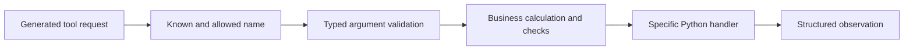
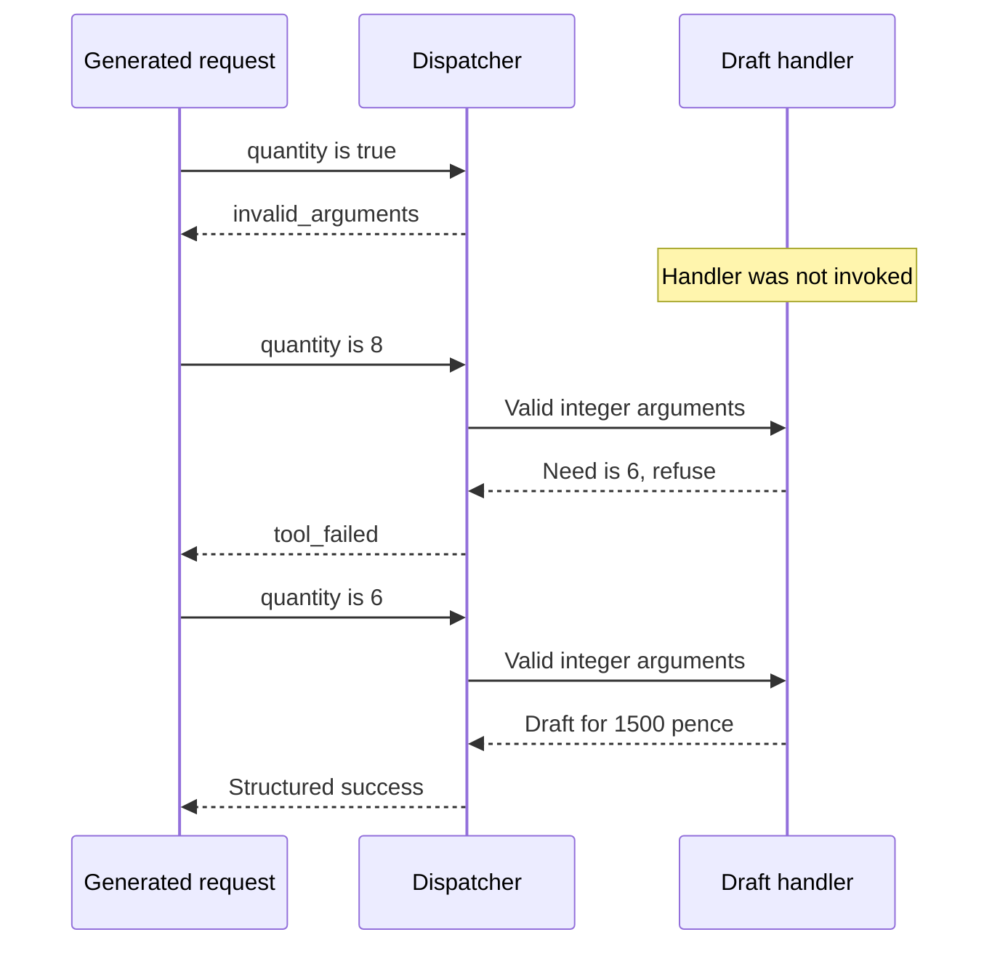
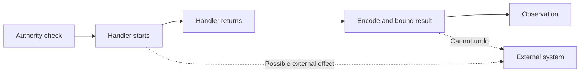

# Chapter 2 — Give the agent reliable shop tools

Lucy receives a morning brief just as a delivery arrives. The brief says vanilla has two tubs, but the freezer now contains nine. The model described the snapshot you sent; it had no way to discover the delivery. You could keep rebuilding longer prompts, but a multi-step task needs a more direct way to request an observation when it matters.

A tool gives the model that opportunity. The model generates a request such as “call `list_stock`.” Your program validates the request, calls a specific Python function, and returns the result. The function reads the data. The model does not become the database, and its requested function name does not become permission to execute arbitrary Python.

This chapter builds three tools: stock lookup, supplier lookup, and draft calculation. You will test them without a model before placing them inside an agent loop. By the end, a fabricated or malformed request will produce an inspectable refusal, while a valid draft request will return an exact quantity and amount in GBP pence.

## Learning objectives

Build and test typed stock, supplier, and draft tools; validate generated arguments before dispatch; and keep authoritative replenishment arithmetic in ordinary Python.

The observable result is a replenishment draft for six vanilla tubs costing 1,500 pence. The physical stock must remain two, and no supplier purchase may occur. You will also demonstrate that a Boolean quantity, an unknown tool name, and a quantity inconsistent with the shop's rule do not pass as valid requests.

## Decide what the model should choose

It is tempting to ask the model to perform the whole job in prose: inspect every product, calculate shortages, multiply prices, and announce a plan. The first live construction runs of this agent showed why that is a weak contract. A model sometimes ordered a product already at its target or chose a quantity inconsistent with the supplied stock. The surrounding loop could complete without detecting the business mistake.

We will let the model choose which available observation or calculation to request. We will give deterministic code responsibility for the calculations themselves. For these fixtures, replenishment need is the positive difference between the target and physical stock. Later, reserved and incoming quantities will participate in that calculation. A model should not have to rediscover the formula every morning.

The tool boundary also gives you a place to enforce the formula. Supplying a `needed` field helps a model choose a request. Rechecking the requested quantity prevents an incorrect choice from quietly becoming a valid draft. Those two steps serve different purposes: useful context improves behavior, while validation defines which requests your program accepts.

| Tool | Input | Result | Effect on the shop |
| --- | --- | --- | --- |
| `list_stock` | No arguments | Product counts, targets, and calculated need | Reads the fixture |
| `supplier` | Stable SKU | Supplier, currency, and unit price | Reads the price fixture |
| `draft_order` | SKU and quantity | Validated draft with an exact total | Returns data; makes no purchase |

For example, vanilla has two tubs and a target of eight. Its need is six. Six tubs at 250 pence each cost 1,500 pence. A draft requesting eight tubs is rejected because it does not implement this replenishment rule, even though eight is a perfectly valid positive integer.

The distinction between a valid type and a valid business decision runs through this chapter. An argument can have the correct JSON shape and still name a missing product, request an inconsistent quantity, or lack authority for a consequential operation. We will give each check a clear location.



**Figure:** Tool execution passes through identity, argument and business checks before a result is returned to the model.

## Reuse the shop fixture

We continue with the same three products from Chapter 1. The standalone checkpoint keeps its stock in memory so that the dispatch mechanism can be inspected without first teaching database transactions. Chapter 4 will replace this storage boundary with persistent records. For now, the complete tool layer uses only Python and Pydantic.

For the examples below, load only the preceding checkpoint's fixture. `run_path` executes the module definitions without running its `main` function. No model request occurs.

```python
import copy
import json
import runpy

SHOP = runpy.run_path("book/always_on/checkpoints/ch01.py")["SHOP"]
PRICES = {"SKU-VANILLA": 250, "SKU-CHOCOLATE": 300, "SKU-STRAWBERRY": 275}
products = {row["sku"]: copy.deepcopy(row) for row in SHOP["products"]}
assert len(products) == len(SHOP["products"])
print(products["SKU-VANILLA"]["on_hand"], PRICES["SKU-VANILLA"])
```

```text
2 250
```

The uniqueness assertion prevents a dictionary comprehension from silently hiding duplicate SKUs. If two source rows use the same key, the later row would otherwise replace the earlier one. A small fixture is a good place to learn that failure: it is much easier to see two conflicting vanilla entries here than to infer them from a confusing generated order later.

Prices are integer pence. Multiplication remains ordinary integer arithmetic, and the result includes `currency="GBP"`. We do not accept a model-selected price as the authoritative unit cost. The tool looks up the price for the requested SKU. Allowing generated arguments to override it would move a business fact into a place where the model can invent it.

We copy each product into the tool's fixture. That makes the checkpoint's ownership clear: changing a tool's local fixture does not mutate the original Chapter 1 dictionary. It is not a persistence mechanism. A process restart still discards in-memory changes, which is one reason we will later replace this boundary with SQLite.

## Describe and validate arguments

A tool schema tells the model which fields a request may contain. The schema is useful guidance, but it is not proof that a generated request obeys the schema. We validate again immediately before execution.

Pydantic supplies the argument validator and JSON Schema generation. It is a building block, rather than an agent framework: it does not call the model, choose tools, create a work queue, or approve a purchase. These classes declare the input contract of each function.

```python
from pydantic import BaseModel, ConfigDict, Field, ValidationError


class NoArguments(BaseModel):
    model_config = ConfigDict(extra="forbid", strict=True)


class ProductArguments(NoArguments):
    sku: str = Field(min_length=1, max_length=100)


class DraftArguments(ProductArguments):
    quantity: int = Field(gt=0, le=1000)


valid = DraftArguments.model_validate({"sku": "SKU-VANILLA", "quantity": 6}, strict=True)
print(valid.sku, valid.quantity)
print(DraftArguments.model_json_schema()["required"])
```

```text
SKU-VANILLA 6
['sku', 'quantity']
```

`extra="forbid"` rejects fields outside the declared interface. A generated request cannot add `approved=True` and expect that extra key to change how the function behaves. `strict=True` avoids quietly converting a string or Boolean into the integer quantity we intended to receive.

Python's treatment of Booleans makes the latter worth testing explicitly. `isinstance(True, int)` is true, so a casual type check can accept one unit expressed as a Boolean. Our interface requires an actual positive integer quantity. It also places a finite upper bound on a single request rather than allowing an arbitrary-size integer to reach later calculations.

```python
for quantity in (True, "6", 0, 1001):
    try:
        DraftArguments.model_validate({"sku": "SKU-VANILLA", "quantity": quantity}, strict=True)
    except ValidationError:
        print(repr(quantity), "rejected")
```

```text
True rejected
'6' rejected
0 rejected
1001 rejected
```

The type validator does not know whether `SKU-VANILLA` exists, what it costs, or how many tubs are needed. Keeping those checks separate avoids burying mutable business data inside a schema that is supposed to describe an interface. The schema is stable while stock changes.

The same separation helps you explain a refusal. Invalid arguments are a problem with the request's form. An unknown product or inconsistent replenishment amount is a problem with its meaning in the current shop. Neither should be repaired by blindly running the handler anyway.

## Implement deterministic shop functions

The stock tool returns both the observations and the calculated need. We keep the calculation small enough to inspect directly. A product above its target has a need of zero; it does not produce a negative purchase quantity.

```python
def list_stock(_):
    return [
        {**row, "needed": max(0, row["reorder_point"] - row["on_hand"])}
        for _, row in sorted(products.items())
    ]


def supplier(args):
    if args.sku not in products:
        raise KeyError("unknown product")
    return {
        "sku": args.sku,
        "supplier": "lucy-local",
        "currency": "GBP",
        "unit_cost_pence": PRICES[args.sku],
    }


def draft_order(args):
    row = products[args.sku]
    needed = max(0, row["reorder_point"] - row["on_hand"])
    if args.quantity != needed:
        raise ValueError("quantity differs from the replenishment need")
    quote = supplier(ProductArguments(sku=args.sku))
    return {
        **quote,
        "quantity": args.quantity,
        "total_pence": args.quantity * quote["unit_cost_pence"],
        "status": "DRAFT",
    }


print([(row["sku"], row["needed"]) for row in list_stock(NoArguments())])
print(draft_order(valid)["total_pence"], products["SKU-VANILLA"]["on_hand"])
```

```text
[('SKU-CHOCOLATE', 0), ('SKU-STRAWBERRY', 4), ('SKU-VANILLA', 6)]
1500 2
```

The final output is a useful pair of observations. The calculation produced 1,500 pence, and physical stock stayed at two. A draft is information about a proposed action. It is not delivery, payment, or evidence that another organization accepted an order.

A caller must pass validated arguments into these functions. You could do that manually at every call site, but repeated validation code is easy to omit. The dispatcher will make the check part of the execution path. Tests will still call the functions directly when isolating the arithmetic from the dispatch mechanism.

Notice also what the function does not read from its arguments: supplier identity, currency, and unit price. Those values come from the configured shop data. The generated request selects a product and proposes a quantity within a fixed operation. It does not get to replace the price list or invent a new remote destination.

## Register executable tools explicitly

A tool needs a name, a description, an argument type, and a Python handler. The name is what a model requests. The handler is the function your program actually calls. We bind them together in a small record, then generate the model-facing schema from that record.

```python
from dataclasses import dataclass
from typing import Any, Callable


@dataclass(frozen=True)
class ExecutableTool:
    name: str
    description: str
    arguments: type[BaseModel]
    handler: Callable[[Any], Any]
    consequential: bool = False

    def schema(self):
        return {
            "type": "function",
            "function": {
                "name": self.name,
                "description": self.description,
                "parameters": self.arguments.model_json_schema(),
            },
        }


tools = [
    ExecutableTool(
        "list_stock", "Read stock and calculated replenishment need.", NoArguments, list_stock
    ),
    ExecutableTool("supplier", "Read a supplier quote in GBP pence.", ProductArguments, supplier),
    ExecutableTool(
        "draft_order", "Calculate a draft; never purchases.", DraftArguments, draft_order
    ),
]
print([tool.schema()["function"]["name"] for tool in tools])
```

```text
['list_stock', 'supplier', 'draft_order']
```

A description helps the model select an appropriate tool. It does not grant authority. Later a skill may mention a purchasing operation, a retrieved document may demand one, or a remote tool server may advertise one. None of those events will add the operation to this registry or its allowlist.

The `consequential` flag marks tools that need a write-authority check before their handler can run. All three shop tools in this chapter return information. When we demonstrate a consequential tool below, it will be a local probe that records whether its handler ran, not a live purchasing endpoint.

The frozen record prevents accidental rebinding of a registered handler through ordinary field assignment. This is an application invariant, not protection against arbitrary hostile Python executing in the host process. All Python handlers here are trusted code you write. Chapter 11 will introduce an operating-system boundary for a tool that executes generated code.

## Build the dispatcher

The dispatcher receives a parsed tool request and returns an observation. It owns the association between a public tool name and executable code. There is no `eval`, dynamic import, or shell command assembled from a requested name. A name that is missing from the registry cannot select a handler.

A request also needs an identifier. In the next chapter, the model's request and the tool's observation will be separate messages. The identifier lets the provider associate an observation with the call that produced it. It is a conversation identifier; it is not yet the stable operation identifier we will use to recover a purchase in Chapter 9.

**Listing:** A parsed request carries a bounded identifier, a tool name, and argument data.

```python
class ToolCall(BaseModel):
    model_config = ConfigDict(extra="forbid", strict=True)
    id: str = Field(min_length=1, max_length=200)
    name: str = Field(min_length=1, max_length=100, pattern=r"^[a-zA-Z0-9_-]+$")
    arguments: dict[str, Any]


request = ToolCall(
    id="draft-vanilla-1",
    name="draft_order",
    arguments={"sku": "SKU-VANILLA", "quantity": 6},
)
print(request.id, request.name)
```

```text
draft-vanilla-1 draft_order
```

The general `arguments` field accepts a dictionary because different tools have different schemas. The dispatcher will apply the selected tool's schema. Validating this outer record therefore does not replace validating `DraftArguments`. The two checks answer different questions: is this a well-formed request envelope, and does this operation accept these particular arguments?

The following class is the execution mechanism. Read `invoke` from top to bottom. The order matters: it resolves and authorizes the name, validates the arguments, checks any required write authority, and only then invokes the handler. Moving a check below the handler would turn prevention into a report about something that already happened.

**Listing:** Dispatch only registered, allowed requests and return bounded observations.

```python
from types import MappingProxyType


class Dispatcher:
    def __init__(self, tools, *, allowed, before_write=None, max_result_bytes=16_384):
        self.tools = MappingProxyType({tool.name: tool for tool in tools})
        if len(self.tools) != len(tools):
            raise ValueError("tool names must be unique")
        if not 128 <= max_result_bytes <= 1_048_576:
            raise ValueError("invalid tool result byte limit")
        self.allowed, self.before_write = allowed, before_write
        self.max_result_bytes = max_result_bytes

    def schemas(self):
        return [tool.schema() for name, tool in sorted(self.tools.items()) if name in self.allowed]

    def invoke(self, call):
        tool = self.tools.get(call.name)
        if tool is None or call.name not in self.allowed:
            return {"ok": False, "error": "tool_not_allowed"}
        try:
            arguments = tool.arguments.model_validate(call.arguments, strict=True)
        except ValidationError:
            return {"ok": False, "error": "invalid_arguments"}
        if tool.consequential and self.before_write is None:
            return {"ok": False, "error": "write_authority_required"}
        try:
            if tool.consequential:
                self.before_write(call)
            value = tool.handler(arguments)
            encoded = json.dumps(value, allow_nan=False)
            if len(encoded.encode()) > self.max_result_bytes:
                return {"ok": False, "error": "result_too_large"}
            return {"ok": True, "value": value}
        except ValueError, TypeError, KeyError, PermissionError, TimeoutError, OSError:
            return {"ok": False, "error": "tool_failed"}


dispatcher = Dispatcher(tools, allowed=frozenset(tool.name for tool in tools))
observation = dispatcher.invoke(request)
print(observation["ok"], observation["value"]["total_pence"])
```

```text
True 1500
```

`MappingProxyType` prevents ordinary item assignment through the published registry. The constructor checks for duplicate names rather than allowing the last registration to replace an earlier one. The allowlist is a `frozenset`: the caller supplies the operations available for this use of the dispatcher. A later worker may use the same collection of implementations with a smaller allowlist.

The `schemas` method returns only allowed tools. Hiding unavailable operations makes the model's job easier, but `invoke` still checks the allowlist. A model can generate a name it was never shown, and a recorded request can be replayed in a different context. Execution must not depend on the assumption that the model only asks for advertised operations.

### Bound observations and explain refusals

Expected failures become small error codes. We do not copy exception messages into the model's context: validation errors may include raw arguments, and network exceptions can include sensitive addresses or credentials. During development, you can reproduce a failure with the deterministic request and inspect its handler locally. A public observation need not expose every internal detail to be useful.

The exception list is deliberate. It covers expected input, permission, timeout, and operating-system failures. It does not catch every possible programming defect or interrupt. A misspelled variable should fail visibly during development instead of being disguised as a routine tool refusal. In Chapter 10 we will save unfinished tasks so another process can recover them after a failure.

The result limit counts encoded bytes, not Python characters. A character may require several UTF-8 bytes. `allow_nan=False` also rejects values such as floating-point infinity that do not belong in a strict JSON observation. These checks keep a completed tool result from flooding the next model request or violating its data format.

This result limit is applied after the trusted handler returns and after serialization. It bounds the observation passed onward; it does not constrain the handler's peak memory, runtime, or external effects. A function that allocates gigabytes or sleeps forever needs a different execution boundary. We will not label this dispatcher a sandbox.

## Break requests before adding a model

Now send requests that should never become useful drafts. Each failure exercises a different layer. Testing only the successful six-tub request would miss the distinction between type validity, tool authority, and business validity.

```python
bad_requests = [
    ToolCall(id="bad-name", name="run_shell", arguments={"command": "anything"}),
    ToolCall(id="bad-type", name="draft_order", arguments={"sku": "SKU-VANILLA", "quantity": True}),
    ToolCall(
        id="bad-extra",
        name="draft_order",
        arguments={"sku": "SKU-VANILLA", "quantity": 6, "approved": True},
    ),
    ToolCall(id="bad-sku", name="supplier", arguments={"sku": "SKU-MISSING"}),
    ToolCall(id="bad-need", name="draft_order", arguments={"sku": "SKU-VANILLA", "quantity": 8}),
]
for call in bad_requests:
    print(call.id, dispatcher.invoke(call)["error"])
print("physical stock", products["SKU-VANILLA"]["on_hand"])
```

```text
bad-name tool_not_allowed
bad-type invalid_arguments
bad-extra invalid_arguments
bad-sku tool_failed
bad-need tool_failed
physical stock 2
```

The last two failures share an outward error code even though their internal causes differ. That is a conscious simplicity choice for this small teaching interface. You could introduce domain error codes for “unknown SKU” and “quantity changed” when the caller has a defined recovery action for each. Do not start by returning arbitrary exception strings as an accidental protocol.

Here is a second case that exposes a subtle error in many first implementations: a tool can be registered but unavailable to this caller. Checking only for membership in the registry would incorrectly execute it.

```python
read_only = Dispatcher(tools, allowed=frozenset({"list_stock", "supplier"}))
print([item["function"]["name"] for item in read_only.schemas()])
print(read_only.invoke(request))
```

```text
['list_stock', 'supplier']
{'ok': False, 'error': 'tool_not_allowed'}
```

The name `read_only` describes this particular selection. Our draft tool also has no external effect, so excluding it here is an example of narrowing an interface rather than a claim that drafting is purchasing. In later chapters, we will choose an allowlist for each kind of task.



**Figure:** Type validation prevents malformed calls, while the handler checks whether a well-typed request agrees with current business data.

A fresh observation also matters. Change vanilla's stock to nine, then repeat the previously valid six-tub request. The old request still has the correct shape, but it no longer matches the rule. We restore the fixture afterwards so subsequent examples remain independent of this experiment.

```python
products["SKU-VANILLA"]["on_hand"] = 9
try:
    print(next(row["needed"] for row in list_stock(NoArguments()) if row["sku"] == "SKU-VANILLA"))
    print(dispatcher.invoke(request)["error"])
finally:
    products["SKU-VANILLA"]["on_hand"] = 2
```

```text
0
tool_failed
```

This experiment explains why a saved recommendation is not a permanent authorization. The world can change between recommendation and execution. The handler checks the fixture at invocation time. When multiple processes can update persistent stock, checking and reserving quantities will require a transaction or equivalent coordination; this in-memory example makes no concurrency guarantee.

## Save the tool layer for Chapter 3

Run all examples from the repository root. Create `book/always_on/learner/ch02.py`. Save the imports, class and function definitions shown in this chapter, together with the assignments to `SHOP`, `PRICES`, `products` and `tools`. Keep the print statements and failure experiments in your interactive session. The checked-in file is the completed version of exactly those definitions; it imports no agent runtime.

The functions above share one module-level product dictionary. Chapter 3 needs a fresh fixture for each experiment. The following factory moves the same calculations inside a function, where each handler closes over its own copied rows. It returns the dispatcher we already built; no hidden factory is supplied by the runtime.

**Listing:** Assemble an independent shop dispatcher from the functions you have built.

```python
def build_tools(shop):
    rows = {row["sku"]: copy.deepcopy(row) for row in shop["products"]}
    if len(rows) != len(shop["products"]):
        raise ValueError("duplicate product identity")

    def stock(_):
        return [
            {**row, "needed": max(0, row["reorder_point"] - row["on_hand"])}
            for _, row in sorted(rows.items())
        ]

    def quote(args):
        if args.sku not in rows:
            raise KeyError("unknown product")
        return {
            "sku": args.sku,
            "supplier": "lucy-local",
            "currency": "GBP",
            "unit_cost_pence": PRICES[args.sku],
        }

    def draft(args):
        row = rows[args.sku]
        needed = max(0, row["reorder_point"] - row["on_hand"])
        if args.quantity != needed:
            raise ValueError("quantity differs from the replenishment need")
        price = quote(ProductArguments(sku=args.sku))
        return {
            **price,
            "quantity": args.quantity,
            "total_pence": args.quantity * price["unit_cost_pence"],
            "status": "DRAFT",
        }

    registered = [
        ExecutableTool("list_stock", "Read stock and calculated need.", NoArguments, stock),
        ExecutableTool("supplier", "Read supplier price in GBP pence.", ProductArguments, quote),
        ExecutableTool("draft_order", "Calculate a draft; never purchases.", DraftArguments, draft),
    ]
    return Dispatcher(registered, allowed=frozenset(tool.name for tool in registered))


fresh = build_tools(SHOP)
print(
    fresh.invoke(
        ToolCall(id="check", name="draft_order", arguments={"sku": "SKU-VANILLA", "quantity": 6})
    )["value"]["total_pence"]
)
```

```text
1500
```

Copy `build_tools` into the same learner file. Importing that file defines code and loads the synthetic fixture; it does not run the failure experiments or contact a model. Try two dispatchers with different stock dictionaries to verify that one experiment cannot change the other's fixture.

## Prove that a write check runs first

Before introducing any real purchase operation, test the ordering of its future authority check. A local probe records whether its handler was invoked. This is stronger evidence than checking that the source contains a function named `before_write`.

```python
executions = []
probe = ExecutableTool(
    "purchase_probe",
    "Local authority-ordering experiment.",
    NoArguments,
    lambda _: executions.append("called"),
    consequential=True,
)
probe_call = ToolCall(id="probe-1", name="purchase_probe", arguments={})
without_authority = Dispatcher([probe], allowed=frozenset({probe.name}))
print(without_authority.invoke(probe_call))


def refuse_write(call):
    raise PermissionError("no current approval")


with_refusal = Dispatcher([probe], allowed=frozenset({probe.name}), before_write=refuse_write)
print(with_refusal.invoke(probe_call))
print("handler invocations", len(executions))
```

```text
{'ok': False, 'error': 'write_authority_required'}
{'ok': False, 'error': 'tool_failed'}
handler invocations 0
```

A missing write-authority function is a refusal. A present function that raises is also a refusal. Neither path calls the handler. The callback is an interface where Chapter 8 will check durable approvals, expiry, operator authority, and spending reservations. Merely supplying a callback that always returns would not implement those rules.

Do not interpret the callback as a guarantee that authorization remains valid forever after it returns. A real external call has a point at which the runtime commits to sending it. Revocation before that point must block the action; revocation afterwards cannot undo a request already accepted by a supplier. We will make that distinction explicit when the order workflow has durable state.

Result-size checking has a similarly precise boundary. The next handler deliberately returns an oversized result. Its output is refused, but the handler has already run. That is why an error observation from a consequential tool cannot, by itself, establish that no external effect occurred.

```python
large = ExecutableTool("large_result", "Result-size experiment.", NoArguments, lambda _: "x" * 200)
small_results = Dispatcher([large], allowed=frozenset({large.name}), max_result_bytes=128)
print(small_results.invoke(ToolCall(id="large-1", name=large.name, arguments={})))
```

```text
{'ok': False, 'error': 'result_too_large'}
```



**Figure:** Refusing an observation after a handler ran does not reverse its effects. Later order recovery will use durable intent and supplier evidence.

## Run the checkpoint and vary the constraints

The standalone checkpoint collects the fixture and shop functions in `book/always_on/checkpoints/ch02.py`. It imports the small request and dispatcher classes whose implementation you have just built from the cumulative source tree. These are this book's own components, and their complete execution path appears above. There is no hidden agent framework selecting or running tools.

### Learner verification commands

From the repository root, run the checkpoint using the environment established in Chapter 1:

```bash
uv run python book/always_on/checkpoints/ch02.py
uv run python scripts/verify_always_on_v1.py
```

The first command prints the following output:

```text
[('SKU-CHOCOLATE', 0), ('SKU-STRAWBERRY', 4), ('SKU-VANILLA', 6)]
{"ok": true, "value": {"currency": "GBP", "quantity": 6, "sku": "SKU-VANILLA", "status": "DRAFT", "supplier": "lucy-local", "total_pence": 1500, "unit_cost_pence": 250}}
{"error": "invalid_arguments", "ok": false}
```

The first command prints the three calculated needs, a successful vanilla draft, and an invalid-argument refusal. The second executes the drafted chapters' Python examples and compares their printed output with the adjacent expected-output blocks. It also runs each standalone checkpoint. Its construction report identifies chapters that remain planned; it does not certify unwritten chapters.

### Expected observations

| Observation | Meaning | What it does not establish |
| --- | --- | --- |
| Vanilla draft totals 1,500 pence | The deterministic calculation used six units at 250 pence | A model will always choose the right tool sequence |
| Boolean and extra fields are refused | The argument schema is enforced before invocation | All business decisions are correct |
| Probe invocation count stays zero | Missing or refusing authority blocks the handler | A future approval system has been implemented |
| Physical stock remains two | These draft functions did not update inventory | An arbitrary handler elsewhere is harmless |

For a direct review, trace the successful result backwards: `total_pence` comes from multiplication inside `draft_order`; its unit price comes from `PRICES`; its quantity must equal the need computed from `products`. The model supplies none of those authoritative facts. Then trace a refused request forwards and identify the exact line that prevents handler invocation, or the business check that refuses a well-typed call.

### Exercise 1 — A fourth product and a changed price

Add `SKU-MANGO` with one tub, a target of five, and a price of 325 pence. Give it a unique SKU and keep the original three products. Request a four-tub draft. Predict its total before executing it, then check that it is 1,300 pence and physical stock is still one. Change only the price to 350 pence and rerun the request; the new total should be 1,400 pence without changing the model-facing argument schema.

This exercise checks that adding a product is a data change. If you need another handler or a special conditional for mango, inspect where product-specific values have escaped from the fixture into the execution mechanism. Also remove mango's price deliberately. The request should fail visibly instead of inventing a price or borrowing vanilla's.

### Exercise 2 — Reserve stock for a catering order

Extend each product with a nonnegative `reserved` quantity. Change need to `max(0, target - on_hand + reserved)`. Apply the same rule in stock reporting and draft validation. With vanilla at two, target eight, and three reserved, a nine-tub draft should pass and the old six-tub draft should fail. Test zero reservation and a product whose physical stock still covers both its target and reservations.

The exercise intentionally requires changing both calculation sites. After proving the behavior, extract a shared `replenishment_need` function so they cannot drift apart. Keep an independent expected answer in the test: deriving the expected value by calling the same helper would only compare the implementation with itself.

### Exercise 3 — An advertised but forbidden operation

Register a harmless probe alongside the shop tools but omit it from the allowlist. Verify both that its schema is absent and that a manually constructed request cannot invoke it. Then duplicate an existing tool name in the registry. Construction must fail rather than silently choosing one handler. These are different failures: the first concerns caller authority, and the second concerns an ambiguous program configuration.

## Active recall and vocabulary

Before continuing, answer these questions without rerunning the examples. Where is the supplier price obtained? Why is `quantity=True` refused? Which check catches a valid integer that exceeds the actual need? Can an oversized-result error prove that the handler never ran? What additional evidence would a purchasing tool need before claiming that an order succeeded?

The **schema** describes a tool's accepted arguments. A **handler** is the particular Python function implementing the operation. The **registry** binds a public name to that implementation. The **allowlist** selects which registered operations this caller may use. A **dispatcher** checks a request and invokes the selected handler. An **observation** is the structured result returned to the model. A **draft** describes a proposed order without claiming purchase or delivery.

## Summary

You built three typed tools, an explicit registry, and a dispatcher whose checks precede invocation. Deterministic code calculates Lucy's replenishment quantities and GBP amounts. Malformed arguments, unavailable operations, missing authority, and inconsistent business requests produce tested refusals. The failure experiments also established a limit: a refused result does not necessarily mean a handler had no effect.

The tools can now answer useful questions, but someone still has to choose the sequence of calls. In [Chapter 3](../ch03_agent_loop/README.md), you will connect model responses, tool requests, and observations in a bounded loop. The model will select requests while the Python runtime retains control of what can execute and when the turn must stop.
