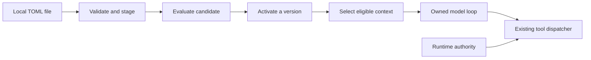
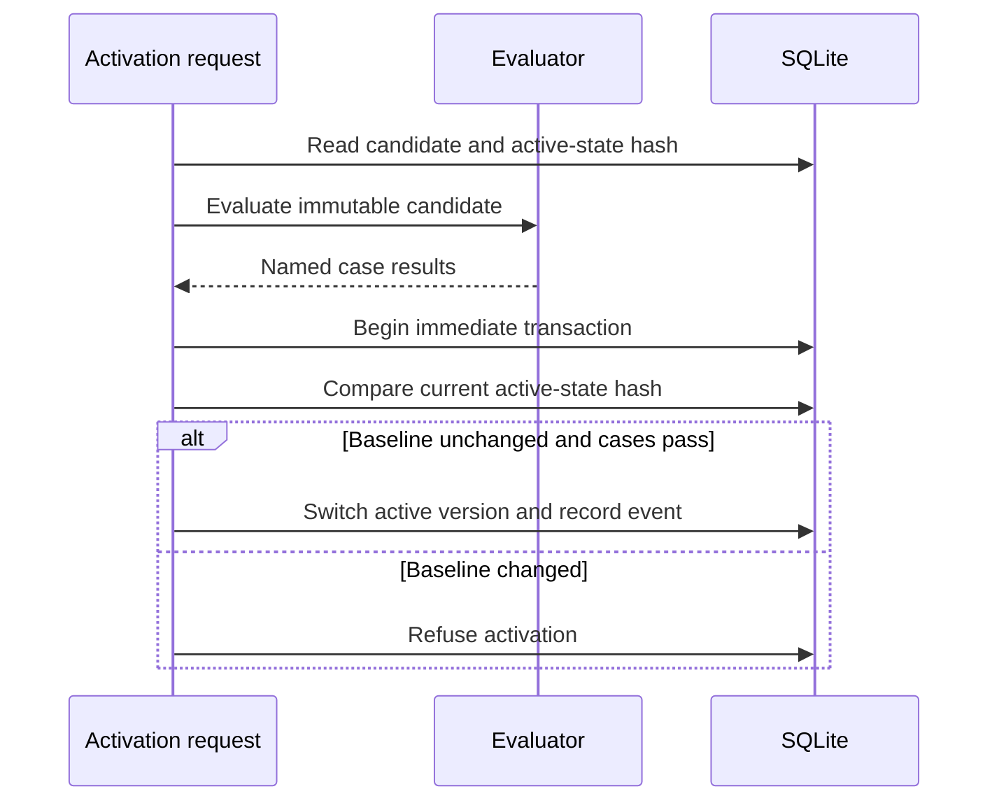
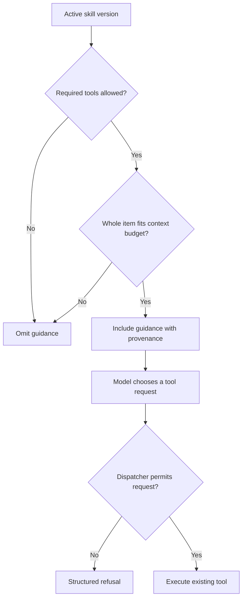

# Chapter 5 — Reuse a tested opening procedure

Lucy wants the same useful opening brief tomorrow, even when her message is only “Prepare the replenishment drafts.” In the previous two chapters, we kept the procedure in a Python message: inspect current stock, use each product's calculated need, create the appropriate drafts, and report their amounts in GBP. That procedure is now worth naming. It should be possible to review and revise it without changing the tool dispatcher or copying instructions into every channel adapter.

Moving the words into a file is easy. Deciding when those words become active is the engineering problem. A plausible revision might stop creating drafts and merely describe them. Another might demand a purchasing tool that this stage of the agent does not have. A third might pass an evaluation while someone changes the active configuration underneath it. A useful skill implementation makes each of those situations visible.

In this chapter you will extract the opening procedure into a local TOML file, validate and stage an immutable version, evaluate it, and activate it only against the configuration you tested. You will then select the skill into the bounded context from [Chapter 4](../ch04_memory/README.md). The model still uses the loop and dispatcher you built. Loading a procedure neither adds a Python function nor changes the authority to invoke one.

## Learning objectives

Distinguish a tool, a skill, a workflow and a policy; implement bounded local skill loading; preserve the identity of a staged version; separate staging, evaluation, activation and eligibility; and prove that an active skill reaches the model without granting additional tool authority.

The deliverable is an opening-check procedure whose version survives a process restart and whose activation has an observable evaluation result. You will reproduce failures involving changed version content, an incomplete evaluation, a missing required tool and a changed configuration. The default exercises use authored model responses. An optional local-model run measures a few actual decisions; it does not turn a small case suite into a general guarantee about the model.

## Decide which part of the behavior should be data

A tool is executable code with an argument contract. The stock tool reads authoritative records; the draft tool checks quantity and calculates money. A skill is guidance describing how to use capabilities that already exist. A workflow fixes some sequencing in code, while a policy decides whether an operation is permitted. These four things can cooperate, but replacing one with another changes which component must enforce correctness.

| Component | Opening-check example | What enforces its behavior |
| --- | --- | --- |
| Tool | Calculate a six-tub vanilla draft | Validated Python arguments and deterministic arithmetic |
| Skill | Read stock, then draft every positive need | Model interpretation, observed and evaluated |
| Workflow | Run a fixed stock-to-draft function | Program control flow |
| Policy | Refuse purchases beyond an allowance | The mediated write boundary |

For this exact replenishment calculation, a plain function is a strong alternative. The model is useful when Lucy also asks questions, combines a procedure with preferences or needs an explanation. The skill lets us study that flexible interface. It does not make the arithmetic more accurate than a function. Keep that comparison available: Chapter 12 will measure the added cost of the agent against a scripted baseline.

A skill file may say “only buy from an approved supplier.” That sentence expresses useful intent, but the purchase boundary must still check supplier authority. A skill may say “call list_stock first.” That is a procedural request which the model can violate; our transcript checks should detect the violation. Distinguishing these statements prevents a common mistake: counting a sentence in a prompt as an implemented control.



**Figure:** A skill reaches the model through context selection. Tool authority reaches the dispatcher through a separate path.

Our first format deliberately contains one procedure per file. There is no registry lookup, package installation, script execution or template expansion. TOML supplies readable strings and lists using Python's standard library. The installed runtime still has only Pydantic as its direct runtime dependency. A future folder containing examples and references would need explicit rules for which files are loaded, how they are bounded and which exact content an evaluation covered.

## Write the opening skill

Create `opening-check-v1.toml` in your scratch directory. Its name identifies the procedure; its version identifies immutable content within that name. The requirements list declares tool names needed to make the procedure relevant. Instructions explain the actual sequence. The example uses the same shop vocabulary and stock calculation as the earlier chapters, so extracting the procedure does not reset the reader's running agent.

**Listing:** The repository's first local skill, also used by the checkpoint.

```toml
name = "opening_check"
version = "1"
requires = ["list_stock", "supplier", "draft_order"]
instructions = """
Prepare a morning replenishment brief. Read list_stock first. For each product,
use its needed field: this already accounts for reserved and incoming stock.
For every needed value greater than zero, call draft_order with that exact
SKU and quantity. Do not draft products whose needed value is zero. A verbal
recommendation does not replace creating the draft through the tool. Finish by
reporting each successful draft's quantity and total_pence in GBP. A draft is
not a purchase. If a tool refuses a draft, read current stock before continuing.
"""
```

The important verb is “call.” A model can write a fluent answer saying Lucy needs six tubs without creating a draft through the tool. We observed that failure while constructing the earlier chapters. The revised procedure makes the expected action explicit, and the checker looks for successful tool observations. Neither the instruction alone nor the final sentence “done” establishes that the action occurred.

Notice what the file does not encode: the fixture's six-tub and four-tub answers. Those are consequences of current stock and thresholds. Embedding them would turn a reusable procedure into a memorized test answer. The procedure consumes the tool's `needed` field, which already accounts for reserved and incoming stock. That keeps the business calculation in the deterministic component where you can test it independently.

**Listing:** Define a strict schema and inspect the staged candidate's declared requirements.

```python
import hashlib
import json
import os
import sqlite3
import stat
import tempfile
import tomllib
from collections.abc import Callable
from pathlib import Path

from pydantic import BaseModel, ConfigDict, Field, ValidationError
from sovereign_agent.database import Database
from sovereign_agent.events import append_event


class Skill(BaseModel):
    model_config = ConfigDict(extra="forbid", strict=True)
    name: str = Field(pattern=r"^[a-z][a-z0-9_-]{0,63}$")
    version: str = Field(pattern=r"^[a-zA-Z0-9._-]{1,64}$")
    instructions: str = Field(min_length=1, max_length=8192)
    requires: list[str] = Field(default_factory=list, max_length=16)


source = Path("book/always_on/skills/opening-check-v1.toml")
skill = Skill.model_validate(tomllib.loads(source.read_text()))
print(skill.name, skill.version)
print(skill.requires)
```

```text
opening_check 1
['list_stock', 'supplier', 'draft_order']
```

The name pattern keeps identities short and predictable. The version is a label, not a promise of semantic-version ordering. Version `2` does not become active simply because its string looks newer. Strict validation rejects unknown fields and incompatible types; a spelling mistake such as `instruction` should fail at admission rather than quietly produce an empty procedure.

The character limit on instructions and the byte limit on the whole file solve different problems. A non-ASCII character can occupy several bytes. TOML also includes field names, quoting and comments beyond the instruction string. We will enforce both limits at their respective boundaries. The requirements list is bounded in length, but declaring a name does not prove that the corresponding tool exists or is allowed.

**Listing:** Refuse a misspelled field before anything is stored.

```python
try:
    Skill.model_validate({"name": "opening", "version": "1", "instruction": "Read stock"})
except ValidationError as error:
    print(sorted(item["type"] for item in error.errors()))
```

```text
['extra_forbidden', 'missing']
```

## Bound the file read itself

A preliminary `path.stat().st_size` check is insufficient. Between checking a path and reading it, another process can replace the file or enlarge it. The original implementation rejected oversized content after calling `read_bytes()`, but a controlled experiment made it read two million bytes before reporting the error. Rejection protected the database while failing to bound the read allocation.

The fix is to open once, inspect the opened descriptor, and read at most the allowed bytes plus one. The extra byte distinguishes an exactly full file from a file that has crossed the limit. On our macOS and Linux path, `O_NOFOLLOW` refuses a final symlink and `O_NONBLOCK` prevents opening a FIFO from waiting for a writer. The regular-file check applies to the opened object, not an earlier observation of its pathname.

**Listing:** Implement the bounded read used by staging.

```python
def read_skill(path: Path) -> bytes:
    """Read one bounded regular file; POSIX flags refuse symlinks and FIFO waits."""
    if path.is_symlink():
        raise ValueError("bounded regular local skill file required")
    flags = os.O_RDONLY | getattr(os, "O_NOFOLLOW", 0) | getattr(os, "O_NONBLOCK", 0)
    try:
        descriptor = os.open(path, flags)
        with os.fdopen(descriptor, "rb") as stream:
            observed = os.fstat(stream.fileno())
            if not stat.S_ISREG(observed.st_mode) or observed.st_size > 16_384:
                raise ValueError("bounded regular local skill file required")
            raw = stream.read(16_385)
    except OSError as error:
        raise ValueError("readable regular local skill file required") from error
    if len(raw) > 16_384:
        raise ValueError("skill changed beyond byte limit")
    return raw


print(read_skill(source) == source.read_bytes())
```

```text
True
```

Opening once also clarifies identity during a rename. If the pathname is replaced after `open`, the descriptor still refers to the selected file. A concurrent in-place writer can still alter that file's contents; this helper is not a filesystem snapshot or a lock. We validate and hash the exact bounded bytes returned by the read, then persist that version. Authors should finish writing a candidate before requesting staging.

The optional flag lookup keeps the function importable elsewhere, but the no-follow and nonblocking guarantees here are demonstrated on POSIX hosts. Parent directories are operator-owned; this is not a sandbox for an attacker-controlled filesystem tree. Do not infer protection against every path race from one flag. Chapter 11 will place code execution behind a separate environment boundary.

**Listing:** Check the exact byte boundary and a symlink refusal in a temporary directory.

```python
scratch = tempfile.TemporaryDirectory(prefix="lucy-skill-chapter-")
root = Path(scratch.name)
bounded = root / "bounded.toml"
bounded.write_bytes(b"x" * 16_384)
print("exact limit:", len(read_skill(bounded)))
bounded.write_bytes(b"x" * 16_385)
try:
    read_skill(bounded)
except ValueError:
    print("oversize: refused")
link = root / "link.toml"
link.symlink_to(source.resolve())
try:
    read_skill(link)
except ValueError:
    print("symlink: refused")
```

```text
exact limit: 16384
oversize: refused
symlink: refused
```

These probes test reading, not TOML validity: a file of repeated `x` bytes is not a skill. Admission is a sequence of checks. Passing the resource boundary permits parsing; passing parsing permits schema validation; passing the schema permits immutable staging. Keeping those steps separate lets an error explain which contract was violated.

## Stage a version without activating it

We need a table whose primary key is `(name, version)` and whose partial unique index permits at most one active version of each name. The content column stores the validated model's JSON representation. The source column stores a SHA-256 digest of the raw TOML bytes, allowing a reviewer to identify the first file staged for that version. Staging defaults to inactive.

**Listing:** Inspect the skill storage contract independently.

```python
skill_schema = """
CREATE TABLE assistant_skills (
    name TEXT NOT NULL, version TEXT NOT NULL, content TEXT NOT NULL,
    source TEXT NOT NULL, active INTEGER NOT NULL DEFAULT 0,
    PRIMARY KEY(name, version)
);
CREATE UNIQUE INDEX assistant_skill_current
ON assistant_skills(name) WHERE active = 1;
"""
probe = sqlite3.connect(":memory:")
probe.executescript(skill_schema)
print([row[1] for row in probe.execute("PRAGMA table_info(assistant_skills)")])
probe.close()
```

```text
['name', 'version', 'content', 'source', 'active']
```

Use the cumulative `Database` for the agent; its migrations already install this schema. The independent in-memory connection above is only a schema experiment. There is no second production skill store. Every subsequent operation uses the same database abstraction and immediate transaction contract introduced earlier.

**Listing:** Implement staging and prove that repeating it preserves one inactive row.

```python
def stage_skill(db: Database, path: Path) -> Skill:
    raw = read_skill(path)
    skill = Skill.model_validate(tomllib.loads(raw.decode()))
    content = skill.model_dump_json()
    with db.immediate() as connection:
        old = connection.execute(
            "SELECT content FROM assistant_skills WHERE name=? AND version=?",
            (skill.name, skill.version),
        ).fetchone()
        if old and old[0] != content:
            raise ValueError("skill versions are immutable; stage a new version")
        connection.execute(
            "INSERT OR IGNORE INTO assistant_skills(name,version,content,source) VALUES (?,?,?,?)",
            (skill.name, skill.version, content, hashlib.sha256(raw).hexdigest()),
        )
    return skill


db_path = root / "agent.sqlite"
db = Database(db_path)
stage_skill(db, source)
stage_skill(db, source)
print(tuple(db.connection.execute("SELECT count(*),sum(active) FROM assistant_skills").fetchone()))
```

```text
(1, 0)
```

The transaction makes the existing-content check and insertion one operation. A repeated identical candidate is harmless. Different validated content under the same identity is refused. This is an application contract enforced by this staging boundary; a program with unrestricted database-write access can violate application conventions. Model tools will not receive such access.

JSON content identity is slightly different from file identity. Adding a TOML comment can leave the validated content unchanged, in which case restaging is accepted and the original source digest remains. Changing instructions or the requirements list changes the content and requires a new version. The runtime does not reinterpret versions according to filenames, modification times or lexicographic order.

## Failure experiment: overwrite yesterday's version

Suppose you edit the opening procedure to “Summarize stock only” and leave `version = "1"`. If staging silently replaced the row, an earlier evaluation report for version 1 would now name different content. The version label would have lost its value as evidence. Instead, try the edit and observe the refusal.

**Listing:** Reject changed content under an existing name and version.

```python
changed = root / "opening-check-changed.toml"
changed.write_text('name="opening_check"\nversion="1"\ninstructions="Summarize stock only"\n')
try:
    stage_skill(db, changed)
except ValueError as error:
    print(error)
print(db.connection.execute("SELECT count(*) FROM assistant_skills").fetchone()[0])
```

```text
skill versions are immutable; stage a new version
1
```

A proposed change should get a new version and remain inactive while it is examined. The operator may author that file directly or ask a model to propose its contents. Proposal does not imply installation: the model does not receive a tool that can activate its own procedure. Chapter 13 will develop diagnosis, comparison reports and rollback around this same boundary.

At this stage a version remains available even after another version becomes active. That history is useful for explaining a change and re-evaluating an older procedure. It is not an unlimited-storage guarantee: the file and instruction bounds limit one candidate, not the lifetime number of stored versions. A retention policy must distinguish inactive historical candidates from the version currently serving requests.

## Bind evaluation to the active configuration

Evaluating one candidate in isolation can miss interactions with another active skill. The runtime therefore takes a snapshot of all active guidance, ordered by name, including each source digest. A hash identifies that configuration. The snapshot is obtained in one database query so it does not combine rows from different observations.

**Listing:** Construct the configuration snapshot.

```python
def skill_snapshot(db: Database) -> tuple[str, tuple[Skill, ...]]:
    """One read binds active guidance and provenance to an evaluation baseline."""
    rows = [
        tuple(row)
        for row in db.connection.execute(
            "SELECT name,version,content,source FROM assistant_skills WHERE active=1 ORDER BY name"
        )
    ]
    digest = hashlib.sha256(json.dumps(rows).encode()).hexdigest()
    return digest, tuple(Skill.model_validate_json(row[2]) for row in rows)


before, active = skill_snapshot(db)
print("active procedures:", len(active))
print("snapshot digest length:", len(before))
```

```text
active procedures: 0
snapshot digest length: 64
```

The digest is an identity check, not a quality score. Two configurations with different hashes may behave identically, while one unchanged configuration can produce different live-model responses. We use the hash for a narrow question: is this still the configuration against which the candidate was evaluated? Outcome evaluation answers a different question about the observed behavior on named cases.

Long model calls should not hold a database write lock. We load the immutable candidate, capture the baseline, run the evaluator outside the transaction, and then enter a short transaction to compare the active state and activate. If another activation changed the baseline, our result is stale. Retrying means evaluating against the new configuration, rather than applying an old result to a different one.



**Figure:** Model evaluation runs without a write lock, followed by a short comparison-and-activation transaction.

**Listing:** Implement evaluated activation with an explicit required-case set.

```python
def activate_skill(
    db: Database,
    name: str,
    version: str,
    *,
    evaluate: Callable[[Skill], dict[str, bool]],
    required_cases: frozenset[str],
    expected_state: str | None = None,
) -> dict[str, bool]:
    row = db.connection.execute(
        "SELECT content FROM assistant_skills WHERE name=? AND version=?", (name, version)
    ).fetchone()
    if row is None or not required_cases:
        raise ValueError("staged skill and a nonempty regression suite required")
    skill = Skill.model_validate_json(row[0])
    baseline = skill_snapshot(db)[0] if expected_state is None else expected_state
    results = evaluate(skill)
    if skill.model_dump_json() != row[0]:
        raise ValueError(
            "evaluation changed the candidate instead of testing its immutable version"
        )
    if not required_cases.issubset(results) or any(value is not True for value in results.values()):
        raise ValueError("candidate did not pass all required regression cases")
    with db.immediate() as connection:
        # The staged version is immutable; evaluating outside the transaction does
        # not turn a long model evaluation into a database-wide write lock.
        if skill_snapshot(db)[0] != baseline:
            raise PermissionError("active skill configuration changed during evaluation")
        connection.execute("UPDATE assistant_skills SET active=0 WHERE name=?", (name,))
        connection.execute(
            "UPDATE assistant_skills SET active=1 WHERE name=? AND version=?", (name, version)
        )
        append_event(
            db, "assistant.skill.activated", {"name": name, "version": version, "cases": results}
        )
    return results


try:
    activate_skill(
        db,
        "opening_check",
        "1",
        evaluate=lambda candidate: {"opening": True},
        required_cases=frozenset({"opening", "at_threshold"}),
    )
except ValueError as error:
    print(error)
print("active procedures:", len(skill_snapshot(db)[1]))
```

```text
candidate did not pass all required regression cases
active procedures: 0
```

The activation function requires every named case and rejects any returned value that is not literally `True`. It also rejects an evaluator that mutates the candidate object while claiming to test its immutable version. Those checks protect the evidence boundary. They cannot determine whether a dishonest evaluator fabricated its booleans. The evaluator's actual work and expected answers must be inspected and tested too.

The callback above deliberately tests missing-case refusal; it is not a behavioral evaluation. For the real candidate, use authored scenarios and inspect actual tool observations. Keep live session preferences out of isolated evaluation data unless the scenario explicitly supplies them. Otherwise a private preference or an old generated answer could contaminate a supposedly reproducible case.

## Evaluate the opening procedure on three visible cases

Our first suite covers an ordinary shortage, a product exactly at its threshold, and reserved stock that creates a shortage despite apparently sufficient physical stock. The answers are written with the fixtures. They are not generated by the agent being evaluated. The threshold case catches the tempting but incorrect rule “always draft something,” while the reserved-stock case catches a procedure that ignores committed stock.

| Case | Stock, reservation and target | Authored draft quantities |
| --- | --- | --- |
| Opening | Vanilla 2/0/8; strawberry 1/0/5 | Vanilla 6; strawberry 4 |
| At threshold | Vanilla 8/0/8 | No draft |
| Reserved stock | Vanilla 8/3/8 | Vanilla 3 |

The shared evaluator assembles the same context function used for work, places the candidate into an isolated database, runs the owned loop and inspects requested operations and returned observations. It checks completion, quantities, stock grounding, allowed operations, tool errors, currency labels, absence of purchases and agreement of a scripted baseline with the authored answer. Chapter 12 constructs the full reporting method and expands its limitations.

For this chapter, inspect `reference_organizations/store/evaluation.py` alongside the call below. You already constructed the loop and transcript checker in Chapter 3; evaluation reuses that observable boundary across several inputs. The offline model selects authored responses and tests the wiring. It does not read the skill and learn how to behave, so an offline pass alone is insufficient evidence that a live model will follow a revision.

**Listing:** Evaluate the candidate, activate it and reopen the database.

```python
from reference_organizations.store.agent import OfflineShopModel, seed_lucy, shop_dispatcher
from reference_organizations.store.evaluation import CASES, candidate_checks, evaluate
from sovereign_agent.assistant_context import context, remember

reports = []


def check_opening(candidate):
    report = evaluate(OfflineShopModel, skill=candidate, cases=CASES[:3])
    reports.append(report)
    return candidate_checks(report)


checks = activate_skill(
    db,
    "opening_check",
    "1",
    evaluate=check_opening,
    required_cases=frozenset(f"{case.name}:0" for case in CASES[:3]),
)
print(checks)
db.close()
db = Database(db_path)
print("active after reopening:", skill_snapshot(db)[1][0].version)
```

```text
{'opening:0': True, 'at_threshold:0': True, 'reserved_stock:0': True}
active after reopening: 1
```

A useful evaluation report retains more than the final boolean: the tested skill identity, inputs, expected drafts, transcript, model adapter, call counts and elapsed time. The checkpoint's `--transcript` option prints those details. If activation fails, it retains the failed report in its output and exits nonzero. An acceptable-looking final answer cannot conceal a missing draft or a tool refusal from these checks.

Do not use the small suite to certify arbitrary advice quality. The currency check looks for labels, for example; it does not prove that every sentence is faithful. The no-purchases check observes that isolated database and its available tools. Later chapters will test stronger execution boundaries separately. Here the suite supplies bounded evidence for an opening procedure under a declared configuration.

## Active does not mean eligible, and eligible does not mean authorized

Activation records which version is selected for each skill name. Context assembly makes a second decision for each turn: are all declared tool requirements present in that turn's allowlist? If not, the skill is omitted. If they are, the whole skill item competes for the existing byte budget. A large item may still be excluded instead of being cut into misleading partial instructions.

This matters when the same agent serves a stock-only request, a normal drafting request and eventually an approved purchasing request. The procedure should not become a route around the task's tool boundary. The source file is descriptive guidance; the dispatcher remains responsible for refusing unavailable operations even if a hostile or mistaken skill requests them.

**Listing:** Observe eligibility and a direct refusal at the dispatcher.

```python
from sovereign_agent.model_turn import ToolCall

seed_lucy(db)
remember(db, "lucy", "format", "three bullets", "lucy/message/3")
dispatcher = shop_dispatcher(db)
prompt = "Prepare replenishment drafts from current stock. State GBP amounts."
limited = context(db, "lucy", prompt, allowed=frozenset({"list_stock"}))
selected = context(db, "lucy", prompt, allowed=dispatcher.allowed)
print("skill in stock-only context:", "skill_guidance" in limited[0]["content"])
print("skill in draft context:", "skill_guidance" in selected[0]["content"])
print("preference retained:", "three bullets" in selected[0]["content"])
print(dispatcher.invoke(ToolCall(id="purchase-attempt", name="purchase", arguments={})))
```

```text
skill in stock-only context: False
skill in draft context: True
preference retained: True
{'ok': False, 'error': 'tool_not_allowed'}
```

There is a useful diagnostic consequence. If an active procedure appears to have no effect, inspect the actual selected context before rewriting the instructions. A missing tool requirement or a byte-budget exclusion can explain the absence. Conversely, seeing the text in context proves delivery to the model boundary, not compliance by the model. The transcript and outcome checks provide the next observation.

Our first procedure declares `supplier` as well as `list_stock` and `draft_order`, matching the current shop tool set. The minimum viable requirements are a design choice you can test: if a future stock-only briefing procedure never needs supplier information, it should declare a different requirement set. Do not grant an extra capability merely to make a skill eligible.



**Figure:** Eligibility controls context inclusion; authorization independently controls execution.

## Failure experiment: activate against a changed baseline

A stale evaluation need not involve simultaneous threads to understand. Capture the active hash, introduce and activate a second procedure, then try to activate against the earlier hash. The old snapshot no longer describes the active set. The original procedure itself can be unchanged; interaction with another active skill is enough to invalidate the baseline identity.

**Listing:** Reject an activation using a stale configuration hash.

```python
baseline_hash = skill_snapshot(db)[0]
reporting = root / "reporting-v1.toml"
reporting.write_text('name="reporting"\nversion="1"\ninstructions="Use short headings"\n')
stage_skill(db, reporting)
activate_skill(
    db,
    "reporting",
    "1",
    evaluate=lambda candidate: {"boundary_probe": True},
    required_cases=frozenset({"boundary_probe"}),
)
try:
    activate_skill(
        db,
        "opening_check",
        "1",
        evaluate=check_opening,
        required_cases=frozenset(f"{case.name}:0" for case in CASES[:3]),
        expected_state=baseline_hash,
    )
except PermissionError as error:
    print(error)
print([item.name for item in skill_snapshot(db)[1]])
db.close()
scratch.cleanup()
```

```text
active skill configuration changed during evaluation
['opening_check', 'reporting']
```

The reporting activation deliberately uses a fixed boolean to construct a configuration-change experiment. It is not an endorsed reporting procedure or a claim of model quality. The temporary database is removed immediately afterward. In the operational improvement path, the evaluator includes the candidate alongside the other active skills and records their identities before applying this same baseline check.

The failure should leave the already active configuration intact. Avoid retrying only the final SQL update after a stale-state error. That would discard the reason for the refusal. Rebuild the candidate context against the new active snapshot, run the required cases, and attempt activation again if the evidence still supports it.

## Compare with a folder-based skill system

Hermes supplies a useful contrast for the packaging decision. At commit `d538f4e9297d7fa46193f638215d002d7a22edd7`, its skills tool describes a directory containing `SKILL.md` plus optional references, templates, assets and scripts. Its listing operation returns brief metadata, while viewing loads the document and linked content. The module calls this progressive disclosure. That is documented behavior in the [pinned skills implementation](https://github.com/NousResearch/hermes-agent/blob/d538f4e9297d7fa46193f638215d002d7a22edd7/tools/skills_tool.py).

The trade-off I infer is that a folder can carry richer supporting material while asking the runtime to resolve more content and identities. Lucy's one-file format makes the evaluated instruction bytes easy to identify, but it cannot lazily load a long reference library. This comparison concerns packaging and loading; it is not evidence that either whole agent is more secure or more reliable.

An experiment that could change our choice is a procedure requiring a lengthy supplier reference. Compare always including it, loading a bounded relevant excerpt, and using a deterministic lookup tool. Measure correct decisions and context cost across inputs requiring different sections. If richer packaging earns its cost, extend the format with explicit referenced-content hashes and bounded reads rather than treating any nearby file as implicitly approved.

## Run the cumulative checkpoint

The checkpoint stages the repository procedure, evaluates the three visible cases, activates it, closes and reopens the database, tests missing-tool exclusion, and then runs the actual loop with selected skill guidance and Lucy's retained formatting preference. Unlike Chapter 4, it no longer prepends a separate copy of the opening procedure from Python. The procedure reaches the model through the skill record and context builder.

**Listing:** Execute the offline construction checkpoint.

```python
import runpy
import sys
from unittest.mock import patch

checkpoint = runpy.run_path("book/always_on/checkpoints/ch05.py")
with patch.object(sys, "argv", ["ch05.py"]):
    assert checkpoint["main"]() == 0
```

```text
Active before evaluation: 0
Candidate cases: 3 True
Active after reopening: 1
Missing required tool excludes skill: True
Draft evidence: PASS
Purchases: 0
```

For a real local-model observation, use the provider setup from Chapter 1:

```bash
uv run python book/always_on/checkpoints/ch05.py --live --model qwen3 --transcript
```

The model calls consume real time and may produce different results. A failed case prevents activation in the checkpoint. Examine the retained transcript and named checks rather than weakening the expected quantity or accepting prose in place of a draft. The authored offline responses remain available for testing the activation and persistence mechanics without a provider.

## Expected observations

Staging creates one inactive version even when repeated. Changed content under the same identity is refused. Missing evaluation cases leave the active set unchanged. A successful evaluation permits activation, and the selected version survives reopening. Missing tool requirements exclude skill guidance from context, while an unauthorized direct tool request still receives a structured refusal.

The final fixture should contain six vanilla tubs and four strawberry tubs in successful draft observations, totaling 2,600 pence GBP. Chocolate needs no draft. These observations are proposals; no supplier purchase is made. A passing transcript proves the named fixture behavior, and the retained report identifies which configuration and adapter produced it.

## Learner verification

Run the checkpoint twice and confirm that both runs start from independent temporary state. Inspect its context message for `skill_guidance`, the version and the source digest. Then remove `draft_order` from the supplied allowlist in a scratch experiment and confirm that the skill is omitted rather than silently extending the allowlist.

Read the evaluation's expected answers before examining the model transcript. This order helps you catch a plausible but incorrect response instead of adjusting the oracle to fit it. Finally, inspect the staged row after a rejected candidate and after a stale-baseline refusal. Both failures should preserve the prior active version. A green process exit without those observations would leave the central learning objective unproved.

## Practice

### Exercise 1: A procedure with no shortage

Create a new version whose instructions explicitly explain what to report when every product is at its threshold. Evaluate the opening and reserved-stock cases as regressions as well as the threshold case. The answer must avoid inventing a draft to satisfy an instruction to “produce something.” Explain which checks concern tool behavior and which still need a human reading the explanation.

### Exercise 2: Reduce the context budget

Use a large but valid candidate and a small context byte budget. Inspect the selected message rather than assuming activation implies inclusion. Propose a policy for reporting an omitted required procedure to the caller, and describe when failing the turn would be preferable to continuing with generic guidance. Do not solve this by truncating instructions at an arbitrary character boundary.

### Exercise 3: Preserve evidence through a correction

Stage version 2 with changed content, demonstrate that version 1 remains stored, and reject a deliberately incomplete case result. Then run an actual case suite and activate the candidate if it passes. Identify the raw-file digest, validated-content identity and active-configuration digest, explaining the different question each answers.

### Exercise 4: Try hostile skill instructions

In isolated scratch state, propose instructions that ask for an unavailable purchase tool. Inspect both the model's requests and the dispatcher's response. A model that never tries the tool has not tested the refusal boundary; invoke the tool request directly as a separate probe. Report model behavior and enforced authority as distinct observations.

## Active recall

Why is a requirement list unable to grant permission? What does the byte-limit-plus-one read detect that a preliminary size check cannot guarantee? Why does changing a comment preserve validated content while changing an instruction requires a new version? Why can an evaluation become stale even if the candidate itself did not change? Which result in this chapter measures model decisions, and which merely exercises authored responses?

## Vocabulary

A **skill** is versioned procedural guidance selected into context. **Staging** validates and retains a candidate without making it active. **Eligibility** checks whether a skill's requirements fit a turn's existing capabilities. An **active configuration snapshot** identifies the selected guidance and provenance at one observation. **Evaluated activation** changes the selected version only after named checks pass against an unchanged baseline.

## Summary

You extracted the opening procedure from a repeated Python message into a bounded local file, built validation and immutable staging, and implemented an activation transaction tied to named evaluation cases and an active-state snapshot. The context builder now combines that procedure with Lucy's preferences while the dispatcher retains its independent tool boundary. The next chapter gives Lucy a phone interface that delivers requests into this same agent.
