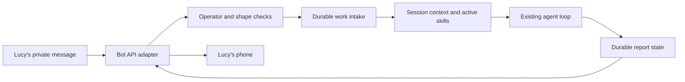
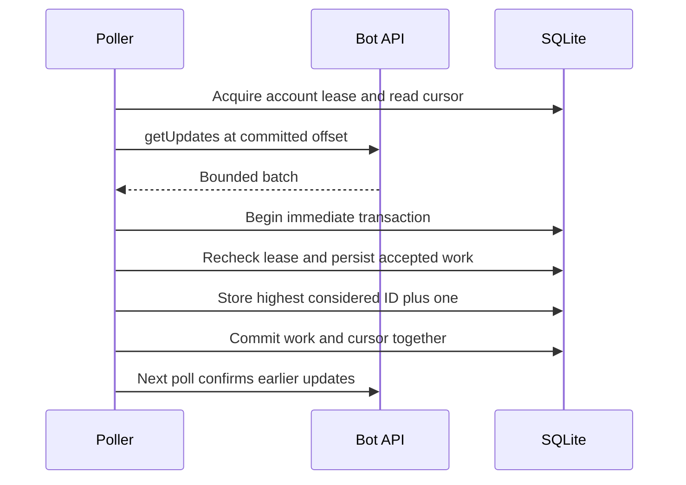
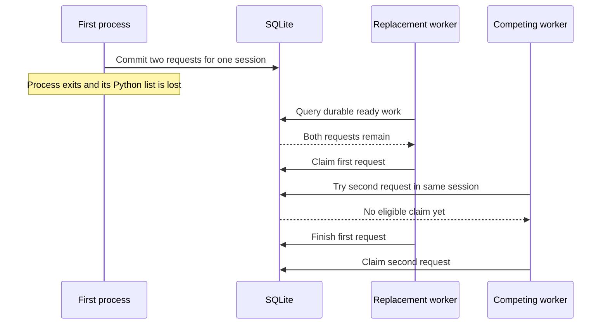
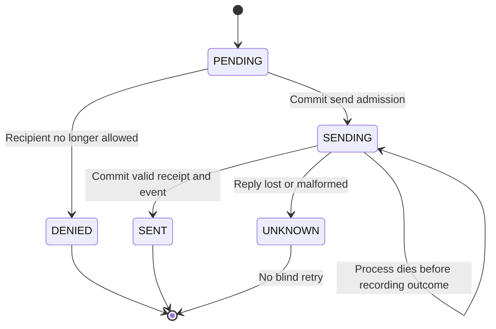

# Chapter 6 — Talk to the agent from your phone

Lucy has left the shop to collect packaging. She wants to ask for the opening brief without returning to the development terminal. The agent already knows how to inspect stock, create drafts and use a tested opening procedure. A phone interface should deliver Lucy's request into that same program and return its result. It should not create a second agent with a separate memory and a different interpretation of her preferences.

The interesting failure is easy to overlook. A messaging service delivers a request, the local process stores it, and the connection drops before either side is certain what happened. When the request arrives again, should the model run twice? On the return path, the service might accept a report and lose its reply. Sending the report again would make the interface look unreliable even though the underlying stock work completed correctly.

In this chapter you will build one Telegram adapter around durable intake, stable session identity and an explicit outbound delivery state. You will keep the local bot interface available for offline exercises. The same loop and active opening skill from [Chapter 5](../ch05_skills/README.md) will perform the work. Consequential purchasing remains outside this chapter's dispatcher.

## Learning objectives

Implement a narrow HTTP bot adapter; authenticate an operator by an explicit numeric allowlist; bind private requests to stable sessions; commit accepted work and the inbound cursor together; serialize conflicting session work; and distinguish a successful report delivery from an unknown outcome.

The deliverable is a phone-capable agent with a deterministic local checkpoint. The local checkpoint proves admission, duplicate handling, context routing and delivery-state behavior without credentials. The optional Telegram run adds a real service interaction and requires you to inspect the reply on your phone. These are different observations. A fake bot returning a message identifier cannot prove that a handset received anything.

## Give each identity one job

A bot account identifies the application's messaging endpoint. A human user identifier identifies the operator. An update identifier identifies one incoming delivery, and a local work identifier identifies the durable task created from it. A session groups turns that may use the same conversation context and preferences. Keeping these identities separate prevents a reconnect from accidentally becoming a new conversation or a duplicate purchase request.

| Identity | Teaching example | Its purpose |
| --- | --- | --- |
| Bot account | `teaching` in the offline adapter | Namespace the channel and its cursor |
| Operator | Numeric user `123` | Decide whose private text may create work |
| Update | `101` | Deduplicate one inbound delivery within the bot account |
| Session | `telegram:teaching:123` | Route context and serialize conflicting turns |
| Work | A locally generated identifier | Track execution and the resulting report |

In the real adapter the account namespace comes from the non-secret numeric prefix of the bot credential. The credential itself is never a session identifier and never enters a prompt. A second bot with the same update number must still create a different origin identity. Conversely, restarting the same bot must preserve the namespace so its duplicate delivery still finds the existing work record.

Our human-authentication policy is deliberately narrow: a private chat, a non-bot sender on the numeric allowlist, and a chat identifier equal to that sender's identifier. Group messages, usernames, forwarded identity claims and text such as “I am Lucy” do not qualify. The HTTPS Bot API response supplies the sender metadata; our code decides which identities are allowed. This policy is separate from later approval to spend money.



**Figure:** The adapter transports requests and reports; the existing runtime retains work, context and execution.

## Prepare a dedicated bot and operator identity

Telegram's official tutorial describes obtaining a bot credential from BotFather using `/newbot`. Keep that credential in an operator-owned environment file outside the repository. It authenticates the bot, while your numeric user identifier determines who our application admits. Use a dedicated teaching bot and a private chat that you initiate yourself. Follow the [official setup tutorial](https://core.telegram.org/bots/tutorial) for the account steps, checked on 7 September 2026.

Set `SOVEREIGN_AGENT_TELEGRAM_TOKEN` and `SOVEREIGN_AGENT_OPERATORS` in the local environment before a live run. The latter is a comma-separated list of positive numeric user identifiers. Obtain and verify your own identifier locally; do not replace the allowlist with “accept the first person who sends a message.” That would turn a race to contact a new bot into an authentication mechanism.

Use restrictive file permissions and avoid commands that echo environment values. The runtime reads the token from the environment, passes it to the HTTP transport over the child's standard input, and emits generic errors rather than URLs containing credentials. The file should never be pasted into a bug report. Tests use recognizable fake credentials so they can verify that error paths do not include them.

## Build the narrow HTTP adapter

We use two Bot API operations: `getUpdates` for long polling and `sendMessage` for plain-text reports. The official API states that a higher polling offset confirms earlier updates, that polling and webhooks are mutually exclusive, and that upstream updates are retained for at most 24 hours. Our local persistence begins after intake; it cannot recover messages that expired before reaching the host. These protocol facts come from the [Bot API reference](https://core.telegram.org/bots/api#getupdates), checked on 7 September 2026.

The adapter exposes a small `call` interface so a local object can exercise the rest of the system. Our bounded HTTP helper is shared with the model provider: it limits the whole request deadline and response size, refuses redirects and keeps credentials out of process arguments. Reusing this transport does not delegate agent behavior to a framework. The model loop, intake and delivery rules remain ordinary Python that we construct here.

**Listing:** Implement the real bot adapter without a messaging SDK.

```python
import json
import math
import re
import sqlite3
import tempfile
import time
import uuid
from pathlib import Path
from typing import Any, Protocol

from sovereign_agent.database import Database
from sovereign_agent.events import append_event
from sovereign_agent.http_transport import request


class Bot(Protocol):
    account: str

    def call(self, method: str, data: dict[str, Any]) -> Any: ...


class Telegram:
    def __init__(self, token: str) -> None:
        if not re.fullmatch(r"[0-9]+:[a-zA-Z0-9_-]+", token):
            raise ValueError("invalid Telegram credential format")
        self._token = token
        self.account = token.split(":", 1)[0]

    def call(self, method: str, data: dict[str, Any]) -> Any:
        if method not in {"getUpdates", "sendMessage"}:
            raise ValueError("unsupported Telegram operation")
        try:
            response = request(
                "https://api.telegram.org/bot" + self._token + "/" + method,
                data=json.dumps(data).encode(),
                headers={"Content-Type": "application/json"},
                timeout=35,
            )
            if response.status != 200:
                raise OSError("Telegram declined operation")
            result = json.loads(response.body)
            if not isinstance(result, dict) or result.get("ok") is not True:
                raise ValueError("Telegram declined operation")
            return result["result"]
        except OSError, ValueError, KeyError, TypeError:
            # API URLs contain the token. Never expose exception URLs or bodies.
            raise OSError("Telegram request failed; inspect connectivity and credentials") from None


try:
    Telegram("not-a-bot-credential")
except ValueError as error:
    print(error)
```

```text
invalid Telegram credential format
```

The method allowlist prevents callers from turning this object into a general bot administration client. The response must be an object, must report success and must contain its result. A malformed envelope or refused operation becomes a generic `OSError`. We deliberately do not put the server response body into the exception because responses and URLs can contain data that does not belong in logs.

A syntactically valid credential is not proof that Telegram accepts it. That requires a real authenticated request. Similarly, a successful HTTP status does not replace validation of the JSON envelope. The adapter performs both checks and leaves the next layer to validate whether a returned update batch or delivery receipt has the expected shape.

**Listing:** Define a local bot that can replay input and lose an accepted output's reply.

```python
class LocalBot:
    account = "teaching"

    def __init__(self, updates):
        self.updates = updates
        self.offsets = []
        self.sent = []
        self.lose_next_reply = False

    def call(self, method, data):
        if method == "getUpdates":
            self.offsets.append(data["offset"])
            return self.updates
        self.sent.append(data)
        if self.lose_next_reply:
            self.lose_next_reply = False
            raise TimeoutError("accepted remotely but reply lost")
        return {"message_id": 900 + len(self.sent)}


def update(
    identifier,
    actor=123,
    text="Prepare replenishment drafts from current stock. State GBP amounts.",
):
    return {
        "update_id": identifier,
        "message": {
            "from": {"id": actor, "is_bot": False},
            "chat": {"id": actor, "type": "private"},
            "text": text,
        },
    }


bot = LocalBot([update(101)])
print(bot.call("getUpdates", {"offset": 0})[0]["update_id"])
print(bot.offsets)
```

```text
101
[0]
```

This local bot intentionally returns repeated updates even when the supplied offset has advanced. That is an adversarial exercise for our own duplicate handling, not a claim that the real service normally ignores offsets. Its outbound list represents accepted messages in the fixture. Losing a reply after adding to that list lets us test uncertainty without relying on an unreliable network accident.

## Build durable admission before advancing the cursor

The work record extends the persisted results from Chapter 4. It needs a unique origin, a stable session, the request text, its channel and recipient, a creation time, and execution/delivery state. An accepted origin must not be reused for different content. Otherwise a duplicate identifier could silently replace the request that an operator actually authorized.

The cumulative database already carries the full work schema. The admission function below is the runtime's complete helper, including daily/pending capacity and the memory revision introduced in Chapter 4. Fields for future task roles and stock subjects retain their ordinary shop defaults here. They do not create new capabilities. Keeping the complete function visible makes it possible to trace which values are persisted when the adapter calls it.

**Listing:** Construct the durable admission boundary used inside the intake transaction.

```python
class IntakeLimitError(ValueError):
    """A producer can defer admission without consuming its own pending signal."""


def _enqueue(
    connection: sqlite3.Connection,
    origin: str,
    session: str,
    prompt: str,
    now: float,
    channel: str = "local",
    recipient: str = "",
    subject: str = "",
    *,
    require_admission: bool = False,
    role: str = "shop",
    billing_session: str = "",
) -> str:
    if (
        not origin
        or not session
        or not prompt.strip()
        or len(prompt.encode()) > 16_384
        or len(origin) > 250
        or len(session) > 200
        or not math.isfinite(now)
        or not isinstance(subject, str)
        or len(subject) > 100
        or role not in {"shop", "research"}
        or len(billing_session) > 200
    ):
        raise ValueError("nonempty bounded intake required")
    existing = connection.execute(
        "SELECT * FROM assistant_work WHERE origin=?", (origin,)
    ).fetchone()
    if existing:
        if (
            existing["session"],
            existing["prompt"],
            existing["channel"],
            existing["recipient"],
            existing["subject"],
            existing["role"],
            existing["billing_session"],
        ) != (session, prompt, channel, recipient, subject, role, billing_session):
            raise ValueError("intake identity reused for different content")
        if require_admission and existing["status"] == "REJECTED":
            raise IntakeLimitError("existing intake was rejected")
        return str(existing["id"])
    control = channel.startswith("telegram:") and prompt.split(maxsplit=1)[0] in {
        "/approve",
        "/revoke",
        "/cancel",
    }
    day = int(now // 86400)
    connection.execute(
        "INSERT OR IGNORE INTO assistant_daily(session,day) VALUES (?,?)", (session, day)
    )
    admitted = connection.execute(
        "SELECT controls,admitted FROM assistant_daily WHERE session=? AND day=?", (session, day)
    ).fetchone()[int(not control)]
    pending = connection.execute(
        "SELECT count(*) FROM assistant_work WHERE session=? "
        "AND status IN ('READY','RUNNING','BLOCKED') AND control=?",
        (session, int(control)),
    ).fetchone()[0]
    rejected = admitted >= (200 if control else 50) or pending >= 20
    if rejected and require_admission:
        raise IntakeLimitError("intake capacity exhausted; condition remains pending")
    identifier = uuid.uuid4().hex
    revision = connection.execute(
        "SELECT revision FROM assistant_memory_revisions WHERE session=?", (session,)
    ).fetchone()
    connection.execute(
        "INSERT INTO assistant_work"
        "(id,origin,session,prompt,created,channel,recipient,status,result,control,subject,role,"
        "billing_session,context_revision) VALUES (?,?,?,?,?,?,?,?,?,?,?,?,?,?)",
        (
            identifier,
            origin,
            session,
            prompt,
            now,
            channel,
            recipient,
            "REJECTED" if rejected else "READY",
            "Request limit reached; resolve pending work or return tomorrow." if rejected else None,
            int(control),
            subject,
            role,
            billing_session,
            revision[0] if revision else 0,
        ),
    )
    if not rejected:
        connection.execute(
            "UPDATE assistant_daily SET admitted=admitted+?,controls=controls+? "
            "WHERE session=? AND day=?",
            (int(not control), int(control), session, day),
        )
    return identifier


scratch = tempfile.TemporaryDirectory(prefix="lucy-phone-chapter-")
root = Path(scratch.name)
db = Database(root / "agent.sqlite")
with db.immediate() as connection:
    first = _enqueue(connection, "local:probe", "local-session", "brief", time.time())
with db.immediate() as connection:
    again = _enqueue(connection, "local:probe", "local-session", "brief", time.time())
print("same durable identity:", first == again)
try:
    with db.immediate() as connection:
        _enqueue(connection, "local:probe", "local-session", "changed request", time.time())
except ValueError as error:
    print(error)
```

```text
same durable identity: True
intake identity reused for different content
```

A duplicate lookup occurs before capacity accounting, so a repeated delivery does not consume a second daily admission. New ordinary requests are bounded by the session's pending count and UTC daily allowance. When capacity is exhausted, the helper records a rejected work result that can be delivered to the operator. It does not repeatedly execute a request while pretending the queue is empty.

The reserved control-command allowance is for later approval, revocation and cancellation work. This chapter's dispatcher exposes stock and draft tools only; a command-looking message cannot create purchasing authority. Chapter 8 will connect explicit command interpretation to exact proposals. Here the important admission property is that every persisted request has its original identity and payload, including an explicit rejection when it cannot enter ordinary work.

## Commit the batch and cursor together

The inbound cursor belongs to a bot account. Read it, request updates from that offset, validate the returned batch, then enter one immediate transaction. For each allowed message, create or recover the corresponding work record. Advance the cursor only after every batch member has been considered. Committing the cursor separately would create a window in which the remote service can forget a request that the runtime never stored.

A single local poller owns a short lease for that bot account. It acquires the lease before the network call and rechecks ownership inside the intake transaction. A process that outlives its lease may have a response in memory, but that response does not entitle it to commit over a replacement poller. The lease is released only if its owner token still matches.

**Listing:** Implement poller ownership and atomic intake.

```python
def _check_operators(operators: frozenset[int]) -> None:
    if not operators or any(type(actor) is not int or actor <= 0 for actor in operators):
        raise ValueError("explicit numeric operator allowlist required")


def poll(db: Database, bot: Bot, operators: frozenset[int]) -> list[str]:
    _check_operators(operators)
    channel = "telegram:" + bot.account
    owner = uuid.uuid4().hex
    with db.immediate() as connection:
        lease = connection.execute(
            "SELECT * FROM assistant_channel_leases WHERE channel=?", (channel,)
        ).fetchone()
        if lease and lease["expires"] > time.time():
            raise PermissionError("another poller owns this bot account")
        connection.execute(
            "INSERT INTO assistant_channel_leases(channel,owner,expires) VALUES (?,?,?) "
            "ON CONFLICT(channel) DO UPDATE SET owner=excluded.owner,expires=excluded.expires",
            (channel, owner, time.time() + 40),
        )
    try:
        return _poll_owned(db, bot, operators, channel, owner)
    finally:
        with db.immediate() as connection:
            connection.execute(
                "DELETE FROM assistant_channel_leases WHERE channel=? AND owner=?", (channel, owner)
            )


def _poll_owned(
    db: Database, bot: Bot, operators: frozenset[int], channel: str, owner: str
) -> list[str]:
    cursor = db.connection.execute(
        "SELECT offset FROM assistant_channel_cursor WHERE channel=?", (channel,)
    ).fetchone()
    offset = cursor[0] if cursor else 0
    updates = bot.call(
        "getUpdates",
        {"offset": offset, "limit": 100, "timeout": 20, "allowed_updates": ["message"]},
    )
    if not isinstance(updates, list) or len(updates) > 100:
        raise ValueError("invalid Telegram update batch")
    identifiers = []
    with db.immediate() as connection:
        current = connection.execute(
            "SELECT 1 FROM assistant_channel_leases WHERE channel=? AND owner=? AND expires>?",
            (channel, owner, time.time()),
        ).fetchone()
        if not current:
            raise PermissionError("poller claim expired")
        highest = offset - 1
        for update in updates:
            if not isinstance(update, dict):
                raise ValueError("invalid Telegram update object")
            update_id = update.get("update_id")
            if type(update_id) is not int or update_id < 0:
                raise ValueError("invalid update identity")
            # Do not discard an earlier member of an unordered batch. The cursor
            # is published only after every accepted payload is durable.
            highest = max(highest, update_id)
            message = update.get("message", {})
            if not isinstance(message, dict):
                raise ValueError("invalid Telegram message object")
            sender = message.get("from", {})
            chat = message.get("chat", {})
            if not isinstance(sender, dict) or not isinstance(chat, dict):
                raise ValueError("invalid Telegram sender or chat object")
            actor = sender.get("id")
            text = message.get("text")
            if (
                type(actor) is int
                and actor in operators
                and chat.get("type") == "private"
                and type(chat.get("id")) is int
                and chat.get("id") == actor
                and not sender.get("is_bot")
                and isinstance(text, str)
                and text.strip()
                and len(text.encode()) <= 16_384
            ):
                origin = f"{channel}:{update_id}"
                existed = connection.execute(
                    "SELECT id FROM assistant_work WHERE origin=?", (origin,)
                ).fetchone()
                identifier = _enqueue(
                    connection, origin, f"{channel}:{actor}", text, time.time(), channel, str(actor)
                )
                if not existed:
                    identifiers.append(identifier)
        connection.execute(
            "INSERT INTO assistant_channel_cursor(channel,offset) VALUES (?,?) "
            "ON CONFLICT(channel) DO UPDATE SET offset=excluded.offset",
            (channel, max(offset, highest + 1)),
        )
    return identifiers


bot = LocalBot([update(103, actor=999), update(101), update(102)])
operators = frozenset({123})
identifiers = poll(db, bot, operators)
print("accepted private requests:", len(identifiers))
print(
    "cursor:",
    db.connection.execute(
        "SELECT offset FROM assistant_channel_cursor WHERE channel='telegram:teaching'"
    ).fetchone()[0],
)
print("new work from replay:", len(poll(db, bot, operators)))
```

```text
accepted private requests: 2
cursor: 104
new work from replay: 0
```

The batch deliberately places update 103 before updates 101 and 102. Tracking the highest identifier does not justify skipping smaller members of the same returned batch; both allowed requests must become durable. The cursor moves past the unauthorized message as well, because the adapter has made and committed its decision to ignore that payload. Re-requesting an unauthorized message forever would not make it authorized.

An absent text field is a supported reason to ignore an update: this adapter does not turn photos or voice recordings into prompts. A malformed object is different. It raises a controlled validation error, rolling back the entire batch and its cursor. We do not silently advance past a response shape that the program cannot interpret. The supervised service can report a generic retry state without logging the malformed body.



**Figure:** A committed cursor only acknowledges a batch after its accepted work is durable.

**Listing:** Reproduce a malformed batch and observe complete rollback.

```python
bad = LocalBot([update(104), {"update_id": 105, "message": None}])
try:
    poll(db, bad, operators)
except ValueError as error:
    print(error)
print(
    "phone work rows:",
    db.connection.execute(
        "SELECT count(*) FROM assistant_work WHERE channel='telegram:teaching'"
    ).fetchone()[0],
)
print(
    "cursor unchanged:",
    db.connection.execute(
        "SELECT offset FROM assistant_channel_cursor WHERE channel='telegram:teaching'"
    ).fetchone()[0],
)
print(
    "poller leases:",
    db.connection.execute("SELECT count(*) FROM assistant_channel_leases").fetchone()[0],
)
```

```text
invalid Telegram message object
phone work rows: 2
cursor unchanged: 104
poller leases: 0
```

The first request in that bad batch looked valid. Its absence afterward proves the transaction rolled it back along with the cursor. This is stronger evidence than checking only that the final invalid object raised an exception. The next valid batch can retry from the unchanged cursor, and the released lease allows a new poller to proceed.

## Route durable work into the existing loop

The result of `poll` is a convenient list of newly admitted identifiers; it is not the durable queue. After a process restart, that Python list is gone. A worker must query the stored work records, claim one eligible assignment, assemble context using the assignment's session, and finish the record with its result. The real service already follows that pattern, and the chapter checkpoint does too.



**Figure:** A replacement reads durable work, while session ownership prevents overlapping turns from using unfinished conversation context.

Two requests in the same private session should not concurrently assemble context from the same unfinished conversation. The existing claim boundary serializes that session. Different sessions can be handled separately when the worker design supports it. Chapter 10 will construct ownership generations and crash replacement in detail; here we can already demonstrate the visible claim behavior using two database connections.

**Listing:** Stage the opening procedure, retain a session preference and observe a conflicting claim.

```python
from reference_organizations.store.agent import OfflineShopModel, seed_lucy, shop_dispatcher
from reference_organizations.store.evaluation import CASES, candidate_checks, evaluate
from sovereign_agent.assistant_context import activate_skill, context, remember, stage_skill
from sovereign_agent.assistant_work import claim, finish

seed_lucy(db)
source = Path("book/always_on/skills/opening-check-v1.toml")
stage_skill(db, source)
activate_skill(
    db,
    "opening_check",
    "1",
    evaluate=lambda candidate: candidate_checks(
        evaluate(OfflineShopModel, skill=candidate, cases=CASES[:3])
    ),
    required_cases=frozenset(f"{case.name}:0" for case in CASES[:3]),
)
remember(db, "telegram:teaching:123", "format", "three bullets", "lucy/explicit-message")
db.close()
db = Database(root / "agent.sqlite")
queued = [
    row[0]
    for row in db.connection.execute(
        "SELECT id FROM assistant_work WHERE channel='telegram:teaching' ORDER BY created,rowid"
    )
]
owner = claim(db, "phone-worker", identifier=queued[0])
other = Database(db.path)
print("second session claim:", claim(other, "other-worker", identifier=queued[1]))
other.close()
selected = context(db, owner.session, owner.prompt, allowed=shop_dispatcher(db).allowed)
print("right preference:", "three bullets" in selected[0]["content"])
print("active procedure:", "skill_guidance" in selected[0]["content"])
```

```text
second session claim: None
right preference: True
active procedure: True
```

Notice that the preference belongs to the phone session, not the earlier local session named `lucy`. Automatically combining sessions merely because two messages mention the same person's name would defeat the identity boundary. This chapter deliberately seeds the authenticated session's preference as an operator action. A later user interface can offer explicit, authenticated preference editing without allowing the model to relabel an arbitrary session.

Build `run_claim` to pass the selected context into the owned loop, use the existing three shop tools, check current ownership around execution, and reserve each model call against the session's durable allowance. It records a successful result only if the fixture's draft observations match the independently authored quantities. These hooks connect messaging to the runtime rather than turning a received text into an untracked model call. The checkpoint carries the same bridge, with its adjacent Chapter 3 file resolved relative to the script.

**Listing:** Execute both stored requests and preserve the results for delivery.

```python
import runpy

from sovereign_agent.agent_loop import run_loop
from sovereign_agent.assistant_work import assert_current, reserve_model_call

draft_checker = runpy.run_path("book/always_on/checkpoints/ch03.py")["draft_evidence"]


def run_claim(db, current, model):
    dispatcher = shop_dispatcher(db)
    messages = context(db, current.session, current.prompt, allowed=dispatcher.allowed)
    result = run_loop(
        model,
        dispatcher,
        messages,
        check_current=lambda: assert_current(db.connection, current),
        reserve_call=lambda: reserve_model_call(db, current, 0),
    )
    passed = result.status == "COMPLETED" and draft_checker(result)
    finish(db, current, "DONE" if passed else "BLOCKED", result.answer)
    return passed, result


passed, result = run_claim(db, owner, OfflineShopModel())
print("first draft evidence:", passed)
owner = claim(db, "phone-worker", identifier=queued[1])
passed, result = run_claim(db, owner, OfflineShopModel())
print("second draft evidence:", passed)
print(
    "phone results:",
    db.connection.execute(
        "SELECT count(*) FROM assistant_work WHERE channel='telegram:teaching' AND status='DONE'"
    ).fetchone()[0],
)
```

```text
first draft evidence: True
second draft evidence: True
phone results: 2
```

The offline model does not interpret the formatting preference; it supplies authored responses to test the data flow. We checked that the selected context contained the preference, while the transcript checker verifies the draft operations. Only a live model run and a reading of its answer can assess how well it follows the requested format. Avoid collapsing those observations into a single claim that the agent “understands Lucy.”

## Treat report delivery as an external effect

There are two state machines in this chapter: execution of the work and delivery of its result. A work record can be `DONE` while its report is still `PENDING`. A report can become `UNKNOWN` even though the stock calculation completed correctly. Keeping those states separate helps the operator distinguish “the agent did not finish” from “the agent finished, but I may not have received its answer.”

| Delivery state | What the local record establishes | Automatic next action |
| --- | --- | --- |
| `PENDING` | No send has been admitted yet | Attempt one eligible delivery |
| `SENDING` | A send was admitted; completion is not recorded | Preserve uncertainty after a crash |
| `SENT` | A valid message identifier was committed with an event | Do not send the same report again |
| `UNKNOWN` | The attempt has an uncertain outcome | Inspect; do not blindly resend |
| `DENIED` | The recipient is no longer allowed | Do not contact that recipient |

The sender checks the current operator allowlist immediately before admitting a send. It then commits `SENDING` before contacting Telegram. If the response is lost, the local program cannot know whether the message reached the service. This chapter chooses a visible uncertain state instead of automatically sending another copy. That is a delivery policy, not a claim of exactly-once messaging.

**Listing:** Implement one outbound attempt and persist its successful message identifier.

```python
def deliver_one(db: Database, bot: Bot, operators: frozenset[int]) -> str | None:
    _check_operators(operators)
    with db.immediate() as connection:
        row = connection.execute(
            "SELECT * FROM assistant_work WHERE channel=? AND "
            "status IN ('DONE','BLOCKED','CANCELLED','REJECTED') AND delivery='PENDING' "
            "ORDER BY created LIMIT 1",
            ("telegram:" + bot.account,),
        ).fetchone()
        if row is None:
            return None
        if not row["recipient"].isdigit() or int(row["recipient"]) not in operators:
            connection.execute(
                "UPDATE assistant_work SET delivery='DENIED' WHERE id=?", (row["id"],)
            )
            return "DENIED"
        # A crash after this commit is ambiguous, even if no HTTP call happened.
        connection.execute("UPDATE assistant_work SET delivery='SENDING' WHERE id=?", (row["id"],))
    try:
        text = row["result"] or "Work ended without a report."
        if len(text) > 3900:
            text = text[:3800] + "\n[Report truncated; request a shorter report.]"
        result = bot.call("sendMessage", {"chat_id": int(row["recipient"]), "text": text})
        if (
            not isinstance(result, dict)
            or type(result.get("message_id")) is not int
            or result["message_id"] <= 0
        ):
            raise ValueError("missing delivery receipt")
        status = "SENT"
    except OSError, ValueError:
        status = "UNKNOWN"
    with db.immediate() as connection:
        updated = connection.execute(
            "UPDATE assistant_work SET delivery=? WHERE id=? AND delivery='SENDING'",
            (status, row["id"]),
        )
        if not updated.rowcount:
            return "UNKNOWN"
        if status == "SENT":
            append_event(
                db,
                "assistant.channel.sent",
                {
                    "work": row["id"],
                    "channel": row["channel"],
                    "recipient": row["recipient"],
                    "message_id": result["message_id"],
                },
            )
    return status


bot.lose_next_reply = True
print("first delivery:", deliver_one(db, bot, operators))
print("second delivery:", deliver_one(db, bot, operators))
print("accepted by local bot:", len(bot.sent))
print("further automatic delivery:", deliver_one(db, bot, operators))
receipt = db.connection.execute(
    "SELECT payload FROM events WHERE kind='assistant.channel.sent'"
).fetchone()[0]
print("recorded successful message:", json.loads(receipt)["message_id"])
```

```text
first delivery: UNKNOWN
second delivery: SENT
accepted by local bot: 2
further automatic delivery: None
recorded successful message: 902
```

The fixture accepted the first report before losing the reply. We know that because we control the local bot's list. The runtime only sees the timeout, so it correctly records `UNKNOWN`. The second report belongs to the second request and receives a valid receipt. It is not a retry of the first report. This distinction is why a global count of sent messages cannot substitute for per-work delivery state.

The update to `SENT` and the receipt event share a transaction. If recording the event fails, the earlier `SENDING` admission remains, leaving the attempt visibly uncertain. If restore or another recovery action changed the delivery state before this completion arrived, the conditional update affects no row and no stale success event is appended. An old network response does not get to overwrite a new local decision.

Our event retains only the work identifier, channel, requested recipient and message identifier. It does not copy the raw server response or bot credential. The message identifier is a delivery receipt from the service; it is not proof that Lucy read the report. A handset observation remains necessary for the user-facing result, and natural-language correctness still needs its own evaluation.



**Figure:** Delivery admission survives a crash even when the remote outcome is unknown.

Plain-text reports avoid an additional formatting language. Telegram documents a 4096-character text limit for `sendMessage`; the adapter leaves headroom and adds a visible truncation notice for long answers. The full local result remains available in the work record. Inspect a long or non-ASCII report on the actual channel rather than assuming that a character-count check guarantees an attractive render. [Bot API text contract](https://core.telegram.org/bots/api#sendmessage)

**Listing:** Revoke the recipient before an otherwise eligible delivery.

```python
with db.immediate() as connection:
    identifier = _enqueue(
        connection,
        "telegram:teaching:200",
        "telegram:teaching:123",
        "brief",
        time.time(),
        "telegram:teaching",
        "123",
    )
owner = claim(db, "phone-worker", identifier=identifier)
finish(db, owner, "DONE", "An already completed report.")
print("delivery after allowlist change:", deliver_one(db, bot, frozenset({456})))
print("accepted messages unchanged:", len(bot.sent))
db.close()
db = Database(root / "agent.sqlite")
print(
    "uncertain reports retained:",
    db.connection.execute(
        "SELECT count(*) FROM assistant_work WHERE delivery='UNKNOWN'"
    ).fetchone()[0],
)
db.close()
scratch.cleanup()
```

```text
delivery after allowlist change: DENIED
accepted messages unchanged: 2
uncertain reports retained: 1
```

Revocation here governs a send that has not yet been admitted. It cannot retract a report already accepted by Telegram, and a local transaction cannot cancel a network request already in flight. The same distinction will matter more when the external effect is a supplier order. Chapter 9 will add provider-supported operation identity and reconciliation for that separate problem.

## Compare a single adapter with a shared gateway

OpenClaw's architecture document at commit `354538083db0a8728e16238cbd0b7a304416ff24` describes a long-lived gateway owning messaging connections, with control clients connecting over WebSocket. It documents typed requests, events, device pairing and idempotency keys for side-effecting methods. These are published architectural choices in the [pinned gateway document](https://github.com/openclaw/openclaw/blob/354538083db0a8728e16238cbd0b7a304416ff24/docs/concepts/architecture.md).

The trade-off I infer is that a shared gateway can coordinate several clients and channels through one control interface, while Lucy's adapter has fewer moving parts for one private chat. Our design still separates the transport from work execution; it simply does not introduce a second WebSocket protocol. That comparison does not establish which whole project has better reliability or security.

An experiment that could change our choice is adding a second simultaneous operator interface. Measure how much authentication, routing, cancellation and state-notification logic gets duplicated. If maintaining those shared behaviors becomes the dominant cost, a gateway may earn its additional protocol and process boundaries. One extra channel alone is not proof that every interface must become a new service.

## Run the cumulative checkpoint and the phone experiment

Run the offline checkpoint first. It admits an unordered batch containing two allowed messages and one unauthorized message, reopens the database, suppresses repeated intake, observes a competing session claim, runs the two draft tasks and injects an accepted delivery whose reply is lost. No network credentials or real purchases are involved.

**Listing:** Execute the complete local channel experiment.

```python
import sys
from unittest.mock import patch

checkpoint = runpy.run_path("book/always_on/checkpoints/ch06.py")
with patch.object(sys, "argv", ["ch06.py"]):
    assert checkpoint["main"]() == 0
```

```text
Accepted private requests: 2
Duplicate intake after restart: 0
Conflicting session claim: None
Completed drafts: 2
First delivery: UNKNOWN
Second delivery: SENT
Automatic resend: None
Recorded send receipts: 1
Purchases: 0
```

For account setup, the companion `telegram_identity_v1.py` generates a one-time challenge on your local terminal. Send that exact text from the intended private account to your dedicated bot. It reports the matching sender's numeric identifier for your review, without changing an allowlist or creating work. It makes up to three bounded polls and does not advance the confirmation offset. Use a new teaching bot without another active poller or an unrelated backlog.

```bash
uv run python book/always_on/appendices/telegram_identity_v1.py
```

The helper is a setup instrument, not automatic enrollment. Its challenge demonstrates control of the private account that sent it to this bot, assuming the challenge remains under your control. A display name is insufficient. If multiple identities return the same challenge, setup refuses and requires a new challenge. After reviewing the identifier, place it in the operator environment setting and keep that setting operator-owned.

Now send the stock request from your phone: “Prepare replenishment drafts from current stock. State GBP amounts.” Run one bounded channel pass using a persistent, dedicated test directory:

```bash
uv run python book/always_on/checkpoints/ch06.py --telegram --root /tmp/lucy-phone-test
```

This command uses the authored offline model while contacting the real bot service. That isolates channel behavior from model variation. Add `--live --model qwen3 --transcript` when you want to exercise the local HTTP model as well. The transcript option prints request and response content, so keep that output local and inspect it before sharing. The bot credential should never appear there.

The checkpoint queries durable pending work, including requests admitted by a prior process, and drains a bounded set of pending reports. It attributes each result's delivery state by its work identifier instead of assuming the next outbound report belongs to the just-completed turn. If no work or delivery occurred, it exits without claiming a new success. An unknown delivery remains uncertain across subsequent invocations.

A setup message may itself arrive as ordinary text during the first run; the teaching opening skill may respond with a stock brief. No setup message grants authority. Keep the bot separate from any personal or production automation so those initial messages and the controlled failure experiments do not affect another workflow.

### Expected observations

The local checkpoint should report two admitted requests, no new work from replay, a refused concurrent claim for the same session, two completed draft results, one unknown delivery and one recorded successful delivery. The uncertain attempt is not automatically repeated after reopening. The successful attempt has one durable message-identifier event, and no supplier purchase exists.

For the live channel, inspect the actual private reply and its content on your phone. Check that the reply belongs to the requested bot and the correct conversation. Stop the program after intake and run it again to observe durable processing. Keep a returned API receipt, a locally completed work record and a human reading of the answer as separate evidence rather than using any one as a substitute for all three.

### Learner verification

Inspect the stored origin, session, channel and recipient for an allowed request, then compare them with an unauthorized update that did not create work. Replay the same update with changed text and confirm refusal without replacing the original payload. Remove the recipient from the allowlist before sending a pending report and observe `DENIED` without another network call.

Read the successful delivery event and identify the exact work record it supports. Inject a timeout after the local bot appends its accepted message, then confirm that a restart leaves the corresponding result uncertain. A program that simply repeats every pending-looking send would fail this lesson even if Lucy eventually receives an answer.

## Practice

### Exercise 1: Two bots, one update number

Create two local bot objects with different account namespaces and the same update identifier. Both allowed requests should become durable, with distinct origins and sessions. Then replay the first bot's update unchanged and with a modified payload. Explain why bot-account identity belongs in the deduplication key.

### Exercise 2: A malformed second member

Start a batch with a valid allowed request, then add a message whose sender is a list instead of an object. Verify that work, cursor and poller ownership return to the expected state after refusal. Compare this with a well-formed message containing a photo and no text: the latter is unsupported content that the adapter may ignore, not a malformed object it must reinterpret.

### Exercise 3: A slow model and a waiting message

Hold the first work claim while a second request arrives in the same private session. Confirm that intake can remain durable while conflicting execution waits. Release or finish the first assignment and demonstrate the second becoming eligible. Measure the delay without changing the rule that the two turns must not concurrently assemble stale session context.

### Exercise 4: Delivery after local state changes

Change an admitted report's delivery state to `UNKNOWN` before a late successful API response returns. Confirm that the old completion does not append a new success event or overwrite the changed state. Explain what the fixture knows about remote acceptance, what the runtime can record safely, and why the operator may still need to inspect the actual conversation.

## Active recall

Which identity deduplicates a request, and which identity selects memory? Why must accepted work and the inbound cursor share a transaction? What does the poller lease prevent that a numeric operator allowlist does not? Why is a `DONE` work record compatible with an `UNKNOWN` report delivery? What does a message identifier establish, and what must still be observed on the phone?

## Vocabulary

A **channel adapter** translates between one messaging protocol and runtime work. An **inbound cursor** identifies the next remote update position to request. A **durable origin** binds one external delivery to its immutable local request. A **poller lease** authorizes one local consumer to commit a bot account's intake. An **outbound receipt** records the service's successful message identifier, while an **unknown delivery** preserves uncertainty after an admitted send lacks a committed completion.

## Summary

You built a narrow bot API client, admitted only explicitly allowed private senders, bound accepted requests to stable sessions, and committed intake with its cursor. The existing skill and model loop now handle work originating from the phone. Results have a separate delivery state and a durable successful receipt, so losing a network response does not silently trigger a duplicate report. The next chapter creates work from schedules and stock events while the operator is away.
