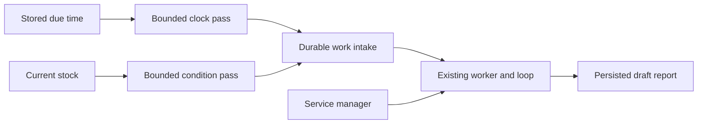
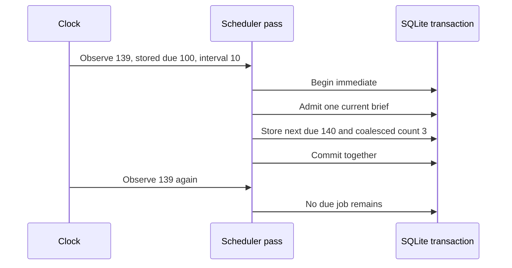
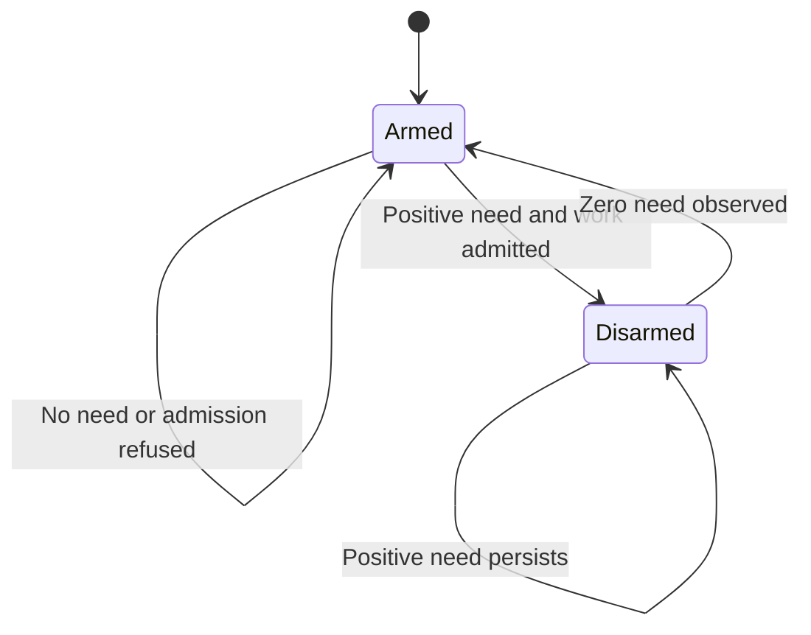
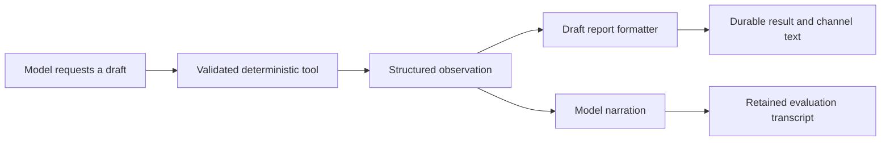

# Chapter 7 — Wake up for schedules and stock events

Lucy has learned to ask for a replenishment brief from her phone. Now she wants the brief before she asks. A second request follows: if vanilla becomes scarce during the day, prepare another draft. Repeating yesterday's prompt in a terminal would work while the builder was present. Lucy needs the host to notice these conditions and retain the resulting work while everyone is elsewhere.

We will build two producers for the durable work queue from [Chapter 6](../ch06_messaging/README.md). One observes the clock. The other observes stock. Neither calls a model. The existing worker consumes their records, loads the current session context and runs the bounded loop. A standard Linux service manager keeps that worker available after the terminal closes.

There is also a less obvious failure to repair. During this chapter's live experiment, the model requested a correct seven-tub draft worth £17.50, then described it as £15.00. A queue can preserve a wrong report perfectly. We will use the structured tool results to render the quantities and amounts Lucy sees, while retaining the original model response for evaluation.

## Learning objectives

By the end of this chapter you can implement a bounded scheduler pass, choose and test a missed-run policy, turn a persistent stock condition into one scoped work item per observed episode, and connect both producers to an unattended worker. You can distinguish process liveness, work admission, successful execution and a correct displayed result. You will also know which parts of a fixed-interval timer do not implement a local-calendar appointment.

The deliverable is an unattended draft-producing agent. The checkpoint runs a real child process without a prompt argument and waits for a persisted result. Its optional live mode uses the local HTTP model in that child. Purchases remain unavailable: no supplier endpoint is configured, and this chapter exposes only the read and draft tools already constructed.

## Separate a wake-up from the work it creates

A process can be alive while doing no useful work. It can also be temporarily absent while its work remains safely recorded. A liveness observation answers whether a process responds; it does not mean that Lucy needs another stock brief. Our scheduler and stock scanner answer different questions about business work. Keeping those questions explicit stops a frequent health check from becoming a frequent model call.

The clock producer asks whether a stored due time has passed. The stock producer asks whether a product has entered a positive replenishment-need episode. Both write through the existing intake function. The worker later claims an admitted record, performs the bounded model loop and persists its result. That separation gives us somewhere to apply admission limits before intelligence becomes expensive.

| Mechanism | Observation | What it may create |
| --- | --- | --- |
| Process health | Is the service running? | An operational observation |
| Clock job | Has `next_due` arrived? | One work record for the coalesced interval |
| Stock condition | Is this product newly in need? | One work record for the observed episode |
| Worker | Is eligible work available? | A transcript and a durable result |

The distinction also makes failures reproducible. We can pass an explicit clock value into a scheduler test without sleeping. We can change the fixture's stock and run one scanner pass without running a language model. Only the final integration experiment needs the producer, worker and model together. A failure there can be traced to the observation, admission, execution or reporting stage.



**Figure:** Time and stock produce records; the service manager keeps the process available to consume them.

## Register a job that can survive a restart

Our job record holds an identity, a session, a prompt, an interval, the next due time and an output route. The identity is immutable. Reusing it for different content would make old work origins ambiguous. Disabling a job preserves its row and earlier work; replacing it requires a new identity. This is a modest configuration policy that we can explain and test without inventing a general calendar language.

Use epoch seconds for stored due times and integer seconds for intervals. A job every 86,400 seconds follows a fixed UTC interval. It does not mean 8 a.m. in London across a daylight-saving transition. For this volume the main path uses the fixed interval and states it plainly. A reader who needs local-calendar behavior must introduce a zone-aware next-occurrence calculation and decide what a skipped or repeated local time means.

Before writing the row, validate the values that later intake depends on. A very long job identity might fit SQLite and then fail every time it becomes part of a work origin. That defect appeared during construction: accepting the schedule was easy, but executing its first tick was impossible. Validate at the configuration boundary so the operator receives a useful refusal immediately.

The following listings execute cumulatively. We reuse the database, event log and work-intake primitive from previous chapters. We construct the scheduler functions here rather than import a finished scheduler. The temporary database supplies the same schema used by the installed agent, so the later checkpoint can test the connection between these functions and the rest of the runtime.

**Listing:** Prepare the fixture and validate an explicit output route.

```python
import json
import math
import tempfile
import time
from pathlib import Path

from reference_organizations.store.agent import OfflineShopModel, seed_lucy, shop_dispatcher
from reference_organizations.store.assistant import run_once
from sovereign_agent.assistant_work import IntakeLimitError, _enqueue
from sovereign_agent.database import Database
from sovereign_agent.events import append_event
from sovereign_agent.model_turn import Message, ToolCall

import re


def validate_route(channel: str, recipient: str) -> None:
    if (
        not isinstance(channel, str)
        or not isinstance(recipient, str)
        or len(channel) > 200
        or len(recipient) > 200
        or not (
            (channel == "local" and not recipient)
            or (
                re.fullmatch(r"telegram:[A-Za-z0-9_-]+", channel)
                and recipient.isascii()
                and recipient.isdigit()
                and int(recipient) > 0
            )
        )
    ):
        raise ValueError("local output or an explicit positive Telegram recipient required")


temporary = tempfile.TemporaryDirectory(prefix="lucy-ch07-")
db = Database(Path(temporary.name) / "agent.sqlite")
seed_lucy(db)
validate_route("local", "")
validate_route("telegram:teaching", "123")
try:
    validate_route("telegram:teaching", "Lucy")
except ValueError:
    print("Named recipient refused")
```

```text
Named recipient refused
```

A route describes where a future result belongs. It does not authorize the recipient by itself. Chapter 6's delivery code still checks the configured numeric operator allowlist at send time. A local route has no remote recipient and makes no network request. Scheduled phone reports must use the same bot-account namespace and numeric recipient that the adapter uses for ordinary conversations.

**Listing:** Register an immutable fixed-interval job and disable future ticks.

```python
def schedule(
    db: Database,
    identifier: str,
    session: str,
    prompt: str,
    *,
    first_due: float,
    interval_seconds: int,
    channel: str = "local",
    recipient: str = "",
) -> None:
    """Epoch UTC intervals; missed runs coalesce to one, rather than a backlog storm."""
    if type(interval_seconds) is not int or interval_seconds < 1 or not math.isfinite(first_due):
        raise ValueError("finite due time and positive integral interval required")
    if (
        any(
            not isinstance(value, str) or not value.strip() or len(value) > 100
            for value in (identifier, session)
        )
        or not isinstance(prompt, str)
        or not prompt.strip()
        or len(prompt.encode()) > 16_384
    ):
        raise ValueError("bounded job identity, session and prompt required")
    validate_route(channel, recipient)
    with db.immediate() as connection:
        if connection.execute("SELECT 1 FROM assistant_jobs WHERE id=?", (identifier,)).fetchone():
            raise ValueError(
                "schedule identity already exists; use a new identity for a replacement"
            )
        connection.execute(
            "INSERT INTO assistant_jobs"
            "(id,session,prompt,interval_seconds,next_due,channel,recipient) "
            "VALUES (?,?,?,?,?,?,?)",
            (identifier, session, prompt, interval_seconds, first_due, channel, recipient),
        )


def unschedule(db: Database, identifier: str) -> None:
    """Stop future ticks without deleting work that a prior tick already admitted."""
    with db.immediate() as connection:
        if (
            connection.execute(
                "UPDATE assistant_jobs SET enabled=0 WHERE id=?", (identifier,)
            ).rowcount
            != 1
        ):
            raise ValueError("unknown schedule")


schedule(
    db,
    "morning",
    "lucy",
    "Prepare the opening replenishment draft.",
    first_due=100.0,
    interval_seconds=10,
)
try:
    schedule(db, "morning", "lucy", "Different instructions", first_due=200.0, interval_seconds=10)
except ValueError:
    print("Replacement needs a new identity")
print(db.connection.execute("SELECT next_due FROM assistant_jobs").fetchone()[0])
```

```text
Replacement needs a new identity
100.0
```

Notice what registration does not do: it does not enqueue work or call the model. The first due time may already be in the past, but admission belongs to the next scheduler pass. That gives the runtime a consistent place to honor a pause and apply workload limits. It also lets a test inspect a configured job before execution has altered it.

## Choose what a late scheduler means

Suppose the first due time is 100 seconds, the interval is ten seconds, and the host next observes time 139. The nominal due times were 100, 110, 120 and 130. Four separate morning briefs would repeat nearly the same work and multiply model cost. We choose one current brief and record that three additional occurrences were coalesced. The next due time becomes 140.

The calculation uses the stored due time as its anchor. Advancing from the observation time instead would slowly shift the schedule whenever a pass ran late. The number of additional elapsed intervals is the floor of `(now - next_due) / interval`. Add one to that count when advancing the next due time. At the exact due time, the floor is zero: one occurrence is due and none are skipped.

Coalescing is appropriate for “tell me the current stock position.” It would be wrong for some other jobs, such as processing each dated settlement record. Those need their own recovery policy and data source. We are making a business decision about this particular report, not discovering a universally correct timer setting. The recorded `coalesced` field makes that choice visible to the operator.



**Figure:** Four elapsed due times become one current task, and a repeated observation creates no additional task.

**Listing:** Admit work and advance the schedule in the same transaction.

```python
def tick(db: Database, *, now: float | None = None, maximum: int = 100) -> list[str]:
    now = time.time() if now is None else now
    if not math.isfinite(now) or type(maximum) is not int or not 1 <= maximum <= 1000:
        raise ValueError("invalid scheduler pass")
    created = []
    with db.immediate() as connection:
        if connection.execute("SELECT paused FROM assistant_control WHERE id=1").fetchone()[0]:
            return []
        rows = connection.execute(
            "SELECT * FROM assistant_jobs WHERE enabled=1 AND next_due<=? "
            "ORDER BY next_due,id LIMIT ?",
            (now, maximum),
        ).fetchall()
        for row in rows:
            try:
                identifier = _enqueue(
                    connection,
                    f"job:{row['id']}:{row['next_due']!r}",
                    row["session"],
                    row["prompt"],
                    now,
                    row["channel"],
                    row["recipient"],
                    require_admission=True,
                )
            except IntakeLimitError:
                if not row["deferred"]:
                    append_event(db, "assistant.job.deferred", {"job": row["id"]})
                    connection.execute(
                        "UPDATE assistant_jobs SET deferred=1 WHERE id=?", (row["id"],)
                    )
                continue
            created.append(identifier)
            skipped = math.floor((now - row["next_due"]) / row["interval_seconds"])
            next_due = row["next_due"] + (skipped + 1) * row["interval_seconds"]
            connection.execute(
                "UPDATE assistant_jobs SET next_due=?,deferred=0 WHERE id=?", (next_due, row["id"])
            )
            append_event(
                db,
                "assistant.job.enqueued",
                {"job": row["id"], "work": identifier, "coalesced": skipped},
            )
    return created


created = tick(db, now=139.0)
print("Created:", len(created))
print("Repeated observation:", len(tick(db, now=139.0)))
print("Next due:", db.connection.execute("SELECT next_due FROM assistant_jobs").fetchone()[0])
event = json.loads(
    db.connection.execute(
        "SELECT payload FROM events WHERE kind='assistant.job.enqueued'"
    ).fetchone()[0]
)
print("Coalesced:", event["coalesced"])
```

```text
Created: 1
Repeated observation: 0
Next due: 140.0
Coalesced: 3
```

There is no HTTP call inside this transaction. SQLite commits the work identity, next due time and event together. If the process dies before that commit, a later pass can observe the old due time and try again. If it dies after the commit, the work is already durable and the next pass sees the advanced time. The model worker does not need to have started for this handoff to be complete.

The origin includes the job identity and the previous due time. Intake uses that origin to find an existing record if the same occurrence is presented again. The transaction supplies the primary local consistency boundary; the stable origin adds an explicit identity for diagnosis and duplicate handling. Neither mechanism claims exactly-once behavior at an external supplier. We will address that different problem when the agent can place orders.

## Make pause and capacity observable

A global pause must leave a due job due. An earlier scheduler implementation advanced the job while the runtime was paused, consuming the scheduled occurrence even though the operator expected work to wait. The repair is the pause check inside the same transaction as the due-row query. A concurrent configuration change cannot slip between those two local steps.

**Listing:** Pause preserves the due time; disabling preserves admitted work.

```python
with db.immediate() as connection:
    connection.execute("UPDATE assistant_control SET paused=1")
print("Paused pass:", tick(db, now=179.0))
print("Due retained:", db.connection.execute("SELECT next_due FROM assistant_jobs").fetchone()[0])
with db.immediate() as connection:
    connection.execute("UPDATE assistant_control SET paused=0")
print("Resumed work:", len(tick(db, now=179.0)))
unschedule(db, "morning")
unschedule(db, "morning")
print("Disabled pass:", tick(db, now=999.0))
print(
    "Earlier work retained:",
    db.connection.execute("SELECT count(*) FROM assistant_work").fetchone()[0],
)
```

```text
Paused pass: []
Due retained: 140.0
Resumed work: 1
Disabled pass: []
Earlier work retained: 2
```

The current intake policy allows twenty pending ordinary items and fifty ordinary admissions per session per UTC day. A saturated periodic tick requests strict admission, leaves its due time unchanged and records one `assistant.job.deferred` event. Repeated passes create neither rejected work nor repeated phone notices. When capacity returns, the scheduler admits one current report, coalesces missed occurrences and advances from the original due time.

Stock conditions use strict admission too: a capacity refusal leaves the condition armed for a later pass. Clock jobs retain their earliest due time, while stock conditions retain their observed need. Both preserve pending work without manufacturing a queue of rejection reports.

## Turn a stock shortage into one episode

Chapter 2 defined replenishment need as the target minus on-hand stock, plus reserved stock, minus incoming replenishment, bounded below by zero. We reuse that calculation rather than write a second threshold rule in the scanner. A stock condition has one immutable subject SKU, a session, a route, an `armed` bit and an episode generation. At most one active condition watches a product in this teaching implementation.

When need is positive and the condition is armed, the scanner admits one scoped work item, increments the generation and disarms the condition. Further scans of the same positive need do nothing. An observation of zero need rearms it. A later positive observation creates a new episode with a new origin. Restarting a process does not erase the armed state or generation because both are in SQLite.

This is an observation-based definition of an episode. If stock briefly reaches the target and falls again entirely between scans, the scanner cannot know that the recovery occurred. It will treat the observations as one continuing shortage. That limit is acceptable for our periodic stock fixture. A business that must account for every intermediate transition needs a durable inventory-event stream and a consumer position, not a faster guess.



**Figure:** Admission consumes an observed shortage episode; a later healthy observation makes a new episode possible.

**Listing:** Register a product condition with an immutable scope and route.

```python
def watch(
    db: Database,
    identifier: str,
    session: str,
    sku: str,
    *,
    channel: str = "local",
    recipient: str = "",
) -> None:
    if any(
        not isinstance(value, str) or not value.strip() or len(value) > 100
        for value in (identifier, session, sku)
    ):
        raise ValueError("bounded condition identity, session and product required")
    validate_route(channel, recipient)
    with db.immediate() as connection:
        if not connection.execute(
            "SELECT 1 FROM inventory i JOIN products p ON p.sku=i.sku WHERE i.sku=?", (sku,)
        ).fetchone():
            raise ValueError("condition requires a known product with inventory")
        if connection.execute(
            "SELECT 1 FROM assistant_stock_conditions WHERE subject=? AND enabled=1 AND id!=?",
            (sku, identifier),
        ).fetchone():
            raise ValueError("one active stock condition per product is allowed")
        previous = connection.execute(
            "SELECT * FROM assistant_stock_conditions WHERE id=?", (identifier,)
        ).fetchone()
        if previous:
            if (
                previous["session"],
                previous["subject"],
                previous["channel"],
                previous["recipient"],
            ) != (session, sku, channel, recipient):
                raise ValueError("condition identity already binds another scope or route")
            if not previous["enabled"]:
                connection.execute(
                    "UPDATE assistant_stock_conditions SET enabled=1,armed=1 WHERE id=?",
                    (identifier,),
                )
        else:
            if (
                connection.execute("SELECT count(*) FROM assistant_stock_conditions").fetchone()[0]
                >= 100
            ):
                raise ValueError("teaching implementation supports at most 100 stock conditions")
            connection.execute(
                "INSERT INTO assistant_stock_conditions(id,session,subject,channel,recipient) "
                "VALUES (?,?,?,?,?)",
                (identifier, session, sku, channel, recipient),
            )


# Use a new database so the prior clock examples cannot consume the next claim.
db.close()
db = Database(Path(temporary.name) / "stock.sqlite")
seed_lucy(db)
watch(db, "vanilla-low", "lucy", "SKU-VANILLA")
watch(db, "vanilla-low", "lucy", "SKU-VANILLA")
print(
    "Conditions:",
    db.connection.execute("SELECT count(*) FROM assistant_stock_conditions").fetchone()[0],
)
try:
    watch(db, "vanilla-low", "lucy", "SKU-STRAWBERRY")
except ValueError:
    print("Changed subject refused")
```

```text
Conditions: 1
Changed subject refused
```

Registering the same condition again is harmless when its binding is unchanged. A different SKU or recipient cannot borrow that identity. The hundred-condition ceiling also bounds the amount of stock inspection in one pass. These limits make the implementation suitable for a small teaching catalog; they are not a claim about a large retailer's event throughput.

**Listing:** Admit one item per observed shortage episode.

```python
def scan(db: Database, *, now: float | None = None, maximum: int = 100) -> list[str]:
    now = time.time() if now is None else now
    if not math.isfinite(now) or type(maximum) is not int or not 1 <= maximum <= 100:
        raise ValueError("finite observation time and bounded scan required")
    emitted = []
    with db.immediate() as connection:
        if connection.execute("SELECT paused FROM assistant_control WHERE id=1").fetchone()[0]:
            return []
        for condition in connection.execute(
            "SELECT * FROM assistant_stock_conditions WHERE enabled=1 ORDER BY id"
        ).fetchall():
            stock = shop_dispatcher(db, subject=condition["subject"]).invoke(
                ToolCall(id="condition-observation", name="list_stock", arguments={})
            )
            if not stock["ok"] or not stock["value"]:
                raise ValueError("condition inventory observation is unavailable")
            if stock["value"][0]["needed"] == 0:
                connection.execute(
                    "UPDATE assistant_stock_conditions SET armed=1 WHERE id=?", (condition["id"],)
                )
                continue
            if not condition["armed"]:
                continue
            generation = condition["generation"] + 1
            try:
                work = _enqueue(
                    connection,
                    f"stock-condition:{condition['id']}:{generation}",
                    condition["session"],
                    f"Prepare a replenishment draft for {condition['subject']} from current stock. "
                    "State GBP amounts.",
                    now,
                    condition["channel"],
                    condition["recipient"],
                    subject=condition["subject"],
                    require_admission=True,
                )
            except IntakeLimitError:
                continue  # Capacity did not admit work; leave this episode armed.
            connection.execute(
                "UPDATE assistant_stock_conditions SET armed=0,generation=? WHERE id=?",
                (generation, condition["id"]),
            )
            append_event(
                db,
                "assistant.stock_condition.triggered",
                {
                    "condition": condition["id"],
                    "subject": condition["subject"],
                    "generation": generation,
                    "work": work,
                },
            )
            emitted.append(work)
            if len(emitted) >= maximum:
                break
    return emitted


print("First scan:", len(scan(db)))
print("Same shortage:", len(scan(db)))
row = db.connection.execute("SELECT subject,origin FROM assistant_work").fetchone()
print(row["subject"], row["origin"])
```

```text
First scan: 1
Same shortage: 0
SKU-VANILLA stock-condition:vanilla-low:1
```

The scanner requests strict admission with `require_admission=True`. If intake refuses capacity, it raises `IntakeLimitError` before inserting a work record. The scanner catches that specific outcome and leaves the episode armed. Other validation failures remain errors: missing inventory should not masquerade as a healthy stock level. Work, episode state and the trigger event share the transaction, so they do not disagree after a local crash.

The `maximum` argument bounds newly emitted items, while the hundred-condition registration limit bounds observations. These are different quantities. A pass may inspect healthy or already-disarmed products without emitting anything. Giving each bound a name makes it easier to reason about the cost of an idle pass and the size of a sudden burst of shortages.

## Carry the subject through the existing loop

The generated prompt names vanilla, but a prompt is not the scope boundary. The work row's immutable `subject` reaches the shop dispatcher. That dispatcher filters stock results, refuses supplier access for another SKU and validates the draft against the current need. The worker also checks that a scoped turn produced the expected draft evidence before describing the work as complete.

This matters if the model remembers a previous whole-shop brief. Strawberry may still be low, but a vanilla episode is not authority to act on strawberry. A tool request outside the subject is refused independently of the model's wording. The same principle will matter more when tools create external effects. Here we can inspect it safely with read-only data and draft calculations.

**Listing:** Run the admitted item, then observe a new shortage after recovery.

```python
first = run_once(db, OfflineShopModel())
print("First work:", first["status"])
print(first["answer"])
with db.immediate() as connection:
    connection.execute("UPDATE inventory SET on_hand=8 WHERE sku='SKU-VANILLA'")
print("Healthy scan:", scan(db))
with db.immediate() as connection:
    connection.execute("UPDATE inventory SET on_hand=1 WHERE sku='SKU-VANILLA'")
print("New episode:", len(scan(db)))
print(
    "Episode generation:",
    db.connection.execute("SELECT generation FROM assistant_stock_conditions").fetchone()[0],
)
```

```text
First work: DONE
Draft estimates:
- "SKU-VANILLA": 6 tubs, £15.00 GBP.
Total: £15.00 GBP.
Healthy scan: []
New episode: 1
Episode generation: 2
```

The stock updates are controlled fixture mutations, not a receiving interface. They let us test the exact transition from two tubs to eight and then to one. A draft itself changes no stock and creates no supplier order. Keeping that distinction visible prevents a plausible replenishment report from being mistaken for a physical delivery.

## Failure experiment — repair a wrong explanation

The first live unattended run reached the correct tool result for the second episode: seven vanilla tubs, 250 pence each, total 1,750 pence. Its final model sentence instead reported £15.00. The old checkpoint checked the tool observation and would have accepted the run. Reading the final response exposed a gap between the numerical evidence and what Lucy would see.

We do not fix this by instructing the model to be more careful with arithmetic. The deterministic tool already did the arithmetic correctly. We need a presentation boundary that uses that result. For completed draft-producing turns, render the latest successful draft for each SKU. Keep the raw model transcript available for evaluation, but do not ask it to restate monetary facts in the delivered draft summary.

**Listing:** Construct the report from actual successful draft observations.

```python
def draft_report(messages: list[Message]) -> str | None:
    """Render latest successful draft estimates; model narration is not arithmetic."""
    names = {
        call["id"]: call["function"]["name"]
        for message in messages
        for call in message.get("tool_calls", [])
    }
    latest: dict[str, tuple[int, int]] = {}
    for message in messages:
        if message["role"] != "tool" or names.get(message["tool_call_id"]) != "draft_order":
            continue
        observation = json.loads(message["content"])
        if observation.get("ok") is not True:
            continue
        value = observation["value"]
        sku, quantity, amount = value.get("sku"), value.get("quantity"), value.get("total_pence")
        if (
            not isinstance(sku, str)
            or not 1 <= len(sku) <= 100
            or type(quantity) is not int
            or quantity <= 0
            or type(amount) is not int
            or amount < 0
            or value.get("currency") != "GBP"
        ):
            raise ValueError("draft observation lacks validated quantity or GBP amount")
        # Recalculating a draft is not creating another purchase. Display only
        # the latest estimate for each SKU; supplier workflows render their ledger.
        latest[sku] = (quantity, amount)
    if not latest:
        return None
    lines = ["Draft estimates:"]
    for sku, (quantity, amount) in sorted(latest.items()):
        label = json.dumps(sku, ensure_ascii=False)
        lines.append(f"- {label}: {quantity} tubs, £{amount // 100}.{amount % 100:02d} GBP.")
    total = sum(amount for _, amount in latest.values())
    lines.append(f"Total: £{total // 100}.{total % 100:02d} GBP.")
    return "\n".join(lines)


second = run_once(db, OfflineShopModel())
print(draft_report(second["loop"]["messages"]))
print(
    "Supplier orders:", db.connection.execute("SELECT count(*) FROM assistant_orders").fetchone()[0]
)
```

```text
Draft estimates:
- "SKU-VANILLA": 7 tubs, £17.50 GBP.
Total: £17.50 GBP.
Supplier orders: 0
```

The function reads tool observations whose call names are `draft_order`; a model sentence claiming to have drafted something is not enough. It rejects malformed amounts, quantities and currency. Repeated calculations for one SKU replace that SKU's earlier estimate instead of being added as extra orders. JSON quoting keeps a product label containing a newline from inserting another report line. Integer pence remain integers until formatting.

The integration point is immediately after a completed loop and before `finish` persists the work result. The worker selects `draft_report(result.messages)` when it returns a report; otherwise it retains the ordinary answer path. Supplier workflows later use their own ledger-backed receipt rendering. This repair covers structured draft facts, not every factual claim in free-form responses, and a draft remains an estimate from the observations made during that turn.

**Listing:** Show why a model assertion alone cannot become a draft report.

```python
assertion = [{"role": "assistant", "content": "I drafted seven tubs for £15.00."}]
print("Report from assertion:", draft_report(assertion))
print(
    "Persisted amount:",
    "£17.50"
    in db.connection.execute(
        "SELECT result FROM assistant_work WHERE origin='stock-condition:vanilla-low:2'"
    ).fetchone()[0],
)
db.close()
temporary.cleanup()
```

```text
Report from assertion: None
Persisted amount: True
```

The regression test deliberately supplies a model response with the old wrong total. It checks the retained raw loop answer, the correct persisted work result and the actual text passed to the channel adapter. That is stronger than checking a formatting helper alone: it follows the data to the boundary where the report would leave the process. The live rerun additionally exercised the local HTTP model and unattended child, but it does not prove that future free-form answers are correct.



**Figure:** Tool-derived draft facts reach the displayed result directly; the original model narration remains inspectable.

## Run the passes without a person prompting

The installed `agent serve` loop is the bridge between our producers and the existing worker. On an ordinary pass it polls the optional channel, checks for shutdown, runs `tick`, runs `scan`, performs at most one work item and attempts one pending channel delivery. It then waits on a stop event. No eligible work means no model call. A configured Telegram long poll and an active model turn can delay the next pass, so this is not a real-time scheduler.

The service catches expected transport or validation errors and waits with bounded exponential backoff before another pass. Successful passes reset that failure counter. Work-level retries and leases are separate durable state; sleeping does not prove that a failed task was repaired. Logs expose work status and identity without printing prompts or bot credentials. The full command also prioritizes uncertain supplier recovery, which later chapters explain.

Run the checkpoint from the repository root:

```bash
uv run python book/always_on/checkpoints/ch07.py
uv run python book/always_on/checkpoints/ch07.py --live --model qwen3 --transcript
```

The default uses the deterministic model fixture. The live option requires the local model setup from Chapter 1. Both use a fresh temporary database, install the tested opening skill, test coalescing and pause, complete the first stock episode, observe healthy stock, and then lower vanilla to one tub. Crucially, the parent closes its database without scanning that second shortage.

The checkpoint starts the actual installed worker in a separate process with no prompt argument, no supplier endpoint and no inherited channel credentials. The child must discover the stored condition, create generation two, run the loop and persist a seven-tub draft worth £17.50. The parent observes SQLite for a bounded time, checks the actual transcript and displayed result, then requests a clean shutdown. This proves the producer-to-worker connection across a process boundary.

## Keep the worker available after the terminal closes

Use one Linux user service for the teaching deployment. Chapter 15 expands maintenance, backups and upgrades; here we need a minimal operational path now. Install the repository with the frozen environment from Chapter 1 on a Linux host with a user systemd manager. Use an absolute checkout path and a separate absolute state directory without spaces or expansion characters, as required by the small service installer.

For a fresh teaching state directory, create `agent.env` with mode `0600`. Leave it empty for the offline model. For the live model, put the model mode, endpoint and model name there using the same settings as your successful interactive run. Add the dedicated bot credential and numeric operator allowlist only if you want remote reports. Do not configure a supplier endpoint for this chapter. The environment file belongs to the operator and stays outside the repository.

The following shell uses a new demonstration state directory. It refuses to replace an existing one. Run it from the installed checkout on that Linux host. The `agent schedule` default first due time is now, so this creates a current brief and then repeats at a fixed UTC interval; it does not silently choose Lucy's local morning time.

```bash
mkdir -m 700 "$HOME/lucy-agent-ch07" &&
install -m 600 /dev/null "$HOME/lucy-agent-ch07/agent.env" &&
uv run sovereign-agent agent schedule "Prepare the opening replenishment draft." --root "$HOME/lucy-agent-ch07" --id morning-v1 --interval 86400 &&
uv run sovereign-agent agent watch-stock SKU-VANILLA --root "$HOME/lucy-agent-ch07" --id vanilla-low &&
uv run sovereign-agent agent service install --root "$HOME/lucy-agent-ch07" &&
uv run sovereign-agent agent status --root "$HOME/lucy-agent-ch07"
```

The installer writes a user unit whose `ExecStart` is the installed Python environment's `sovereign-agent agent serve` command. It sets `Restart=on-failure`, a ten-second restart delay and a ninety-second shutdown allowance. Its working directory and writable state path are explicit. It enables and starts that unit through `systemctl --user`. Installing the unit twice with identical content is allowed; a different existing installation is refused rather than overwritten.

A user service must also have an appropriate user-manager lifetime to continue after logout and return at boot. Configure lingering for the dedicated teaching user through the host's administration path, then verify it with `loginctl show-user "$USER" -p Linger`. Close the original shell, reconnect, and inspect both `systemctl --user show sovereign-agent.service` and the work results. Service activity alone is not evidence that the brief completed.

The upstream [loginctl manual source](https://github.com/systemd/systemd/blob/main/man/loginctl.xml), checked on 7 September 2026, documents that enabling lingering starts the user's manager at boot and retains it after logout. This is a host configuration step; writing a service unit alone does not establish it.

For the live deployment, confirm the model endpoint is reachable from the Linux host itself. A model on the builder's laptop is a dependency that may disappear when that laptop sleeps. The service manager restarts a failed agent process; it cannot make an unavailable model server, network or Telegram service available. That is the concrete availability boundary behind the book's “always-on” promise.

| Check | Required observation | What it does not establish |
| --- | --- | --- |
| Unit status | The intended executable is active | A useful model result |
| Work row | The scheduled or conditional origin reached `DONE` | Correctness of arbitrary prose |
| Transcript and report | Required drafts and matching GBP amounts | A supplier purchase |
| Reconnection | Work completed after the original shell closed | Operation through every host outage |

Clock and stock work share session admission limits but have different origins, so the initial schedule and initial shortage can both create drafts. That is an intentional two-trigger demonstration, not duplicate delivery of one event. Disable the demonstration jobs after inspection with `agent unschedule morning-v1` and `agent unwatch-stock vanilla-low`, using the same root. The already admitted work remains available for inspection.

## Compare a periodic rescan with event hints

NanoClaw's `src/host-sweep.ts`, pinned to commit `acc69a70962af6707aa8a6abba699bdaa7da95f8` and inspected on 7 September 2026, combines a periodic session sweep with event-driven enqueues. The source describes events as hints and the rescan as a way to recover when an event is lost. It queues active sessions and singleton duties, waits for the current queue to become idle, then schedules another sweep after a 60-second interval. See the [pinned source](https://github.com/nanocoai/nanoclaw/blob/acc69a70962af6707aa8a6abba699bdaa7da95f8/src/host-sweep.ts).

That is the authors' documented recovery rationale. Our interpretation is that it favors rereading durable state over treating an in-memory event notification as the only evidence that something changed. We make a related, smaller choice: each stock pass rereads the database. We do not implement NanoClaw's session driver, keyed queue or event feeds. An experiment that could change our choice is a measured requirement for lower notification latency across a much larger catalog.

## Expected observations and learner verification

The offline checkpoint reports one coalesced morning task, one first stock episode, one independently discovered second episode, zero duplicate episode work and zero purchases. It verifies that the second episode's persisted report contains £17.50 for seven tubs. It also observes the actual worker's clean shutdown. A missing child result, a wrong amount or an unexpected purchase fails the checkpoint rather than becoming an explanatory footnote.

During authoring, the first live run passed the tool-level checks but failed the explanation check when read. The retained evidence records both that run and the repaired rerun. This is why the chapter asks you to inspect the work result as well as the transcript. A successful tool call is useful evidence, but the builder's job includes delivering the right facts to Lucy.

Run `uv run pytest tests/test_schedule_boundaries.py tests/test_stock_conditions.py tests/test_draft_reporting.py -q` for the focused software checks. Then run the checkpoint, inspect its transcript and try the Linux service exercise. The repository's full `make verify` also executes the chapter's Python listings and compares their displayed output. Live model and phone observations remain separate from that deterministic gate.

### Exercise 1 — Change the missed-run contract

Create a job due at 100 with interval ten and observe it at 140. Predict the coalesced count and next due time before running the pass. Then propose a job for which replaying every missed occurrence would be necessary. Describe the durable input records and maximum replay batch that its implementation would need; do not simply remove the coalescing calculation and create an unbounded loop.

### Exercise 2 — Fill the intake queue

Fill a session to the pending-work limit and run both a due clock job and an armed vanilla condition. Inspect the absence of a rejected clock record, its unchanged due time and the still-armed condition. Free capacity through a legitimate terminal transition, then rescan. Explain why one coalesced clock occurrence and one new condition episode should be admitted when enough capacity is available. Repeat the observation without freeing capacity and confirm that the scanner does not generate rejected rows on every pass.

### Exercise 3 — Hide an intermediate stock recovery

Start with a disarmed condition and positive need. Change on-hand stock to the target and back below it without scanning between the changes. Predict the next result. Then repeat with a scan at the healthy value. Explain why these histories produce different episode counts, and identify the additional inventory-event data needed if the business must distinguish them even while the scanner is offline.

### Exercise 4 — Corrupt only the model's narration

Use a model fixture that requests the correct draft but ends with the wrong currency or total. Check the raw transcript, stored result and channel payload separately. Then corrupt the structured tool result instead and require a refusal. The report renderer should not turn arbitrary text into an authoritative amount, and an invalid structured amount must not be silently repaired by guessing what the tool intended.

## Active recall

What remains durable when the worker process is absent? Why do we advance a clock job from its old due time? What observation rearms a stock condition? How does a work subject differ from a SKU mentioned in a prompt? Which check caught the £15.00 explanation, and which narrower check had already passed? Why does a fixed 86,400-second interval not fully specify an 8 a.m. local appointment?

## Vocabulary

A **scheduler pass** is one bounded observation and admission step. **Coalescing** combines missed occurrences into one current task. A **stock episode** is the shortage period distinguished by the scanner's healthy and unhealthy observations. **Armed** means the next positive observation may create work. A **generation** distinguishes successive episodes. A **subject** is the immutable product scope carried with the task. **Liveness** describes the process; it does not certify the business outcome.

## Summary

You built durable clock and stock producers around the existing work queue, made pause and missed-run behavior explicit, and carried product scope into the owned agent loop. You connected those pieces to an unattended process and a standard Linux user service. You also repaired a reporting failure by taking draft quantities and GBP amounts from structured tool observations. Lucy can now receive drafts while away; the next chapter establishes the permission boundary before any draft becomes spending.
