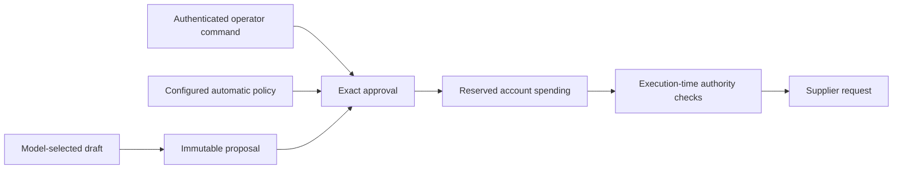
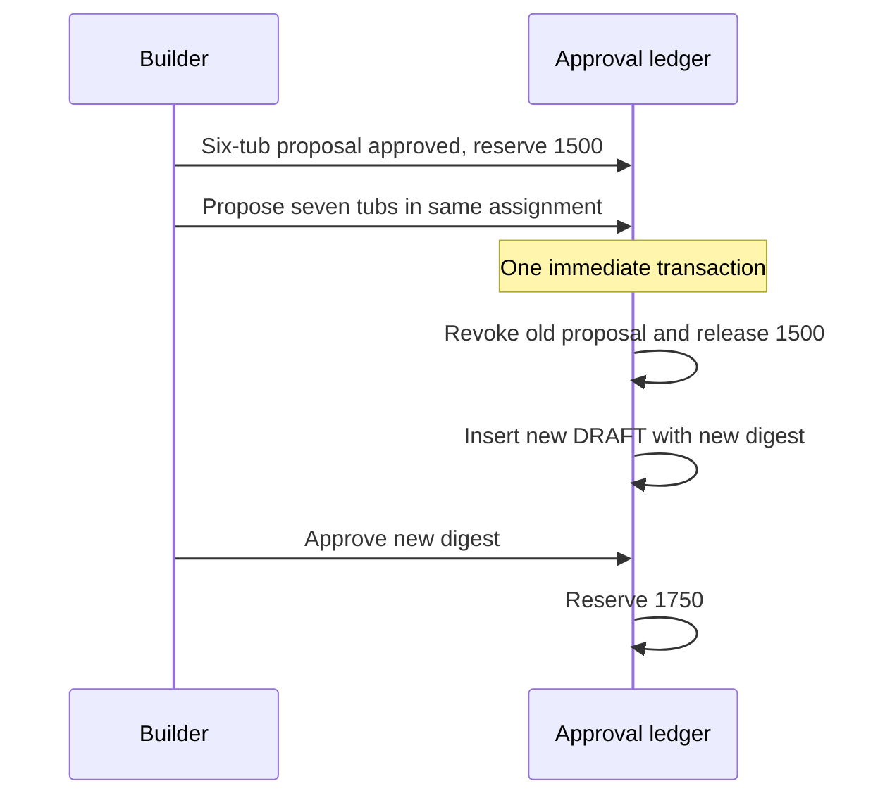
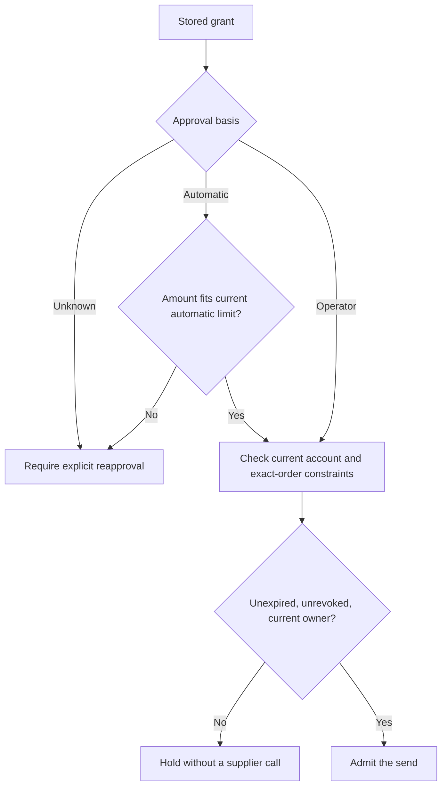

# Chapter 8 — Ask permission before spending

Lucy's unattended agent can prepare a useful replenishment draft. She now wants it to place small orders while she is away and ask her about larger ones. The instruction sounds like a prompt: “Ask before spending more than my limit.” But a sentence in context cannot reserve money, expire an old decision or stop a later worker from using permission that no longer applies.

In this chapter we will build an exact-proposal approval boundary around the draft tools from [Chapter 7](../ch07_scheduling/README.md). We will retain the proposed product, quantity, price, destination and approval basis in SQLite. The runtime will recheck those records immediately before a supplier request. A small HTTP supplier in a separate process lets us observe whether a refused action nevertheless reached the other side.

Two failures shape the design. An automatically approved £15 order remained executable after its automatic allowance was reduced to zero. Separately, revising a six-tub proposal into seven tubs left the old six-tub approval alive. Both cases passed ordinary “approve, then send” tests. We will make policy changes and proposal revisions part of the executable contract.

## Learning objectives

Construct a canonical proposal and stable identity; separate authentication, policy and exact approval; reserve cumulative spending atomically; preserve approval across a restart; revoke obsolete proposals; and revalidate current authority before a new send. You will distinguish a permission decision from a supplier outcome, and you will test both by inspecting independent records.

The deliverable is an approval-controlled write path to the simulated supplier. There is no live purchasing in the exercises. The model may propose an order, but it does not receive an approval tool or choose the operator identity. The examples use explicit trusted application calls so the policy calculations are deterministic; the same functions sit behind Chapter 6's authenticated operator commands.

## Give each kind of permission a precise meaning

Authentication establishes who contacted the agent. The Telegram adapter admits only configured private operator identities. Authorization establishes what the application may do under its current policy. Exact approval establishes that one particular proposal may proceed during a bounded time window. An operator can be authenticated without having approved the order the model just invented.

Our policy has one automatic-order ceiling and one cumulative account ceiling. The latter includes both confirmed spending and money reserved for eligible orders. It is not a daily allowance: this teaching account retains spending until an explicit administrative recovery or a separately designed budget policy changes it. Model-call budgets remain separate from supplier spending, even though both are expressed in pence for the examples.

| Record or check | Question it answers | What it does not establish |
| --- | --- | --- |
| Operator allowlist | Who may issue approval commands? | Approval of every proposed order |
| Exact digest | Which immutable effect is being approved? | Identity of the approving human |
| Automatic allowance | May policy approve this amount? | Room under the cumulative ceiling |
| Spending reservation | Is this amount committed locally? | Acceptance by the supplier |
| Supplier receipt | What did the supplier conclude? | Permission for a different purchase |

The `actor` argument below is an assertion by trusted application code. Passing the string `"lucy"` is not cryptographic authentication. A network adapter must derive that value from verified sender metadata, and model-selected tools must not expose the approval function. The process and its database remain in the operator's trust boundary; a person who can replace the Python code can replace these checks too.



**Figure:** Proposing, approving and transmitting are separate application actions, with authority checked again at the final boundary.

## Define the spending policy and fixture

Use integers for monetary values. Floating-point pounds invite rounding disagreements between the proposed total, reservation and receipt. The policy refuses non-positive cumulative ceilings and automatic allowances outside that ceiling. Its default automatic allowance is zero, which makes operator approval the initial path for every positive order.

The code listings share one namespace and temporary database. We reuse the durable work queue, database and event log already constructed. A claimed work record supplies the current assignment identity; Chapter 10 will develop its replacement-worker behavior. This chapter constructs the proposal and approval logic rather than replacing those previous mechanisms with an in-memory shopping list.

**Listing:** Define explicit operator and spending limits.

```python
import hashlib
import json
import math
import tempfile
import time
import uuid
from dataclasses import dataclass
from pathlib import Path
from typing import Any

from reference_organizations.store.agent import seed_lucy
from sovereign_agent.assistant_orders import Supplier, _record
from sovereign_agent.assistant_work import Claim, assert_current, claim, enqueue
from sovereign_agent.database import Database
from sovereign_agent.events import append_event


@dataclass(frozen=True)
class SpendingPolicy:
    operators: frozenset[str]
    total_pence: int = 20_000
    automatic_order_pence: int = 0

    def __post_init__(self) -> None:
        if not self.operators or type(self.total_pence) is not int or self.total_pence <= 0:
            raise ValueError("operators and positive spending ceiling required")
        if (
            type(self.automatic_order_pence) is not int
            or not 0 <= self.automatic_order_pence <= self.total_pence
        ):
            raise ValueError("automatic allowance must fit the total ceiling")


temporary = tempfile.TemporaryDirectory(prefix="lucy-ch08-")
location = Path(temporary.name) / "agent.sqlite"
db = Database(location)
seed_lucy(db)
enqueue(db, "chapter8:inline", "lucy", "Prepare replenishment orders")
work = claim(db, "chapter8-builder")
policy = SpendingPolicy(frozenset({"lucy"}), total_pence=2500)
automatic_policy = SpendingPolicy(frozenset({"lucy"}), total_pence=2500, automatic_order_pence=2000)
print("Automatic allowance:", policy.automatic_order_pence)
print("Cumulative ceiling:", policy.total_pence)
```

```text
Automatic allowance: 0
Cumulative ceiling: 2500
```

The `Supplier` protocol and receipt recorder are the companion's external-effect plumbing. We will use them to connect this chapter's boundary to a controlled endpoint; Chapter 9 constructs the uncertain-outcome and receipt logic in detail. Neither helper decides who may approve a proposal. All proposal, reservation and send-authorization checks are visible in the functions built here.

## Bind authority to an exact proposal

An order proposal contains the SKU, quantity, authoritative unit price, supplier name and currency. The digest also binds the configured supplier target. Moving an otherwise identical order to another endpoint changes the effect Lucy approved. The model supplies a proposed SKU and quantity, but the application obtains the price from the product record and calculates the amount itself.

The shop's model-facing draft wrapper first checks that the quantity matches the current deterministic need. The generic proposal function below then enforces valid quantity, known product, current assignment and product scope. Those are complementary boundaries: stock correctness belongs to the shop tool, while immutable purchase identity and approval belong to the controlled order path.

Canonical JSON makes key insertion order irrelevant. The digest identifies the exact content; a UUID derived from the work identity and digest identifies the intended operation. Neither is a secret or a signature. Repeating the same proposal in the same assignment returns the same record. A different product may have its own proposal within the same assignment, preserving the multi-product opening brief.

**Listing:** Persist an exact proposal and supersede an unsent revision atomically.

```python
def propose(
    db: Database, work: Claim, sku: str, quantity: int, *, target: str = "lucy-local"
) -> str:
    if type(quantity) is not int or not 1 <= quantity <= 1000:
        raise ValueError("positive integral bounded quantity required")
    with db.immediate() as connection:
        assert_current(connection, work)
        if work.role != "shop":
            raise PermissionError("delegated research has no purchasing authority")
        if work.subject and work.subject != sku:
            raise PermissionError("proposal differs from the work item's subject")
        product = connection.execute("SELECT record FROM products WHERE sku=?", (sku,)).fetchone()
        if product is None:
            raise ValueError("unknown product")
        cost = json.loads(product[0])["unit_cost_cents"]
        if type(cost) is not int or cost <= 0:
            raise ValueError("invalid authoritative product cost")
        proposal = {
            "sku": sku,
            "quantity": quantity,
            "unit_cost_pence": cost,
            "supplier": "lucy-local",
            "currency": "GBP",
        }
        encoded = json.dumps(proposal, sort_keys=True, separators=(",", ":"))
        digest = hashlib.sha256((target + "\n" + encoded).encode()).hexdigest()
        # One stable intent for this exact proposal in this assignment. A deliberate
        # second purchase requires another work item, not another random tool-call ID.
        identifier = uuid.uuid5(uuid.NAMESPACE_URL, work.id + ":" + digest).hex
        if connection.execute(
            "SELECT 1 FROM assistant_orders WHERE id=?", (identifier,)
        ).fetchone():
            return identifier  # Repeating an old revision never resurrects its authority.
        previous = connection.execute(
            "SELECT id,status,amount FROM assistant_orders "
            "WHERE work_id=? AND json_extract(proposal,'$.sku')=?",
            (work.id, sku),
        ).fetchall()
        if any(
            row["status"] in {"SENDING", "UNKNOWN", "CONFIRMED", "DELIVERED"} for row in previous
        ):
            raise PermissionError(
                "existing product effect must be resolved; new purchase needs new work"
            )
        for row in previous:
            if row["status"] not in {"DRAFT", "APPROVED"}:
                continue
            if row["status"] == "APPROVED":
                connection.execute(
                    "UPDATE assistant_spending SET reserved_pence=reserved_pence-? WHERE id=1",
                    (row["amount"],),
                )
            connection.execute(
                "UPDATE assistant_orders SET status='REVOKED',revoked=1 WHERE id=?", (row["id"],)
            )
            append_event(
                db, "assistant.order.superseded", {"order": row["id"], "replacement": identifier}
            )
        connection.execute(
            "INSERT OR IGNORE INTO assistant_orders"
            "(id,work_id,proposal,digest,amount,created,target) "
            "VALUES (?,?,?,?,?,?,?)",
            (identifier, work.id, encoded, digest, quantity * cost, time.time(), target),
        )
        return identifier


original = propose(db, work, "SKU-VANILLA", 6)
print("Repeated proposal:", propose(db, work, "SKU-VANILLA", 6) == original)
original_row = db.connection.execute(
    "SELECT * FROM assistant_orders WHERE id=?", (original,)
).fetchone()
print("Amount and state:", original_row["amount"], original_row["status"])
print("Supplier target:", original_row["target"])
```

```text
Repeated proposal: True
Amount and state: 1500 DRAFT
Supplier target: lucy-local
```

The database also has an immutable-identity trigger covering the order ID, assignment, encoded proposal, digest, amount and target. Ordinary updates cannot quietly modify a row after approval. A revision therefore creates a new record. The old record remains available to explain what changed and which permission became obsolete; history is not rewritten into a more convenient story.

The revision branch requires care. If an earlier same-product proposal is still a draft or approved but unsent, the transaction revokes it and releases its reservation before inserting the replacement. If a request is in flight, uncertain or already accepted, a revision cannot pretend that effect disappeared. The function refuses another same-product proposal in that assignment; discovery and any deliberately new purchase need explicit subsequent work.

## Approve content and reserve cumulative spending

Approval takes an order identity and the digest the operator saw. It verifies that the stored proposal is eligible and unchanged, checks the actor against current policy, and limits the approval lifetime to one day. A shorter window is usually easier to reason about. The phone command uses one hour from the incoming message's creation time, so a delayed command does not acquire a fresh full hour merely because the worker processed it late.

For an automatic approval, the order must fit the automatic-order ceiling. Both automatic and operator approvals must also fit the cumulative account ceiling. We calculate that as spent plus reserved plus the newly requested reservation. Reapproving the same eligible record adds zero, preventing a duplicate operator command from reserving the same amount twice.

**Listing:** Save the grant basis, expiration and reservation together.

```python
def approve(
    db: Database,
    identifier: str,
    digest: str,
    *,
    actor: str,
    policy: SpendingPolicy,
    expires: float,
    automatic: bool = False,
    now: float | None = None,
) -> None:
    now = time.time() if now is None else now
    if type(automatic) is not bool:
        raise ValueError("approval basis must be explicit")
    if not math.isfinite(expires) or not now < expires <= now + 86400:
        raise ValueError("approval must expire within one day")
    if actor not in policy.operators:
        raise PermissionError("operator is not allowlisted")
    with db.immediate() as connection:
        order = connection.execute(
            "SELECT * FROM assistant_orders WHERE id=?", (identifier,)
        ).fetchone()
        if (
            order is None
            or order["digest"] != digest
            or order["status"] not in {"DRAFT", "APPROVED"}
            or order["revoked"]
        ):
            raise PermissionError("approval does not match an eligible exact proposal")
        if automatic and order["amount"] > policy.automatic_order_pence:
            raise PermissionError("exact proposal needs operator approval")
        connection.execute(
            "INSERT OR IGNORE INTO assistant_spending(id,limit_pence) VALUES (1,?)",
            (policy.total_pence,),
        )
        budget = connection.execute("SELECT * FROM assistant_spending WHERE id=1").fetchone()
        assert budget
        addition = order["amount"] if order["status"] == "DRAFT" else 0
        # A supplied policy cannot silently raise the installed account ceiling.
        if budget["spent_pence"] + budget["reserved_pence"] + addition > min(
            budget["limit_pence"], policy.total_pence
        ):
            raise PermissionError("cumulative spending ceiling reached")
        connection.execute(
            "UPDATE assistant_spending SET reserved_pence=reserved_pence+? WHERE id=1", (addition,)
        )
        connection.execute(
            "UPDATE assistant_orders SET status='APPROVED',approved_by=?,approved_until=?,"
            "approval_basis=? WHERE id=?",
            (actor, expires, "AUTOMATIC" if automatic else "OPERATOR", identifier),
        )
        append_event(
            db,
            "assistant.order.approved",
            {"order": identifier, "digest": digest, "actor": actor, "automatic": automatic},
        )


def grant(operation, *, automatic=False, selected_policy=policy):
    digest = db.connection.execute(
        "SELECT digest FROM assistant_orders WHERE id=?", (operation,)
    ).fetchone()[0]
    approve(
        db,
        operation,
        digest,
        actor="lucy",
        policy=selected_policy,
        expires=time.time() + 60,
        automatic=automatic,
    )


def balances():
    return tuple(
        db.connection.execute(
            "SELECT reserved_pence,spent_pence FROM assistant_spending"
        ).fetchone()
    )


try:
    approve(db, original, "different digest", actor="lucy", policy=policy, expires=time.time() + 60)
except PermissionError:
    print("Changed digest refused")
try:
    approve(
        db, original, original_row["digest"], actor="model", policy=policy, expires=time.time() + 60
    )
except PermissionError:
    print("Model identity refused")
grant(original)
grant(original)
print("Reserved and spent:", *balances())
```

```text
Changed digest refused
Model identity refused
Reserved and spent: 1500 0
```

The account's installed ceiling is persisted on first approval. Later calls use the smaller of that ceiling and the supplied policy ceiling. A caller cannot silently raise the account's allowance by passing a larger number on the next request. Lowering policy can restrict new sends, while recorded spending remains a fact. A real business may need explicit budget renewal periods; adding them requires a named policy and ledger transition rather than clearing a counter at process startup.

SQLite's immediate transaction serializes the read of the current reservation and its update. Two simultaneous approval attempts cannot both observe the same unreserved balance and each spend it. This is why checking the total in a prompt or before entering the transaction is insufficient. The useful invariant is about all eligible orders together, not the amount of the one order currently being discussed.

## Failure experiment — revise the quantity after approval

Lucy originally had two vanilla tubs and needed six. Before execution, a further sale leaves one tub and the new draft needs seven. The old six-tub approval cannot authorize that new amount. More subtly, leaving both versions eligible would allow the runtime to send six and seven as separate orders while claiming it merely revised a draft.

The transaction in `propose` makes the replacement explicit. It revokes the unsent old record, returns its £15 reservation and creates a fresh £17.50 draft. Repeating the old request later finds the revoked record; it does not resurrect it. The operator must review the new digest and amount before the new record can obtain authority.

**Listing:** Change the fixture and inspect both versions.

```python
with db.immediate() as connection:
    connection.execute("UPDATE inventory SET on_hand=1 WHERE sku='SKU-VANILLA'")
revised = propose(db, work, "SKU-VANILLA", 7)
print("Different identity:", revised != original)
print(
    "Old state:",
    db.connection.execute("SELECT status FROM assistant_orders WHERE id=?", (original,)).fetchone()[
        0
    ],
)
print(
    "New state:",
    db.connection.execute("SELECT status FROM assistant_orders WHERE id=?", (revised,)).fetchone()[
        0
    ],
)
print("Released reservation:", *balances())
print("Old request stays old:", propose(db, work, "SKU-VANILLA", 6) == original)
```

```text
Different identity: True
Old state: REVOKED
New state: DRAFT
Released reservation: 0 0
Old request stays old: True
```

Changing two products is different from changing two versions of one product. Strawberry retains its own independent proposal and digest. The same-product lookup does not revoke vanilla merely because the model next drafts strawberry. The tests exercise both cases, including the refusal to turn an uncertain vanilla send into a new seven-tub operation.



**Figure:** A revision replaces unsent authority; it does not add another purchase to the same product's assignment.

## Respect both ceilings and explicit revocation

Now let the policy automatically approve the £17.50 revised order under a £20 automatic limit. Strawberry needs another £11. Each order fits that per-order limit, but the two reservations would total £28.50 against the account's £25 ceiling. Splitting a purchase into smaller proposals must not bypass the aggregate check.

**Listing:** Two individually small orders still share one account ceiling.

```python
grant(revised, automatic=True, selected_policy=automatic_policy)
other = propose(db, work, "SKU-STRAWBERRY", 4)
try:
    grant(other, automatic=True, selected_policy=automatic_policy)
except PermissionError:
    print("Cumulative ceiling refused strawberry")
print("Reserved and spent:", *balances())
print(
    "Grant basis:",
    db.connection.execute(
        "SELECT approval_basis FROM assistant_orders WHERE id=?", (revised,)
    ).fetchone()[0],
)
```

```text
Cumulative ceiling refused strawberry
Reserved and spent: 1750 0
Grant basis: AUTOMATIC
```

Revocation is another persisted decision. For an approved but unsent order, it releases the reservation and marks the proposal revoked. For a draft, it closes the proposal without changing money. For an in-flight or uncertain order, the reservation remains held because the supplier may already have accepted it. Revocation controls further authority; it cannot erase an external event.

**Listing:** Revoke the unapproved alternative without disturbing vanilla's reservation.

```python
def revoke(db: Database, identifier: str, *, actor: str, policy: SpendingPolicy) -> None:
    if actor not in policy.operators:
        raise PermissionError("operator is not allowlisted")
    with db.immediate() as connection:
        row = connection.execute(
            "SELECT * FROM assistant_orders WHERE id=?", (identifier,)
        ).fetchone()
        if row is None or row["revoked"]:
            return
        # In-flight/unknown reservations remain held until the supplier resolves them.
        if row["status"] == "APPROVED":
            connection.execute(
                "UPDATE assistant_spending SET reserved_pence=reserved_pence-? WHERE id=1",
                (row["amount"],),
            )
            connection.execute(
                "UPDATE assistant_orders SET status='REVOKED' WHERE id=?", (identifier,)
            )
        connection.execute(
            "UPDATE assistant_orders SET revoked=1,status=CASE WHEN status='DRAFT' "
            "THEN 'REVOKED' ELSE status END WHERE id=?",
            (identifier,),
        )
        append_event(db, "assistant.order.revoked", {"order": identifier, "actor": actor})


revoke(db, other, actor="lucy", policy=policy)
revoke(db, other, actor="lucy", policy=policy)
print(
    "Strawberry state:",
    db.connection.execute("SELECT status FROM assistant_orders WHERE id=?", (other,)).fetchone()[0],
)
print("Vanilla reservation retained:", *balances())
```

```text
Strawberry state: REVOKED
Vanilla reservation retained: 1750 0
```

An approval that expires without a send also loses execution authority, but this implementation does not automatically recycle its reservation. The operator can revoke it to release the hold or explicitly reapprove an eligible proposal. That choice favors visible blocked funds over quietly making uncertain capacity available. We will inspect work age and outstanding reservations in the operational chapters.

## Recheck authority at the send boundary

The most consequential check happens immediately before the outbound call. The work claim must still be current, the order must belong to that work, and the supplier identity must match the approved destination. The installed and current account ceilings must still cover the reservation, the approving operator must still be allowed, and the exact grant must remain eligible and unexpired.

The approval basis adds one more condition. `AUTOMATIC` means the amount must still fit the current automatic allowance. `OPERATOR` means the human explicitly approved that exact amount, subject to the other current constraints. `UNKNOWN` never authorizes a new send. Recording only “approved by Lucy” would lose this distinction when policy performed the approval on behalf of her configured account.

**Listing:** Admit a supplier request only after checking current authority.

```python
def execute(
    db: Database, work: Claim, identifier: str, supplier: Supplier, *, policy: SpendingPolicy
) -> dict[str, Any]:
    """A recovered uncertain intent is discovered before any possible retransmission.

    Supplier idempotency is an explicit adapter contract, not a property inferred
    from HTTP or a local transaction. Fence admission; cannot recall a sent request.
    """
    row = db.connection.execute(
        "SELECT * FROM assistant_orders WHERE id=? AND work_id=?", (identifier, work.id)
    ).fetchone()
    if row is None:
        raise PermissionError("order belongs to another work item")
    assert_current(db.connection, work)
    if row["target"] != supplier.identity:
        raise PermissionError("supplier destination differs from the approved proposal")
    if row["status"] in {"CONFIRMED", "DELIVERED", "REJECTED"}:
        return dict(json.loads(row["receipt"]))
    if row["status"] in {"SENDING", "UNKNOWN"}:
        try:
            receipt = supplier.lookup(identifier)
            if receipt is not None:
                return _record(db, work, identifier, receipt)
        except OSError, ValueError:
            return {"status": "UNKNOWN", "operation": identifier}
        if not supplier.idempotent:
            return {"status": "UNKNOWN", "operation": identifier, "needs_operator": True}
    with db.immediate() as connection:
        assert_current(connection, work)
        current = connection.execute(
            "SELECT * FROM assistant_orders WHERE id=?", (identifier,)
        ).fetchone()
        assert current
        budget = connection.execute("SELECT * FROM assistant_spending WHERE id=1").fetchone()
        held = connection.execute(
            "SELECT coalesce(sum(amount),0) FROM assistant_orders "
            "WHERE status IN ('APPROVED','SENDING','UNKNOWN')"
        ).fetchone()[0]
        if (
            budget is None
            or budget["reserved_pence"] < held
            or budget["spent_pence"] + budget["reserved_pence"]
            > min(budget["limit_pence"], policy.total_pence)
            or current["approved_by"] not in policy.operators
            or current["approval_basis"] == "UNKNOWN"
            or (
                current["approval_basis"] == "AUTOMATIC"
                and current["amount"] > policy.automatic_order_pence
            )
        ):
            raise PermissionError("current spending authority or reservation is insufficient")
        expires = connection.execute(
            "SELECT expires FROM assistant_work WHERE id=? AND cancelled=0", (work.id,)
        ).fetchone()
        if expires is None:
            raise PermissionError("cancelled work cannot authorize a new send")
        expires = expires[0]
        if (
            not math.isfinite(supplier.timeout)
            or supplier.timeout <= 0
            or expires - time.time() <= supplier.timeout
        ):
            raise PermissionError("supplier wait would exceed current ownership")
        if (
            current["status"] not in {"APPROVED", "SENDING", "UNKNOWN"}
            or current["revoked"]
            or (current["approved_until"] or 0) <= time.time()
        ):
            raise PermissionError("current exact-order approval required")
        connection.execute("UPDATE assistant_orders SET status='SENDING' WHERE id=?", (identifier,))
        append_event(
            db, "assistant.order.intent", {"order": identifier, "generation": work.generation}
        )
    try:
        receipt = supplier.order(identifier, json.loads(row["proposal"]))
        return _record(db, work, identifier, receipt)
    except OSError, ValueError:
        with db.immediate() as connection:
            assert_current(connection, work)
            connection.execute(
                "UPDATE assistant_orders SET status='UNKNOWN' WHERE id=? AND status='SENDING'",
                (identifier,),
            )
        return {"status": "UNKNOWN", "operation": identifier}


class ReceiptSupplier:
    idempotent = True
    identity = "lucy-local"
    timeout = 1

    def __init__(self):
        self.calls = 0
        self.receipts = {}

    def lookup(self, operation):
        return self.receipts.get(operation)

    def order(self, operation, proposal):
        self.calls += 1
        receipt = {"operation": operation, "proposal": proposal, "status": "ACCEPTED"}
        self.receipts[operation] = receipt
        return receipt


supplier = ReceiptSupplier()
db.close()
db = Database(location)
try:
    execute(db, work, revised, supplier, policy=policy)
except PermissionError:
    print("Reduced automatic allowance refused")
print("Supplier calls:", supplier.calls)
print("Reservation retained after restart:", *balances())
```

```text
Reduced automatic allowance refused
Supplier calls: 0
Reservation retained after restart: 1750 0
```

This is the reproduced policy-change failure with its repair. The old code checked the aggregate ceiling and operator identity but forgot how approval had been obtained. A £15 automatic grant survived reducing the automatic allowance to zero. The corrected checkpoint changes policy after approval and reopens the database before execution. The supplier's call count must remain zero; a raised error after sending would be too late.

The `SENDING` update is the local authorization point. A revocation committed before that transaction's checks prevents admission. A revocation after the request has been admitted cannot promise to recall it. The code releases SQLite's lock before performing HTTP so that a slow supplier does not hold the entire local ledger hostage. Chapter 9 examines what happens when the remote outcome is uncertain after that point.

The discovery branch in the listing is present because the cumulative runtime already retains external intents. Finding a receipt for an earlier accepted request records an existing fact, even if the automatic allowance has since fallen. An empty lookup, by contrast, does not grant permission to send again. Any permitted retransmission must still pass the current authority checks. Do not move those checks around without considering both kinds of action.



**Figure:** The basis of a grant determines which current policy checks it must satisfy before a new transmission.

## Let an operator approve the exact amount

The operator can explicitly approve an eligible automatic grant even when the new automatic allowance is zero. That changes the stored basis to `OPERATOR`; it does not reserve the money twice. The model cannot make this conversion through a tool call. The application receives it through an authenticated command or a trusted local operator path.

We will also inject an expired timestamp to represent time passing while the order waited. This fixture mutation changes only the permission's expiration; it does not change the proposal, amount or supplier state. Execution must refuse it before any network request. Reapproving the exact proposal then gives us one authorized send and one conclusive receipt.

**Listing:** Exercise expiry and explicit reapproval before the single purchase.

```python
grant(revised)
with db.immediate() as connection:
    connection.execute("UPDATE assistant_orders SET approved_until=0 WHERE id=?", (revised,))
try:
    execute(db, work, revised, supplier, policy=policy)
except PermissionError:
    print("Expired approval refused")
print("Calls before reapproval:", supplier.calls)
grant(revised)
receipt = execute(db, work, revised, supplier, policy=policy)
print("Receipt:", receipt["status"], receipt["proposal"]["quantity"])
print("Stored receipt reused:", execute(db, work, revised, supplier, policy=policy) == receipt)
print("Supplier calls:", supplier.calls)
print("Reserved and spent:", *balances())
db.close()
temporary.cleanup()
```

```text
Expired approval refused
Calls before reapproval: 0
Receipt: ACCEPTED 7
Stored receipt reused: True
Supplier calls: 1
Reserved and spent: 0 1750
```

The phone path uses `/approve ORDER_ID DIGEST` and `/revoke ORDER_ID`. It takes the actor from the admitted message's recipient identity after checking the current operator policy, not from text such as “Lucy says yes.” The approval command is a separate durable work item. On success it makes the blocked order assignment eligible again; the resumed worker consumes the approved records without asking the model to invent a new order.

Cancellation and revocation are related but different. Cancellation stops an assignment from authorizing new work, whereas revocation addresses an order's grant. Neither should erase a receipt or release an uncertain reservation as though the supplier could not have acted. These distinctions become concrete when the connection fails in the next chapter and when workers are replaced in Chapter 10.

## Migrate approval records without inventing consent

The new schema adds `approval_basis` with the allowed values `UNKNOWN`, `OPERATOR` and `AUTOMATIC`. Fresh approval calls always write an explicit basis. Existing order rows receive `UNKNOWN` during migration. We do not label old grants as operator consent merely because their actor field names Lucy, nor do we infer a safe default from a possibly incomplete historical view.

For an old approved but unsent order, explicit reapproval supplies the missing basis without adding its reservation again. An old transmitted order can still be looked up and reconciled, because discovering a receipt does not authorize a new effect. These two paths keep migration from either manufacturing spending permission or preventing the operator from learning what already happened.

This schema change is also an operational boundary. Stop workers before migration and use the compatibility checks described in the maintenance appendix. The runtime's startup guard refuses unknown future schema versions; it is not a mechanism for making an already-running old process understand a newly added column. Chapter 15 will turn the migration and compatible-code rollback procedure into a full maintenance exercise.

| Situation after upgrade | May send a new request? | Correct next action |
| --- | --- | --- |
| Old approved record, basis unknown | No | Inspect and explicitly reapprove or revoke |
| Automatic grant above the new automatic limit | No | Obtain operator approval or revoke |
| Old request already accepted remotely | No new send needed | Discover and record its receipt |
| New exact operator grant within current limits | After execution checks | Send its stable operation identity |

## Compare exact business approval with command approval

OpenClaw's execution-approval documentation at commit `354538083db0a8728e16238cbd0b7a304416ff24`, checked on 7 September 2026, describes host-side policy and approval checks. It distinguishes those controls from a per-user authentication boundary and describes binding approved node runs to execution context such as exact arguments and working directory. It also discusses refusing some changed file operands after approval. See the [pinned documentation](https://github.com/openclaw/openclaw/blob/354538083db0a8728e16238cbd0b7a304416ff24/docs/tools/exec-approvals.md).

Those are documented design choices. Our interpretation is that the common principle is binding permission to the thing that will actually execute. Lucy's boundary binds a purchase proposal and spending reservation rather than a shell command. That lets us inspect business amounts directly. An experiment that might change our interface is a requirement to approve arbitrary operator commands; it would require an execution-context model beyond this chapter's single supplier and structured orders.

## Expected observations and learner verification

Run `uv run python book/always_on/checkpoints/ch08.py` from the repository root. It starts the real simulated HTTP supplier in a separate process with its own SQLite database, then exercises digest mismatch, an untrusted actor, a reduced automatic allowance, expiration, proposal revision and cumulative overspend. These failures must leave the supplier's order table empty before the authorized send.

After the revised seven-tub vanilla order receives explicit approval, the checkpoint performs one request, reuses its receipt on repetition and independently queries the supplier database. The required result is one supplier order, quantity seven, zero reserved pence and 1,750 spent pence. The rejected strawberry alternative must not become a hidden second purchase. A local “approved” status alone cannot satisfy this acceptance condition.

Run the focused regressions with `uv run pytest tests/test_approval_lifecycle.py tests/test_assistant_durability.py -q`. The tests include migration from an older schema and discovery after automatic authority has been reduced. The full gate also executes the chapter's inline code and the separate-process checkpoint. These are deterministic authority tests; changing the language model cannot make an unauthorized call acceptable.

### Exercise 1 — Lower a different limit

Approve an order and then reduce the cumulative ceiling below the held amount. Predict the reservation and supplier call count before attempting execution. Compare that result with reducing only the automatic allowance after an explicit operator approval. Explain why those policies should affect different grants, while neither changes the factual amount already spent.

### Exercise 2 — Revise while the response is missing

Use the next chapter's supplier that accepts an order and loses its reply. Attempt to revise the same product in the same assignment. Require a refusal and retain the uncertain reservation. Explain why revoking and replacing the local row would not undo the supplier's acceptance, even if the replacement digest were perfectly formed.

### Exercise 3 — Interrupt the revision transaction

Inject an exception when the supersession event is written. Verify that the old proposal remains approved, its original reservation remains held and no replacement record commits. This tests the entire transaction rather than merely checking that the code contains an update to `REVOKED`. Remove the injection and require the replacement to revoke and release exactly once.

### Exercise 4 — Reapprove a historical grant

Create a database at the previous schema with an approved record and its reservation, then migrate it. Require `UNKNOWN` basis and zero supplier calls on execution. Explicitly reapprove the exact proposal and inspect the reservation before and after. Explain why defaulting every old row to `OPERATOR` would invent a stronger form of consent than the stored data proves.

## Active recall

Why does an order digest include the supplier target? Which layer authenticates the actor string passed to `approve`? Why must a second approval add zero to an existing reservation? What happens to old authority when an unsent quantity changes? Why can receipt discovery continue after automatic authority is reduced? At what point can the local runtime no longer promise to recall a request?

## Vocabulary

An **exact proposal** is the immutable content and destination of an intended effect. An **approval basis** records whether policy or an operator granted permission. A **reservation** holds account capacity before a conclusive outcome. **Revocation** withdraws authority for further action. **Supersession** replaces an unsent proposal while retaining its history. An **authorization point** is the local admission boundary immediately before transmission, distinct from the supplier's acceptance.

## Summary

You constructed exact proposal identity, durable approval, cumulative reservations and execution-time authority checks. You repaired policy-change and revision failures without relying on the model to remember a rule. The separate supplier process proves that refused actions remain local and that the authorized seven-tub revision creates one purchase. The next chapter asks what the agent should do when that purchase succeeds but its response never arrives.
