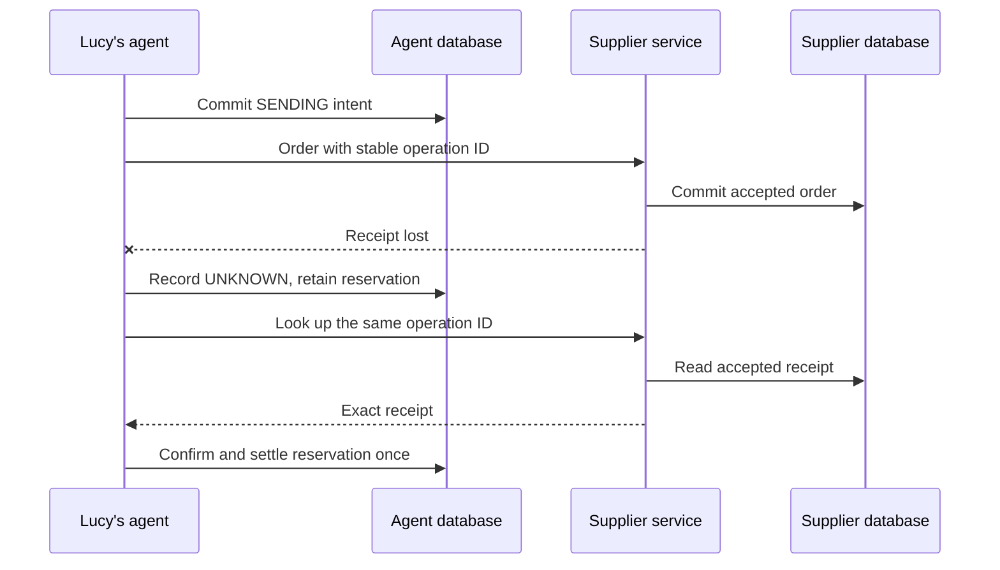
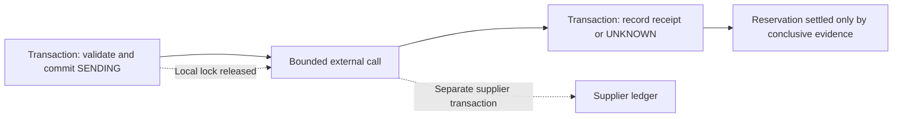
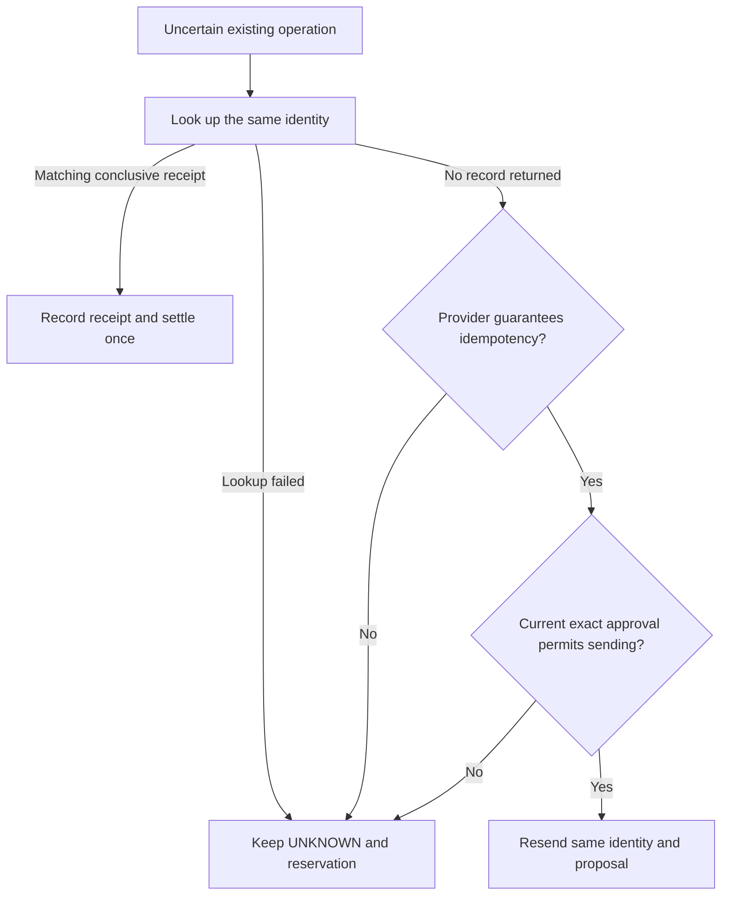

# Chapter 9 — Survive the ambiguous supplier order

The supplier accepts Lucy's vanilla order and records it in its database. Before the receipt reaches her agent, the connection drops. The agent sees a failed request. The supplier sees six tubs to deliver.

If the agent creates another order, Lucy may receive twelve tubs and pay twice. If it declares failure and releases the reserved money, a later order may spend funds already committed to the first purchase. If it declares success without a receipt, the shop's records may claim an order that never existed. The honest immediate result is that the outcome is unknown.

This chapter builds the path from that uncertainty to evidence. We will record a stable intent before transmission, preserve its spending reservation, and ask the supplier about that same operation before considering a retry. The final experiment runs the supplier in an independent process with its own database, so we can prove that the remote commit happened even though the reply disappeared.

## Learning objectives

Implement stable external-operation identities, record send admission durably, distinguish known outcomes from uncertainty, and reconcile exact supplier receipts without duplicating purchases or spending entries.

The observable result is one accepted six-tub order, one local confirmed record, and 1,500 pence moved from reserved to spent exactly once. The first send must return `UNKNOWN`. Reopening the agent's database and repeating reconciliation must preserve that result without creating another supplier order.

## Separate a failed request from a failed order

Chapter 8 established exact-proposal approval and a cumulative spending reservation. Those checks decide whether an order may be sent. They cannot tell us what happened after a request crossed the boundary to another system.

The network error is an observation about communication. It is not necessarily an observation about the supplier's transaction. A timeout might occur before the request arrives, during processing, or after the supplier commits. From the client's missing reply alone, these cases can look identical.



**Figure:** The ambiguous interval lies between the supplier's commit and the agent's recorded receipt. Reconciliation obtains evidence from the system that performed the effect.

Our local states describe both progress and knowledge. `SENDING` means the agent committed to transmission; after a crash, it must be treated as potentially sent. `UNKNOWN` means a send or discovery attempt did not establish a conclusive outcome. Neither state is permission to invent a fresh operation identifier.

| Local state | What the record establishes | Treatment of the amount |
| --- | --- | --- |
| `DRAFT` | A proposal exists | No reservation yet |
| `APPROVED` | Exact proposal approved under policy | Reserved |
| `SENDING` | Transmission admitted durably | Reserved |
| `UNKNOWN` | Remote outcome not conclusively known | Reserved |
| `CONFIRMED` | Matching supplier acceptance recorded | Spent |
| `REJECTED` | Matching conclusive rejection recorded | Reservation released |

There is also `REVOKED` for an eligible proposal whose permission was withdrawn before sending. Revoking an uncertain order prevents a newly authorized send; it does not erase the possibility that the supplier already accepted the earlier one. We still need to discover its outcome and settle the accounts accordingly.

Avoid a generic “failed” state that combines validation refusal, connection failure, conclusive supplier rejection, and lost acceptance. These states require different next actions. A malformed proposal can be corrected before transmission. An accepted order needs a receipt. An uncertain order needs discovery or an explicit unresolved report.

## Give the intended effect a stable identity

A model's tool-call identifier is an identifier for one conversation request. A replacement run may generate a different identifier for the same intended purchase. If each generated call creates a fresh supplier order, conversation replay becomes accidental spending.

We bind operation identity to the durable work item and the exact proposal. The proposal includes SKU, quantity, authoritative unit price, supplier, and currency. Its digest also includes the configured supplier target. Changing the destination is a change to the approved effect, even if the product and price remain the same.

**Listing:** Derive one operation identity for one exact proposal in one assignment.

```python
import hashlib
import json
import sqlite3
import tempfile
import time
import uuid
from pathlib import Path

from reference_organizations.store.agent import seed_lucy
from sovereign_agent.assistant_orders import SpendingPolicy, approve, propose, revoke
from sovereign_agent.assistant_work import assert_current, claim, enqueue
from sovereign_agent.database import Database
from sovereign_agent.events import append_event


def operation_identity(work_id, target, proposal):
    encoded = json.dumps(proposal, sort_keys=True, separators=(",", ":"))
    digest = hashlib.sha256((target + "\n" + encoded).encode()).hexdigest()
    identifier = uuid.uuid5(uuid.NAMESPACE_URL, work_id + ":" + digest).hex
    return identifier, digest


proposal = {
    "sku": "SKU-VANILLA",
    "quantity": 6,
    "unit_cost_pence": 250,
    "supplier": "lucy-local",
    "currency": "GBP",
}
one = operation_identity("morning-work", "lucy-local", proposal)
again = operation_identity("morning-work", "lucy-local", dict(reversed(list(proposal.items()))))
changed = operation_identity("morning-work", "another-target", proposal)
print("same proposal", one == again, "changed target", one == changed)
```

```text
same proposal True changed target False
```

Canonical JSON sorting makes dictionary insertion order irrelevant. UUID version 5 gives this teaching implementation a deterministic identifier; it is not a secret, signature, or proof of permission. Authority comes from the approved record and its execution-time checks. A caller who guesses an identifier does not gain a right to spend.

Including the work identity makes repeated presentation of the same exact proposal in one assignment converge on one intent. A deliberately separate purchase requires another work item. This is a business rule that must be explicit: if Lucy actually wants two identical purchases, the interface must express two distinct authorized needs rather than disguise the second as a retry.

The schema's immutable-identity trigger prevents ordinary SQL updates from changing an existing order's ID, work association, proposal, digest, amount, or target. A changed proposal gets a new record and new approval. Immutability here protects an application invariant; an administrator with unrestricted database access can still alter the database or its schema.

## Reuse exact approval and reserve the amount

We will use the durable queue and approval boundary from the preceding chapters. The `work` handle identifies the current assignment. The code below creates a temporary agent database and seeds the shop without changing existing stock on repeated setup. The current-worker check remains part of every consequential write; Chapter 10 will explain how that handle changes after a worker dies.

```python
temporary = tempfile.TemporaryDirectory(prefix="lucy-order-snippets-")
root = Path(temporary.name)
db = Database(root / "agent.sqlite")
seed_lucy(db)
enqueue(db, "chapter9:one", "lucy", "Replenish vanilla")
work = claim(db, "chapter9-worker", ttl=3600)
identifier = propose(db, work, "SKU-VANILLA", 6)
assert propose(db, work, "SKU-VANILLA", 6) == identifier
order = db.connection.execute("SELECT * FROM assistant_orders WHERE id=?", (identifier,)).fetchone()
policy = SpendingPolicy(frozenset({"lucy"}), total_pence=2000)
approve(db, identifier, order["digest"], actor="lucy", policy=policy, expires=time.time() + 600)
print(
    db.connection.execute(
        "SELECT status,amount FROM assistant_orders WHERE id=?", (identifier,)
    ).fetchone()[:]
)
print(
    db.connection.execute("SELECT reserved_pence,spent_pence FROM assistant_spending").fetchone()[:]
)
```

```text
('APPROVED', 1500)
(1500, 0)
```

The 1,500-pence reservation consumes part of the 2,000-pence account ceiling before any send. A later uncertainty must keep consuming that capacity. Otherwise two individually plausible orders can exceed the total when one missing receipt causes the first reservation to vanish.

The approval digest must match the persisted proposal, and the approving actor must belong to the current operator allowlist. Reapproving the same eligible record does not reserve the money a second time. Those are local transaction properties. We now need to connect them to an external effect whose transaction cannot be included in our SQLite commit.

## Make the supplier's idempotency contract executable

Idempotency is a property supplied by the remote operation's contract. HTTP POST is not automatically idempotent, and adding a local UUID does not force a supplier to honor it. Our simulated supplier stores one receipt per operation ID and refuses an existing ID paired with different proposal bytes.

For the inline examples, a small supplier adapter uses a second SQLite file in the same process. It commits before deliberately raising a timeout. This makes the transition easy to inspect. The standalone checkpoint later runs the HTTP supplier in another process and drops the actual connection after its commit.

**Listing:** A supplier ledger preserves an accepted receipt before the reply is lost.

```python
class LedgerSupplier:
    identity = "lucy-local"
    idempotent = True
    timeout = 3

    def __init__(self, path):
        self.connection = sqlite3.connect(path)
        self.connection.execute(
            "CREATE TABLE orders(operation TEXT PRIMARY KEY, proposal TEXT, receipt TEXT)"
        )
        self.sends = self.lookups = 0

    def lookup(self, operation):
        self.lookups += 1
        row = self.connection.execute(
            "SELECT receipt FROM orders WHERE operation=?", (operation,)
        ).fetchone()
        return None if row is None else json.loads(row[0])

    def order(self, operation, proposal):
        self.sends += 1
        encoded = json.dumps(proposal, sort_keys=True)
        existing = self.connection.execute(
            "SELECT proposal,receipt FROM orders WHERE operation=?", (operation,)
        ).fetchone()
        if existing:
            if existing[0] != encoded:
                raise ValueError("operation identity conflicts with existing proposal")
            return json.loads(existing[1])
        receipt = {"operation": operation, "proposal": proposal, "status": "ACCEPTED"}
        with self.connection:
            self.connection.execute(
                "INSERT INTO orders VALUES (?,?,?)", (operation, encoded, json.dumps(receipt))
            )
        raise TimeoutError("supplier committed but receipt was lost")


supplier = LedgerSupplier(root / "supplier.sqlite")
print(supplier.connection.execute("SELECT count(*) FROM orders").fetchone()[0])
```

```text
0
```

The unique key is enforced by the supplier's database, not merely by the agent's memory. The inline adapter is deliberately single-process and sequential. The HTTP fixture also serves requests sequentially. A concurrent production implementation needs a transaction or atomic insert strategy that handles races between simultaneous requests for the same key.

This supplier retains its keys for the lifetime of its database. A real provider may expire idempotency keys, scope them to an account or endpoint, or reject changed payloads differently. Before marking an adapter `idempotent=True`, document those details and make sure the retention period covers every possible retry. An expired or differently scoped key can create a second effect.

## Record a conclusive receipt once

The receipt must identify the same operation and exact proposal. Accepting any response that says `ACCEPTED` would allow a receipt for another SKU, amount, or destination to settle the wrong reservation. The configured adapter identity is checked before contacting the supplier; the receipt then binds its returned evidence to the stored proposal.

The following function records a known outcome in one local transaction. Confirmation moves the amount from reserved to spent. Conclusive rejection releases the reservation without increasing spent. If the record is already terminal, returning its stored receipt avoids another accounting transition.

**Listing:** Bind a conclusive receipt to the exact admitted intent.

```python
def record_receipt(db, work, identifier, receipt):
    with db.immediate() as connection:
        assert_current(connection, work)
        row = connection.execute(
            "SELECT * FROM assistant_orders WHERE id=? AND work_id=?",
            (identifier, work.id),
        ).fetchone()
        assert row is not None
        encoded = json.dumps(
            receipt.get("proposal"), sort_keys=True, separators=(",", ":"), allow_nan=False
        )
        if receipt.get("operation") != identifier or encoded != row["proposal"]:
            raise ValueError("receipt does not match the exact intent")
        if receipt.get("status") not in {"ACCEPTED", "REJECTED"}:
            raise ValueError("supplier outcome is not conclusive")
        if row["status"] in {"CONFIRMED", "REJECTED"}:
            return json.loads(row["receipt"])
        if row["status"] not in {"SENDING", "UNKNOWN"}:
            raise PermissionError("order was not admitted for transmission")
        accepted = receipt["status"] == "ACCEPTED"
        connection.execute(
            "UPDATE assistant_orders SET status=?,receipt=? WHERE id=?",
            ("CONFIRMED" if accepted else "REJECTED", json.dumps(receipt), identifier),
        )
        connection.execute(
            "UPDATE assistant_spending SET reserved_pence=reserved_pence-?,spent_pence=spent_pence+? WHERE id=1",
            (row["amount"], row["amount"] if accepted else 0),
        )
        append_event(
            db, "assistant.order.reconciled", {"order": identifier, "status": receipt["status"]}
        )
    return receipt
```

The local transaction makes these local changes atomic. It does not include the supplier's earlier transaction. If the agent dies before this transaction commits, the order remains uncertain locally and a replacement can look up the receipt again. If it dies after commit, the stored terminal record prevents the reservation from being settled twice.

Do not release an uncertain reservation merely because an approval expires. Expiry controls permission for a new send. It cannot change whether a previous send was accepted. The same distinction applies to revocation: discovering an already accepted order records reality even if Lucy has since withdrawn permission for further transmission.

## Admit a send, then reconcile before any retry

The order workflow first checks ownership and target identity. Terminal orders return their stored receipt. Uncertain orders ask the supplier about the existing operation before doing anything that could create an effect. If lookup is unavailable, or an absent result comes from a supplier without an idempotency guarantee, the workflow preserves uncertainty.

Only after that discovery step may an eligible send reach its local admission transaction. The transaction rechecks current authority, cumulative spending, held reservations, approval expiry, cancellation, and the remaining work lease. It then records `SENDING`. This commit is the authorization point for transmission.

Chapter 8 also records the basis of each grant. An automatic approval must still fit the current automatic allowance; an operator approval remains subject to the current operator list and cumulative ceiling. A historical grant with an unknown basis requires explicit reapproval before a new send. These restrictions do not prevent recording a receipt for an effect that the supplier already accepted.

**Listing:** Discover an existing effect before admitting another transmission of its stable identity.

```python
def execute_order(db, work, identifier, supplier, *, policy):
    row = db.connection.execute(
        "SELECT * FROM assistant_orders WHERE id=? AND work_id=?",
        (identifier, work.id),
    ).fetchone()
    if row is None:
        raise PermissionError("order belongs to another work item")
    assert_current(db.connection, work)
    if row["target"] != supplier.identity:
        raise PermissionError("supplier destination differs from approved proposal")
    if row["status"] in {"CONFIRMED", "REJECTED"}:
        return json.loads(row["receipt"])
    if row["status"] in {"SENDING", "UNKNOWN"}:
        try:
            receipt = supplier.lookup(identifier)
            if receipt is not None:
                return record_receipt(db, work, identifier, receipt)
        except OSError, ValueError:
            return {"status": "UNKNOWN", "operation": identifier}
        if not supplier.idempotent:
            return {"status": "UNKNOWN", "operation": identifier, "needs_operator": True}
    with db.immediate() as connection:
        assert_current(connection, work)
        current = connection.execute(
            "SELECT * FROM assistant_orders WHERE id=?", (identifier,)
        ).fetchone()
        budget = connection.execute("SELECT * FROM assistant_spending WHERE id=1").fetchone()
        held = connection.execute(
            "SELECT coalesce(sum(amount),0) FROM assistant_orders WHERE status IN ('APPROVED','SENDING','UNKNOWN')",
        ).fetchone()[0]
        if (
            budget is None
            or budget["reserved_pence"] < held
            or budget["spent_pence"] + budget["reserved_pence"]
            > min(budget["limit_pence"], policy.total_pence)
            or current["approved_by"] not in policy.operators
            or current["approval_basis"] == "UNKNOWN"
            or (
                current["approval_basis"] == "AUTOMATIC"
                and current["amount"] > policy.automatic_order_pence
            )
        ):
            raise PermissionError("current spending authority or reservation is insufficient")
        lease = connection.execute(
            "SELECT expires FROM assistant_work WHERE id=? AND cancelled=0",
            (work.id,),
        ).fetchone()
        if lease is None:
            raise PermissionError("cancelled work cannot authorize a new send")
        if not 0 < supplier.timeout < lease[0] - time.time():
            raise PermissionError("supplier wait would exceed current ownership")
        if (
            current["status"] not in {"APPROVED", "SENDING", "UNKNOWN"}
            or current["revoked"]
            or (current["approved_until"] or 0) <= time.time()
        ):
            raise PermissionError("current exact-order approval required")
        connection.execute("UPDATE assistant_orders SET status='SENDING' WHERE id=?", (identifier,))
        append_event(
            db, "assistant.order.intent", {"order": identifier, "generation": work.generation}
        )
    try:
        receipt = supplier.order(identifier, json.loads(row["proposal"]))
        return record_receipt(db, work, identifier, receipt)
    except OSError, ValueError:
        with db.immediate() as connection:
            assert_current(connection, work)
            connection.execute(
                "UPDATE assistant_orders SET status='UNKNOWN' WHERE id=? AND status='SENDING'",
                (identifier,),
            )
        return {"status": "UNKNOWN", "operation": identifier}
```

The database lock is not held while waiting for HTTP. Holding it would block unrelated local work without making the supplier's database part of the transaction. Instead, we commit the intent, release the local lock, perform the bounded call, and enter another transaction to record the receipt or uncertainty.

The lease check ensures the configured supplier wait fits within current ownership at admission. It cannot make an already transmitted request disappear when that ownership later expires. Chapter 10 will fence newly admitted work from stale workers; it will not claim to recall an operation already accepted remotely.

### Understand the authorization point

Revocation before the `SENDING` commit must prevent transmission. Revocation after that commit may be too late to prevent the admitted send. The user-facing control should report that distinction instead of promising that a revoked flag undoes network traffic. Discovery can still proceed after revocation because it obtains evidence about an existing effect.

The order's target is immutable and must match the supplier adapter before lookup or send. Reconfiguring the runtime to contact another server must not cause an old approved operation to be replayed against that server. In this fixture, the target includes the loopback endpoint. A maintained integration should bind the intended provider account and environment as well.



**Figure:** Two local transactions surround the external call. Their separation creates a recoverable record; it does not create a transaction spanning both organizations.

## Observe the ambiguous order and reconcile it

Run the workflow against the supplier ledger that deliberately loses its first response. The local result should be unknown while the independent supplier file already contains one accepted order. Inspecting both records demonstrates the ambiguity directly.

```python
initial = execute_order(db, work, identifier, supplier, policy=policy)
print(initial["status"])
print("supplier rows", supplier.connection.execute("SELECT count(*) FROM orders").fetchone()[0])
print(
    "reserved and spent",
    db.connection.execute("SELECT reserved_pence,spent_pence FROM assistant_spending").fetchone()[
        :
    ],
)
recovered = execute_order(db, work, identifier, supplier, policy=policy)
print(recovered["status"], "sends", supplier.sends, "lookups", supplier.lookups)
print(
    "reserved and spent",
    db.connection.execute("SELECT reserved_pence,spent_pence FROM assistant_spending").fetchone()[
        :
    ],
)
print("same receipt", execute_order(db, work, identifier, supplier, policy=policy) == recovered)
```

```text
UNKNOWN
supplier rows 1
reserved and spent (1500, 0)
ACCEPTED sends 1 lookups 1
reserved and spent (0, 1500)
same receipt True
```

The second execution performed a lookup, not another send. The third returned the stored receipt. The accepted purchase consumed 1,500 pence once, and the reservation is now zero. A second settlement would incorrectly subtract the reservation again or double the spent total; the terminal-state check prevents that transition.

The supplier's accepted order does not mean six tubs physically arrived at the shop. Confirmation belongs to order accounting. Receiving stock is a separate observed business event. Until a delivery is recorded, physical inventory remains unchanged and the confirmed order represents incoming stock.

## Refuse an unjustified retry

A lookup returning no record is not always proof that no order exists. A provider may update its search index asynchronously, expose only a recent window, or search a different account. A request accepted moments ago might not yet be discoverable. Treating every empty lookup as permission to create a fresh order turns delayed visibility into duplicate effects.

Our workflow permits retransmission after an empty lookup only when the configured adapter guarantees idempotency for the same operation ID and the current approval still permits sending. It never replaces the operation ID merely to make a retry succeed. Without the guarantee, it preserves `UNKNOWN` and asks for operator resolution.

The next adapter deliberately cannot establish an outcome. Its first send fails without a conclusive receipt, and its lookup returns no record. The test must show that repeated execution makes only one send attempt and keeps the reservation even after revocation.

```python
class BlindSupplier:
    identity = "lucy-local"
    idempotent = False
    timeout = 3
    sends = 0

    def order(self, operation, proposal):
        self.sends += 1
        raise TimeoutError("outcome cannot be established")

    def lookup(self, operation):
        return None


blind_db = Database(root / "blind-agent.sqlite")
seed_lucy(blind_db)
enqueue(blind_db, "chapter9:blind", "lucy", "Replenish vanilla")
blind_work = claim(blind_db, "blind-worker", ttl=3600)
blind_id = propose(blind_db, blind_work, "SKU-VANILLA", 6)
blind_digest = blind_db.connection.execute(
    "SELECT digest FROM assistant_orders WHERE id=?", (blind_id,)
).fetchone()[0]
approve(blind_db, blind_id, blind_digest, actor="lucy", policy=policy, expires=time.time() + 600)
blind = BlindSupplier()
print(execute_order(blind_db, blind_work, blind_id, blind, policy=policy)["status"])
revoke(blind_db, blind_id, actor="lucy", policy=policy)
unresolved = execute_order(blind_db, blind_work, blind_id, blind, policy=policy)
print(unresolved["status"], unresolved["needs_operator"], "sends", blind.sends)
print(
    blind_db.connection.execute(
        "SELECT reserved_pence,spent_pence FROM assistant_spending"
    ).fetchone()[:]
)
```

```text
UNKNOWN
UNKNOWN True sends 1
(1500, 0)
```

The reservation is inconvenient but honest. It represents money that may already have been committed remotely. Releasing it would make the available budget look larger without obtaining any new evidence. An operator resolving the case must provide a conclusive account outcome or a documented reconciliation decision; clicking “retry” is not equivalent evidence.



**Figure:** An empty lookup becomes a retry opportunity only under an explicit provider guarantee and current authority. It never justifies a new operation identity.

### Failure experiment: a plausible but mismatched receipt

Now alter the quantity in a copied receipt while keeping its operation ID and accepted status. Recording it must fail without changing the already settled amount. This probes whether reconciliation checks the effect's contents rather than trusting a green status word.

```python
wrong = json.loads(json.dumps(recovered))
wrong["proposal"]["quantity"] = 7
try:
    record_receipt(db, work, identifier, wrong)
except ValueError:
    print("mismatched receipt refused")
print(
    db.connection.execute("SELECT reserved_pence,spent_pence FROM assistant_spending").fetchone()[:]
)
print(
    "physical vanilla",
    db.connection.execute("SELECT on_hand FROM inventory WHERE sku='SKU-VANILLA'").fetchone()[0],
)
```

```text
mismatched receipt refused
(0, 1500)
physical vanilla 2
```

Keeping physical stock at two is part of the expected result. An order receipt proves supplier acceptance, not delivery. Updating inventory at confirmation would let Lucy sell stock that has not arrived. The order ledger and stock ledger answer related but distinct questions.

## Run the independent HTTP failure experiment

The standalone checkpoint in `book/always_on/checkpoints/ch09.py` uses the cumulative `assistant_orders` implementation, whose admission and reconciliation mechanism you have built above. It starts the simulated supplier as a separate Python process, with a separate SQLite file and an operating-system-assigned loopback port.

The supplier's `--drop-first-response` option closes the connection after committing the first receipt for each new operation. Looking up that operation still returns the persisted receipt, and resubmitting the same identity returns the existing outcome. The failure is placed after the database commit, so this is an actual lost-response experiment rather than a timeout raised before any effect happened.

The checkpoint reads the supplier database to confirm one order exists while the agent reports uncertainty. It then closes and reopens the agent's database before reconciling. This tests durable effect evidence across connections; it does not pretend that reopening a connection is a hard-killed worker. Chapter 10 performs the separate ownership-replacement experiment.

```python
import runpy

checkpoint = runpy.run_path("book/always_on/checkpoints/ch09.py")
checkpoint["main"]()
```

```text
initial UNKNOWN
reserved and spent 1500 0
after reconciliation ACCEPTED CONFIRMED
reserved and spent 0 1500
supplier orders 1
```

The subprocess is stopped in a `finally` block, and its temporary state is isolated from the shop data used by other examples. No live supplier or payment credentials are involved. You can repeat the experiment with a fresh temporary directory without creating purchases or silently carrying a previous successful receipt into the next test.

When debugging a failed experiment, inspect both ledgers before resetting them. A local `UNKNOWN` with one remote receipt is the intended ambiguous state. A local `UNKNOWN` with no remote row means the fault occurred earlier than expected. A local `CONFIRMED` with no matching remote row would mean the evidence path is wrong. Those are three different diagnoses even if a superficial command log merely says “failed.”

### Learner verification commands

```bash
uv run python book/always_on/checkpoints/ch09.py
uv run pytest tests/test_assistant_durability.py
uv run python scripts/verify_always_on_v1.py
```

The durability tests add cases beyond the checkpoint: exact approval mismatch, cumulative reservation, lost response followed by replacement ownership, revocation after remote acceptance, and uncertainty without discovery. Some also anticipate Chapter 10's worker fencing. The chapter construction gate executes the inline examples and compares their printed observations with the output blocks.

### Expected observations

| Probe | Required evidence | A false success would look like |
| --- | --- | --- |
| Lost response | Agent unknown while supplier has one accepted row | Timeout happened before the supplier received anything |
| Reconciliation | Matching receipt, one supplier row, 1,500 pence spent | Local code fabricated success without reading supplier evidence |
| Repeat reconciliation | Same receipt and unchanged spending | Reservation settled or spent amount added twice |
| Blind supplier | One send attempt and reservation still held | A new identity created after an empty lookup |
| Receipt mismatch | Refusal with unchanged accounts | Any accepted status string settled the order |

Review the data path as well as the printed status. The HTTP supplier writes `orders.receipt` in its own database before closing the connection. `SupplierClient.lookup` reads that endpoint's persisted receipt. The order workflow verifies the operation and proposal before changing `assistant_orders` and `assistant_spending` together. The final count comes from the supplier file, not a counter returned by the agent under test.

## Keep crash recovery and backup recovery separate

The workflow handles an intent that still exists in the agent's durable database. A worker can recover it because the operation identifier and proposal survived. Restoring an older backup creates a harder case: a purchase accepted after that backup may be absent from every restored order row.

Looking up only the restored identifiers cannot discover an identifier the backup never contained. Nor can a new local epoch stop a request already admitted to the supplier before restoration. A safe operational restore therefore starts paused and requires account-wide reconciliation, including effects newer than the snapshot and possible late old requests.

Chapter 15 will examine that operational procedure. Do not add an automatic unpause here on the assumption that all restored rows are consistent. A backup's internal consistency proves that the snapshot can be read, not that it includes every effect that occurred in the outside world afterwards.

The scope of this chapter's guarantee is precise: given a retained intent, an exact approval, a controlled write boundary, and the stated supplier contract, the agent reconciles uncertainty without blindly creating a duplicate purchase. It does not create a universal exactly-once guarantee across arbitrary services, lost backups, dishonest adapters, or expired provider keys.

## Exercises that change the supplier contract

### Exercise 1 — Conclusive rejection

Change the inline supplier's first persisted receipt to `REJECTED` while retaining the lost-response behavior. Predict the local result before and after lookup. The first result should still be `UNKNOWN`, because its receipt was lost. Reconciliation should produce a local `REJECTED` record with zero reserved and zero spent, while retaining the supplier's conclusive rejection receipt.

Verify that repeating reconciliation leaves those amounts unchanged. A test that only checks a zero final balance would miss a transient double release; inspect the individual transition or add a nonnegative reservation invariant to your experiment. Restore the accepted fixture afterwards so the main checkpoint keeps its declared meaning.

### Exercise 2 — Delayed discovery

Make `lookup` return `None` the first time even though the supplier has a receipt. With a truthful idempotency guarantee, the workflow may retransmit the same identity and receive the original receipt without creating another row. Count send attempts separately from supplier orders: two transmissions can still represent one effect.

Then set `idempotent=False`. The same absent lookup must leave the order unknown with its reservation held. Allow a later lookup to reveal the receipt and verify that reconciliation succeeds without another send. This experiment demonstrates why “not found” and “definitely never happened” are different claims.

### Exercise 3 — Revocation after acceptance

Run the lost-response case, revoke the order while it is unknown, and then reconcile. The reservation should remain until the accepted receipt arrives, then move to spent. A matching accepted receipt must not be discarded simply because the operator revoked future authority after the supplier had already accepted the order.

For a second case, revoke an approved order before any send. Its handler must never run and its reservation must be released. Keep both cases in the test so the implementation cannot satisfy the exercise by always blocking reconciliation or by always permitting a new send.

## Active recall and vocabulary

Why is a model tool-call ID insufficient as a purchase identity? What fact does `SENDING` establish after a crash? Why does an unknown order retain its reservation? When may an empty lookup lead to retransmission? What must match before a receipt can settle an order? Which outside effects can an old backup fail to remember?

An **intent** is the durable description of an effect the agent may attempt. An **operation identity** remains stable across repeated attempts for that effect. **Idempotency** is the provider's guarantee about repeated requests under that identity. A **receipt** is conclusive evidence returned by the supplier for the exact operation. **Reconciliation** obtains and records evidence about an uncertain outcome. A **reservation** retains spending capacity while an approved or uncertain effect may still consume it. The **authorization point** is the local commit after which transmission has been admitted.

```python
supplier.connection.close()
blind_db.close()
db.close()
temporary.cleanup()
print("temporary ledgers closed")
```

```text
temporary ledgers closed
```

## Summary

You built a recoverable order path around a failure that a network error alone cannot classify. Stable intent precedes transmission, uncertainty preserves the reservation, and an exact supplier receipt settles the outcome once. The independent-process experiment proves that remote acceptance and local uncertainty can coexist without justifying a duplicate purchase.

The next question concerns the worker carrying that intent. If its process dies and another starts, which one may continue? [Chapter 10](../ch10_worker_recovery/README.md) separates durable work from its current owner and rejects newly authorized writes from stale workers.
