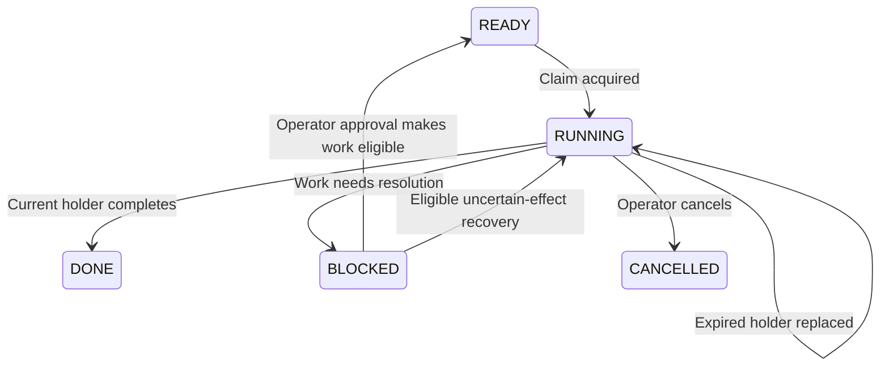
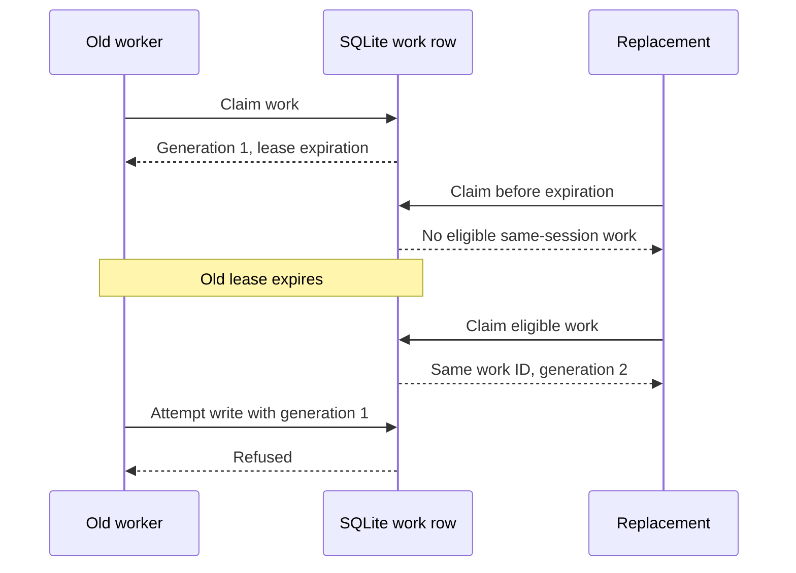
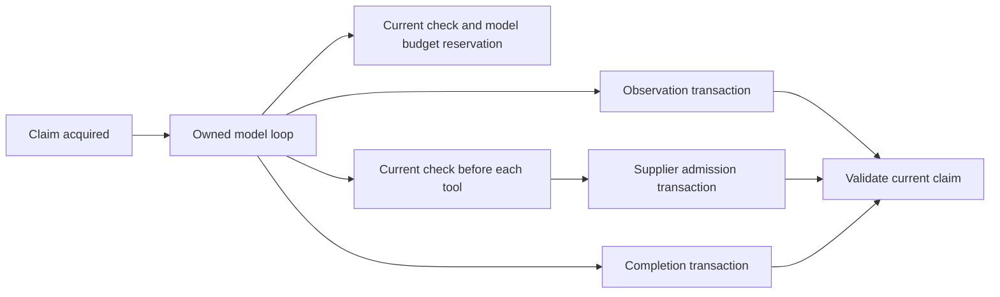

# Chapter 10 — Recover work after a process crash

The supplier's order survived a lost response in Chapter 9. Now the process performing Lucy's work disappears. Its Python variables, open connection and current model conversation are gone. A replacement can reopen SQLite, but that alone does not tell it which assignment to continue or prevent the previous process from writing if it was merely delayed rather than dead.

We will construct durable claims with expiring ownership and increasing generations. Every controlled write will check the claim against current records. The final experiment first kills an actual worker process, then repeats the scenario with an old worker that stays alive. Those are different failures. An implementation that only works when the old process has definitely stopped is insufficient for the second case.

The authority boundary from [Chapter 9](../ch09_ambiguous_order/README.md) remains in place. A replacement continues the existing approved operation and uses the same supplier identity. It does not ask a new model to reconstruct a purchase from a conversational summary. We will make that requirement observable by supplying a model object that fails if recovery tries to call it.

## Learning objectives

Separate a durable assignment from its executing process; claim eligible work atomically; explain leases and ownership generations; reject stale transcript, completion and supplier writes; and recover an existing approved operation after a real process kill. You will also distinguish process health, work progress, cancellation and external completion, rather than treating them as one green status.

The deliverable is a replacement worker that resumes eligible work while stale holders cannot make newly authorized writes through the controlled boundary. The checkpoint uses separate worker and HTTP supplier processes on a POSIX host. It observes actual lease expiry without rewriting the clock or ledger, and independently counts the supplier's orders.

## An assignment outlives the process that holds it

The work table already contains an immutable origin, session, prompt, product subject and role. Those fields describe the assignment. Mutable execution fields describe its current holder: status, owner, generation and expiration. A process may hold one assignment, disappear and be replaced, while the assignment identity remains unchanged. The model provider is another replaceable component used during that execution.

An operating-system process identifier is useful evidence during the failure experiment. It is not the work identity and is not a permanent authority credential. Process identifiers can be reused; a long-lived process can perform many assignments. Our runtime typically gives each execution a fresh owner identifier and always checks it together with the work's generation and current state.

| Identity or state | Example | What it describes |
| --- | --- | --- |
| Work ID | One durable morning assignment | The task being carried forward |
| Owner | A fresh execution identifier | The current holder's label |
| Generation | One, then two after replacement | Which acquisition is current |
| Lease expiration | An absolute epoch timestamp | How long this holding remains eligible |
| Process ID | The child observed by the experiment | The operating-system process |
| Supplier operation | The existing exact order identity | The intended external effect |

The `Claim` object carries the values a worker must present later. It is frozen to discourage accidental local mutation, but a Python dataclass is not a security boundary. Trusted runtime code constructs and checks it. The model never receives a tool for manufacturing arbitrary claims, and the next chapter will constrain untrusted executable tools outside the host process.

**Listing:** Define the held claim and create two queued turns in one session.

```python
import json
import math
import sqlite3
import tempfile
import time
from dataclasses import dataclass
from pathlib import Path
from typing import Any

from reference_organizations.store.agent import seed_lucy
from sovereign_agent.assistant_work import enqueue
from sovereign_agent.database import Database
from sovereign_agent.events import append_event


@dataclass(frozen=True)
class Claim:
    id: str
    session: str
    prompt: str
    generation: int
    owner: str
    epoch: str
    subject: str = ""
    role: str = "shop"


temporary = tempfile.TemporaryDirectory(prefix="lucy-ch10-")
location = Path(temporary.name) / "agent.sqlite"
db = Database(location)
seed_lucy(db)
first_id = enqueue(db, "phone:first", "lucy", "Prepare the stock draft")
second_id = enqueue(db, "phone:second", "lucy", "Explain the draft")
print("Distinct assignments:", first_id != second_id)
print(
    "Queued work:",
    db.connection.execute("SELECT count(*) FROM assistant_work WHERE status='READY'").fetchone()[0],
)
```

```text
Distinct assignments: True
Queued work: 2
```

The second turn must not start while the first has a live holder, because both use the same session context and can affect related business records. Different sessions may proceed independently within their own limits. Serializing a session is a useful local policy; it does not by itself authorize a supplier request or protect a global spending ceiling. Those checks still belong to their own transaction boundaries.

## Claim work in one transaction

A worker must not read an eligible row, release the database lock and only later mark itself as owner. Another process could make the same choice in between. The claim transaction acquires SQLite's write lock before selecting work, checks pause and eligibility, increments the generation, records the new owner and lease, and returns the resulting claim.

For ordinary work, eligible means `READY` or `RUNNING` with an expired lease, subject to its retry delay. The query also refuses a session that already has another unexpired running item. Recovery-only passes narrow the selection to assignments with uncertain supplier orders; control-only passes admit operator commands. Those selectors preserve the priorities introduced earlier without changing the ownership mechanism.

**Listing:** Acquire one current holder and exclude a conflicting session turn.

```python
def claim(
    db: Database,
    owner: str,
    *,
    now: float | None = None,
    ttl: float = 90,
    recovery_only: bool = False,
    control_only: bool = False,
    role: str = "shop",
    identifier: str = "",
) -> Claim | None:
    now = time.time() if now is None else now
    if not owner or not math.isfinite(now) or not math.isfinite(ttl) or not 0 < ttl <= 3600:
        raise ValueError("bounded claim lifetime required")
    with db.immediate() as connection:
        control = connection.execute(
            "SELECT epoch,paused FROM assistant_control WHERE id=1"
        ).fetchone()
        if control["paused"]:
            return None
        row = connection.execute(
            "SELECT w.* FROM assistant_work w WHERE w.role=? AND (?='' OR w.id=?) "
            "AND w.available_after<=? AND "
            "(?=0 OR w.control=1) AND "
            "((?=0 AND w.status='READY') OR (w.status='RUNNING' AND w.expires<=?) OR "
            "(?=1 AND w.status IN ('READY','BLOCKED','CANCELLED'))) AND "
            "(?=0 OR EXISTS (SELECT 1 FROM assistant_orders o WHERE o.work_id=w.id "
            "AND o.status IN ('SENDING','UNKNOWN'))) AND NOT EXISTS "
            "(SELECT 1 FROM assistant_work other WHERE other.session=w.session "
            "AND other.status='RUNNING' AND other.expires>?) "
            "ORDER BY w.control DESC,w.created,w.rowid LIMIT 1",
            (
                role,
                identifier,
                identifier,
                now,
                control_only,
                recovery_only,
                now,
                recovery_only,
                recovery_only,
                now,
            ),
        ).fetchone()
        if row is None:
            return None
        generation = row["generation"] + 1
        connection.execute(
            "UPDATE assistant_work SET status='RUNNING',generation=?,owner=?,expires=? WHERE id=?",
            (generation, owner, now + ttl, row["id"]),
        )
        append_event(db, "assistant.work.claimed", {"work": row["id"], "generation": generation})
        return Claim(
            row["id"],
            row["session"],
            row["prompt"],
            generation,
            owner,
            control["epoch"],
            row["subject"],
            row["role"],
        )


first = claim(db, "old-owner", ttl=30)
other_connection = Database(location)
print("First assignment held:", first.id == first_id)
print("Generation:", first.generation)
print("Competing claim:", claim(other_connection, "new-owner"))
```

```text
First assignment held: True
Generation: 1
Competing claim: None
```

The SQL is longer than a simple queue pop because it expresses several policies together. Read its predicates by responsibility: role and optional work identity; retry delay; optional control selection; ordinary or recovery eligibility; uncertain-effect restriction; and the absence of another live holder in the session. The final ordering gives operator controls priority and otherwise selects older work before newer work.



**Figure:** These relevant work transitions require a committed action; elapsed time alone does not rewrite the row.

The generation increases even if the owner label is reused. That is important: an old process might resume with the same configured name as its replacement. Checking only the label would let both look current. A claim for generation one cannot authorize writes after the row advances to generation two, even when both callers describe themselves as Lucy's stock worker.



**Figure:** Expiration permits a new acquisition; the increasing generation makes the old acquisition distinguishable.

## Expiry is permission to replace, not proof of death

A lease gives the holder a bounded opportunity to act. Its expiration does not prove that the process died. The process may be paused, overloaded or waiting on a dependency. We therefore design replacement so that the old process can remain alive without retaining authority to commit new results. The final experiment deliberately keeps it alive to test this distinction.

Persistent leases use wall-clock epoch timestamps so another process can interpret them after restart. The model loop uses a monotonic clock for its local elapsed-time budget. Those clocks serve different purposes. A forward wall-clock jump may make a holder eligible for early replacement; a backward jump may delay recovery. Generation checks still distinguish holders, but this teaching deployment does not claim tolerance of arbitrary clock faults or distributed clock disagreement.

The runtime keeps turns bounded instead of building a general lease-renewal system. Its claim lifetime is the configured loop duration plus a margin, and the supplier admission check refuses a request whose declared wait would exceed the remaining lease. A tool handler must also honor its timeout contract. An unbounded Python function running inside the process is not made cancellable by merely storing an expiration timestamp.

For the inline example, inject a later observation time into the claim function. This exercises the transition without sleeping for thirty seconds. The separate process checkpoint later uses a short real lease and waits for actual expiry. Keeping those forms of evidence distinct makes the chapter reproducible without calling simulated time an operational test.

**Listing:** Replace the holder at a controlled observation time.

```python
expires = db.connection.execute(
    "SELECT expires FROM assistant_work WHERE id=?", (first_id,)
).fetchone()[0]
replacement = claim(other_connection, "new-owner", now=expires, ttl=30)
print("Same durable work:", replacement.id == first.id)
print("New generation:", replacement.generation)
print("New owner:", replacement.owner)
print(
    "Second assignment still queued:",
    db.connection.execute("SELECT status FROM assistant_work WHERE id=?", (second_id,)).fetchone()[
        0
    ],
)
```

```text
Same durable work: True
New generation: 2
New owner: new-owner
Second assignment still queued: READY
```

The database state is now authoritative about the current holder. An old stack frame can still contain the original `Claim`, and an old conversation can still describe the task correctly. Neither fact changes the generation in SQLite. Recovery depends on that durable distinction rather than trying to inspect every process's memory and decide which one has the most convincing account.

## Fence every controlled write with current ownership

Acquisition alone is insufficient. A worker can pass its initial check and then lose the lease while waiting for a model response. The runtime must recheck ownership when it appends a transcript observation, declares the assignment complete, reserves another model call or admits a supplier request. A check only at the start of the loop leaves later writes exposed to stale results.

The current-holder check compares work identity, owner, generation, running state, expiration and immutable assignment fields. It also compares the authority epoch in SQLite with the companion authority marker and the held claim. The epoch exists for whole-database replacement during restore; Chapter 15 develops that path. For ordinary process replacement in this chapter, the epoch stays the same and the generation changes.

**Listing:** Reject a claim whose current record no longer matches.

```python
def assert_current(connection: sqlite3.Connection, work: Claim, now: float | None = None) -> None:
    now = time.time() if now is None else now
    control = connection.execute("SELECT epoch,paused FROM assistant_control WHERE id=1").fetchone()
    location = connection.execute("PRAGMA database_list").fetchone()[2]
    try:
        current_epoch = Path(location).with_suffix(".authority").read_text()
    except OSError:
        raise PermissionError("authority marker is unavailable") from None
    if (
        not control
        or control["paused"]
        or current_epoch != control["epoch"]
        or work.epoch != current_epoch
    ):
        raise PermissionError("runtime paused or replaced by restore")
    row = connection.execute(
        "SELECT 1 FROM assistant_work WHERE id=? AND owner=? AND generation=? "
        "AND status='RUNNING' AND expires>? AND subject=? AND role=? AND session=? AND prompt=?",
        (
            work.id,
            work.owner,
            work.generation,
            now,
            work.subject,
            work.role,
            work.session,
            work.prompt,
        ),
    ).fetchone()
    if row is None:
        raise PermissionError("worker claim expired or superseded")
    if work.role == "research":
        contract = connection.execute(
            "SELECT d.deadline,p.cancelled FROM assistant_delegations d "
            "JOIN assistant_work p ON p.id=d.parent_id WHERE d.work_id=?",
            (work.id,),
        ).fetchone()
        if contract is None or contract["deadline"] <= now or contract["cancelled"]:
            raise PermissionError("delegation expired or parent cancelled")


try:
    assert_current(db.connection, first)
except PermissionError:
    print("Old holder refused")
assert_current(other_connection.connection, replacement)
print("Replacement accepted")
```

```text
Old holder refused
Replacement accepted
```

The comparison of immutable fields makes accidental reconstruction errors visible. A claim for vanilla cannot be copied into a strawberry-scoped write, and a claim with another prompt or session does not silently become equivalent because its ID was retained. These checks operate within trusted application code and the controlled database boundary; they are not proof that arbitrary host code cannot edit files directly.

The research-role branch anticipates Chapter 14. A delegated worker also needs a live assignment deadline and an uncancelled parent. It uses the same ownership check and adds its narrower contract. We keep that branch visible because the cumulative runtime has one current-holder function; the ordinary shop examples do not grant a research role or rely on delegation.

## Reject stale observations and stale completion

A fluent model response can arrive after its holder was replaced. Persisting it under the new generation would falsely attribute old work to the replacement. The observation function therefore takes the held claim and validates it inside the transaction that appends the transcript row. The row records the actual generation that produced the observation.

Completion follows the same pattern. Only the current holder can move the assignment to `DONE`, `BLOCKED` or `CANCELLED` and store its result. A blocked turn also receives a bounded retry delay. The terminal label describes the work result; it is not an operating-system exit code. A process can exit cleanly after recording blocked work, or crash after durable work has already completed.

That delay does not automatically turn every blocked item back into ordinary queued work. An approval can explicitly make a waiting assignment ready, while an uncertain-effect recovery pass has its own eligibility rule. The distinction prevents a missing permission from becoming a loop that repeatedly asks the model for a way around it.

**Listing:** Guard transcript and completion transactions.

```python
def observe(db: Database, work: Claim, message: dict[str, Any]) -> None:
    with db.immediate() as connection:
        assert_current(connection, work)
        connection.execute(
            "INSERT INTO assistant_transcript(work_id,generation,message) VALUES (?,?,?)",
            (work.id, work.generation, json.dumps(message, allow_nan=False)),
        )


def finish(
    db: Database, work: Claim, status: str, result: str, *, now: float | None = None
) -> None:
    if status not in {"DONE", "BLOCKED", "CANCELLED"}:
        raise ValueError("invalid terminal work state")
    with db.immediate() as connection:
        assert_current(connection, work, now)
        connection.execute(
            "UPDATE assistant_work SET status=?,result=?,expires=NULL,available_after=? WHERE id=?",
            (
                status,
                result,
                (time.time() if now is None else now)
                + (min(60, 2 ** min(work.generation, 6)) if status == "BLOCKED" else 0),
                work.id,
            ),
        )
        append_event(
            db,
            "assistant.work.finished",
            {"work": work.id, "status": status, "generation": work.generation},
        )


for name, action in {
    "transcript": lambda: observe(db, first, {"role": "assistant", "content": "old answer"}),
    "completion": lambda: finish(db, first, "DONE", "old result"),
}.items():
    try:
        action()
    except PermissionError:
        print(name, "refused")
observe(other_connection, replacement, {"role": "assistant", "content": "current observation"})
finish(other_connection, replacement, "DONE", "current result")
print(
    "Stored result:",
    db.connection.execute("SELECT result FROM assistant_work WHERE id=?", (first_id,)).fetchone()[
        0
    ],
)
print(
    "Transcript rows:",
    db.connection.execute("SELECT count(*) FROM assistant_transcript").fetchone()[0],
)
```

```text
transcript refused
completion refused
Stored result: current result
Transcript rows: 1
```

The assertions check the resulting data, not just the presence of a guard function. The stale transcript never becomes a row, the stale completion never becomes the work result, and the replacement's single observation is retained. If the check and write used separate transactions, another holder could acquire the task between them; keeping them together closes that local race.

The second turn in Lucy's session can now become eligible because the first no longer has a live running holder. It receives its own work identity and generation. This prevents conversation serialization from becoming a permanent lock after a task completes, while still allowing unfinished work to preserve its place through a process failure.

**Listing:** Release the session for the next durable turn.

```python
next_turn = claim(db, "next-owner")
print("Next assignment:", next_turn.id == second_id)
print("Its first generation:", next_turn.generation)
finish(db, next_turn, "DONE", "The prior draft is recorded.")
print(
    "Work states:",
    [
        row[0]
        for row in db.connection.execute("SELECT status FROM assistant_work ORDER BY created,rowid")
    ],
)
db.close()
other_connection.close()
temporary.cleanup()
```

```text
Next assignment: True
Its first generation: 1
Work states: ['DONE', 'DONE']
```

## Connect the checks to the owned loop

The shop worker supplies three callbacks to the Chapter 3 loop: an observation writer, a current-holder check and a model-call reservation function. The loop checks current ownership before another model call and before each tool call. Its observation callback checks again when a returned message becomes durable. The supplier tool has its own admission transaction because a loop-level check alone cannot cover a later external effect.

Those callbacks carry the same held work record into the database operations. The model never updates its own generation, and a replacement does not edit the old process's local object. A stale response may still exist in memory, but an attempted observation or controlled write fails against the current row. That is the data-flow connection that makes the fencing mechanism useful rather than merely present in a helper module.



**Figure:** The loop carries one claim to each controlled boundary; acquiring it once does not replace later checks.

Cancellation deliberately invalidates running authority and revokes eligible unsent orders. It may leave an uncertain supplier outcome requiring recovery. A recovery-only pass can discover that outcome without treating cancellation as new permission to transmit. The useful question is always which action is being authorized now: writing a result, sending a purchase and discovering an existing receipt are different actions.

## Recover from records before asking the model again

A replacement should start by inspecting the assignment and its operational records. If an exact order is already approved, it can continue the controlled order path. If an order is uncertain, it discovers that existing operation before any possible retransmission. A summary can provide context, but it is not the source of truth for whether money was reserved or a supplier accepted a purchase.

The checkpoint makes this ordering strict. Its `NoNewReasoning` model raises an assertion if called. The replacement uses the actual shop `run_once` function, which recognizes existing non-draft order state and continues through the order workflow. The experiment can pass only if the durable approval and operation identity are sufficient to complete the work without manufacturing a new model-selected proposal.

This does not mean every interrupted task can resume without another model call. A read-only research turn might need to rebuild bounded context and continue reasoning. Its new call must still reserve budget and pass ownership checks. The claim in this chapter is narrower: already-recorded business effects and approvals must not be reconstructed from model recollection when authoritative records exist.

## Failure experiments: a killed holder and a live stale holder

Run the checkpoint from the repository root:

```bash
uv run python book/always_on/checkpoints/ch10.py
uv run python book/always_on/checkpoints/ch10.py --evidence
```

Each case starts a separate HTTP supplier and fresh shop database. The parent enqueues one vanilla assignment. An actual child process claims it with a short lease, persists the six-tub proposal and operator approval, writes a ready record and waits. The parent checks that a competing claim cannot proceed while that lease is still current.

In the first case the parent sends `SIGKILL` to the child and verifies the operating-system exit status. It waits for the actual lease expiration, then asks the existing worker to continue the assignment. The replacement acquires generation two, sends the existing approved operation and finishes the work. The remote supplier database must contain one order with that original operation identity.

In the second case the child remains alive. After real expiry, the replacement completes the same sequence. Only then does the parent release the old child. The child attempts to append an observation, declare completion and execute the supplier operation using its old claim. All three must raise `PermissionError`. The remote count remains one and the stale transcript contributes no rows.

The experiment's ready record is written through a temporary file and renamed, so the parent does not mistake a partially written JSON file for a completed setup. Every wait is bounded. Cleanup terminates any remaining child and supplier processes, including on assertion failures. These details belong in a failure experiment because a test that leaves workers behind can contaminate the next run and produce misleading evidence.

**Listing:** Inspect the checkpoint's strict model replacement.

```python
import runpy

checkpoint = runpy.run_path("book/always_on/checkpoints/ch10.py")
probe = checkpoint["NoNewReasoning"]()
try:
    probe.complete([], [])
except AssertionError:
    print("A new reasoning call would fail the recovery experiment")
```

```text
A new reasoning call would fail the recovery experiment
```

This small check explains the oracle, while the standalone checkpoint exercises the actual processes. The evidence file records the killed child's negative signal status, generation two in both cases, one supplier order per case and three refused stale boundaries in the live-old case. It does not label a simulated exception as a hard kill or a rewritten expiration as elapsed wall time.

## A crash after remote acceptance is a separate position

The new checkpoint kills its worker before the first supplier transmission. The repository also has an actual `agent serve` test that waits until the supplier has committed an order, then kills the agent before its local receipt is recorded. That case combines this chapter's replacement ownership with Chapter 9's ambiguous effect. The replacement must reconcile the original operation before processing unrelated later work.

That service test accelerates lease and backoff expiry by explicitly changing the fixture after the old process is killed. It does not claim to have waited through the production lease. Its distinct purpose is to inspect recovery ordering at the remote-commit boundary, including the retained reservation and one independent supplier order. The two experiments complement one another without being described as identical proofs.

| Failure position | Durable facts available | Required continuation |
| --- | --- | --- |
| Before work admission commits | No admitted work record | Intake can present the origin again |
| After approval, before sending | Exact proposal and reservation | Current replacement can continue that operation |
| After supplier acceptance, before local receipt | Intent and uncertain local outcome | Discover the existing operation first |
| After local completion commits | Terminal work and receipt | Reuse the result; do not repeat the purchase |

The stale-holder fence governs admission to new controlled writes. It cannot recall a request that the old holder already transmitted while authorized. A supplier may finish that request after the lease expires. Stable operation identities and reconciliation handle that external boundary; ownership generations handle which local execution is currently allowed to act. Removing either mechanism leaves a different class of failure exposed.

## Compare writer authority at a delivery boundary

OpenClaw's `session-writer-delivery-authority.ts`, pinned to commit `354538083db0a8728e16238cbd0b7a304416ff24` and inspected on 7 September 2026, contains checks for current session identity and optional lifecycle revision and writer-run identity. For a reply carrying that authority metadata, changed ownership can prevent final delivery. The source has a separate permitted path when no such metadata is attached. See the [pinned implementation](https://github.com/openclaw/openclaw/blob/354538083db0a8728e16238cbd0b7a304416ff24/src/auto-reply/reply/session-writer-delivery-authority.ts).

The code comments document revalidation against the latest committed writer. Our interpretation is that it addresses the same broad danger of a delayed result crossing a boundary after ownership changes. We compare that particular reply-delivery check with our transcript, completion and supplier checks; we do not claim equivalent system-wide coverage or that fencing is unique to this book. A useful experiment would attach an old writer identity to a delayed result and change the current writer before delivery.

## Expected observations and learner verification

The process checkpoint reports `DONE` for the replaced killed worker, three refused boundaries for the live stale worker, one supplier order in each isolated case and zero new model calls during recovery. Inspect the evidence output to distinguish the `SIGKILL` case from the cleanly exiting stale child. The supplier count comes from its separate SQLite database, not from the agent's own claim that it succeeded.

Run `uv run pytest tests/test_assistant_durability.py tests/test_assistant_shutdown.py -q` for the broader durable and actual-service cases. The full `make verify` also executes the chapter's Python listings and checkpoint. A passing run establishes the named single-host behaviors; it is not a test of SQLite on a network filesystem, arbitrary remote tools or multi-host clock coordination.

Use the service observations from Chapter 7 to distinguish host availability from work recovery. `Restart=on-failure` can start a new process, but only the runtime's durable records and checks make that process a safe replacement. Conversely, sound recovery logic is unavailable while the host or its storage is down. An operational report should expose both service health and outstanding work, not replace either with a single success icon.

### Exercise 1 — Reuse the owner label

Acquire and replace a claim using the same owner string in both acquisitions. Keep the old claim object and try to complete work with it. Require refusal because its generation is stale. Explain why logging only the owner label would make the two executions hard to distinguish even though the database correctly rejects one of them.

### Exercise 2 — Cancel while a result is delayed

Hold a claimed turn before its completion callback, cancel the assignment through the controlled operator path and then release the result. Require the stale completion to be refused. Repeat with a supplier request that was already accepted and distinguish discovery of its receipt from authority to place another order. Keep the uncertain reservation until its outcome is known.

### Exercise 3 — Remove one fence from a copy

In a disposable copy of the observation function, omit the current-holder check while leaving completion protected. Release a stale model response and inspect the transcript. The experiment should reveal that a protected final status does not prevent incorrectly attributed observations. Restore the check and verify that the stale row is absent, not merely accompanied by a later warning.

### Exercise 4 — Separate sessions from account spending

Queue work in two different sessions and allow both to claim independently. Give each a proposed order that individually fits policy but whose combined reservations exceed the account ceiling. Verify that session concurrency is permitted while only the affordable reservation is admitted. Explain why a per-session lock cannot replace the account-level transaction from Chapter 8.

## Active recall

What survives a process kill? Why is an expired lease not evidence that its process died? Which value distinguishes two acquisitions with the same owner label? Why must ownership be checked inside an observation transaction? When may a replacement continue without a model call? What must still be reconciled if an old authorized request completes after replacement?

## Vocabulary

A **claim** is the current holding of a durable assignment. A **lease** limits that holding in time. A **generation** distinguishes successive acquisitions or invalidations. A **fence** rejects an outdated holder at a controlled boundary. **Liveness** is evidence about a process; **progress** is evidence about its work. **Recovery** continues from durable state, while **reconciliation** determines the outcome of an effect whose external result is uncertain.

## Summary

You constructed atomic work acquisition and current-holder checks, then connected them to transcript and completion writes. The real-process checkpoint replaced a killed worker and refused a still-living stale worker without duplicating the supplier order. Existing operational records carried the approved purchase forward without a new model call. The next chapter constrains what untrusted content and executable tools can access, so the controlled boundaries cannot be bypassed by giving arbitrary code the host's privileges.
