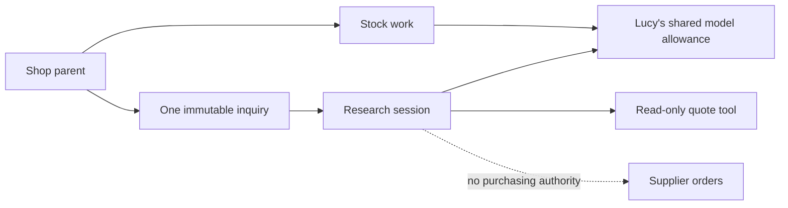
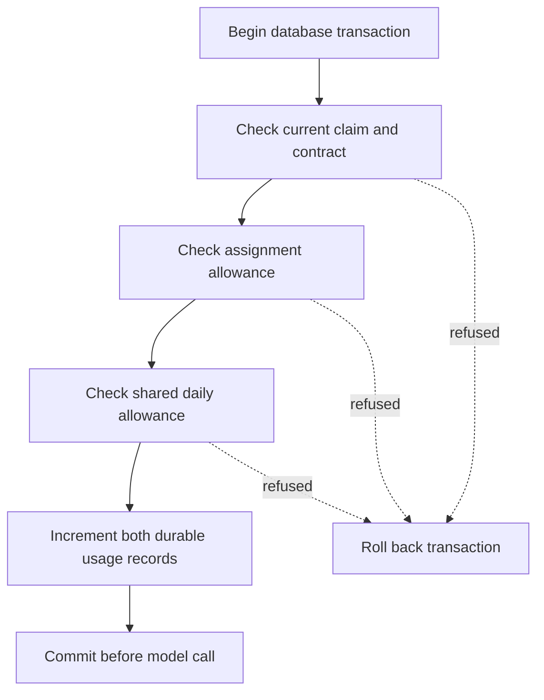
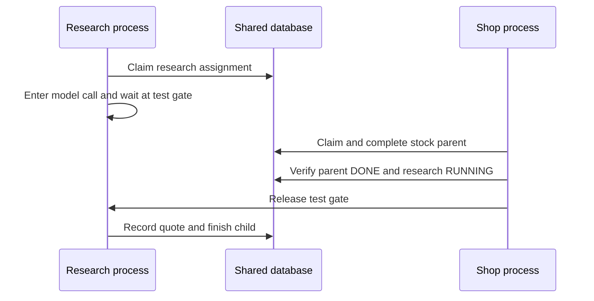

# Chapter 14 — Delegate one bounded task

A catering inquiry arrives while Lucy's morning stock work is pending. The customer expects 41 guests and wants vanilla ice cream. We could add another instruction to the existing agent, call a plain function or give a separate worker a bounded assignment. The existence of several tasks does not settle which design is useful.

This chapter implements one delegation path and tests the obligations it creates. The research worker receives an immutable inquiry, a deadline and a model allowance. It can calculate a draft quote but cannot reserve stock, purchase supplies or create another child. Its model usage is charged to Lucy's existing account, and cancellation remains enforceable after its parent finishes the stock task.

We will also compare the result with a direct function. For this fixed calculation, the function remains the recommended design. Building the bounded delegation path lets us understand what a second agent costs and what evidence would justify using one for a less mechanical task. It does not require us to promote every asynchronous job into another reasoning agent.

## Learning objectives

Compare a function, skill and second agent; define an immutable delegated assignment; route research separately from stock work; preserve shared allowances across replacement; reject changed inquiries and expired authority; and compare the resulting quote with independently authored expectations.

The deliverable is one evaluated delegation pattern with a defensible simpler alternative. The checkpoint launches an actual research process, pauses it during a model call and completes stock work in the parent process. It then tests cancellation, real deadline expiry, replacement-budget refusal and unchanged stock and purchasing records.

## Start with the job, then choose the mechanism

The inquiry contains a product identity and a guest count. Lucy's teaching fixture defines ten portions per tub and a selling price of £5 per tub. The arithmetic is ceiling division followed by multiplication. Neither uncertainty about phrasing nor a long conversation is needed to compute it once those inputs are known.

A plain function is therefore a strong baseline. A skill can explain the steps to an existing agent that already handles varied customer requests. A second agent becomes more plausible when the task needs independent reasoning, a separate context or an independently managed lifetime while other work continues. Each choice introduces different costs and failure modes.

| Mechanism | Appropriate reason to use it | Cost to account for |
| --- | --- | --- |
| Function | Inputs and business calculation are known | Code maintenance and data acquisition |
| Skill in the existing agent | A reusable procedure guides varied requests | Context space, model calls and regression evaluation |
| Separate worker without a model | Deterministic work needs its own lifetime | Queueing, ownership and result delivery |
| Bounded second agent | Independent reasoning or context earns its overhead | All worker obligations plus another model budget |

Concurrency alone does not require another model. A function can run in another worker when scheduling or isolation warrants it. We will deliberately pause the research model in the process experiment to make concurrent progress observable, but that artificial wait is not evidence that a second model improves latency.

The new worker also has less authority than the shop worker. It can produce a quote, not a sale or supplier order. The quote does not reserve inventory and does not promise that stock will be available when the customer accepts. Those are separate business transitions that would need their own records and permissions.

## Construct the quote and its independent expectations

Use selling price for the customer quote, not supplier cost. The original vanilla fixture has a supplier unit cost of 250 pence and a selling price of 500 pence. Confusing those fields could produce a perfectly formatted quote at the wrong price. An expected answer written independently of the function exposes that error.

**Listing:** Build the inquiry and quote function, then test authored boundaries.

```python
import json
import math
import tempfile
import time
import uuid
from collections.abc import Callable
from dataclasses import asdict
from pathlib import Path
from typing import Any

from pydantic import Field

from reference_organizations.store.agent import NoArguments, seed_lucy
from sovereign_agent.database import Database


class Inquiry(NoArguments):
    sku: str = Field(min_length=1, max_length=100)
    guests: int = Field(ge=1, le=200)


def quote(db: Database, inquiry: Inquiry) -> dict[str, Any]:
    """Ten portions per tub is Lucy's authored catering fixture, not a model estimate."""
    row = db.connection.execute(
        "SELECT record FROM products WHERE sku=?", (inquiry.sku,)
    ).fetchone()
    if row is None:
        raise ValueError("unknown catering product")
    price = json.loads(row[0])["price_cents"]
    if type(price) is not int or price <= 0:
        raise ValueError("invalid catalog selling price")
    tubs = (inquiry.guests + 9) // 10
    return {
        "sku": inquiry.sku,
        "guests": inquiry.guests,
        "portions_per_tub": 10,
        "tubs": tubs,
        "total_pence": tubs * price,
        "currency": "GBP",
        "status": "DRAFT_QUOTE",
        "stock_reserved": False,
    }


temporary = tempfile.TemporaryDirectory(prefix="lucy-ch14-")
root = Path(temporary.name)
db = Database(root / "agent.sqlite")
seed_lucy(db)
for guests, tubs, pence in (
    (1, 1, 500),
    (10, 1, 500),
    (11, 2, 1000),
    (41, 5, 2500),
    (200, 20, 10000),
):
    result = quote(db, Inquiry(sku="SKU-VANILLA", guests=guests))
    assert (result["tubs"], result["total_pence"]) == (tubs, pence)
print("Authored boundary cases:", 5)
print("41 guests:", quote(db, Inquiry(sku="SKU-VANILLA", guests=41))["total_pence"], "pence")
print("Stock reserved:", quote(db, Inquiry(sku="SKU-VANILLA", guests=41))["stock_reserved"])
```

```text
Authored boundary cases: 5
41 guests: 2500 pence
Stock reserved: False
```

For 41 guests, four tubs provide only forty portions, so the quote requires five tubs. At £5 each, that is £25.00. The literal expected answer comes from that reasoning, rather than from a saved output of `quote`. If the function later changes its rounding rule, the test should disagree and force an explicit business decision.

The strict inquiry schema refuses boolean guest counts, zero and values above 200. An unknown product or invalid selling price also fails. These refusals keep the bounded assignment meaningful before any model runs. A model-generated argument still passes through the same strict validation at dispatch time.

## Bind a child to one exact assignment

A delegated task needs a durable identity independent of a model conversation. We bind one child to an eligible shop parent and store the inquiry, deadline, maximum model calls, per-call estimate and total assignment estimate limit. Repeating the identical handoff returns the same child. Changing any of those terms under the same parent is refused.

The child gets a separate research session so stock work is not serialized behind its model call. It retains the parent's billing session, however. A new conversation namespace must not manufacture another spending allowance. Work identity, conversational context and billing identity are separate fields because they answer separate questions.

**Listing:** Construct the immutable handoff and prove duplicate identity.

```python
from sovereign_agent import assistant_work as work_records
from sovereign_agent.events import append_event


def delegate(
    db: Database,
    parent: str,
    inquiry: Inquiry,
    *,
    deadline: float,
    model_calls: int = 4,
    estimated_call_pence: int = 0,
    budget_pence: int = 100,
) -> str:
    if (
        not math.isfinite(deadline)
        or not time.time() < deadline <= time.time() + 3600
        or type(model_calls) is not int
        or not 1 <= model_calls <= 8
        or type(estimated_call_pence) is not int
        or estimated_call_pence < 0
        or type(budget_pence) is not int
        or not 1 <= budget_pence <= 1000
    ):
        raise ValueError("bounded delegation contract required")
    encoded = inquiry.model_dump_json()
    with db.immediate() as connection:
        source = connection.execute("SELECT * FROM assistant_work WHERE id=?", (parent,)).fetchone()
        if (
            source is None
            or source["role"] != "shop"
            or source["cancelled"]
            or source["status"] == "REJECTED"
            or connection.execute("SELECT paused FROM assistant_control").fetchone()[0]
        ):
            raise PermissionError("eligible shop parent required; delegation cannot recurse")
        quote(db, inquiry)
        existing = connection.execute(
            "SELECT d.*,w.prompt FROM assistant_delegations d JOIN assistant_work w "
            "ON w.id=d.work_id WHERE d.parent_id=?",
            (parent,),
        ).fetchone()
        if existing:
            if (
                existing["prompt"],
                existing["deadline"],
                existing["model_calls_limit"],
                existing["estimated_call_pence"],
                existing["budget_pence"],
            ) != (encoded, deadline, model_calls, estimated_call_pence, budget_pence):
                raise ValueError("parent already has a different immutable assignment")
            return str(existing["work_id"])
        child = work_records._enqueue(
            connection,
            "delegation:" + parent,
            "research:" + parent,
            encoded,
            time.time(),
            source["channel"],
            source["recipient"],
            require_admission=True,
            role="research",
            billing_session=source["billing_session"] or source["session"],
        )
        connection.execute(
            "INSERT INTO assistant_delegations(work_id,parent_id,deadline,model_calls_limit,"
            "estimated_call_pence,budget_pence) VALUES (?,?,?,?,?,?)",
            (child, parent, deadline, model_calls, estimated_call_pence, budget_pence),
        )
        append_event(db, "assistant.delegation.created", {"parent": parent, "child": child})
        return child


parent = work_records.enqueue(db, "catering:1", "lucy", "Prepare the stock brief.")
inquiry = Inquiry(sku="SKU-VANILLA", guests=41)
deadline = time.time() + 120
child_id = delegate(db, parent, inquiry, deadline=deadline, estimated_call_pence=7)
again = delegate(db, parent, inquiry, deadline=deadline, estimated_call_pence=7)
print("Same handoff, same child:", child_id == again)
try:
    delegate(
        db, parent, Inquiry(sku="SKU-VANILLA", guests=42), deadline=deadline, estimated_call_pence=7
    )
except ValueError:
    print("Changed inquiry:", "refused")
try:
    delegate(db, child_id, inquiry, deadline=deadline)
except PermissionError:
    print("Recursive delegation:", "refused")
```

```text
Same handoff, same child: True
Changed inquiry: refused
Recursive delegation: refused
```

The handoff's child row and contract are created in one database transaction. The event belongs to that transaction too. An injected event failure must leave neither an orphan child nor a half-recorded contract. The regression suite tests that rollback directly rather than assuming that several adjacent SQL statements form one atomic operation.

The deadline is an absolute timestamp with a bounded horizon. If you pause between the chapter's listings long enough for it to expire, rerun the isolated example from its initial fixture. Quietly extending an existing assignment would change its terms, so the duplicate-handoff path intentionally does not do that for you.

The one-child rule is sufficient for this lesson. It is not a distributed orchestration language, a dynamic team hierarchy or permission for the research worker to spawn more agents. A larger fan-out would introduce new admission, cancellation and aggregation contracts. It should solve a demonstrated problem before entering this codebase.



**Figure:** The research session can progress separately from stock work while retaining the parent's billing identity and a narrower tool boundary.

## Carry the contract through every model call

A limit stored at handoff is useful only if execution rechecks it. The current-holder check from Chapter 10 validates worker identity and ownership. For research work it also checks the delegation deadline and parent cancellation. A model reply arriving after authority expires cannot proceed to tool execution or transcript completion as though the original permission still held.

Model-call reservation must survive process replacement. A worker that spends its one permitted call cannot recover by acquiring a new generation and resetting a local counter. The durable contract counter and the parent's daily allowance are updated together before the call. Failure of either check rolls the transaction back.

**Listing:** Construct durable call reservation and explicit contract expiry.

```python
from sovereign_agent.assistant_work import Claim, assert_current


def reserve_model_call(
    db: Database, work: Claim, estimate_pence: int, *, now: float | None = None
) -> None:
    """Retain estimated exposure even if the provider's reply is lost. Not an invoice cap."""
    if type(estimate_pence) is not int or estimate_pence < 0:
        raise ValueError("nonnegative integral model estimate required")
    now = time.time() if now is None else now
    if not math.isfinite(now):
        raise ValueError("finite clock required")
    day = int(now // 86400)
    with db.immediate() as connection:
        assert_current(connection, work, now)
        ledger = connection.execute(
            "SELECT billing_session,estimated_cost_pence FROM assistant_work WHERE id=?",
            (work.id,),
        ).fetchone()
        billing = ledger["billing_session"] or work.session
        if work.role == "research":
            contract = connection.execute(
                "SELECT * FROM assistant_delegations WHERE work_id=?", (work.id,)
            ).fetchone()
            if (
                contract["model_calls"] >= contract["model_calls_limit"]
                or estimate_pence != contract["estimated_call_pence"]
                or ledger["estimated_cost_pence"] + estimate_pence > contract["budget_pence"]
            ):
                raise PermissionError("delegation model allowance exhausted")
            connection.execute(
                "UPDATE assistant_delegations SET model_calls=model_calls+1 WHERE work_id=?",
                (work.id,),
            )
        connection.execute(
            "INSERT OR IGNORE INTO assistant_daily(session,day) VALUES (?,?)", (billing, day)
        )
        row = connection.execute(
            "SELECT * FROM assistant_daily WHERE session=? AND day=?", (billing, day)
        ).fetchone()
        if (
            row["model_calls"] >= row["call_limit"]
            or row["estimated_cost_pence"] + estimate_pence > row["cost_limit"]
        ):
            raise PermissionError("daily model allowance exhausted")
        connection.execute(
            "UPDATE assistant_daily SET model_calls=model_calls+1,"
            "estimated_cost_pence=estimated_cost_pence+? WHERE session=? AND day=?",
            (estimate_pence, billing, day),
        )
        connection.execute(
            "UPDATE assistant_work SET estimated_cost_pence=estimated_cost_pence+? WHERE id=?",
            (estimate_pence, work.id),
        )


def expire(db: Database) -> None:
    """Cancel expired contracts even when no worker claimed them or a model failed."""
    with db.immediate() as connection:
        rows = connection.execute(
            "SELECT w.id FROM assistant_work w JOIN assistant_delegations d ON d.work_id=w.id "
            "JOIN assistant_work p ON p.id=d.parent_id WHERE "
            "w.status IN ('READY','RUNNING','BLOCKED') AND (d.deadline<=? OR p.cancelled=1)",
            (time.time(),),
        ).fetchall()
        for row in rows:
            connection.execute(
                "UPDATE assistant_work SET status='CANCELLED',cancelled=1,"
                "generation=generation+1,result='Delegation expired or parent cancelled.' "
                "WHERE id=?",
                (row[0],),
            )
            append_event(db, "assistant.delegation.expired", {"work": row[0]})
```



**Figure:** Assignment and shared-account reservations succeed together. A failed daily check must not consume a separate child counter while leaving billing unchanged.

The reservation records estimated exposure even if a reply is lost. It is not an invoice guarantee. The per-call estimate is part of the immutable delegation contract; a replacement cannot pass a smaller estimate to make the remaining budget look larger. The total model-call counter also remains authoritative across restarts.

The daily table contains both intake accounting and model usage. Research sessions can therefore have their own rows even though their model usage is billed to Lucy. Our first added checkpoint assertion incorrectly required exactly one row. The corrected test checks the relevant usage columns: only Lucy has model calls or estimated cost, and every research intake row has zero billed usage.

That distinction is worth investigating rather than deleting the extra rows to satisfy the test. A table's existence does not tell us which account a particular operation charges. Trace the update query and observe the resulting fields. The checkpoint's complete scenarios account for ten calls and 26 estimated pence in one billing account, with no additional allowance created by the research sessions.

## Build the read-only research loop

The research worker claims only research work and loads its recorded contract. Its dispatcher contains one tool, `catering_quote`. The tool requires the exact immutable inquiry; a model cannot change the product or guest count to broaden the assignment. It has no stock-reservation, purchasing or delegation tool.

The loop uses the same bounded model/tool implementation as the shop worker. Its current-holder, reservation and observation callbacks enforce the work record's contract. On success, the result contains both the quote observation and a direct-function baseline. The channel-facing statement is rendered from validated quote fields rather than trusting the model to repeat the price accurately.

**Listing:** Construct the research worker and execute the held inquiry.

```python
from reference_organizations.store.delegation import OfflineCateringModel
from sovereign_agent.agent_loop import Limits, run_loop
from sovereign_agent.model_turn import Model
from sovereign_agent.tool_dispatch import Dispatcher, ExecutableTool


def run_once(
    db: Database,
    model: Model,
    *,
    identifier: str = "",
    should_stop: Callable[[], bool] = lambda: False,
) -> dict[str, Any]:
    expire(db)
    if should_stop():
        return {"status": "STOPPED"}
    work = work_records.claim(db, uuid.uuid4().hex, role="research", identifier=identifier)
    if work is None:
        return {"status": "IDLE"}
    contract = db.connection.execute(
        "SELECT * FROM assistant_delegations WHERE work_id=?", (work.id,)
    ).fetchone()
    if contract is None:
        raise ValueError("research work has no assignment contract")
    inquiry = Inquiry.model_validate_json(work.prompt)
    baseline_start = time.monotonic()
    baseline = quote(db, inquiry)
    baseline_seconds = time.monotonic() - baseline_start
    observations: list[dict[str, Any]] = []

    def calculate(arguments: Inquiry) -> dict[str, Any]:
        if arguments != inquiry:
            raise PermissionError("quote differs from immutable inquiry")
        value = quote(db, inquiry)
        observations.append(value)
        return value

    dispatcher = Dispatcher(
        [
            ExecutableTool(
                "catering_quote",
                "Calculate this assignment's read-only draft quote.",
                Inquiry,
                calculate,
            )
        ],
        allowed=frozenset({"catering_quote"}),
    )
    started = time.monotonic()
    try:
        remaining = contract["deadline"] - time.time()
        if remaining <= 0:
            raise PermissionError("delegation expired")
        result = run_loop(
            model,
            dispatcher,
            [
                {
                    "role": "system",
                    "content": "Prepare a catering draft using catering_quote. "
                    "You cannot reserve stock, buy supplies, or delegate.",
                },
                {"role": "user", "content": work.prompt},
            ],
            limits=Limits(
                model_calls=contract["model_calls_limit"],
                tool_calls=4,
                seconds=min(60, remaining),
                estimated_call_pence=contract["estimated_call_pence"],
                model_budget_pence=contract["budget_pence"],
            ),
            check_current=lambda: work_records.assert_current(db.connection, work),
            reserve_call=lambda: work_records.reserve_model_call(
                db, work, contract["estimated_call_pence"]
            ),
            observe=lambda message: work_records.observe(db, work, message),
            should_stop=should_stop,
        )
        if result.status == "STOP_REQUESTED":
            with db.immediate() as connection:
                work_records.assert_current(connection, work)
                connection.execute(
                    "UPDATE assistant_work SET status='READY',owner=NULL,expires=NULL WHERE id=?",
                    (work.id,),
                )
            return {"status": "STOPPED", "work": work.id}
        passed = (
            result.status == "COMPLETED" and bool(observations) and observations[-1] == baseline
        )
        report = {
            "passed": passed,
            "quote": observations[-1] if observations else None,
            "model_answer": result.answer,
            "loop": asdict(result),
            "baseline": {"quote": baseline, "model_calls": 0, "seconds": baseline_seconds},
            "seconds": time.monotonic() - started,
            "decision": "Retain the function for this fixed calculation; model prose is ungraded.",
            "assignment_usage": dict(
                db.connection.execute(
                    "SELECT d.model_calls,w.estimated_cost_pence FROM assistant_delegations d "
                    "JOIN assistant_work w ON w.id=d.work_id WHERE d.work_id=?",
                    (work.id,),
                ).fetchone()
            ),
        }
        status = "DONE" if passed else "BLOCKED"
        # Channel delivery uses a deterministic statement of the validated observation.
        answer = (
            (
                f"Catering draft: {baseline['tubs']} tubs for {inquiry.guests} guests, "
                f"GBP {baseline['total_pence'] / 100:.2f}. No stock reserved."
            )
            if passed
            else ("Catering research did not produce verified quote evidence.")
        )
        with db.immediate():
            work_records.assert_current(db.connection, work)
            append_event(db, "assistant.delegation.evaluated", {"work": work.id, "report": report})
        work_records.finish(db, work, status, answer)
        return {"status": status, "work": work.id, "report": report}
    except PermissionError:
        expire(db)
        # A stale worker must never finish or cancel a replacement's claim.
        try:
            work_records.finish(db, work, "BLOCKED", "Delegation authority or allowance exhausted.")
        except PermissionError:
            pass
        return {"status": "AUTHORITY_STOP", "work": work.id}


result = run_once(db, OfflineCateringModel(), identifier=child_id)
print("Research status:", result["status"])
print(
    "Quote:",
    result["report"]["quote"]["tubs"],
    "tubs",
    result["report"]["quote"]["total_pence"],
    "pence",
)
print("Assignment usage:", result["report"]["assignment_usage"])
print("Baseline model calls:", result["report"]["baseline"]["model_calls"])
print("Repeat research run:", run_once(db, OfflineCateringModel(), identifier=child_id)["status"])
```

```text
Research status: DONE
Quote: 5 tubs 2500 pence
Assignment usage: {'model_calls': 2, 'estimated_cost_pence': 14}
Baseline model calls: 0
Repeat research run: IDLE
```

The report's comparison with the baseline proves that the observed tool result matches that calculation for the assigned inquiry. Both paths call `quote`, so their agreement alone does not independently establish the business arithmetic. The earlier authored boundary expectations supply that evidence. Keeping those two kinds of check separate prevents a circular test from becoming a false proof.

The offline catering model is a fixture that requests the quote and then finishes. The direct function requires no model calls; the fixture uses two. The result therefore recommends retaining the function for this fixed calculation, and states that model prose remains ungraded. A meaningful comparison may conclude that the more elaborate mechanism is unnecessary.

An `IDLE` repeat means the completed research work is not executed again. It is not a guarantee of exactly-once delivery through an external messaging service. Outbound delivery has its own acknowledgement and retry behavior. Do not extend a durable work-identity observation into a stronger statement about another system's effects.

## Keep stock work and billing connected correctly

The research child uses a separate session, but the parent remains ordinary shop work. The following call completes the parent through the actual shop worker. Its three model calls join the child's two calls in Lucy's daily account. The child contributes fourteen estimated pence from its two configured seven-pence reservations; the offline shop calls use the default zero estimate.

**Listing:** Complete the parent and inspect shared usage and unchanged business records.

```python
from reference_organizations.store.agent import OfflineShopModel
from reference_organizations.store.assistant import run_once as shop_once

stock_result = shop_once(db, OfflineShopModel())
usage = db.connection.execute(
    "SELECT model_calls,estimated_cost_pence FROM assistant_daily WHERE session='lucy'"
).fetchone()
print("Stock status:", stock_result["status"])
print("Lucy's shared usage:", tuple(usage))
print("Purchases:", db.connection.execute("SELECT count(*) FROM assistant_orders").fetchone()[0])
print("Reserved tubs:", db.connection.execute("SELECT sum(reserved) FROM inventory").fetchone()[0])
```

```text
Stock status: DONE
Lucy's shared usage: (5, 14)
Purchases: 0
Reserved tubs: 0
```

These inline calls run sequentially so their data flow is easy to inspect. The cumulative checkpoint supplies the separate process experiment. It starts research in a child process, waits until that process has claimed work and entered its model call, then completes the shop parent while the research process is still alive and waiting.

After the parent releases the test gate, research finishes its quote. The pause is deliberate instrumentation, not a measured workload or a claim that the model needs that delay. It demonstrates that the worker roles and session routing allow independent progress without giving the research task purchasing authority.



**Figure:** The checkpoint proves concurrent progress with two actual processes and observed work states. It does not infer concurrency merely because two functions exist.

## Experiment: cancel after the parent finishes

Finishing the stock brief does not necessarily finish its catering child. Lucy may withdraw the catering inquiry after the stock task is done. Cancellation must stop the outstanding child without rewriting the parent's completed business result.

The work cancellation primitive handles this case by retaining the parent's `DONE` result while recording cancellation for its still-active delegation. The research current-holder check sees the cancelled parent, and expiry processing moves the child to `CANCELLED`. A model reply already in progress cannot produce a new quote observation or completed child result afterward.

In the checkpoint's second process case, research pauses inside its first model call again. The shop process completes the stock parent, then cancels the parent and releases research. The child returns `AUTHORITY_STOP`, its work becomes cancelled and no tool observation is recorded. The stock parent's completed result remains intact.

The model call's reserved allowance is retained. Cancellation can prevent newly admitted tool work and completion; it cannot recall a provider request already sent or guarantee that the provider did not charge for it. This is the same distinction between authority and completed external activity that motivated the [supplier-recovery chapter](../ch09_ambiguous_order/README.md).

## Experiment: replacement must not reset the allowance

We can test durable budget ownership without waiting for a long-running provider. Create a child with a one-call allowance, claim it under a short lease and reserve its one call. After actual lease expiry, acquire a new generation and try to reserve another call. The replacement must be refused even though its own Python counter starts at zero.

**Listing:** Observe real lease expiry and retain the exhausted assignment budget.

```python
budget_parent = work_records.enqueue(db, "budget:parent", "lucy", "Prepare a brief.")
budget_child = delegate(
    db,
    budget_parent,
    Inquiry(sku="SKU-VANILLA", guests=1),
    deadline=time.time() + 60,
    model_calls=1,
    estimated_call_pence=5,
)
old = work_records.claim(db, "old", role="research", identifier=budget_child, ttl=0.1)
assert old is not None
reserve_model_call(db, old, 5)
time.sleep(0.15)
replacement = work_records.claim(db, "replacement", role="research", identifier=budget_child)
assert replacement is not None
print("Generation advanced:", replacement.generation == old.generation + 1)
try:
    reserve_model_call(db, replacement, 5)
except PermissionError:
    print("Replacement's extra call:", "refused")
print(
    "Durable call count:",
    db.connection.execute(
        "SELECT model_calls FROM assistant_delegations WHERE work_id=?", (budget_child,)
    ).fetchone()[0],
)
db.close()
temporary.cleanup()
```

```text
Generation advanced: True
Replacement's extra call: refused
Durable call count: 1
```

This exercise uses actual elapsed time rather than rewriting the lease timestamp. It changes ownership records in one process; Chapter 10 and the cumulative delegation checkpoint provide the complementary process evidence. Each experiment states which boundary it tests instead of pretending one demonstration covers every failure mode.

The checkpoint also lets an unclaimed contract expire by real elapsed time. Expiration happens before a model call, and the work becomes cancelled. A deadline should constrain work that never starts as well as work that is already running. Otherwise a delayed queue can begin an inquiry long after its usefulness has ended.

## Learn from the real model's tool-schema failure

The recorded live construction run used local `qwen3` with reasoning disabled. The first version advertised a quote tool with no arguments while putting the inquiry in the user's message. The model supplied the natural SKU and guest-count arguments anyway. Strict dispatch refused them, leaving the work blocked with no quote.

We repaired the tool schema to expose the explicit `Inquiry` fields and checked exact equality with the stored assignment inside the handler. The same model then produced a valid five-tub, 2,500-pence quote for 41 guests. Both runs are retained in the evidence, and the repaired source hash matches the current delegation module.

| Live construction observation | Before schema repair | After schema repair |
| --- | --- | --- |
| Model supplied inquiry fields | Yes | Yes |
| Tool accepted those fields | No, invalid arguments | Yes, exact inquiry required |
| Verified quote | None | Five tubs, £25.00 |
| Work disposition | `BLOCKED` | `DONE` |

The repair did not loosen the assignment. It made the interface tell the model what the handler actually expects, then enforced the immutable terms. A permissive handler that accepted any product or guest count would have made the test green by changing the problem. The exact-inquiry regression prevents that expansion.

This is one live construction example, not a reliability rate. The deterministic process checkpoint and the live tool interaction answer different questions. The former proves routing, ownership, cancellation and budget behavior under controlled timing. The latter shows how the selected model interacted with the declared schema in the recorded environment.

## Decide whether the second agent earned its place

For this fixed quote, the answer is to retain the function. The model adds calls and a possible schema or explanation failure without improving the arithmetic. The bounded worker pattern remains available for a future inquiry that requires comparing options, gathering several sources or managing an independent conversation, but that future task should bring its own evaluation cases.

Use the same inputs and acceptance criteria when comparing alternatives. Include complete work, failed handoffs, cancellation and total model usage, not just the fastest successful response. A second agent that makes the parent look faster by hiding its own calls in another account has not reduced cost. A separate context that loses the inquiry's constraints has not improved quality.

The operator can run a research worker through `agent serve --research-worker`, with its separate service environment. The installed service path uses the same durable contracts and dispatcher as this chapter. It does not inherit the messaging bot's credentials merely because both workers use the same database. Deployment and maintenance of those processes are the next chapter's subject.

## Exercises

### Exercise 1: change the business rule independently

Suppose Lucy's tubs serve eight portions instead of ten. Write new expected answers for one, eight, nine and forty-one guests before changing the function. Update the calculation and show that the old expectations fail where the rule changed. Do not generate the replacement expected values by calling the updated function.

### Exercise 2: attempt to broaden an assignment

Make the model request another SKU or a larger guest count while the recorded inquiry stays unchanged. Require the handler to refuse it and retain zero purchase and reservation changes. Explain why successful JSON validation is insufficient when valid arguments can still describe work outside the assignment.

### Exercise 3: cancel during an in-flight model call

Run the two-process checkpoint and inspect the second scenario. Verify that the stock parent is already done before cancellation, the child has no tool observations after the cancellation and the reserved model usage remains charged. Identify what can be prevented and what cannot be recalled after a provider request has begun.

### Exercise 4: justify another reasoning worker

Propose a task for Lucy that a fixed function does not already solve. Define its inputs, authority, deadline, context and cost allowance, then write a comparison plan against a single-agent or scripted alternative. State the observable result that would make you keep the simpler design. Do not add a second child merely to demonstrate a larger team.

## Expected observations

The cumulative checkpoint verifies five authored arithmetic boundaries. In its first process case, stock work completes while research waits, then the child returns five tubs at 2,500 pence and a repeat research run is idle. In its second case, cancellation preserves the completed stock result and prevents the child's observation and completion.

Unclaimed work expires, replacement cannot reset an exhausted assignment allowance, and all usage is billed to Lucy: ten calls and 26 estimated pence across the complete checkpoint. Stock and reservation values remain unchanged and no supplier orders exist. The final architecture decision retains the direct function for this particular calculation.

## Learner verification

Run `uv run python book/always_on/checkpoints/ch14.py` and inspect the process synchronization rather than inferring concurrency from names. Confirm the research process reaches its model call before stock work completes. Read both work states and the parent billing row. Distinguish intake-accounting rows from additional model spending allowances.

Run the catering-delegation regressions and the applicable project gate after changing the contract or worker. Check duplicate handoffs, changed inquiries, event-failure rollback, shared limits, cancellation, expiry and stale ownership. Compare quote arithmetic with authored literals as well as checking that the worker and baseline agree.

## Summary

A second agent creates durable obligations: an exact assignment, separate execution identity, constrained authority, shared accounting, cancellation and a result whose source can be verified. This chapter implements those obligations for one read-only catering task and proves independent progress with actual processes.

The fixed quote still belongs in a function. The delegation pattern earns its teaching role by making that decision measurable and by showing what a more demanding task would have to justify. The remaining work is operational: install the agent predictably, maintain its state and demonstrate a complete unattended business day.

## Active recall and vocabulary

Explain why concurrency does not by itself require another model. Distinguish the research session from its billing account. Describe why a changed inquiry is refused even when it passes the tool's JSON schema, and why a replacement worker cannot reset its call counter. Explain why a completed quote is neither a stock reservation nor a supplier purchase.

**Delegation contract** fixes the work and limits given to a child. **Handoff identity** lets duplicate delivery refer to the same assignment. **Billing session** identifies the shared account charged for model usage. **Cancellation** withdraws permission for further work while retaining completed facts. **Baseline comparison** tests whether additional reasoning earns its cost. **Authored expectation** supplies a business answer independent of the function being tested.
