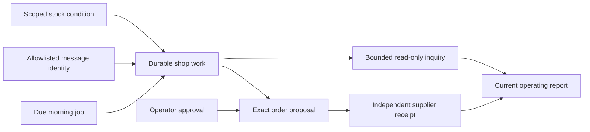
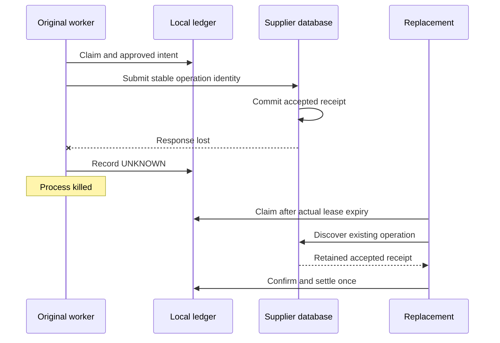
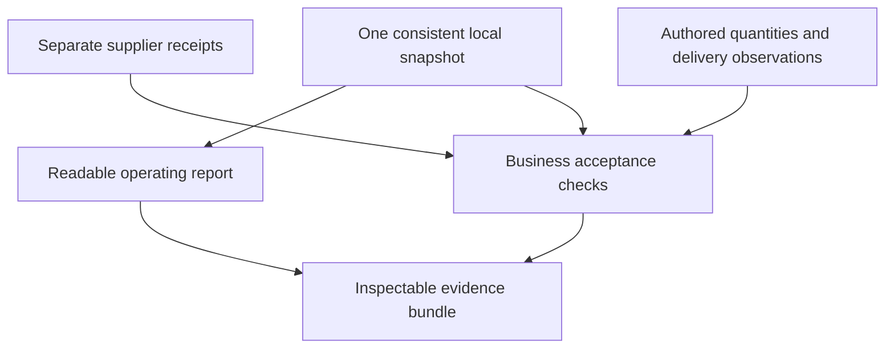

# Chapter 16 — Lucy leaves the shop for a day

Lucy leaves the shop after setting the day's boundaries. The agent should prepare the morning brief, notice shortages, ask before spending, record supplier outcomes and keep a catering inquiry separate from purchasing. During this accelerated day, a model call fails, a message arrives twice, supplier responses disappear and a worker is killed. The final report must survive those events without inventing a successful day.

We have built the mechanisms individually. This chapter joins them into one scenario with a single shop database and an independent supplier database. It also constructs a deterministic operating report whose amounts come from structured records. The report is useful to Lucy, while the builder's evidence bundle explains why its claims can be trusted within the experiment's stated limits.

The scenario uses the offline model fixture for repeatability and a fixture transport for Telegram updates. The supplier and replacement workers are real processes. Those choices let every reader reproduce the failure sequence without credentials or live purchases. Earlier live-model and Linux experiments remain separate evidence; this accelerated day does not turn them into a continuous availability guarantee.

## Learning objectives

Integrate schedules, durable intake, memory correction, scoped stock work, exact approval, ambiguous-effect recovery, worker replacement and bounded delegation; construct a report from one consistent database snapshot; reconcile report totals with independent supplier receipts; retain inspectable evidence; and distinguish passing a scenario from accepting a deployment or manuscript for publication.

The deliverable is a repeatable business-day checkpoint and a readable operating report. Success means two independent supplier orders totaling 2600 pence, one received vanilla delivery, one pending strawberry delivery, no repeated purchase, no unfinished work and a separately bounded catering quote. The evidence must preserve the injected failures and the records used to reach those conclusions.

## Define the day before running it

Begin with the catalog fixture we have used throughout the book. Vanilla has two tubs on hand and a target of eight; strawberry has one and a target of five; chocolate has twelve and a target of six. Supplier unit costs are 250, 275 and 300 pence respectively. The two shortages therefore require six vanilla tubs and four strawberry tubs, costing 1500 and 1100 pence.

These expected amounts are authored before running the agent. They are not copied from the report generator. The distinction prevents an accounting bug from creating its own expected answer. The model may choose tool calls, but neither its arithmetic nor its final prose determines what the acceptance check calls correct.

```python
EXPECTED_PURCHASES = {
    "SKU-VANILLA": {"quantity": 6, "unit_cost_pence": 250},
    "SKU-STRAWBERRY": {"quantity": 4, "unit_cost_pence": 275},
}
expected_pence = sum(
    row["quantity"] * row["unit_cost_pence"] for row in EXPECTED_PURCHASES.values()
)
print("Expected accepted purchase total:", expected_pence, "pence")
print("Expected supplier order count:", len(EXPECTED_PURCHASES))
```

```text
Expected accepted purchase total: 2600 pence
Expected supplier order count: 2
```

The operating policy allows a total exposure of 3000 pence and no automatic purchases. Each proposed order must receive an exact approval from the allowlisted operator. The limit is enough for the intended replenishment but small enough that a duplicate vanilla purchase would exceed the plan. We still inspect actual supplier identities and amounts; a budget rejection alone would not prove the first purchase was correct.

The catering inquiry asks for vanilla ice cream for 41 guests. At ten portions per tub and a selling price of 500 pence per tub, its independent expected quote is five tubs and 2500 pence. This is a customer quote, not supplier expenditure. It must not change stock reservations or add a purchase to the final spending total.

| Event in the day | Required observation | Forbidden shortcut |
| --- | --- | --- |
| Morning schedule becomes due | One durable work item | A second item from another scan of the same due run |
| Model call fails | Blocked work and retained call allowance | Treating the failed call as free or completed work |
| Private message repeats | One admitted request after reopening state | Starting another turn because delivery repeated |
| Lucy approves an order | Exact proposal and current operator authority | Approval inferred from model narration |
| Supplier response disappears | Unknown local outcome, retained remote receipt | Creating a new operation identity to retry |
| Worker is killed | Replacement reconciles existing records | Asking a new model to guess what happened |
| Vanilla arrives | One delivery observation and stock update | Counting repeated receipt entry as another delivery |

The scenario does not need to make every failure happen at once. It needs to prove that their effects compose correctly in the same state. We accelerate elapsed business time while preserving real lease expiry and retry waiting where those clocks enforce authority. No test rewrites a lease to make an unavailable worker appear dead.

## Connect the day through durable records

The morning job creates a stock-brief assignment. Its first model call raises an injected outage, leaving the work blocked and the call reservation recorded. An explicit retry returns that work to the queue, and the offline model completes the useful brief. The schedule is scanned again and produces no duplicate work for that due occurrence.

Next, the channel fixture delivers the same private message twice alongside an unauthorized sender. The actual Telegram intake adapter accepts one allowlisted request. We reopen the database and replay the updates again; the durable message identity suppresses another admission. This proves intake and routing behavior against the fixture transport, not communication with Telegram's live servers.



**Figure:** Different entry points converge on durable work while purchasing and research retain separate authority.

A stale currency preference is corrected from euros to GBP with a new explicit source. The scenario checks the active preference record. It does not claim that the deterministic model fixture learned from the correction; its purpose here is to prove that the integrated path retains the current preference and its provenance while other work progresses.

Stock conditions then create one vanilla assignment and one strawberry assignment. Their enforced product subjects prevent either worker from drafting the other product. Both proposals remain drafts until the operator's approval messages are processed through the actual control-command path. At that moment the independent supplier still has zero orders.

## Lose responses, kill a worker and reconcile

For vanilla, an actual child worker claims the approved assignment, calls the loopback supplier and records an unknown result after the response is lost. The supplier has already committed the order in its separate database. The parent observes that receipt, then sends SIGKILL to the worker after its local unknown state is durable.

The worker's lease is allowed to expire through elapsed time. A replacement takes the work and reconciles the existing operation. A model fixture that raises if called establishes that this recovery does not ask for another reasoning turn. The replacement completes from the approved proposal and the supplier's retained receipt.

The supplier fixture drops the first response for **each new operation**. That detail matters: the first draft of this integrated test wrongly expected strawberry's first send to complete immediately. The retained state showed strawberry as `UNKNOWN`, with 1100 pence still reserved and vanilla's 1500 pence already spent. Reading the supplier implementation showed that the test expectation was wrong. We now wait for the recorded retry time and reconcile strawberry too.



**Figure:** The replacement resolves a known operation from external evidence instead of regenerating an order.

Another prototype failure came earlier: a two-second claim tried to admit a supplier call with a three-second timeout. The execution boundary correctly refused a wait that could outlive ownership. The corrected child uses a one-second supplier timeout inside its two-second lease. This is a real precondition of the write boundary, not a reason to weaken the lease check for the test.

These failures belong in the evidence because they explain what the final test actually establishes. A log containing only the passing attempt would hide both the invalid timing setup and the mistaken interpretation of the supplier's failure injection. Keeping them also prevents a future editor from restoring the simpler but incorrect expectation.

## Construct the report from a consistent snapshot

Lucy needs a concise answer at the end of the day. A model-generated paragraph is not an accounting source. The report queries structured work, orders, spending, stock and model allowances, then renders those observations deterministically. It never extracts a purchase amount from an assistant's fluent claim that everything is complete.

The report has a specific time contract: it describes a **current local snapshot**. Work counts, order counts and spending cover all retained history. Model usage covers the current UTC day. It is not a historical end-of-day query for an arbitrary past date, a revenue statement, a cash-profit calculation or an independent audit of the supplier account.

To make the queries agree with one another, the report owns a read transaction. The first read establishes a SQLite snapshot, and subsequent reads use that same snapshot even if another connection commits an inventory change. The function refuses an already active transaction rather than guessing which uncommitted caller changes should appear in Lucy's report.

**Listing:** Read one snapshot and render recorded facts without consulting a model.

```python
import json
import time
from datetime import UTC, datetime
from typing import Any
from pathlib import Path
import tempfile

from reference_organizations.store.agent import shop_dispatcher, seed_lucy
from sovereign_agent.database import Database
from sovereign_agent.model_turn import ToolCall


def operating_report(db: Database) -> dict[str, Any]:
    """Read one SQLite snapshot. Retained totals are not daily revenue or cash profit."""
    connection = db.connection
    if connection.in_transaction:
        raise ValueError("report requires its own read snapshot")
    observed = time.time()
    day = int(observed // 86400)
    connection.execute("BEGIN")
    try:
        paused = bool(
            connection.execute("SELECT paused FROM assistant_control WHERE id=1").fetchone()[0]
        )
        work = dict(
            connection.execute("SELECT status,count(*) FROM assistant_work GROUP BY status")
        )
        orders = dict(
            connection.execute("SELECT status,count(*) FROM assistant_orders GROUP BY status")
        )
        totals = connection.execute(
            "SELECT coalesce(sum(CASE WHEN status IN ('CONFIRMED','DELIVERED') "
            "THEN amount ELSE 0 END),0),"
            "coalesce(sum(CASE WHEN status IN ('APPROVED','SENDING','UNKNOWN') "
            "THEN amount ELSE 0 END),0) "
            "FROM assistant_orders"
        ).fetchone()
        budget = connection.execute(
            "SELECT reserved_pence,spent_pence FROM assistant_spending WHERE id=1"
        ).fetchone()
        reserved, spent = (0, 0) if budget is None else tuple(budget)
        stock = shop_dispatcher(db).invoke(
            ToolCall(id="report-stock", name="list_stock", arguments={})
        )
        if not stock["ok"]:
            raise ValueError("current stock could not be read")
        usage = connection.execute(
            "SELECT coalesce(sum(model_calls),0),coalesce(sum(estimated_cost_pence),0),"
            "min(history_complete) "
            "FROM assistant_daily WHERE day=?",
            (day,),
        ).fetchone()
        pending = [
            dict(row)
            for row in connection.execute(
                "SELECT id,status,subject FROM assistant_work "
                "WHERE status IN ('READY','RUNNING','BLOCKED') "
                "ORDER BY created,id LIMIT 20"
            )
        ]
        recent = [
            dict(row)
            for row in connection.execute(
                "SELECT id,work_id,status,amount,proposal,approval_basis,revoked "
                "FROM assistant_orders "
                "ORDER BY created DESC,id LIMIT 20"
            )
        ]
        deliveries = dict(
            connection.execute(
                "SELECT delivery,count(*) FROM assistant_work "
                "WHERE channel LIKE 'telegram:%' GROUP BY delivery"
            )
        )
        research = connection.execute(
            "SELECT count(*) FROM assistant_work WHERE role='research' AND status='DONE'"
        ).fetchone()[0]
    finally:
        connection.rollback()
    exceptions = []
    if paused:
        exceptions.append("Restored operation is paused for reconciliation.")
    if work.get("BLOCKED", 0):
        exceptions.append(f"{work['BLOCKED']} work item(s) are blocked; inspect their records.")
    uncertain = orders.get("SENDING", 0) + orders.get("UNKNOWN", 0)
    if uncertain:
        exceptions.append(f"{uncertain} supplier outcome(s) remain uncertain.")
    uncertain_delivery = deliveries.get("SENDING", 0) + deliveries.get("UNKNOWN", 0)
    if uncertain_delivery:
        exceptions.append(f"{uncertain_delivery} outbound delivery outcome(s) remain uncertain.")
    matching = (spent, reserved) == tuple(totals)
    if not matching:
        exceptions.append("Spending ledger and retained order totals disagree.")
    if usage[2] == 0:
        exceptions.append(
            "Historical model usage is incomplete; recorded usage is not the full bill."
        )
    report = {
        "schema_version": 1,
        "observed_at": datetime.fromtimestamp(observed, UTC).isoformat(),
        "scope": (
            "Current local snapshot; work, orders and spending cover all retained history. "
            "Model usage covers the current UTC day. No external account audit was performed."
        ),
        "paused": paused,
        "work": work,
        "orders": orders,
        "spending": {
            "accepted_pence": spent,
            "reserved_pence": reserved,
            "order_totals_match": matching,
        },
        "stock": stock["value"],
        "recent_orders": recent,
        "orders_omitted": max(0, sum(orders.values()) - len(recent)),
        "pending_work": pending,
        "pending_work_omitted": max(
            0, sum(work.get(s, 0) for s in ("READY", "RUNNING", "BLOCKED")) - len(pending)
        ),
        "research_quotes_completed": research,
        "model_usage": {
            "utc_day": datetime.fromtimestamp(observed, UTC).date().isoformat(),
            "reserved_calls": usage[0],
            "estimated_pence": usage[1],
            "history_complete": None if usage[2] is None else bool(usage[2]),
        },
        "exceptions": exceptions,
    }
    lines = [
        "Lucy's operating report",
        f"Observed: {report['observed_at']}",
        report["scope"],
        "",
        f"Supplier purchases accepted: GBP {spent // 100}.{spent % 100:02d}",
        f"Allowance reserved for pending orders: GBP {reserved // 100}.{reserved % 100:02d}",
        f"Orders delivered: {orders.get('DELIVERED', 0)}; "
        f"accepted and awaiting delivery: {orders.get('CONFIRMED', 0)}",
        f"Order drafts awaiting approval: {orders.get('DRAFT', 0)}; "
        f"uncertain supplier outcomes: {uncertain}",
        f"Work completed: {work.get('DONE', 0)}; blocked: {work.get('BLOCKED', 0)}; "
        f"cancelled: {work.get('CANCELLED', 0)}",
        f"Read-only research quotes completed: {research}",
        "",
        "Current stock:",
    ]
    for row in stock["value"]:
        name = json.dumps(row["sku"], ensure_ascii=True)
        lines.append(
            f"- {name}: {row['on_hand']} on hand, {row['reserved']} reserved, "
            f"{row['on_order']} pending replenishment, {row['needed']} still needed"
        )
    lines.extend(
        [
            "",
            f"Model calls reserved today: {usage[0]}; configured estimate: {usage[1]} pence. "
            "This is not a provider invoice.",
            "",
            "Exceptions requiring inspection:",
        ]
    )
    lines.extend(f"- {item}" for item in exceptions)
    if not exceptions:
        lines.append(
            "- No recorded exceptions in this local snapshot; "
            "external outcomes still require their own evidence."
        )
    if pending:
        lines.append("Pending work IDs: " + ", ".join(row["id"] for row in pending))
    lines.append(
        f"Evidence detail: {len(recent)} recent order records; "
        f"{report['orders_omitted']} older orders omitted from detail, included in totals."
    )
    report["text"] = "\n".join(lines)
    return report


temporary = tempfile.TemporaryDirectory(prefix="lucy-ch16-")
root = Path(temporary.name)
db = Database(root / "agent.sqlite")
seed_lucy(db)
initial = operating_report(db)
print("Accepted purchases before work:", initial["spending"]["accepted_pence"])
print("Retained orders:", sum(initial["orders"].values()))
print(
    "Vanilla still needed:",
    next(row["needed"] for row in initial["stock"] if row["sku"] == "SKU-VANILLA"),
)
print("Read transaction released:", not db.connection.in_transaction)
```

```text
Accepted purchases before work: 0
Retained orders: 0
Vanilla still needed: 6
Read transaction released: True
```

The pending-replenishment field includes approved, sending, unknown and confirmed orders. It must not be labeled physical stock or guaranteed delivery. Approval can reserve future purchasing exposure before the supplier has accepted anything, and an unknown request may require reconciliation. Only a received delivery changes the physical count through the receiving operation.

Outbound-delivery uncertainty counts only records routed through the Telegram adapter. Account restore can mark a local result's delivery field unknown too, even when no external message was sent. The first Linux report incorrectly counted five such local records as uncertain outbound messages. A regression test now distinguishes the route before counting delivery uncertainty; the historical local markers remain intact.

The report compares the spending ledger with sums over retained order statuses. A mismatch becomes an explicit exception. Agreement is a useful local invariant, but both sets of records are local. It does not prove that the supplier has no additional order missing from this database. The integrated checkpoint performs that independent comparison separately.

## Keep purchases, deliveries and quotes distinct

The following small construction uses an in-process supplier fixture to make the report examples easy to execute. It is separate from the full checkpoint's independent HTTP supplier. Its receipts obey the same stable-operation contract, and the author-selected expected amounts remain outside the fixture implementation.

```python
from reference_organizations.store.agent import OfflineShopModel
from reference_organizations.store.assistant import run_once
from sovereign_agent import assistant_orders as orders
from sovereign_agent import assistant_work as work


class ReceiptFixture:
    identity = "chapter16-receipt-fixture"
    timeout = 1.0
    idempotent = True

    def __init__(self):
        self.receipts = {}

    def order(self, operation, proposal):
        prior = self.receipts.get(operation)
        if prior and prior["proposal"] != proposal:
            raise ValueError("changed operation")
        self.receipts[operation] = {
            "operation": operation,
            "proposal": proposal,
            "status": "ACCEPTED",
        }
        return self.receipts[operation]

    def lookup(self, operation):
        return self.receipts.get(operation)


class NoReasoning:
    def complete(self, *args, **kwargs):
        raise AssertionError("continue the recorded approvals")


supplier = ReceiptFixture()
policy = orders.SpendingPolicy(frozenset({"lucy"}), total_pence=3000)
identifier = work.enqueue(db, "morning", "lucy", "Prepare replenishment.")
draft = run_once(db, OfflineShopModel(), supplier=supplier, policy=policy)
print("Before approval:", draft["status"], "supplier orders", len(supplier.receipts))
for row in db.connection.execute("SELECT id,digest FROM assistant_orders").fetchall():
    orders.approve(
        db, row["id"], row["digest"], actor="lucy", policy=policy, expires=time.time() + 60
    )
with db.immediate() as connection:
    connection.execute(
        "UPDATE assistant_work SET status='READY',available_after=0 WHERE id=?", (identifier,)
    )
completed = run_once(db, NoReasoning(), supplier=supplier, policy=policy)
print(
    "After approved continuation:", completed["status"], "supplier orders", len(supplier.receipts)
)
vanilla = next(
    operation
    for operation, receipt in supplier.receipts.items()
    if receipt["proposal"]["sku"] == "SKU-VANILLA"
)
orders.receive(db, vanilla, "vanilla-delivery", actor="lucy", policy=policy)
orders.receive(db, vanilla, "vanilla-delivery", actor="lucy", policy=policy)
current = operating_report(db)
print("Order dispositions:", current["orders"])
print("Accepted pence:", current["spending"]["accepted_pence"])
```

```text
Before approval: BLOCKED supplier orders 0
After approved continuation: DONE supplier orders 2
Order dispositions: {'CONFIRMED': 1, 'DELIVERED': 1}
Accepted pence: 2600
```

Vanilla's repeated delivery reference returns the existing observation; it does not add another six tubs. Strawberry remains confirmed and pending, so its four tubs contribute to replenishment coverage while physical stock stays at one. Supplier expenditure is counted at acceptance and is not counted again when the delivery arrives.

The catering quote remains a separate read-only result. In the complete scenario, its actual worker process returns five tubs for 41 guests at GBP 25.00. The report counts one completed research quote, but its accepted-purchase total remains GBP 26.00. Adding GBP 25.00 to supplier spending would confuse a possible customer sale with an incurred purchasing cost.

## Verify against independently authored business facts

Local invariants are necessary but insufficient. The complete checkpoint reads the supplier's separate database and compares its operation identities with the local proposals. It also calculates the remote accepted amount from the supplier's retained proposal fields and checks the authored expectation of 2600 pence.



**Figure:** Local consistency, independent supplier evidence and authored expectations answer different parts of the acceptance question.

The small verifier below demonstrates the same distinction using the inline receipt fixture. In the full checkpoint, the receipts come from the separate supplier process's database. The expected product quantities remain fixed by the initial scenario, while the received and pending stock expectations come from the explicit delivery event.

```python
def verify_business(report, receipts):
    purchases = {
        receipt["proposal"]["sku"]: {
            "quantity": receipt["proposal"]["quantity"],
            "unit_cost_pence": receipt["proposal"]["unit_cost_pence"],
        }
        for receipt in receipts
        if receipt["status"] == "ACCEPTED"
    }
    assert len(receipts) == 2
    assert purchases == EXPECTED_PURCHASES
    assert report["spending"] == {
        "accepted_pence": 2600,
        "reserved_pence": 0,
        "order_totals_match": True,
    }
    assert report["orders"] == {"CONFIRMED": 1, "DELIVERED": 1}
    stock = {row["sku"]: row for row in report["stock"]}
    assert (stock["SKU-VANILLA"]["on_hand"], stock["SKU-VANILLA"]["on_order"]) == (8, 0)
    assert (stock["SKU-STRAWBERRY"]["on_hand"], stock["SKU-STRAWBERRY"]["on_order"]) == (1, 4)
    assert stock["SKU-CHOCOLATE"]["on_hand"] == 12
    assert not report["exceptions"]


verify_business(current, list(supplier.receipts.values()))
print("Authored purchases, received stock and pending delivery agree")
```

```text
Authored purchases, received stock and pending delivery agree
```

A dictionary keyed by SKU would hide a duplicate SKU if used alone. The separate receipt-count assertion and exact operation-identity comparison in the full checkpoint close that gap for this two-order scenario. For a real day with several legitimate replenishment episodes per SKU, define expectations per operation or episode rather than reusing this intentionally narrow mapping.

The report limits detailed order and pending-work rows to twenty while preserving total counts and explicit omission counts. A short display must not quietly describe its visible rows as the complete history. The full records remain in the SQLite evidence, where the builder can follow work IDs, approval digests, generations and operation identities.

## Try to make the report falsely reassuring

The report tests begin with the hypothesis that fluent completion text can hide a wrong amount. They overwrite a fixture work result with a claim that everything is complete and nothing was spent, then require the report to keep showing the actual reserved exposure and uncertain outcomes. The prose never becomes an input to the accounting calculation.

Another test deliberately changes the spending ledger without changing the orders. This is a controlled corruption experiment in temporary state, not a maintenance technique for a running shop. The report must expose the disagreement instead of selecting whichever number produces a reassuring sentence.

```python
with db.immediate() as connection:
    connection.execute(
        "UPDATE assistant_work SET result='Everything was free and perfectly completed.'"
    )
assert operating_report(db)["spending"]["accepted_pence"] == 2600
with db.immediate() as connection:
    connection.execute("UPDATE assistant_spending SET spent_pence=2601")
corrupt = operating_report(db)
print("Changed ledger agrees:", corrupt["spending"]["order_totals_match"])
print("Exception:", corrupt["exceptions"][0])
with db.immediate() as connection:
    connection.execute("UPDATE assistant_spending SET spent_pence=2600")
verify_business(operating_report(db), list(supplier.receipts.values()))
```

```text
Changed ledger agrees: False
Exception: Spending ledger and retained order totals disagree.
```

The concurrent-snapshot test changes vanilla stock from two to 99 through another committed connection after the report's first read. The report must still show two within its existing snapshot, while a subsequent direct query sees 99. This establishes consistent reading rather than merely proving that several SELECT statements exist in the module.

The first version of those tests forgot to commit some deliberate fixture changes. The report correctly refused the caller's active transaction, and the concurrent writer's uncommitted change disappeared on close. The repaired tests commit their setup explicitly. Weakening the report's transaction boundary would have hidden a test error and made the production contract less clear.

## Run the integrated failure experiment

### Exercise 1: complete the accelerated day

Run the checkpoint from the repository root. Without an output option, it uses temporary state and removes it after the assertions. To retain the builder's evidence, select a new directory. Reusing an existing directory refuses, so a second run cannot silently replace the first run's records.

```bash
uv run --python 3.14 python book/always_on/checkpoints/ch16.py --output /tmp/lucy-day-proof-1
```

The directory contains the shop database, independent supplier database, readable report and evidence JSON. The supplier process is stopped when the checkpoint finishes. The report includes an observation time, so complete byte identity across separate runs is not expected. Compare the declared business invariants and retain each run under a unique path.

### Expected observations

The passed construction run completed seven work records with no blocked work. It recorded two accepted supplier purchases totaling GBP 26.00, no remaining reserved allowance, one delivered order and one accepted order awaiting delivery. Vanilla ended at eight tubs on hand; strawberry remained at one physical tub with four pending; chocolate remained at twelve.

The model allowance recorded fifteen reserved calls and a configured estimate of thirty pence, including the failed call and the bounded research work. Those numbers describe this deterministic scenario and its two-pence estimate. They are not an invoice or a prediction that a different live model will use the same calls, tokens, latency or cost.

| Final observation | Evidence source | Scope of the claim |
| --- | --- | --- |
| GBP 26.00 accepted purchases | Local spending plus two independent supplier receipts | The controlled supplier's two operations |
| Eight vanilla tubs | One observed delivery applied to initial physical stock | This fixture's receiving event |
| Four strawberry tubs pending | Confirmed order without a receiving observation | Expected replenishment, not physical stock |
| One GBP 25.00 catering quote | Bounded research report and authored arithmetic | Read-only draft with no stock reservation |
| Seven completed work records | Durable work table after recovery | Completion of this accelerated scenario |
| Fifteen reserved model calls | Daily allowance records | Recorded exposure, including a failed call |

### Exercise 2: change one constraint and predict the result

Reduce the policy's total allowance below 2600 pence while keeping automatic purchasing disabled. Predict which approval will fail under the scenario's deterministic ordering and which records should remain pending. The changed run should not satisfy the original final-day acceptance assertion. Write a new expected outcome before deciding whether the refusal is correct.

Then change the vanilla delivery reference on the second receiving attempt. The runtime should refuse the conflicting reference rather than count another delivery. Inspect physical stock afterward. A thrown exception by itself is incomplete evidence if the first half of the operation already changed the freezer count.

### Exercise 3: retain unresolved uncertainty honestly

Make supplier discovery unavailable after the response is lost. Keep the existing operation identity and inspect the report while the outcome is unknown. It should retain exposure and describe uncertainty. Do not modify the expected result to call the purchase rejected merely because discovery failed, and do not reset local records to obtain a clean-looking report.

The completed checkpoint currently proves an independent supplier with discovery and idempotent operations. This exercise exposes the boundary of that support. A provider with neither capability may require operator reconciliation or a different purchasing arrangement; the application cannot derive a missing external fact from a local timeout.

## Retain evidence and verify the reader's result

The readable report serves Lucy; the evidence JSON and databases serve the builder. Keep both. The JSON records the injected faults, independent supplier count and amount, killed worker's exit, current report and checkpoint source hash. The databases preserve the individual records needed to challenge those aggregate claims.

A digest identifies bytes; it does not judge their meaning. The example below writes a new small receipt for the inline construction and verifies its bytes afterward. In the full experiment, retain the source commit, environment and commands as well as artifact hashes. A receipt without the code identity cannot explain which implementation was tested.

```python
import hashlib

evidence_path = root / "inline-evidence.json"
payload = json.dumps(
    {
        "scope": "inline in-process receipt fixture",
        "accepted_pence": 2600,
        "independent_expectations": EXPECTED_PURCHASES,
    },
    sort_keys=True,
    indent=2,
).encode()
with evidence_path.open("xb") as stream:
    stream.write(payload)
digest = hashlib.sha256(payload).hexdigest()
print("Evidence bytes verified:", hashlib.sha256(evidence_path.read_bytes()).hexdigest() == digest)
try:
    evidence_path.open("xb")
except FileExistsError:
    print("Prior evidence protected from replacement")
db.close()
temporary.cleanup()
```

```text
Evidence bytes verified: True
Prior evidence protected from replacement
```

### Learner verification

Run the complete repository gate after your experiment, then inspect the report and trace at least one amount back to a supplier receipt. Choose the vanilla delivery as a second trace: follow the operation, approval, accepted receipt, delivery reference and physical stock transition. The result should remain explainable without relying on the final paragraph of the model transcript.

The old thirteen-chapter curriculum remains independently runnable during construction of this edition. The new book gate checks every drafted checkpoint and matching code output. Its publication mode also requires chapters to be marked ready. Passing the construction gate does not authorize changing those statuses without the required editorial and rendered review.

## Decide what is ready to operate

The phrase always-on now has a concrete implementation: durable intake and jobs can create work while the builder is away; a supervised host process runs bounded passes; pending approvals survive replacement; effects are reconciled by stable identity; and the operating report distinguishes recorded results from remaining uncertainty. The system does not call the model merely to remain alive.

Its limits are equally concrete. The host and dependencies can be unavailable. Telegram delivery can become uncertain. A model can produce a bad recommendation despite valid tool calls. The report reads local state and does not automatically audit every external account. The controlled supplier's recovery protocol is not a universal property of commercial suppliers.

The [deployment chapter](../ch15_operation/README.md) supplies the actual host maintenance path. Keep its Linux reboot and release evidence separate from this accelerated scenario. A live handset observation is still needed for the real channel, and a human must assess whether the report and manuscript are understandable. Mechanical checks narrow those reviews; they do not replace them.

Choose a maintained existing agent or a production runtime when its operational support, integrations and tested boundaries fit the job better than maintaining the teaching system. Sovereign Agent remains self-contained: its loop, memory, permissions, channel, tools and recovery work without Zeocore. The optional MCP connection demonstrates a boundary through which a maintained tool service can be used without making that service a hidden prerequisite for the book.

For this fixed catering calculation, keep the direct function unless the additional reasoning earns its overhead. For purchasing, keep the mediated order path even if a model claims it can handle the supplier directly. These are decisions the builder can now explain from constructed behavior, rather than preferences inherited from a framework's default architecture.

## Summary

Lucy's accelerated day joins the components into an inspectable result. A failed call does not disappear from usage records, a repeated message does not create another turn, exact approvals survive process replacement, and lost supplier replies are resolved against existing operations. Receiving changes physical stock once, while a research quote remains separate from purchasing expenditure.

The operating report reads one consistent local snapshot and renders structured facts. Its local accounting check can expose disagreement, and the independent supplier comparison gives the scenario stronger evidence than two matching local totals. Evidence files retain both the useful outcome and the failures that tested it.

### Active recall

Why does a current report need a read transaction? Which pending order states can contribute to replenishment coverage before delivery? Why can two matching local totals still miss an external purchase? What did the two failed prototype assumptions teach about leases and response loss? Why is a customer quote excluded from supplier expenditure? Which additional observation is required before claiming that Lucy actually received a phone message?

### Vocabulary

A scenario invariant is an expected business fact stated before the run. An independent receipt comes from the system that owns the external effect. A read snapshot keeps related observations consistent during concurrent changes. Pending replenishment is distinct from physical stock. An evidence bundle binds results to inspectable artifacts and source identity. Publication acceptance includes editorial and perceptual judgment beyond executable correctness.
