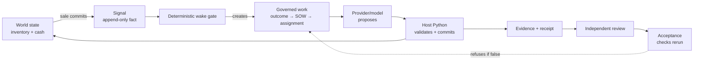
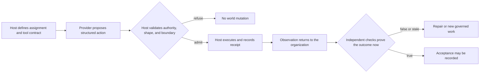

# Chapter 0 — Lucy's First Shift Through a Governed Agent

Meet Lucy. She runs a small ice cream shop, and over the course of this book she
is going to hand more and more of its dull, repetitive work to a governed AI
organization you will build from nothing. Before you build it, though, you should
see the finished shape *once* — the way you glance at a completed jigsaw on the
box before you tip the pieces out.

So this chapter is a guided tour. You will run a small, self-contained shop that
ships with the framework, watch it carry one piece of work from start to finish,
and — this is the part that matters — **check whether it told you the truth.**

> It is fine if this chapter feels like magic. Chapters 1 to 3 take the magic
> apart, one decision at a time. What matters here is that you see the whole
> shape once, and that you leave believing one specific thing: that the word
> `ACCEPTED` in this system is a *claim the code proved*, not a status string
> someone felt like printing.

## Learning objective

Run a Zero-Employee Organization through one complete piece of work, and learn
to tell the difference between **a fact about the process** ("the paperwork says
done") and **a fact about the world** ("the shelf is actually full"). By the end
you will have made the system say `ACCEPTED`, then broken the underlying data by
hand and watched an independent check *catch the lie*.

## The exercise

## A map of the system before you touch it

The demo is small, but it is not one undifferentiated "agent." It is four
different kinds of machinery arranged so that no probabilistic component gets
the last word:



**Figure:** A governed shift begins with a world fact and may reach acceptance only after host validation, durable evidence, independent review, and a fresh check.

Read the arrow labels as changes of epistemic status—changes in what the
organization is entitled to claim. A signal says *something happened*. A SOW
says *someone has specified work*. A receipt says *an execution ended*. Evidence
says *a named check observed a result*. Acceptance says *the declared outcome is
true now*. These are deliberately not synonyms. A common agent design collapses
all five into a single `status="done"` field and then has no vocabulary for
distinguishing an attempted action from a true outcome.

There are also two loops. The operational loop changes Lucy's shop; the proof
loop challenges the claim about that change. The worker participates in the
first loop but cannot close the second. That separation—not the model prompt—is
the safety architecture you will spend the book constructing.

Use this diagnostic throughout the course: point to any arrow and ask, **what
durable row authorizes this transition, what deterministic code enforces it,
and what false claim becomes possible if the arrow is skipped?** If you cannot
answer all three, you have found either a gap in your understanding or a gap in
the system.

The shop that ships with the framework is a tiny store. Run its full loop once,
with no API keys, no network, and no model — it uses a deterministic `scripted`
stand-in so the result is identical on every machine:

```bash
uv run sovereign-agent doctor
uv run sovereign-agent demo store --mode simulated --root /tmp/first-shift
```

`doctor` tells you which provider CLIs you happen to have installed; the demo
needs none of them. (In Chapter 3 you will swap a real local model in for the
stand-in — as a governed act, optional, with the stand-in always available as a
fallback — but not yet. One shape at a time.)

The course version of this lesson often begins with a five-step agent loop:
define a tool, let the model propose a call, execute it in code, return the
observation, and let the model choose again. That loop is useful, but it hides
the two boundaries that matter once the action has consequences. A proposal is
not authorization, and a successful process exit is not a true business
outcome. The system in this book therefore wraps the familiar loop in two
deterministic gates:



**Figure:** The provider proposes an action; the host alone admits and executes it, and a later verifier may still send the work back for repair.

This diagram also tells you where to debug. If the provider proposes the wrong
action, inspect the assignment and model boundary. If the proposal is right but
nothing changes, inspect host validation and execution. If execution succeeds
but acceptance refuses, inspect the world-state checks and their causal
bindings. Calling all three failures “the agent got it wrong” destroys the
information you need to repair the correct layer.

## What the organization just did

Read this as a story; every arrow is one governed step:

```text
a customer buys 2 units
  → inventory drops below the reorder point
  → the organization records a durable signal: "stock is low"
  → the Principal's outcome says: keep the tea jar stocked
  → a Master writes a statement of work and assigns it to an Operator actor
  → the Operator's provider PROPOSES a restock quantity
  → deterministic Python VALIDATES that proposal and commits the purchase
  → inventory, cash, and the event all commit together, or not at all
  → a Verifier runs the acceptance checks and records evidence
  → Sparring reviews the work — a different actor than the one who did it
  → the Principal accepts
```

Notice how many *different* roles touched that work, and that the one who *did*
it is not the one who *approved* it. That separation is not decoration; it is the
spine of the whole book, and Chapter 3 is devoted to why it must hold even when
the "worker" is a language model.

## Expected observations

You should see, at the end:

```text
out_...  ACCEPTED  Keep the tea jar stocked
  sow_...  ACCEPTED  Manually dispatched replenishment after signal sig_...
outcome ACCEPTED
```

Now do the thing most systems never let you do: **confirm the organization is
telling the truth.** The database is plain SQLite — open it and look:

```bash
sqlite3 /tmp/first-shift/.sovereign/organization.db \
  "SELECT on_hand, reorder_point FROM inventory;"
```

On-hand is **at or above** the reorder point — the shelf is genuinely stocked.

```bash
sqlite3 /tmp/first-shift/.sovereign/organization.db \
  "SELECT id, amount_cents FROM cash_entries;"
```

Three rows: an opening balance, a sale, and a purchase. Real money left the
organization to buy the stock, and the arithmetic reconciles.

```bash
sqlite3 /tmp/first-shift/.sovereign/organization.db \
  "SELECT kind FROM events ORDER BY seq;"
```

A `replenishment.committed` event sits between `assignment.finished` and
`sow.reviewed` — the durable trace of what happened, in order.

## The whole point: break it, and watch the lie get caught

Here is the exercise that earns this chapter its place. One command checks that
the accepted outcome is *actually true*:

**Listing:** Verify the store outcome against current state

```bash
uv run python scripts/verify_store_outcome.py /tmp/first-shift
```

It exits `0` only if reality matches the claim. Now sabotage reality by hand and
run it again:

```bash
sqlite3 /tmp/first-shift/.sovereign/organization.db \
  "UPDATE inventory SET on_hand = 0 WHERE on_hand > 0;"
uv run python scripts/verify_store_outcome.py /tmp/first-shift
```

It **fails**, with exit code `1`, and tells you why — this transcript is from a
real run of exactly the commands above:

```text
FAIL: check 'inventory_at_or_above_reorder_point' does not hold now: available=0 (on_hand=0 - reserved=0) vs reorder_point=3
FAIL: inventory 0 is below reorder point 3
FAIL: evidence for 'inventory_at_or_above_reorder_point' is stale relative to current state

3 problem(s): this outcome is NOT truthfully accepted.
```

The status field still reads
`ACCEPTED`, because that is a historical record of a decision that really was
made — but the verifier does not read the status field. It reads *the world*, and
the world no longer matches the claim.

That gap — between "we filed the forms" and "the work is actually done" — is the
entire subject of this book.

## Why this is not a toy

It is easy — the default, really — to build a system that prints `ACCEPTED`
while the shelf sits below its reorder point. Every governance record can exist —
outcome, statement of work, assignment, review, acceptance — and the shelf can
still be empty. The paperwork is perfect and the claim is false. That is the
normal outcome when "accepted" is a status someone sets rather than a fact
someone proved.

That is the failure this book is built to prevent. An organization that cannot
tell you the difference between "we did the work" and "we filed the forms" will
confidently tell you the forms *are* the work. A governed organization refuses to
conflate them, and it lets you check.

## Why nothing happened until you typed

Worth noticing before you move on: **you** started this. The sale, the signal,
the statement of work, the restock — none of it began until you ran a command.

This demo does not run an unattended scheduler or a heartbeat. Every step you
just watched was dispatched because the demo dispatched it synchronously. The
installed system does contain Pulse, a signal-to-work mechanism introduced in
Chapter 7, but this exercise does not invoke it. You can confirm this narrower
and testable claim the same way you checked the others—by reading the ledger:

```bash
sqlite3 /tmp/first-shift/.sovereign/organization.db \
  "SELECT DISTINCT kind FROM events ORDER BY kind;"
```

Every `kind` describes something a human or a governed actor did on purpose. The
capacity for an organization to wake *itself* and create work with nobody
prompting it is a real and separate mechanism you will meet much later in the
book; this first shift deliberately does not use it, and — importantly — nothing
in the ledger you just read pretends otherwise. Knowing what a system cannot yet
do is part of knowing what it does.

## Learner verification command

The single command that checks all of it at once:

```bash
uv run python scripts/verify_store_outcome.py /tmp/first-shift
```

Exit `0` means the accepted outcome is genuinely true; exit `1` means it is not,
and the message says which check failed. (If you ran the sabotage step above,
re-run the demo into a fresh `--root` to get a clean `0` again.)

## Summary

This first shift builds nothing yet. It runs the finished mechanism once, end to
end, so every later chapter has a shape to recognize pieces of. The
mechanism you watched was one sale traveling through five distinct proof
roles (signal, SOW, receipt, evidence, acceptance) rather than collapsing
into a single `status="done"` field.

The governing rule is that `ACCEPTED` is checked against the
world at the moment you ask, not trusted from history: `verify_store_outcome.py`
re-reads the database rather than the status string.

The failure made visible here is ordinary: paperwork says done while
the shelf is empty — and you produced that exact failure by hand, by
editing `on_hand` directly under an already-`ACCEPTED` outcome, and watched
the checker refuse it with the precise row that no longer holds.

For Lucy, if a supplier's invoice says delivered and the freezer
is still empty, the invoice is not evidence, and neither is this book's
`ACCEPTED` unless something re-checked the freezer after the invoice was
filed.

## Explain it back

Answer these in your own words before moving on. If you cannot, re-read the
observations — every answer is visible in the database.

1. The demo printed `ACCEPTED`. What would you check, and in what order, to
   decide for yourself whether that word is earned?
2. The provider asked for a certain restock quantity. Where did the *price* of
   those units come from — the provider, or somewhere else? Why does that
   distinction matter?
3. A Sparring actor reviewed the work and the Principal accepted it. Why not let
   the Operator who *did* the work do either of those?
4. Which of these is a fact about the world, and which about the process:
   "on-hand is 8" versus "the statement of work is in state ACCEPTED"?
5. Nothing happened until you typed a command. What would have to exist for the
   organization to start this work on its own, and why is it honest that today's
   ledger contains no sign of it?

## The road from here — what you will actually build

Every chapter after this one follows the same honest rhythm: you **build** the
mechanism yourself in small runnable pieces, you **break** a naive version of it
and watch the failure with your own eyes, and you **repair** it into the shape
production uses — then the chapter names, precisely, what it has *not* proven.
Every code block in this book executes, and every printed output you will read
was produced by that code, byte for byte. The tour you just took visits each of
these once:

| Chapter | You build | You break |
| --- | --- | --- |
| 1 — The organization remembers | The ledger: schema, append-only triggers, migrations that commit whole | A migration that half-applies and leaves wreckage a `with db:` block cannot roll back |
| 2 — Work needs governance | Acceptance as composed, checked obligations | The status-flip: a system that "accepts" work by setting a field to `ACCEPTED` |
| 3 — An actor is not a model | Actors whose authority comes from role, not provider; a governed model swap | A sharp new model trying to approve its own work — and being refused |
| 4 — Work stays inside its boundary | The workspace boundary | Path escapes that try to write outside it |
| 5 — Authority needs a fence | Fencing tokens, compare-and-swap, leases | The stale actor that still *thinks* it holds authority |
| 6 — The organization recovers | Supervised recovery from lost workers | A "kind" recoverer that quietly lies about what it restored |
| 7 — The organization wakes itself | Pulse: one signal-to-work decision pass, distinct from scheduling and heartbeat | A tick that orders twice for one signal |
| 8 — The store becomes a catalog | A migration on *populated* data, and validated seeding | A mid-migration fault — and the old data untouched afterward |
| 9 — Each product has its own threshold | A sale as five writes in one transaction | The oversell: on-hand driven below zero by a stale read |
| 10 — One signal wakes one need | Causal binding: *this* run caused *that* effect | A checker satisfied that "run-t did something" when run-t did nothing |
| 11 — Replenishment scales | Idempotent restock claims | The double-order, reproduced to the digit |
| 12 — The pilot begins with a receipt | The pilot-start contract and the release proof pack | A forged pack the verifier *correctly* calls internally consistent |

That last row is the destination, so hear it now, once: chapter by chapter you
will make the organization better at proving things — and the book ends by
showing you the proof that *cannot* be strengthened from the inside. A proof
pack whose every byte agrees with itself can still be a fabrication; internal
consistency is not authenticity. The verifier you ran today already lives on the
right side of that line — it reads the world, not the paperwork — and the whole
book is the discipline of keeping every claim on that side, and saying so
plainly whenever one is not.

## Where to look next

- `governance/outcomes/*/outcome.json` — the outcome, projected for reading
- `.sovereign/organization.db` — the authority for everything operational
- `.sovereign/runs/*/.sovereign-out/report.json` — what the provider proposed
- `.sovereign/runs/*/receipt.json` — what the organization recorded about the run

`solution.py` imports the production demo rather than copying it, so the shape
you toured here is the same code the rest of the book builds toward.

Next: [Chapter 1 — The organization remembers](../ch01_organization_remembers/README.md)
