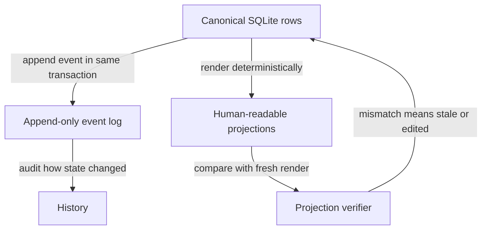
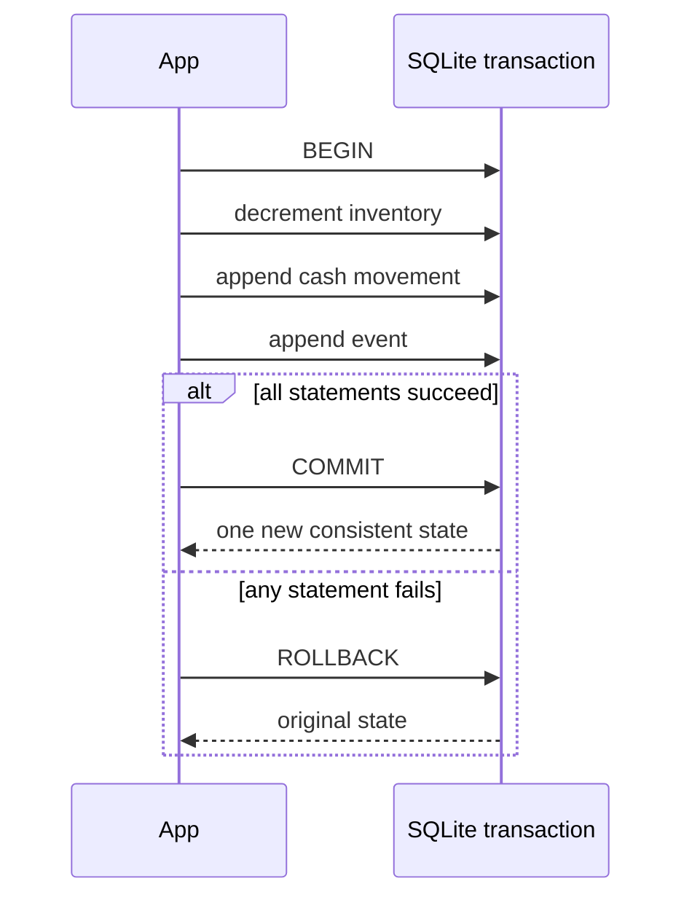
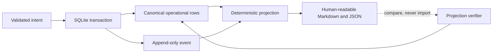
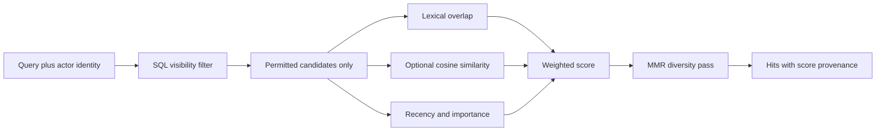

# Chapter 1 — The organization remembers

Lucy's shop lost an order once. Not a big one — a single case of cones — but the
supplier's system had recorded the sale, charged her, and then, somewhere between
a crashed browser tab and a reload, forgotten it existed. The money was gone and
the cones never came, and there was no record to point at. "We ordered them" was
a hope, not a fact.

A Zero-Employee Organization cannot afford that. If it is going to act on Lucy's
behalf — move money, commit to suppliers, promise a full freezer — then its
memory has to be the kind you can hold it to. So before we teach the organization
to *decide* anything, we have to answer a plainer question: **where does the
truth live, and what survives when the power goes out mid-sentence?**

This chapter is hands-on the whole way through. You will open the organization's
memory, try to corrupt it three different ways, watch a half-finished purchase
roll itself back, build a migration runner and watch the naive version poison a
database forever, catch a status file lying about the freezer, meet a verifier
that destroys the evidence it was supposed to find, and tear a file in half to
learn what an atomic write actually promises. By the end you can name — for any
piece of data in this system — which file or table is the authority for it.

## Learning objective

Understand where a Zero-Employee Organization keeps its memory, why some of that
memory is allowed to change and some is not, what a transaction actually buys
you, and how retrieval filters authority before it ranks relevance.

By the end you should be able to say, for any piece of data in this system,
**which file or table is the authority for it** — and defend the answer.

## Why memory is the first hard problem

## Three kinds of memory, three different guarantees

"Persist it" is not a design. The implementation uses three forms of memory,
and each answers a different question:



**Figure:** Canonical rows, append-only history, and human-readable projections serve different guarantees; only the canonical database may feed a regenerated projection.

| Memory | Question it answers | Principal guarantee | Deliberate limit |
| --- | --- | --- | --- |
| Canonical rows | What is true now? | Related writes commit or roll back together. | Most operational rows are mutable. |
| Append-only events | How did the organization say it changed? | SQLite triggers refuse update and delete. | The log does not prove an external-world claim by itself. |
| Projections | What can a human inspect conveniently? | They are reproducible from canonical rows. | A file can become stale; it is evidence only after comparison. |

This is a miniature CQRS-style separation without requiring a framework: the
write model is the database; the readable view is derived. The useful idea is
not the acronym. It is that a convenient representation must not quietly become
a second authority. If both a Markdown status file and a database row can win a
disagreement, the system has two truths and therefore none.

The transaction boundary is equally important. Atomicity does not mean "every
step succeeded." It means observers see either the state before a transaction or
the state after it—never a committed subset:



**Figure:** Inventory, cash, and event history become one fact only when the transaction commits all three statements or rolls all three back.

Durability is a separate axis: after SQLite acknowledges the commit, its journal
mode and filesystem decide what survives a crash. Atomicity answers "all or
none"; durability answers "does the chosen one survive?" Keeping those words
separate prevents a large class of confident but incorrect database claims.

The ownership rule can be drawn as a one-writer path. Every convenient view is
downstream of the ledger, and no view is allowed to write back merely because a
human edited it:



**Figure:** Human-readable memory is a deterministic view of canonical rows and events, and verification compares that view with a fresh render rather than importing it.

This is the same principle that makes filesystem handoffs safe only when their
authority is explicit. A file can be an excellent transport and a terrible
source of truth. `governance/outcomes/.../STATUS.md` is optimized for a person;
the SQLite row is optimized for atomic change. The projection verifier compares
the two, but it does not “heal” the database from the file. Doing so would turn
an accidental edit into an authorized state transition.

An organization that forgets cannot be held to anything. If an order can vanish
because a process died halfway through — exactly what happened to Lucy's cones —
then "we ordered it" is a hope, not a fact.

So the first question is not "how does the AI decide" — it is "where does the
truth live, and what happens when the power goes out mid-sentence".

## Build it yourself: memory that cannot half-happen

Before you inspect the production database, build the core of it from scratch, so
that when you see the real thing you recognize every piece. Everything below runs
in a throwaway in-memory SQLite database — paste it into a Python shell.

Start with the smallest schema that can hold a shop's operational truth: what is
on the shelf, every movement of money, and a log of what happened.

```python
import sqlite3

db = sqlite3.connect(":memory:")
db.executescript("""
    CREATE TABLE inventory (
        sku TEXT PRIMARY KEY,
        on_hand INTEGER NOT NULL,
        reorder_point INTEGER NOT NULL
    );
    CREATE TABLE cash_entries (id INTEGER PRIMARY KEY, amount_cents INTEGER NOT NULL);
    CREATE TABLE events (seq INTEGER PRIMARY KEY, kind TEXT NOT NULL);
""")
db.execute("INSERT INTO inventory VALUES ('SKU-VANILLA', 4, 3)")
db.execute("INSERT INTO cash_entries(amount_cents) VALUES (10000)")  # opening balance
db.commit()
```

Notice the shape of `cash_entries`: it is a **ledger of signed movements**, not a
single balance field. The balance is `SUM(amount_cents)`. Be precise about what
that shape buys and what it does not. It is an *application accounting
discipline*: because no code path ever needs to read-modify-write a balance,
the classic lost-update bug — two writers both computing `balance + delta`
from the same stale read — has nothing to attack, and an erroneous movement
is corrected by adding a compensating row you can see, not by editing
history. What it is **not** is a database-enforced guarantee: unlike
`events` (whose triggers you will meet in a moment), nothing at the SQLite
layer stops a raw `UPDATE` or `DELETE` on `cash_entries` — a bug or a 2am
shell that mutates a cash row directly will succeed. The discipline removes
the *tempting* mistake; it does not make the table immutable.

Now the append-only guarantee for the event log, enforced by the *database*, not
by Python remembering to be careful:

```python
db.executescript("""
    CREATE TRIGGER events_no_update BEFORE UPDATE ON events
    BEGIN SELECT RAISE(ABORT, 'events are append-only: update refused'); END;
    CREATE TRIGGER events_no_delete BEFORE DELETE ON events
    BEGIN SELECT RAISE(ABORT, 'events are append-only: delete refused'); END;
""")
db.execute("INSERT INTO events(kind) VALUES ('sale.committed')")
db.commit()

try:
    db.execute("UPDATE events SET kind = 'NOTHING_HAPPENED'")
except sqlite3.IntegrityError as error:
    print("refused:", error)
```

```text
refused: events are append-only: update refused
```

A rule in application code protects you from your own bugs. A rule in the database
protects you from *everything that can reach the database* — including you, at 2am,
with a shell open. That is why the guard lives here.

### The three-write transaction, and what a rollback buys you

A restock has to change three things together: inventory goes up, cash goes down,
and an event records it. If only some of those land, the organization is lying to
itself — a full shelf with no money spent, or money spent with no stock. The tool
that makes "all or nothing" real is a transaction.

**Listing:** Commit inventory, cash, and event history as one transaction

```python
def restock(db, sku, units, unit_cost):
    with db:  # commits at the end, or rolls the whole block back on any exception
        db.execute("UPDATE inventory SET on_hand = on_hand + ? WHERE sku = ?", (units, sku))
        db.execute("INSERT INTO cash_entries(amount_cents) VALUES (?)", (-units * unit_cost,))
        db.execute("INSERT INTO events(kind) VALUES ('replenishment.committed')")


def state(db):
    on_hand = db.execute("SELECT on_hand FROM inventory WHERE sku = 'SKU-VANILLA'").fetchone()[0]
    balance = db.execute("SELECT SUM(amount_cents) FROM cash_entries").fetchone()[0]
    return f"on_hand={on_hand} balance={balance}"


print("before:", state(db))
restock(db, "SKU-VANILLA", 6, 250)
print("after: ", state(db))
```

```text
before: on_hand=4 balance=10000
after:  on_hand=10 balance=8500
```

Now break it. Inject a failure *after* inventory and cash have already been
written but *before* the event — the exact "power cut mid-sentence" case — and
watch all three writes disappear together:

```python
def restock_but_crash(db, sku, units, unit_cost):
    with db:
        db.execute("UPDATE inventory SET on_hand = on_hand + ? WHERE sku = ?", (units, sku))
        db.execute("INSERT INTO cash_entries(amount_cents) VALUES (?)", (-units * unit_cost,))
        raise RuntimeError("power cut before the event was written")


print("before:", state(db))
try:
    restock_but_crash(db, "SKU-VANILLA", 6, 250)
except RuntimeError as error:
    print("failed:", error)
print("after: ", state(db))
```

```text
before: on_hand=10 balance=8500
failed: power cut before the event was written
after:  on_hand=10 balance=8500
```

`before` and `after` are identical. The inventory write had already happened, and
the rollback took it back. Either all three changes commit or none do — there is
no in-between state for the shop to be caught in.

### One honest limit: SQLite durability, not magic

The transaction guarantees *atomicity* — all-or-nothing — and, on commit,
*durability* to the extent SQLite provides it (WAL mode, an `fsync` at commit). Be
precise about what that does and does not promise: it protects the **database**.
It cannot make a write to the database and a write to a separate file happen in
one transaction — those are two systems, and a crash between them can leave them
disagreeing. The production organization keeps its canonical truth in SQLite for
exactly this reason, and treats files it writes outside the database as
projections that can always be regenerated. You will build that boundary — and
watch it fail honestly — later in this chapter.

## Growing the schema without losing the shop

The schema you just built is version one of a shop that intends to run for
years. The freezer will gain products, the organization will gain signals, and
every one of those changes arrives *after* real money and real history are
already in the tables. You cannot recreate the database — recreating it would
be exactly the forgetting this chapter exists to prevent. The mechanism that
grows a schema underneath live data is a **migration**: a numbered, one-way
step from schema N to schema N+1.

Build the runner first. It keeps a ledger of which steps have already run —
memory about the shape of memory — and applies only the missing ones:

```python
db = sqlite3.connect(":memory:")  # a brand-new shop, from nothing

MIGRATIONS = [
    (
        1,
        [
            "CREATE TABLE inventory (sku TEXT PRIMARY KEY,"
            " on_hand INTEGER NOT NULL, reorder_point INTEGER NOT NULL)",
            "CREATE TABLE cash_entries (id INTEGER PRIMARY KEY, amount_cents INTEGER NOT NULL)",
            "CREATE TABLE events (seq INTEGER PRIMARY KEY, kind TEXT NOT NULL)",
        ],
    ),
]


def migrate(db, migrations):
    db.execute("CREATE TABLE IF NOT EXISTS schema_migrations (version INTEGER PRIMARY KEY)")
    applied = {row[0] for row in db.execute("SELECT version FROM schema_migrations")}
    for version, statements in migrations:
        if version in applied:
            continue
        with db:  # ONE transaction per migration: the DDL and the stamp, together
            for statement in statements:
                db.execute(statement)
            db.execute("INSERT INTO schema_migrations(version) VALUES (?)", (version,))


migrate(db, MIGRATIONS)
print("applied:", [row[0] for row in db.execute("SELECT version FROM schema_migrations")])
```

```text
applied: [1]
```

The version stamp goes inside the *same* transaction as the schema change, on
purpose. If it were a separate write, a crash between the two would leave a
database whose shape says "migrated" while its stamp says "not yet" — and the
runner would re-apply a migration that already ran, or skip one that never
finished. Same lesson as the restock: things that must be true together must
commit together.

Now the shop runs for a while — rows land — and *then* the business changes.
Migration 2 arrives with the database already populated: a new `signals` table,
and a price column the original schema never imagined. The new column needs a
`DEFAULT` so existing rows stay valid, and a backfill to give them real values:

```python
db.execute("INSERT INTO inventory VALUES ('SKU-VANILLA', 4, 3)")
db.execute("INSERT INTO cash_entries(amount_cents) VALUES (10000)")
db.commit()

MIGRATIONS.append(
    (
        2,
        [
            "CREATE TABLE signals (id INTEGER PRIMARY KEY, kind TEXT NOT NULL, sku TEXT)",
            "ALTER TABLE inventory ADD COLUMN unit_price_cents INTEGER NOT NULL DEFAULT 0",
            "UPDATE inventory SET unit_price_cents = 400",
        ],
    )
)
migrate(db, MIGRATIONS)
print("applied:", [row[0] for row in db.execute("SELECT version FROM schema_migrations")])
print("vanilla:", db.execute("SELECT sku, on_hand, unit_price_cents FROM inventory").fetchone())
```

```text
applied: [1, 2]
vanilla: ('SKU-VANILLA', 4, 400)
```

Migration 1 was skipped — already stamped — and the vanilla row survived the
upgrade with a real price. This is the everyday case: schema change as a guest
in a house where data already lives.

### Break it: the migration that half-happens

Migration 3 has a typo in its second statement. The runner wraps everything in
`with db:`, so the failure should roll the whole step back — right?

```python
MIGRATIONS.append(
    (
        3,
        [
            "CREATE TABLE reservations (id INTEGER PRIMARY KEY, sku TEXT NOT NULL)",
            "CREATE TABEL oops (id INTEGER)",  # typo: TABEL
        ],
    )
)
try:
    migrate(db, MIGRATIONS)
except sqlite3.OperationalError as error:
    print("migration 3 failed:", error)

leftovers = db.execute(
    "SELECT name FROM sqlite_master WHERE type = 'table' AND name IN ('reservations', 'oops')"
).fetchall()
print("applied:", [row[0] for row in db.execute("SELECT version FROM schema_migrations")])
print("left behind:", leftovers)
```

```text
migration 3 failed: near "TABEL": syntax error
applied: [1, 2]
left behind: [('reservations',)]
```

Wrong. The version was not stamped — good — but `reservations` **exists**. Half
the migration escaped the transaction. The reason is subtle and worth knowing
precisely: Python's `sqlite3` module, in its default mode, only begins its
implicit transaction before *data* statements (`INSERT`, `UPDATE`, `DELETE`).
A `CREATE TABLE` runs in autocommit — it commits itself, instantly, outside
any transaction `with db:` is managing. The context manager rolled back an
empty transaction and reported nothing, because as far as it knew, nothing had
happened. The guard looked right and guarded nothing — enforcement did not
match the claim.

And this database is now poisoned. Fix the typo and run the runner again:

```python
MIGRATIONS[-1] = (
    3,
    ["CREATE TABLE reservations (id INTEGER PRIMARY KEY, sku TEXT NOT NULL)"],
)
try:
    migrate(db, MIGRATIONS)
except sqlite3.OperationalError as error:
    print("still broken:", error)
```

```text
still broken: table reservations already exists
```

Version 3 is unstamped, so the runner re-runs it; the table it half-created
last time is in the way; the migration fails forever. No amount of retrying
recovers this database. The production code paid for this exact lesson — the
docstring of `Database.migrate` in `sovereign_agent/database.py` records that
an early version used `executescript()`, which *commits any open transaction
before it runs*, and left exactly this kind of orphaned table behind a failed
migration: "reopening re-ran it and failed forever."

### Repair: an explicit transaction the DDL cannot escape

The fix is to stop trusting the implicit machinery and say what we mean:

```python
db = sqlite3.connect(":memory:", autocommit=True)  # start the shop over, safely

MIGRATIONS[-1] = (
    3,
    [
        "CREATE TABLE reservations (id INTEGER PRIMARY KEY, sku TEXT NOT NULL)",
        "CREATE TABEL oops (id INTEGER)",  # the same typo, one more time
    ],
)


def migrate_safely(db, migrations):
    db.execute("CREATE TABLE IF NOT EXISTS schema_migrations (version INTEGER PRIMARY KEY)")
    applied = {row[0] for row in db.execute("SELECT version FROM schema_migrations")}
    for version, statements in migrations:
        if version in applied:
            continue
        db.execute("BEGIN IMMEDIATE")  # explicit: now the DDL joins the transaction
        try:
            for statement in statements:
                db.execute(statement)
            db.execute("INSERT INTO schema_migrations(version) VALUES (?)", (version,))
            db.execute("COMMIT")
        except BaseException:
            db.execute("ROLLBACK")
            raise


try:
    migrate_safely(db, MIGRATIONS)
except sqlite3.OperationalError as error:
    print("migration 3 failed:", error)

leftovers = db.execute(
    "SELECT name FROM sqlite_master WHERE type = 'table' AND name IN ('reservations', 'oops')"
).fetchall()
print("applied:", [row[0] for row in db.execute("SELECT version FROM schema_migrations")])
print("left behind:", leftovers)
```

```text
migration 3 failed: near "TABEL": syntax error
applied: [1, 2]
left behind: []
```

Same typo, same failure — but this time the failure is *clean*: no stamp, no
orphaned table. SQLite rolls DDL back like any other statement, as long as the
DDL is actually inside a transaction. And because failure left nothing behind,
recovery is now just: fix the typo, run again.

```python
MIGRATIONS[-1] = (
    3,
    ["CREATE TABLE reservations (id INTEGER PRIMARY KEY, sku TEXT NOT NULL)"],
)
migrate_safely(db, MIGRATIONS)
print("applied:", [row[0] for row in db.execute("SELECT version FROM schema_migrations")])

db.execute("INSERT INTO inventory VALUES ('SKU-VANILLA', 4, 3, 400)")
db.execute("INSERT INTO cash_entries(amount_cents) VALUES (10000)")
print("vanilla:", db.execute("SELECT sku, on_hand, reorder_point FROM inventory").fetchone())
```

```text
applied: [1, 2, 3]
vanilla: ('SKU-VANILLA', 4, 3)
```

The production organization runs this same design at full scale:
`database.py` carries **sixteen** numbered migrations, applied inside an
explicit `BEGIN IMMEDIATE` exactly as above, with one extra trick —
`sqlite3.complete_statement` — to split scripts that contain trigger bodies
(whose internal semicolons a naive `split(";")` would cut in half). Two rules
travel with the design, both of which you have now seen the reason for:

- **Forward-only.** There is no down-migration. A landed migration is never
  edited — a change of mind is a *new* migration. This is the append-only
  events rule, one level up: history you can rewrite is history you cannot
  trust, and a migration list is the history of the schema.
- **The stamp commits with the step.** Migration state and schema state can
  never disagree, because they are one transaction.

`tests/test_persistence.py` — the same file your learner-verification command
runs — proves both: migrations apply in order, and a populated v1 database
upgrades without losing its rows.

## Projections: files the ledger can regenerate

Lucy does not read SQL. The organization writes her a status file — Markdown,
generated from the database, for human eyes. Build it as two deliberately
separate functions: a **pure** renderer that turns ledger state into bytes and
writes nothing, and a writer that puts those bytes on disk:

```python
import pathlib
import tempfile

shop_root = pathlib.Path(tempfile.mkdtemp())


def render_status(db):  # PURE: reads the ledger, returns bytes, writes nothing
    lines = ["# Shop status"]
    for sku, on_hand, reorder_point in db.execute(
        "SELECT sku, on_hand, reorder_point FROM inventory ORDER BY sku"
    ):
        level = "OK" if on_hand >= reorder_point else "LOW"
        lines.append(f"- {sku}: {on_hand} on hand (reorder at {reorder_point}) {level}")
    return ("\n".join(lines) + "\n").encode()


def write_status(db, root):
    (root / "STATUS.md").write_bytes(render_status(db))


write_status(db, shop_root)
print((shop_root / "STATUS.md").read_text(), end="")
```

```text
# Shop status
- SKU-VANILLA: 4 on hand (reorder at 3) OK
```

Here is the structural problem, and it is not fixable: the database commit and
the file write are **two systems**. No transaction spans them. The organization
therefore writes projections *after* the ledger commits — so a crash between
the two leaves a stale file and a correct ledger, never the reverse. Stale is
survivable precisely because the file is a projection: every byte of it can be
regenerated from the database. But "survivable" only counts if someone
*notices* the staleness. Nothing reads `STATUS.md` back. Nothing will ever
notice on its own.

### Break it: the file lies

So build the thing that notices. A verifier compares the file on disk against
what the pure renderer says it should be — and while we are at it, hand-edit
the file the way a well-meaning 2am human might:

```python
def verify_status(db, root):
    path = root / "STATUS.md"
    if not path.is_file():
        return "DRIFT: STATUS.md is missing"
    if path.read_bytes() != render_status(db):
        return "DRIFT: STATUS.md does not match the ledger"
    return "OK"


(shop_root / "STATUS.md").write_text("# Shop status\n- SKU-VANILLA: plenty!\n")
print(verify_status(db, shop_root))
```

```text
DRIFT: STATUS.md does not match the ledger
```

Caught. The freezer is not "plenty!"; the freezer is whatever the ledger says
it is, and the file is now provably lying about it.

### The verifier that repairs the evidence

Now meet the most dangerous function in this chapter. It looks like a
diligence improvement — "make sure the file is fresh before checking it":

```python
def verify_status_helpfully(db, root):
    write_status(db, root)  # "refresh first, then check" -- the bug
    return verify_status(db, root)


print(verify_status_helpfully(db, shop_root))
print(verify_status(db, shop_root))  # the tampering is gone -- and so is the evidence
```

```text
OK
OK
```

Green, and green again. The hand-edit you made a moment ago has been silently
overwritten; the verifier "found" a world in which nothing was ever wrong,
because it *wrote* that world first. A verifier that edits reality until it
agrees with itself is worse than no verifier — no verifier leaves you
suspicious, this one manufactures confidence. And note the second cost: even
the *pure* check now passes, because the evidence of drift was destroyed by
the checker itself.

This is not a hypothetical. The production drift-checker,
`scripts/verify_projections.py`, opens with exactly this confession: an
earlier version called the projection writer to learn what the files should
contain, silently repaired hand-edited files, and then reported "projections
match the ledger." The current version is built on the rule you should take
from this section: **verification is pure; repair is a separate, explicit
act.** In production, `check()` never writes, and repair hides behind an
explicit `--reconcile` flag.

```python
def reconcile_status(db, root):
    write_status(db, root)  # the same write as the bug above -- but invoked ON PURPOSE
    return "reconciled toward the ledger"


(shop_root / "STATUS.md").unlink()  # the missing-projection case
print(verify_status(db, shop_root))
print(reconcile_status(db, shop_root))
print(verify_status(db, shop_root))
```

```text
DRIFT: STATUS.md is missing
reconciled toward the ledger
OK
```

Same write, different verb. `verify_status_helpfully` and `reconcile_status`
execute identical code; the entire difference is *who decided* the write should
happen. Drift always resolves **toward the database** — the ledger is the
authority, so the file changes to match it, never the other way around. One
drift case remains that this toy verifier cannot see: a *stale extra* file — a
projection for something the ledger no longer contains, left lingering on
disk. The production checker walks the projection directory and flags exactly
that; question 7 below asks you why the toy misses it.

## Writing a file without tearing it

One hazard left. Even an honest, ledger-derived projection write can be
interrupted *mid-write* — and a half-written file is worse than a stale one,
because nothing about it says "half":

```python
def write_status_torn(db, root, crash_after_bytes):
    data = render_status(db)[:crash_after_bytes]  # the power died mid-write
    (root / "STATUS.md").write_bytes(data)


write_status_torn(db, shop_root, crash_after_bytes=20)
print((shop_root / "STATUS.md").read_text())
```

```text
# Shop status
- SKU-
```

`- SKU-` is not a status; it is debris that parses as one. The repair is the
oldest trick in durable systems — never write where readers read. Write the
whole file *next to* the real one, force it to disk, then swap names in a
single atomic step:

```python
import os


def write_status_atomically(db, root, crash_before_replace=False):
    path = root / "STATUS.md"
    tmp = path.with_name(f".{path.name}.tmp")
    data = render_status(db)
    with tmp.open("wb") as handle:
        handle.write(data[:20] if crash_before_replace else data)
        handle.flush()
        os.fsync(handle.fileno())  # the bytes are on disk, not in a cache
    if crash_before_replace:
        return  # power died before os.replace: STATUS.md was never touched
    os.replace(tmp, path)  # atomic swap: readers see the old file or the new one


write_status(db, shop_root)  # start from a good file
write_status_atomically(db, shop_root, crash_before_replace=True)
print((shop_root / "STATUS.md").read_text(), end="")
```

```text
# Shop status
- SKU-VANILLA: 4 on hand (reorder at 3) OK
```

The crash landed at the worst moment — after the (truncated) temp file was
written, before the swap — and the real file is untouched. Whatever instant
the power dies, a reader sees the complete old file or the complete new file,
never a torn one. The production mechanism strengthens the example for
concurrent callers: every governance file goes through `atomic_write` in
`sovereign_agent/files.py` — a **unique** sibling temp file, flush, `fsync`,
then `os.replace`. Unique names prevent two writers from truncating each
other's staging file; replacement still decides which complete value wins.

**What this does not guarantee.** Be precise about the promise. `os.replace`
swaps the *directory entry* atomically, but this helper does not `fsync` the
parent directory — and until the directory entry itself reaches disk, a power
loss can quietly undo the rename. So the honest contract is: **old-or-new,
never torn — but not guaranteed-new** after a crash. The production code
accepts that bound deliberately, and the reason is the division of labor this
chapter built: the file is a projection. If a crash costs the rename, the
verifier reports drift and the reconciler regenerates the file from the
ledger. Durability lives in SQLite; the filesystem only ever holds copies.

## From durable history to useful memory

Lucy now has an honest ledger, but a ledger answers a different question from
memory retrieval. The ledger answers, “What happened?” Retrieval answers,
“Which permitted facts are useful for this decision?” Copying the newest rows
into a prompt is not a neutral shortcut. It is an access policy, relevance
policy, and context-budget policy disguised as a query.

The production implementation keeps those decisions visible in
`sovereign_agent.memory`. A memory row contains content, an optional embedding,
a visibility label, an explicit importance value, and its creation time. The
retriever performs the operations in a security-sensitive order:



**Figure:** Retrieval first enforces SQL visibility, then combines lexical, semantic, recency, and importance scores before a diversity pass returns traceable hits.

The first arrow is the important one. Suppose Bob's private supplier note is a
perfect semantic match for Alice's query. If code ranks every row and removes
Bob's note only before display, its content has already influenced selection,
logs, timing, or a model call. Filtering in SQL means an unauthorized row never
becomes a candidate at all.

### Build the score before hiding it behind a library

The reference uses a deliberately small formula:

```python
def chapter_memory_score(
    lexical: float, semantic: float, recency: float, importance: float
) -> float:
    return 0.35 * lexical + 0.35 * semantic + 0.15 * recency + 0.15 * importance


print(round(chapter_memory_score(0.5, 1.0, 1.0, 0.5), 3))
```

```text
0.75
```

Every component stays on the returned `MemoryHit`. A learner can therefore
explain why a row won and predict the effect of changing a weight. When an
embedding is absent, semantic similarity is zero and
`semantic_status="unavailable"`; lexical retrieval is not relabeled as
semantic search. When lexical and semantic relevance are both zero, recency
and importance cannot rescue the row. A fresh, important chocolate note should
not answer a vanilla-inventory question.

The final pass uses maximal marginal relevance (MMR). Raw relevance tends to
return near-duplicates, wasting the scarce prompt window. MMR repeatedly picks
the candidate with the best tradeoff between relevance and similarity to
already selected hits:

| Candidate | Raw relevance | Similar to selected hit | MMR consequence |
| --- | ---: | ---: | --- |
| current vanilla count | high | low | selected first |
| duplicate vanilla count | high | high | penalized |
| vanilla supplier lead time | medium | low | may beat the duplicate |

This is not a vector database benchmark. For a large corpus, SQLite FTS5 and a
specialized embedding index may become appropriate. The durable lesson stays
the same: restrict access before ranking, expose score provenance, and make
semantic unavailability visible.

### Break it: let importance bypass relevance

Run the chapter extension against an empty ledger:

```bash
uv run python book/ch01_organization_remembers/advanced_exercise.py \
  --root /tmp/sa-ch01-memory
```

The result must list `public` and `alice-only`, report that Bob's row never
reached the visible results, reject the unrelated high-importance row, and show
the score components for every hit. Then remove the zero-relevance guard in
`memory.py`. The unrelated row becomes eligible because its recency and
importance contribute positive weight. Restore the guard and run this
independent proof:

```bash
uv run pytest -q \
  tests/test_advanced_mechanisms.py::test_memory_does_not_return_an_unrelated_high_importance_row \
  tests/test_advanced_mechanisms.py::test_memory_filters_access_before_ranking_and_exposes_score_components
```

Expected result: two tests pass. The exercise is successful only if you can
also point to the SQL `WHERE` clause that prevents Bob's private row from being
ranked. A clean display alone is an insufficient observation.

## Exercise 1: look at the operational state

```bash
uv run sovereign-agent demo store --mode simulated --root /tmp/lucy-memory
sqlite3 /tmp/lucy-memory/.sovereign/organization.db ".tables"
```

Expected: twenty-seven tables listed (count them —
`SELECT COUNT(*) FROM sqlite_master WHERE type='table' AND name NOT LIKE
'sqlite_%'` returns 27; the schema has grown well past this chapter's toy,
which is exactly what the migrations section explains). The ones to care
about now:

| Table | Holds |
| --- | --- |
| `inventory` | how much stock exists, and the reorder point |
| `cash_entries` | every movement of money, as signed amounts |
| `events` | an append-only history of what happened |
| `signals` | durable "something needs attention" facts |
| `schema_migrations` | which schema versions have been applied |

```bash
sqlite3 -header -column /tmp/lucy-memory/.sovereign/organization.db \
  "SELECT * FROM inventory; SELECT id, amount_cents FROM cash_entries;"
```

Cash is a **ledger of movements**, not a single balance field. The balance is
`SUM(amount_cents)`: `10000` opening, `+800` from the sale, `-720` for the
purchase. No supported code path overwrites a movement — corrections are new
compensating rows — but remember the honest scope from earlier: this is the
application's discipline, not a trigger-enforced guarantee like the one you
are about to meet on `events`. Try `UPDATE cash_entries SET amount_cents = 0`
from this same `sqlite3` shell if you want the difference to sting.

## Exercise 2: prove the events are append-only

The event log is the organization's memory of what it did. Try to rewrite it.

```bash
sqlite3 /tmp/lucy-memory/.sovereign/organization.db \
  "UPDATE events SET kind='NOTHING_HAPPENED' WHERE kind='sale.committed';"
```

Expected:

```text
Error: stepping, events are append-only: update refused (19)
```

Now try deleting:

```bash
sqlite3 /tmp/lucy-memory/.sovereign/organization.db \
  "DELETE FROM events WHERE kind='replenishment.committed';"
```

Also refused. Now try the sneaky third variant — overwriting a row instead of
editing it:

```bash
sqlite3 /tmp/lucy-memory/.sovereign/organization.db \
  "INSERT OR REPLACE INTO events(id,kind,payload,created_at)
   SELECT id,'NOTHING_HAPPENED',payload,created_at FROM events LIMIT 1;"
```

Also refused: `events are append-only: replace refused`.

All three are enforced by **database triggers**, not by Python being careful.
That distinction matters: a rule enforced in application code protects you from
bugs, but a rule enforced in the database protects you from *everything else
that can reach the database* — including you, at 2am, with a REPL open.

That third case is worth dwelling on, because it is where a subtle mistake
hides. A tempting way to block the overwrite is a SQLite setting like
`recursive_triggers`, switched on when the application opens the database. It
works — *from the application*. But from the `sqlite3` command line above, the
one this chapter just told you to use, the overwrite would succeed silently and
the row count would not change. A guarantee that lives in only one client is not
a guarantee; it is a coincidence waiting to be discovered at 2am.

The guard you just triggered instead is a `BEFORE INSERT` trigger that refuses an
id which already exists. It needs no setting, so it holds from *any* client.
Enforcement matches the claim — which is the entire subject of Chapter 2.

## Exercise 3: watch a transaction roll back

A restock has to change three things: inventory goes up, cash goes down, and an
event records it. If only some of those happen, the organization is lying to
itself.

```bash
python - <<'PY'
import tempfile, pathlib
from unittest.mock import patch
import reference_organizations.store as store
from reference_organizations.store import RestockProposal, apply_restock, record_sale, seed
from sovereign_agent.models import Role
from sovereign_agent.organization import Organization

org = Organization.init(pathlib.Path(tempfile.mkdtemp()))
seed(org.db)

# An effect needs a real completed assignment behind it. Chapter 2 explains why.
outcome = org.create_outcome(
    "Keep the shelf stocked", "stocked",
    ["inventory_at_or_above_reorder_point"], "principal-human", "SKU-TEA")
org.activate(outcome.id, "master-course")
sow = org.create_sow(outcome.id, "replenish", Role.OPERATOR, "master-course")
org.ready_sow(sow.id)
assignment = org.run_assignment(org.assign(sow.id, "operator-course", "master-course").id)

signal = record_sale(org.db, "SKU-TEA", 2, 400)

def state():
    on_hand = org.db.connection.execute(
        "SELECT on_hand FROM inventory WHERE sku='SKU-TEA'").fetchone()["on_hand"]
    cash = org.db.connection.execute(
        "SELECT COUNT(*) c FROM cash_entries WHERE amount_cents<0").fetchone()["c"]
    return f"on_hand={on_hand} purchase_entries={cash}"

print("before: ", state())
with patch.object(store, "append_event", side_effect=RuntimeError("power cut")):
    try:
        apply_restock(org.db, RestockProposal("SKU-TEA", 6), assignment.id, signal.id)
    except RuntimeError as error:
        print("failed: ", error)
print("after:  ", state())
PY
```

Expected: `before` and `after` are identical. The failure was injected *after*
inventory had already been written — and the rollback took it back. Either all
three changes happen, or none do.

## Exercise 4: find the boundary between governance and operations

```bash
uv run sovereign-agent demo store --mode simulated --root /tmp/lucy-boundary
cat /tmp/lucy-boundary/sovereign.toml
ls /tmp/lucy-boundary/governance/outcomes/*/
```

Two kinds of file, and they behave differently:

- **`sovereign.toml`** is read every time the organization opens. Edit an actor's
  `provider = ` line, reopen, and the change takes effect. It is *canonical*.
- **`governance/outcomes/*/outcome.json` and `README.md`** are written and never
  read back. Delete the whole `governance/` directory and the organization keeps
  working perfectly. They are *projections*.

Try it:

```bash
python -c "
import shutil, sys; sys.path.insert(0,'src')
shutil.rmtree('/tmp/lucy-boundary/governance')
from sovereign_agent.organization import Organization
o = Organization('/tmp/lucy-boundary')
print(o.status_text(o.db.connection.execute('select id from outcomes').fetchone()['id']))
"
```

It still prints the outcome. Nothing was lost, because SQLite held the truth.

Markdown is one step further out: it is generated for *humans* and is never
authoritative for anything. If it disagrees with the database, the database is
right and the Markdown is stale.

The full boundary — and the one thing this design cannot honestly promise — is
written up in [docs/persistence-boundary.md](../../docs/persistence-boundary.md).
Read the section titled "The limit you must not lie about".

## Expected results

Across the four exercises, the durable pattern should be the same:

| Experiment | What changes | What must remain unchanged |
| --- | --- | --- |
| Append-only attack | The attempted statement returns an error. | The original event bytes and row count. |
| Failed multi-row write | Nothing commits. | Inventory, cash, and the event log all remain at the pre-transaction state. |
| Failed migration | The migration raises. | Both the schema and its version stamp remain on the prior version. |
| Edited projection | Only the readable file differs. | Canonical rows remain authoritative; verification turns red. |

If any experiment changes only half of a claimed atomic group, the exercise has
found a real defect. If a verifier repairs the mismatch while checking it, the
verifier has destroyed its own evidence. A useful negative result preserves the
scene long enough for you to understand it.

## Learner verification command

```bash
uv run python -m pytest tests/test_persistence.py -q
```

Expected: all tests pass. They prove rollback, append-only enforcement,
migrations applying in order, and a v1 database upgrading to v2 without losing
its history.

## Summary

Memory now has three distinct forms: canonical SQLite rows,
append-only events enforced by database triggers, and regenerable Markdown
projections — plus a migration runner that keeps the schema change and its
version stamp inside one explicit transaction.

It also built a transparent retrieval policy over durable memory: SQL removes
rows the actor may not see before lexical, optional semantic, recency, and
importance signals are combined, then MMR avoids spending context on duplicates.

One authority rule governs them: only one thing is ever the authority
for a given fact, and every other representation is either derived from it
or provably stale against it: a projection that disagrees with the ledger is
wrong by definition, never the other way around.

The chapter catches silent, permanent data loss disguised as a
successful upgrade — the migration that half-applies outside its
transaction and poisons the database forever, and the "helpful" verifier
that overwrites tampered evidence instead of reporting it. Both are built
and caught in this chapter, not merely described.

For Lucy, this is the difference between "we ordered the cones"
and a signed invoice you can still produce six months later. A memory that
can half-happen is not a memory Lucy's business can be held to.

## Explain it back

1. Cash is stored as a list of signed movements instead of one balance number.
   Name one specific bug that choice makes impossible.
2. The event triggers refuse `UPDATE` and `DELETE`. Why enforce that in SQLite
   instead of just not writing such code?
3. You delete `governance/` and nothing breaks. You delete
   `.sovereign/organization.db` and everything is gone. Explain the difference
   in one sentence.
4. A restock fails after inventory is written but before the event. What does
   the shelf look like afterwards, and why?
5. The docs say SQLite and the filesystem cannot be updated in one transaction.
   Describe a state the organization can end up in because of that.
6. The naive migration runner wrapped everything in `with db:` and still left
   `reservations` behind. Explain precisely which statement escaped the
   transaction, and why the fix is `BEGIN IMMEDIATE` rather than a bigger
   `try/except`.
7. `verify_status_helpfully` returned `OK` and was catastrophically wrong.
   Name the two distinct things it destroyed. Then explain why the toy
   verifier also cannot see a *stale extra* projection file, and what the
   production checker does differently.
8. After a power loss, `atomic_write` promises "old-or-new, never torn" but
   not "guaranteed-new." What single missing `fsync` creates that gap, and
   why is the gap acceptable for a projection when it would not be acceptable
   for the ledger?
9. A private memory is removed after ranking but before display. Name two ways
   its content has already crossed the access boundary, then explain why a
   recent, important but irrelevant row must still be excluded.

Next: [Chapter 2 — Work needs governance](../ch02_work_needs_governance/README.md)
