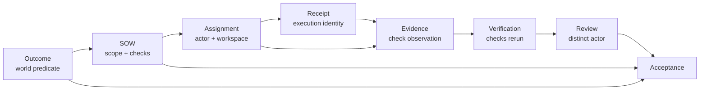
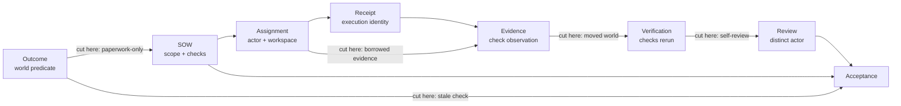
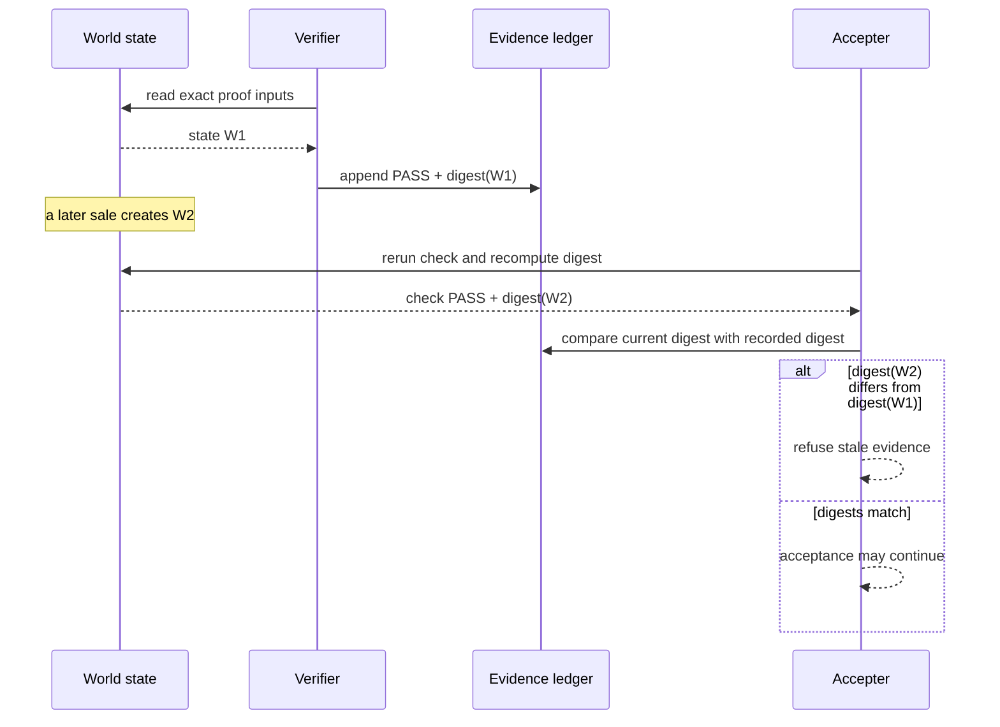
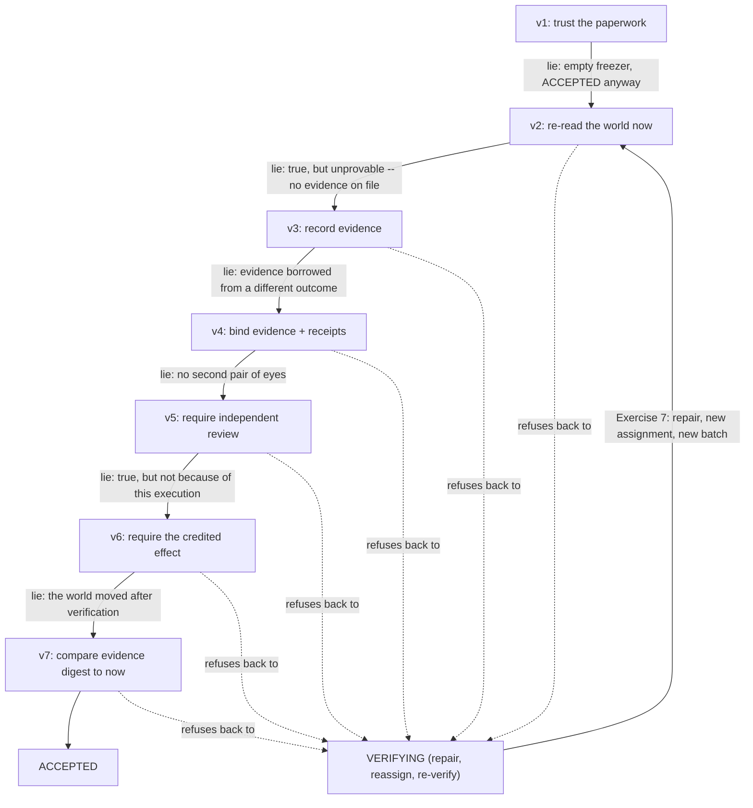

# Chapter 2 — Work needs governance

In Chapter 0 the shop said `ACCEPTED` and you learned to distrust the word until
you had checked the world yourself. This chapter is about why you *shouldn't have
to* — about the machinery that makes `ACCEPTED` mean something even when nobody is
watching over its shoulder.

Here is the uncomfortable truth that machinery exists to handle: the thing doing
the work will, sooner or later, have a reason to say it went fine when it didn't.
Not out of malice — a model that ran out of turns, a script that half-finished, a
tired human clicking through. If "done" is just a field someone sets, then "done"
is worth exactly nothing. So Lucy's organization never lets the worker mark its
own homework. Work travels through a chain of distinct hands, and at the end
someone re-checks reality before the word `ACCEPTED` is allowed to attach to it.

You will build that machinery yourself, one refusal at a time: seven versions
of one function, each of which stops a lie the version before it allowed. Then
you will follow one outcome through the real system's chain and spend the rest
of the chapter trying to smuggle lies past it.

## Learning objective

Understand how a piece of work travels from "somebody wants this" to "this is
done", and why every step in that journey exists. By the end you should be able
to explain what makes `ACCEPTED` mean something — and to break it on purpose.

Chapter 1 was about memory. This chapter is about **judgement**: who is allowed
to decide what, and what has to be true before a decision sticks.

## The vocabulary, in the order the work moves

| Word | What it is |
| --- | --- |
| **Outcome** | The state of the world someone wants. "Lucy's freezer stays stocked." |
| **Acceptance check** | A deterministic question that decides whether the outcome is true. |
| **SOW** | A statement of work: scope, non-goals, deliverables, done-when. |
| **Assignment** | One actor bound to one SOW, with a workspace. |
| **Receipt** | The durable record of an execution: who ran, how it ended. |
| **Evidence** | The record of a check having been run, bound to what it proves. |
| **Verification** | Actually executing the declared checks. |
| **Review** | A different actor reading the work. |
| **Acceptance** | The Principal declaring the outcome true — if it survives proof. |
| **Ruling** | A recorded decision that changes the rules. |

## Acceptance is a proof graph, not a workflow status

The nouns above form a directed proof graph. The graph matters more than the
order of buttons in a UI because each edge answers a different adversarial
question:



**Figure:** Acceptance is the terminal claim of a connected proof graph: outcome, scope, assignment, receipt, evidence, fresh verification, and independent review must agree.

Acceptance is permitted only when the necessary paths converge at `A`. A receipt
without evidence proves an execution ended, not that it worked. Evidence without
an execution binding may have been borrowed from another run. A review by the
performer is self-attestation. A green check whose observed inputs changed after
it ran is stale. Production `Organization.accept()` therefore behaves like a
proof checker: it does not trust a summary of this graph; it follows the ledger
edges and re-establishes the obligations.

The seven layers you are about to build can be understood as attacks on graph
integrity:

| Attack | Missing relation | False conclusion |
| --- | --- | --- |
| Paperwork-only acceptance | outcome → current observation | "The freezer is full" because a field says so. |
| Stale check | evidence → current world digest | Yesterday's truth is accepted today. |
| Borrowed evidence | evidence → assignment/receipt | Alice's successful run proves Bob's failed run. |
| Self-review | reviewer ≠ performer | The worker marks its own answer correct. |
| Moved world | digest → exact observed inputs | A check still exits zero while the facts it supposedly proved changed. |

The table names which relation each attack severs; the same graph from above
shows exactly where that break sits, because "missing relation" is easier to
place on an edge than to hold in your head across five table rows at once:



**Figure:** Cutting any proof edge admits a distinct lie, from paperwork-only completion and borrowed evidence to self-review and a stale world check.

**What this figure shows:** each labeled edge is the exact relation a weaker
`accept()` forgot to check, taken from the table above — this is the same ten
nodes and edges as the proof graph you just read, with the five attacks
pinned to the specific edge they sever rather than left as a separate list to
cross-reference by hand. An edge with no label is one none of the seven
layers attacks directly; it is enforced structurally (append-only, foreign
keys) rather than by a layer of `accept()` itself.

This also explains why review and acceptance are not one act. Review evaluates
the bounded work described by a SOW. Acceptance evaluates whether the outcome is
true after the necessary reviewed work and observations converge. One outcome
may require several SOWs; approving one diff is not automatically accepting the
world-level result.

## Build it yourself: acceptance in seven layers

The whole chapter turns on one function. Production `accept()` — in
`sovereign_agent/organization.py`, and it is one of the longest functions in
the codebase — composes about ten distinct obligations, and every one of them
exists because its absence lets a specific lie through. Reading the finished
function teaches you what it does; it cannot teach you *why each clause
earned its place*. So build it the way it was actually earned: start with the
version that trusts paperwork, find the lie it permits, add exactly one
clause, and repeat until the lies run out.

Everything runs on real table rows, continuing Chapter 1's idiom. The mini
schema mirrors the production ledger's proof tables — outcomes, SOWs,
assignments, receipts, verifications, evidence, reviews, effects — with the
inessential columns removed:

```python
import hashlib
import sqlite3

db = sqlite3.connect(":memory:")
db.executescript("""
    CREATE TABLE inventory (sku TEXT PRIMARY KEY, on_hand INT NOT NULL, reorder INT NOT NULL);
    CREATE TABLE outcomes (id TEXT PRIMARY KEY, state TEXT, subject TEXT, check_id TEXT);
    CREATE TABLE sows (id TEXT PRIMARY KEY, outcome_id TEXT, state TEXT, required_effect TEXT);
    CREATE TABLE assignments (id TEXT PRIMARY KEY, sow_id TEXT, actor TEXT, state TEXT);
    CREATE TABLE receipts (assignment_id TEXT PRIMARY KEY, deliverable TEXT);
    CREATE TABLE verifications (id TEXT PRIMARY KEY, outcome_id TEXT);
    CREATE TABLE evidence (id TEXT PRIMARY KEY, verification_id TEXT, outcome_id TEXT,
                           check_id TEXT, success INT, state_digest TEXT);
    CREATE TABLE reviews (id TEXT PRIMARY KEY, verification_id TEXT, reviewer TEXT, decision TEXT);
    CREATE TABLE effects (id TEXT PRIMARY KEY, assignment_id TEXT, kind TEXT, subject TEXT);
""")
db.execute("INSERT INTO inventory VALUES ('SKU-VANILLA', 2, 3)")  # BELOW the line
db.execute("INSERT INTO outcomes VALUES ('out-van', 'VERIFYING', 'SKU-VANILLA', 'stock_ok')")
db.execute("INSERT INTO sows VALUES ('sow-van', 'out-van', 'ACCEPTED', 'replenishment')")
db.execute("INSERT INTO assignments VALUES ('run-1', 'sow-van', 'operator-lucy', 'COMPLETED')")
db.commit()
```

Note the starting position, because it is the classic one: every piece of
*paperwork* is in order — the SOW says `ACCEPTED`, the assignment says
`COMPLETED` — and the freezer is at 2 with a reorder point of 3. The paperwork
and the world disagree. Watch which one each version of `accept` believes.

### Layer 1: trust the paperwork

The tempting `accept` checks that the work-tracking rows look finished, then
flips the field:

```python
def accept_v1(db, outcome_id, accepter):
    open_sows = db.execute(
        "SELECT COUNT(*) FROM sows WHERE outcome_id = ? AND state != 'ACCEPTED'", (outcome_id,)
    ).fetchone()[0]
    if open_sows:
        raise PermissionError("refused: SOWs remain open")
    db.execute("UPDATE outcomes SET state = 'ACCEPTED' WHERE id = ?", (outcome_id,))
    return "ACCEPTED"


print(accept_v1(db, "out-van", "principal-lucy"))
on_hand, reorder = db.execute("SELECT on_hand, reorder FROM inventory").fetchone()
receipts = db.execute("SELECT COUNT(*) FROM receipts").fetchone()[0]
print(f"but the freezer: on_hand={on_hand} reorder={reorder}, receipts on file: {receipts}")
```

```text
ACCEPTED
but the freezer: on_hand=2 reorder=3, receipts on file: 0
```

Everything *said* done, so it accepted — an empty freezer, zero deliverables
on file, nothing ever executed as far as the receipts table knows. Status
fields are claims. A claim checked against another claim proves consistency
between claims, which is worth nothing when both are wrong the same way.

### Layer 2: re-read the world, right now

The repair is the single most important line in this book: at the moment of
acceptance, **run the declared check against current state**.

```python
def check_stock(db, subject):
    on_hand, reorder = db.execute(
        "SELECT on_hand, reorder FROM inventory WHERE sku = ?", (subject,)
    ).fetchone()
    return on_hand >= reorder, f"on_hand={on_hand} reorder={reorder}"


def accept_v2(db, outcome_id, accepter):
    subject, check_id = db.execute(
        "SELECT subject, check_id FROM outcomes WHERE id = ?", (outcome_id,)
    ).fetchone()
    ok, detail = check_stock(db, subject)
    if not ok:
        raise PermissionError(f"refused: {check_id} fails NOW ({detail})")
    return accept_v1(db, outcome_id, accepter)


db.execute("UPDATE outcomes SET state = 'VERIFYING'")  # undo v1's lie
try:
    accept_v2(db, "out-van", "principal-lucy")
except PermissionError as error:
    print(error)
```

```text
refused: stock_ok fails NOW (on_hand=2 reorder=3)
```

Two details are load-bearing. The *subject* (`SKU-VANILLA`) came from the
outcome row, not from the caller — otherwise acceptance could be pointed at a
healthy product while the real one sits empty; the production code carries
exactly that comment. And the check ran *at acceptance time* — the production
docstring calls this "the step that matters."

But v2 has its own hole. Restock the freezer and accept:

```python
db.execute("UPDATE inventory SET on_hand = 9")  # somebody restocks -- the world is true now
print(accept_v2(db, "out-van", "principal-lucy"))
evidence = db.execute("SELECT COUNT(*) FROM evidence").fetchone()[0]
print(f"evidence rows supporting this acceptance: {evidence}")
```

```text
ACCEPTED
evidence rows supporting this acceptance: 0
```

True — and unprovable. Nothing records *what was observed* when acceptance was
granted. Six months from now, when someone asks why this outcome was accepted,
the answer is "trust me, the check passed." An organization whose acceptances
cannot be audited is honest only while nobody needs it to prove it.

### Layer 3: evidence — the observation, written down

Verification becomes a durable act: run the check, record what it saw, and
stamp the record with a **digest of the exact state it observed**. Acceptance
then demands recorded, successful evidence:

```python
def digest_stock(db, subject):
    row = db.execute(
        "SELECT sku, on_hand, reorder FROM inventory WHERE sku = ?", (subject,)
    ).fetchone()
    return hashlib.sha256(repr(tuple(row)).encode()).hexdigest()[:12]


def verify(db, verification_id, outcome_id):
    subject, check_id = db.execute(
        "SELECT subject, check_id FROM outcomes WHERE id = ?", (outcome_id,)
    ).fetchone()
    ok, detail = check_stock(db, subject)
    db.execute("INSERT INTO verifications VALUES (?, ?)", (verification_id, outcome_id))
    db.execute(
        "INSERT INTO evidence VALUES (?, ?, ?, ?, ?, ?)",
        (
            f"evd-{verification_id}",
            verification_id,
            outcome_id,
            check_id,
            int(ok),
            digest_stock(db, subject),
        ),
    )
    db.commit()
    return f"recorded {'PASS' if ok else 'FAIL'} evidence at digest {digest_stock(db, subject)}"


def accept_v3(db, outcome_id, accepter):
    rows = db.execute("SELECT success FROM evidence WHERE outcome_id = ?", (outcome_id,)).fetchall()
    if not rows:
        raise PermissionError("refused: no evidence was ever recorded")
    if not all(success for (success,) in rows):
        raise PermissionError("refused: evidence on file reports failure")
    return accept_v2(db, outcome_id, accepter)


db.execute("UPDATE outcomes SET state = 'VERIFYING'")
try:
    accept_v3(db, "out-van", "principal-lucy")
except PermissionError as error:
    print(error)
print(verify(db, "ver-1", "out-van"))
print(accept_v3(db, "out-van", "principal-lucy"))
```

```text
refused: no evidence was ever recorded
recorded PASS evidence at digest 5d68aec58fd6
ACCEPTED
```

Pause on the digest input, because production paid a real bill here. The
digest covers **exactly the rows this check observed** — one inventory row,
nothing else. The production `checks.py` records the scar in a comment: an
older design used one *shared* digest over broad state, and it failed to
notice duplicate-event drift because the duplicated rows were outside what any
individual check looked at while inside what the digest hashed. A digest wider
than the observation dilutes it; narrower, and it misses changes that matter.
The rule: **the digest is the observation's fingerprint, so it must cover the
observation — all of it and only it.**

### Layer 4: proof you can steal is not proof

v3 has a subtle flaw: it asks whether successful evidence *exists for this
outcome*, but nothing binds the evidence rows to a verification *of this
outcome*. Watch — Lucy adds a pistachio line, and its outcome simply borrows
vanilla's proof:

```python
db.execute("INSERT INTO inventory VALUES ('SKU-PISTACHIO', 7, 3)")
db.execute("INSERT INTO outcomes VALUES ('out-pis', 'VERIFYING', 'SKU-PISTACHIO', 'stock_ok')")
db.execute("INSERT INTO sows VALUES ('sow-pis', 'out-pis', 'ACCEPTED', 'replenishment')")
db.commit()

stolen = db.execute("UPDATE evidence SET outcome_id = 'out-pis' WHERE outcome_id = 'out-van'")
print("evidence reassigned:", stolen.rowcount)
print(accept_v3(db, "out-pis", "principal-lucy"))
```

```text
evidence reassigned: 1
ACCEPTED
```

Pistachio was never verified, never executed, never delivered — it was
accepted on vanilla's paperwork. (In the production schema the reassignment
itself would be refused by append-only triggers, but the *checking* flaw is
real: proof must be validated as belonging to the thing it proves.) The repair
binds the chain at both ends: evidence must come from **this outcome's own
verification batch**, and every SOW must have a **completed execution with a
receipt** — the durable record that something actually ran and delivered:

```python
def accept_v4(db, outcome_id, accepter):
    verification = db.execute(
        "SELECT id FROM verifications WHERE outcome_id = ? ORDER BY id DESC LIMIT 1",
        (outcome_id,),
    ).fetchone()
    if verification is None:
        raise PermissionError("refused: this outcome has no verification of its own")
    rows = db.execute(
        "SELECT success FROM evidence WHERE outcome_id = ? AND verification_id = ?",
        (outcome_id, verification[0]),
    ).fetchall()
    if not rows:
        raise PermissionError("refused: no evidence in this outcome's own verification batch")
    if not all(success for (success,) in rows):
        raise PermissionError("refused: evidence on file reports failure")
    for (sow_id,) in db.execute("SELECT id FROM sows WHERE outcome_id = ?", (outcome_id,)):
        run = db.execute(
            "SELECT a.id FROM assignments a JOIN receipts r ON r.assignment_id = a.id"
            " WHERE a.sow_id = ? AND a.state = 'COMPLETED'",
            (sow_id,),
        ).fetchone()
        if run is None:
            raise PermissionError(f"refused: {sow_id} has no completed execution with a receipt")
    return accept_v2(db, outcome_id, accepter)


db.execute("UPDATE evidence SET outcome_id = 'out-van'")  # put the stolen proof back
db.execute("UPDATE outcomes SET state = 'VERIFYING'")
try:
    accept_v4(db, "out-pis", "principal-lucy")
except PermissionError as error:
    print(error)

try:
    accept_v4(db, "out-van", "principal-lucy")
except PermissionError as error:
    print(error)

db.execute("INSERT INTO receipts VALUES ('run-1', 'restock-report.md')")
db.commit()
print(accept_v4(db, "out-van", "principal-lucy"))
```

```text
refused: this outcome has no verification of its own
refused: sow-van has no completed execution with a receipt
ACCEPTED
```

Two refusals before the accept, and read them in order: pistachio fell at
"no verification of its own" — the theft no longer works — and then *vanilla
itself* fell at the receipt check, exposing that all this time nothing had
ever proven an execution happened. The lie v1 let through has only now been
fully closed, three layers later. Layered obligations catch each other's
leftovers; that is why they compose instead of replacing each other.

**A labeled simplification before Layer 5.** The toy has one SOW, so it can
get away with one review bound to "the latest verification." Production
cannot, and splits what the toy collapses into **two different things**:

- **per-SOW review** — every SOW's *own* verification batch must have been
  reviewed by an independent actor, checked SOW by SOW (a second
  verification must not be able to replace every reviewed row while
  acceptance still reports "the work was reviewed");
- **the final outcome observation** — one last, separate verification that
  the outcome's world-condition holds *now*. This final observation is
  freshness-checked (its digests must match, as Layer 7 builds) but it has
  **no reviewer of its own**, deliberately: it is a *measurement* of the
  world, not a unit of work, and the production comment says exactly that —
  requiring a reviewer for it would mean reviewing a measurement rather
  than reviewing work.

Keep that split in mind as you build Layer 5 against the one-SOW toy: the
review you are about to demand plays the *per-SOW* role, and Layer 7's
digest check plays the *final observation* role. In production they are
distinct queries against distinct verifications.

### Layer 5: someone else must have looked

Nothing yet requires a second pair of eyes. The performer's proof can all be
in order and all be wrong the same way — the reason Chapter 0 told you to
distrust `ACCEPTED` in the first place. So: a **review of the exact current
verification batch**, by someone who is not the accepter:

```python
def accept_v5(db, outcome_id, accepter):
    verification = db.execute(
        "SELECT id FROM verifications WHERE outcome_id = ? ORDER BY id DESC LIMIT 1",
        (outcome_id,),
    ).fetchone()
    if verification is not None:
        review = db.execute(
            "SELECT reviewer, decision FROM reviews WHERE verification_id = ?",
            (verification[0],),
        ).fetchone()
        if review is None:
            raise PermissionError("refused: no review of the CURRENT verification batch")
        reviewer, decision = review
        if decision != "approved":
            raise PermissionError("refused: the current batch's review did not approve")
        if reviewer == accepter:
            raise PermissionError(f"refused: {accepter} reviewed this work and cannot accept it")
    return accept_v4(db, outcome_id, accepter)


db.execute("UPDATE outcomes SET state = 'VERIFYING'")
try:
    accept_v5(db, "out-van", "principal-lucy")
except PermissionError as error:
    print(error)

db.execute("INSERT INTO reviews VALUES ('rev-1', 'ver-1', 'principal-lucy', 'approved')")
db.commit()
try:
    accept_v5(db, "out-van", "principal-lucy")
except PermissionError as error:
    print(error)

db.execute("UPDATE reviews SET reviewer = 'sparring-lucy' WHERE id = 'rev-1'")
db.commit()
print(accept_v5(db, "out-van", "principal-lucy"))
```

```text
refused: no review of the CURRENT verification batch
refused: principal-lucy reviewed this work and cannot accept it
ACCEPTED
```

The review binds to the **verification id**, not to the outcome. Bind it to
the outcome and a stale approval — of a batch that has since been replaced —
would satisfy acceptance forever: "the evidence supporting acceptance must be
the evidence a reviewer actually saw," as the production refusal puts it. And
the reviewer/accepter collision is refused outright; review and acceptance
are separate acts by separate actors, or they are one act wearing two hats.

### Layer 6: true — but not because of you

Now the deepest lie, the one every earlier layer waves through. Every check
passes, honestly. Evidence is fresh, reviewed, receipted. And the execution
being credited **did nothing** — the freezer is full because of the manual
restock back in Layer 2, not because of `run-1`. The condition is true for
*other reasons*, and v5 happily pays `run-1` the credit:

```python
def accept_v6(db, outcome_id, accepter):
    for sow_id, required in db.execute(
        "SELECT id, required_effect FROM sows WHERE outcome_id = ?", (outcome_id,)
    ):
        if required is None:
            continue
        contributed = db.execute(
            "SELECT COUNT(*) FROM effects e JOIN assignments a ON a.id = e.assignment_id"
            " WHERE a.sow_id = ? AND e.kind = ?",
            (sow_id, required),
        ).fetchone()[0]
        if not contributed:
            raise PermissionError(
                f"refused: the condition may hold, but {sow_id}'s execution"
                f" produced no {required} effect -- it holds for OTHER reasons"
            )
    return accept_v5(db, outcome_id, accepter)


db.execute("UPDATE outcomes SET state = 'VERIFYING'")
try:
    accept_v6(db, "out-van", "principal-lucy")
except PermissionError as error:
    print(error)

db.execute("INSERT INTO effects VALUES ('eff-1', 'run-1', 'replenishment', 'SKU-VANILLA')")
db.commit()
print(accept_v6(db, "out-van", "principal-lucy"))
```

```text
refused: the condition may hold, but sow-van's execution produced no replenishment effect -- it holds for OTHER reasons
ACCEPTED
```

This distinction — "the condition is true" versus "this execution *made* it
true" — is the deepest idea in the production implementation. A SOW declares
the **effect kind** it must produce; acceptance requires an effect of that
kind from that SOW's own execution. Without it, an assignment that did
nothing inherits credit for a restock done last week. The production comment
adds a subtlety worth quoting: there is deliberately no "if there were any
effects, then..." guard, because the empty case is the *strongest* form of
"this execution did nothing" — guarding the requirement would make it vacuous
exactly when it matters most. Chapter 10 builds this into full causal binding.

### Layer 7: the world must not have moved

One window remains. Verification observed the world; a review approved that
observation; and between then and acceptance, the world can change. Sell most
of the vanilla after `ver-1` and watch v6 (which re-runs the check — the
freezer at 3 still *equals* the reorder point, so the check still passes)
accept against evidence describing a world that no longer exists. The final
clause compares the **evidence's state digest** against the world's digest at
acceptance time:



**Figure:** Acceptance re-reads the world and compares its current digest with recorded evidence, refusing when the verified state has changed.

The check can still return `PASS` in both worlds. The digest rejects the
stronger lie: that today's passing state is the same state an independent
reviewer actually examined.

**Listing:** Recheck evidence against the current world before acceptance

```python
def accept_v7(db, outcome_id, accepter):
    subject = db.execute("SELECT subject FROM outcomes WHERE id = ?", (outcome_id,)).fetchone()[0]
    verification = db.execute(
        "SELECT id FROM verifications WHERE outcome_id = ? ORDER BY id DESC LIMIT 1",
        (outcome_id,),
    ).fetchone()
    if verification is not None:
        recorded = db.execute(
            "SELECT state_digest FROM evidence WHERE verification_id = ?",
            (verification[0],),
        ).fetchone()[0]
        if recorded != digest_stock(db, subject):
            raise PermissionError(
                "refused: the world moved since verification"
                f" (evidence digest {recorded}, world digest {digest_stock(db, subject)})"
            )
    return accept_v6(db, outcome_id, accepter)


db.execute("UPDATE outcomes SET state = 'VERIFYING'")
db.execute("UPDATE inventory SET on_hand = 3 WHERE sku = 'SKU-VANILLA'")  # a big sale lands
db.commit()

try:
    accept_v7(db, "out-van", "principal-lucy")
except PermissionError as error:
    print(error)

print(verify(db, "ver-2", "out-van"))
db.execute("INSERT INTO reviews VALUES ('rev-2', 'ver-2', 'sparring-lucy', 'approved')")
db.commit()
print(accept_v7(db, "out-van", "principal-lucy"))
```

```text
refused: the world moved since verification (evidence digest 5d68aec58fd6, world digest 423fad940a8d)
recorded PASS evidence at digest 423fad940a8d
ACCEPTED
```

The check still passed — 3 is at the reorder point — but acceptance refused
anyway, because the evidence on file described `on_hand=9` and the world says
`on_hand=3`. Recovery is not a bypass: verify again (a **new** batch, at the
new digest), review the new batch, accept. Nothing was edited; the ledger now
holds both verifications, both reviews, and the whole history of the world
moving. Refusal is the system working, and re-proving is how work resumes.

### What you just built, against the real thing

Read production `accept()` in `sovereign_agent/organization.py` now — start at
its docstring — and you will recognize every clause: SOWs all accepted (L1);
checks re-executed against current state, subject read from the outcome
(L2); stored evidence required, successful, bound to this outcome and batch
(L3/L4); per-SOW receipts and deliverables via `_trusted_receipt` and
`_require_deliverables` (L4); review of the exact verification batch and
`forbid_self_approval` — production derives the performers from the ledger
rather than trusting a parameter (L5); `required_effect_kind` contribution
(L6); the outcome's own final observation with matching state digests (L7).
The production version also validates *each SOW on its own proof chain* —
your toy has one SOW; with several, one execution must not ride on a
sibling's work — and refuses acceptance when the accepter appears among the
ledger-derived performers, which no layer above could even express because
the toy passed `accepter` in as a trusted string. Presence of a clause is
never the lesson; the lie it stops is. That is also why the exercises below
attack the *real* system rather than re-running the toy.

Seven layers, seven refusals — the ladder below is the same seven-version
build-up you just ran, read top to bottom as one picture instead of seven
separate code blocks. Each rung names the lie that version of `accept`
still let through and the layer that closes it; the loop back to `VERIFYING`
on the right is Exercise 7's recovery cycle, which is how work climbs back
onto the ladder after a refusal instead of being stuck below it.



**Figure:** Seven successive implementations close seven different false-acceptance paths; every refusal returns to new governed work rather than forcing the old evidence through.

**What this figure shows:** each rung's refusal edge names a specific lie a
weaker `accept` would let through, and the dashed edges share one thing —
every refusal returns to `VERIFYING` instead of ending the story, exactly
Exercise 7's "being refused is not the end." The solid path is the seven
layers in build order; a dashed edge is what a bug in that layer would skip.

## Expected results and invariants

Before the exercises, here is what each layer guarantees stated as a
falsifiable predicate — not "what the code does" but "what must be true
after `accept()` returns `ACCEPTED`, or acceptance itself is broken." Use
this table to tell a real pass from a false green while you work through
the exercises below: if an exercise's output does not match the invariant
here, either the exercise found a real bug or you mis-set-up the scenario —
it should never be ambiguous which.

| Layer | Invariant that must hold after `ACCEPTED` | What violating it would look like |
| --- | --- | --- |
| L1/L2 | The declared check, re-run against the *current* database, returns success. | `ACCEPTED` while `SELECT on_hand, reorder FROM inventory` shows the shelf empty. |
| L3 | At least one evidence row exists, and every evidence row for this acceptance reports `success=1`. | `ACCEPTED` with zero rows in `evidence` for this outcome. |
| L4 | Every evidence row belongs to *this outcome's own* verification batch, and every SOW has a completed execution with a receipt. | `ACCEPTED` on evidence copied or reassigned from a different outcome's proof. |
| L5 | The verification batch has a review, the review's decision is `approved`, and the reviewer is not the accepter. | `ACCEPTED` with no review row, or with `reviewer == accepter`. |
| L6 | If the SOW declares a `required_effect_kind`, the credited execution produced an effect of that kind. | `ACCEPTED` while `contributing_executions(outcome_id)` is empty for a SOW that promised an effect. |
| L7 | The evidence's recorded `state_digest` equals the world's digest computed *right now*, at acceptance time. | `ACCEPTED` against evidence whose digest describes a world that no longer exists. |

Exercise 2 falsifies L1/L2. Exercise 3's ten tests falsify L3 through L7 by
name. Exercise 6 falsifies the append-only guarantee the whole table above
depends on staying true. Exercise 8, below, falsifies L6 specifically and
shows what a *broken* L6 would have looked like — a version of this exact
guard that review caught and rejected before it ever merged.

## Exercise 1: follow one outcome through the whole chain

```bash
uv run sovereign-agent demo store --mode simulated --root /tmp/lucy-gov
DB=/tmp/lucy-gov/.sovereign/organization.db

sqlite3 -header -column "$DB" \
  "SELECT json_extract(record,'$.title') AS title,
          json_extract(record,'$.state') AS state,
          json_extract(record,'$.acceptance_checks') AS checks
   FROM outcomes;"
```

The outcome declares **three** acceptance checks. Note that the outcome declares
them — not the provider, and not the operator who does the work. The thing being
judged does not get to choose its own judges.

```bash
sqlite3 -header -column "$DB" \
  "SELECT check_id, success, substr(outcome_id,1,20) AS outcome,
          substr(assignment_id,1,20) AS execution
   FROM evidence;"
```

Three evidence rows, one per declared check. Each one records *which question*
was asked, *about which outcome*, and *during which execution*. That binding is
the difference between evidence and a filename.

## Exercise 2: try to accept something that is not true

This is the important exercise. Governance is only real if it refuses.

```bash
python - <<'PY'
import pathlib, tempfile
from reference_organizations.store.demo import run_simulated
from sovereign_agent.organization import Organization
from sovereign_agent.errors import Refusal

root = pathlib.Path(tempfile.mkdtemp())
run_simulated(root)
org = Organization(root)
outcome_id = org.db.connection.execute("SELECT id FROM outcomes").fetchone()["id"]

# Empty the shelf, then re-open the outcome and try to accept it again.
org.db.connection.execute("UPDATE inventory SET on_hand=0 WHERE sku='SKU-TEA'")
org.db.connection.execute(
    "UPDATE outcomes SET record=json_set(record,'$.state','VERIFYING') WHERE id=?",
    (outcome_id,))
org.db.connection.commit()

try:
    org.accept(outcome_id, "principal-human")
    print("ACCEPTED  <-- this would be a bug")
except Refusal as refusal:
    print("REFUSED:", str(refusal).splitlines()[0])
PY
```

Expected: a refusal naming `inventory_at_or_above_reorder_point`. Acceptance
**re-runs the checks against the world at the moment of acceptance**. It does
not trust that they passed earlier.

That last sentence is the entire lesson of this chapter. The tempting shortcut
is to accept an outcome by checking that someone handed it a non-empty list of
evidence IDs — without ever looking the IDs up. Do that and you can accept with
`["evd_i_just_made_this_up"]`. Acceptance that trusts a list of names instead of
re-reading the world is theatre.

## Exercise 3: try the other ways of lying

Each of these is refused for a different reason. Run the suite that proves it:

```bash
uv run python -m pytest tests/test_acceptance_falsification.py -v
```

Read the test names. They are the list of lies this system knows how to catch:

- evidence that does not exist (refused by a **foreign key**, in the database)
- evidence that reports failure
- evidence for a different outcome
- evidence from a different execution
- evidence that is **stale** — true when written, but the world moved since
- a declared check with no evidence at all
- an outcome with no SOW
- the operator trying to accept its own work
- a malformed provider report
- a proposal outside its allowed bounds

## Exercise 4: no self-approval

```bash
python -c "
from sovereign_agent.policy import forbid_self_approval
from sovereign_agent.errors import Refusal
try:
    forbid_self_approval('operator-course','operator-course')
except Refusal as r:
    print('REFUSED:', str(r).splitlines()[0])
"
```

Three different actors touch the store outcome, and none of them can do another's
job:

- `operator-course` does the work.
- `sparring-course` reviews it.
- `principal-human` accepts it.

`accept()` does not take a "who performed this" argument. It **derives** the
performers from the assignments in the ledger, then refuses if the accepter is
among them. If the caller could name the performer, the caller could name a
convenient stranger, and the separation would be decoration.

## Exercise 5: watch verification actually run

```bash
python -c "
import tempfile, pathlib
from reference_organizations.store.demo import run_simulated
from sovereign_agent.organization import Organization
from sovereign_agent.checks import run_check
root = pathlib.Path(tempfile.mkdtemp()); run_simulated(root)
org = Organization(root)
oid = org.db.connection.execute('SELECT id FROM outcomes').fetchone()['id']
for check_id in org._outcome(oid).acceptance_checks:
    r = run_check(org.db, check_id, 'SKU-TEA')
    print(f'{r.check_id}: {\"PASS\" if r.success else \"FAIL\"} - {r.detail}')
"
```

Expected:

```text
inventory_at_or_above_reorder_point: PASS - available=8 (on_hand=8 - reserved=0) vs reorder_point=3
cash_reconciles: PASS - 1 purchase entr(y/ies) reconcile
replenishment_event_exists: PASS - 1 replenishment event(s) for SKU-TEA
```

Each check reports the facts it observed. The failure mode to guard against is
a verification step that only flips a status field and runs no checks at all — a
verification that verifies nothing. Here `verify_outcome` executes every declared
check, and an unknown or crashing check **fails closed** rather than being
skipped.

## Exercise 6: the proof itself cannot be rewritten

Chapter 1 showed that `events` refuses `UPDATE` and `DELETE`. The same guarantee
now covers every table acceptance reads as proof — `effects`, `verifications`,
`reviews`, `evidence`:

```bash
sqlite3 /tmp/lucy-gov/.sovereign/organization.db \
  "UPDATE evidence SET success = 1;"
```

Expected: `Error: stepping, evidence are append-only: update refused`.

There is a general trap worth naming here. Append-only protection tends to get
added to whichever table the proof *used* to live in. As a system grows, the
proof migrates — from `events` to `evidence`, `reviews`, `verifications`,
`effects` — and if the guards do not migrate with it, the tables carrying the
real load end up unprotected while an old, now-irrelevant table stays immune.
Put sharply: *the guarantee stays put while the load moves.* Protect where the
proof lives now, not where it used to.

One thing append-only cannot do is stop a forged **append**: inserting is
precisely what it permits. An effect is therefore cross-checked against the
event committed alongside it, and an effect with no matching event is an
incomplete record.

Now the part that matters more, because it is where most systems overclaim.
That cross-check detects **inconsistency**. It does not prove **authenticity**.
Someone who can write arbitrary rows can append an effect *and* its matching
event — two rows that agree with each other and are both invented. The
organization will accept them.

That is not a hole to be plugged with a third table. Every check you can write
inside the database constrains what the *code* does, and an attacker with a
database handle is not the code. Proving authenticity needs something the
database does not hold — a signature key kept outside it — which is a different
subject and out of scope here.

So here is the honest statement this design commits to: **anyone who can write
arbitrary rows can rewrite the organization's memory.** Everything in this chapter
protects the ledger from mistakes and
ordinary tools. Knowing exactly which door is open is worth more than believing
they are all shut.

## Exercise 7: being refused is not the end

Chapter 2 has spent five exercises showing the organization refusing things. A
fair question: what happens to work that gets refused? Is it dead?

```bash
uv run python -m pytest tests/test_recovery.py -v
```

Read the test names. The cycle they prove is:

```text
verification fails
  -> Sparring requests changes           (SOW state: CHANGES_REQUESTED)
  -> the world is repaired
  -> a NEW assignment is created         (SOW state: ASSIGNED)
  -> verification runs again             (a new batch)
  -> Sparring reviews the new batch      (accepted)
  -> the Principal accepts
```

Two details worth pausing on.

**Recovery creates a new assignment.** Repaired work is new work, and the ledger
says so. The failed execution is not overwritten or reused — you can still read
what went wrong the first time.

**Nothing is deleted.** After recovery the database holds two verifications and
two reviews, including the `changes_requested` one. The organization remembers
being wrong. That is the difference between a system that learns and a system
that launders its history.

This matters more than it looks. If `changes_requested` were terminal — if the
only way forward from a refusal were to delete the organization and start over —
then "refusal is the system working" would be a slogan the system contradicts in
practice. A refusal you cannot recover from teaches the opposite of what it says.
Recovery is what makes refusal a step in the work rather than the end of it.

## Exercise 8: an attack the seven layers were built to survive

Layer 6 is the deepest lie in this chapter — a condition that is true for
reasons that have nothing to do with the execution being credited. It is
also the layer with the most dangerous *near-miss* implementation, because
the guard it needs is easy to write in a way that looks right and is not.

`tests/test_causal_binding.py` documents exactly this. Its own module
docstring says the *first version of that test file itself* "did not prove
independence" and "missed the empty-contributor bypass entirely," because its
own "contribution false" case always had an older contributor present — so it
could not tell a real guard from a vacuous one. Both reviewers caught it when
asked to attack the file, before it ever merged. The production
`organization.py` comment right above the real guard names the same
almost-guard by the exact code it refuses to write. Reproduce both the real
behavior and the guard that would have looked plausible and passed nothing,
side by side:

```python
import pathlib, tempfile
from reference_organizations.store import seed
from sovereign_agent.checks import run_check
from sovereign_agent.errors import Refusal
from sovereign_agent.models import Role
from sovereign_agent.organization import Organization

root = pathlib.Path(tempfile.mkdtemp())
org = Organization.init(root)
seed(org.db)

outcome = org.create_outcome(
    "Keep the tea jar stocked",
    "On-hand tea stays at or above the reorder point.",
    ["inventory_at_or_above_reorder_point"],
    "principal-human",
    "SKU-TEA",
)
org.activate(outcome.id, "master-course")

# A SOW that PROMISES a replenishment effect -- but its assignment never
# restocks anything. The shelf happens to be fine anyway, for a reason that
# has nothing to do with this SOW (the seed data starts above the line).
sow = org.create_sow(outcome.id, "idle", Role.OPERATOR, "master-course", "replenishment")
org.ready_sow(sow.id)
assignment = org.run_assignment(org.assign(sow.id, "operator-course", "master-course").id)

contributors = org.contributing_executions(outcome.id)
print("contributing executions:", len(contributors))
print(
    "stock check passes anyway:",
    run_check(org.db, "inventory_at_or_above_reorder_point", "SKU-TEA").success,
)

org.verify_outcome(outcome.id, "verifier-course")
org.review(sow.id, "sparring-course")

try:
    org.accept(outcome.id, "principal-human")
    print("ACCEPTED  <-- this would be a bug")
except Refusal as refusal:
    print("REFUSED because:", "produced no replenishment effect" in refusal.happened)

# The historical guard, reported by review before it ever shipped, was
# written as `if contributors and execution_id not in contributors`.
# Evaluate that exact predicate against this same data:
buggy_guard_would_refuse = bool(contributors) and assignment.id not in contributors
print("buggy guard would have refused:", buggy_guard_would_refuse)
```

Expected result / invariant: the condition is true (the check passes), the
execution contributed nothing (`contributing executions: 0`), and real
`accept()` still refuses. The mutation case is the last line: the historical
guard evaluates `bool(contributors) and ...`, so an *empty* contributor set —
the strongest possible case for "this execution did nothing" — short-circuits
the `and` to `False` and never raises at all.

```text
contributing executions: 0
stock check passes anyway: True
REFUSED because: True
buggy guard would have refused: False
```

That last line is the false green this exercise exists to expose: a
plausible-looking guard that is vacuous in exactly the case that matters
most, silently accepting nothing-happened as done. The real implementation
in `organization.py` avoids it on purpose — read the comment directly above
the `required_effect_kind` check, which names the same trap by name — and
`tests/test_causal_binding.py::test_condition_true_but_no_effects_exist_at_all_is_refused`
is the regression test that would catch it returning.

## Learner verification command

```bash
uv run python -m pytest tests/test_acceptance_falsification.py tests/test_actors_and_mailbox.py \
  tests/test_recovery.py tests/test_causal_binding.py -q
```

Expected: all pass. Together they prove that acceptance refuses every lie listed
above, that authority cannot be self-granted, and that a credited execution must
have actually caused the effect it claims.

## Summary

Acceptance now consists of seven composed layers, each one closing a
specific lie the layer before it still let through: re-reading the world,
recording evidence, binding that evidence to the right outcome and
execution, requiring a distinct reviewer, requiring the credited execution
to have actually produced the required effect, and refusing evidence whose
observed world has since moved.

The governing rule is that `ACCEPTED` is a proof graph that must
fully converge, not a workflow status: an outcome, its SOW (a **statement of
work**, this book's own term for the deliverable and its acceptance checks),
its evidence, and its review all have to point at each other correctly, or
acceptance refuses.

The refused cases form a family: paperwork-only
acceptance, stale evidence, borrowed evidence, self-review, and crediting an
execution for a condition that became true for unrelated reasons — five
distinct attacks, five distinct refusals, each with its own failing test.

For Lucy, this is why a restock actually has to happen before the
freezer counts as "handled" — and why the person who did the restock is
never the same person who signs off that it was done correctly.

## Explain it back

1. An outcome declares its acceptance checks. Why is it dangerous to let the
   actor doing the work declare them instead?
2. Evidence records a check id, an outcome id, and an execution id. Remove any
   one of those three. What lie becomes possible?
3. "Stale evidence" is refused even when the check would still pass today.
   Why bother refusing something that is still true?
4. `accept()` deliberately has no `performer_id` parameter. Explain why adding
   one back would quietly disable no-self-approval.
5. What is the difference between a **receipt** and **evidence**? One describes
   an execution; the other describes a fact about the world. Which is which?
6. Recovery from `changes_requested` creates a *new* assignment rather than
   reusing the failed one. What would you lose if it reused it?
7. `events` was append-only long before `evidence` was. Explain, in terms of
   where the proof lives, why protecting only `events` stopped being enough.
8. Append-only refuses rewriting a row but permits adding one. Why does that
   make corroboration necessary, and what corroborates an effect?
9. Acceptance requires a review of the **exact** verification batch it is
   accepting on. Describe the lie that would be possible if it accepted any
   review of the outcome instead.
10. In Layer 7 the check itself still passed (`on_hand=3`, reorder point 3),
    yet acceptance was refused. What exactly did the digest comparison prove
    that re-running the check could not?
11. A digest over *all* of the shop's state would seem strictly safer than one
    over a single inventory row. Using the duplicate-event-drift scar from
    `checks.py`, explain why "all of it and only it" beats "everything".
12. Layer 6 refuses when the world is genuinely fine. Defend that refusal to
    an annoyed Lucy: what future failure does crediting a do-nothing
    execution set up?
13. Exercise 8's near-miss guard was `if contributors and execution_id not
    in contributors`. What does `bool(contributors) and ...` evaluate to
    when `contributors` is empty, and why is that the worst case for this
    bug to hide in?

Next: [Chapter 3 — The actor is not a model](../ch03_actor_is_not_a_model/README.md)
