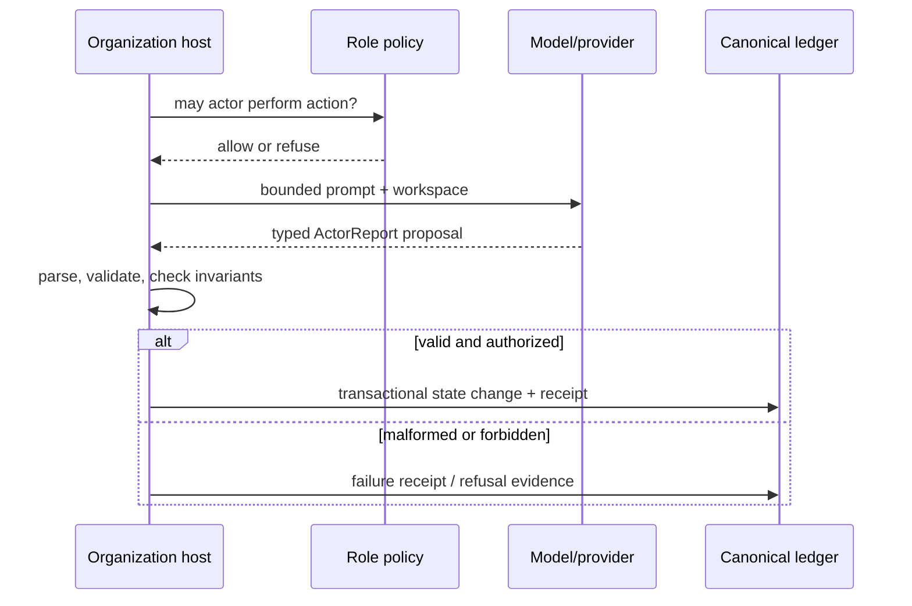
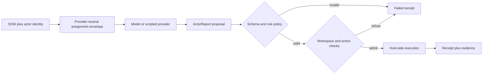
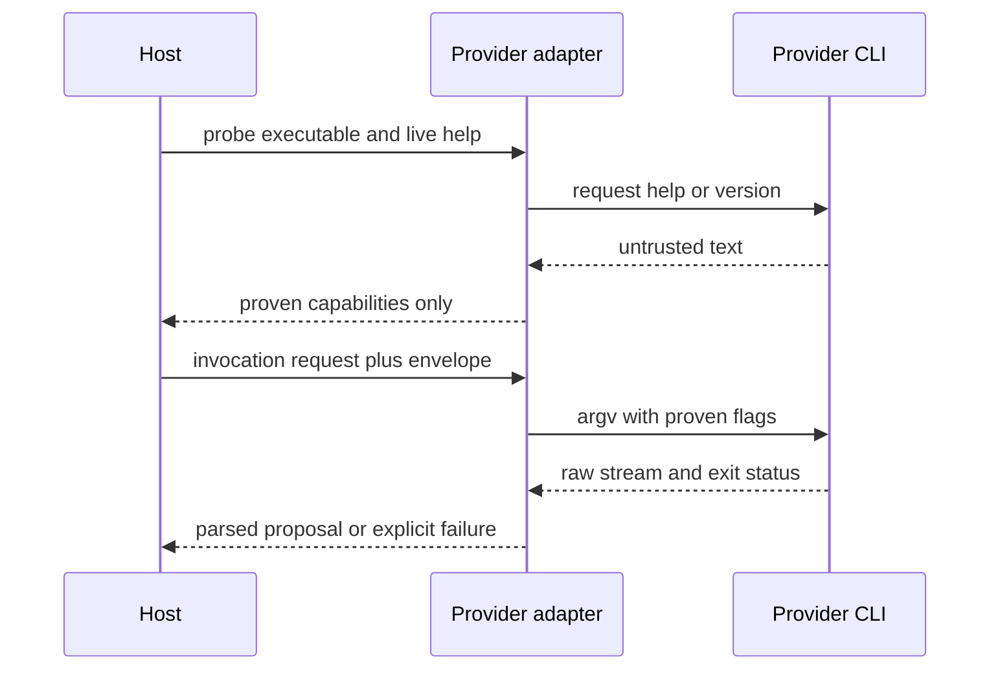
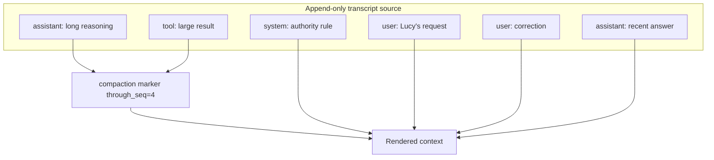
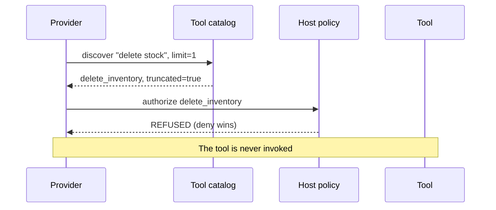

# Chapter 3 — The Actor Is Not the Model

## The bug that started an argument

Lucy runs an ice cream shop. This summer she started letting a language model help
with the boring part: watching stock and proposing reorders. One Saturday the
model proposed reordering **400 tubs of vanilla** — ten freezers' worth. It did
not go through, because in [Chapter 2](../ch02_work_needs_governance/README.md)
you built the governed check that re-reads reality before a proposal commits.

This chapter answers the question Lucy's friend asked that evening:

> "If you switch to a smarter model, does the shop get safer, or more dangerous?"

The honest answer is **neither**, by design — and the reason is the most important
idea in this book. Most systems that bolt an LLM onto a business get it exactly
backwards: they tie *authority* to *intelligence*, so a sharper model quietly
gets a longer leash. In a Sovereign Agent, the model is a **swappable part of an
actor**, and the actor's authority comes from its **role**, not from the model
behind it. You will build that distinction from the real production pieces, swap
the model, and prove that who-may-do-what did not move an inch.

## Learning objective

Understand why swapping the intelligence behind an actor changes its *proposals*
but not its *authority*, and why a provider therefore cannot approve its own work.
You will build the real actor representation (an actor **has** a `provider`
field), the real role-to-authority policy, and the real rebind, and see that
authority is enforced by a role lookup — not by a model, a prompt, or a clever
data-structure trick. You will also preserve source conversation bytes while
compacting a derived view, and prove that discovering a tool never authorizes it.

## What you'll learn

- That in production an actor **has** a `provider` — the swappable intelligence
  lives on the actor, alongside its `role` and `authority`.
- That authority safety comes from a **role → allowed-actions** policy table, not
  from making an object immutable.
- Why the actor whose model *did* the work still cannot *accept* it, no matter
  which model you bind to it.

**Prerequisites:** Chapters 0–2. Comfort with Python classes and `pydantic`
models. No machine-learning background required.

## The actor boundary: proposal is data, authority is code

An actor is a durable organizational identity. A provider is an interchangeable
mechanism that produces a proposal for that actor. The host application remains
the reference monitor—the component that checks authority and decides whether a
proposal may change canonical state:



**Figure:** Role policy and host validation surround the provider call, so a model response remains a proposal until authorized host code commits it.

This is a capability-security idea expressed with ordinary Python. The provider
does not receive "authority" as prose in a prompt; it receives inputs and can
return data. The host looks up `ROLE_AUTHORITY`, validates the report schema, and
executes the narrow operation. Rebinding an actor from `scripted` to `ollama`
changes the proposal generator, not the policy lookup.

The provider-to-host handoff is therefore a data pipeline, not a transfer of
authority:



**Figure:** A provider-neutral envelope can reach different models or scripts without transferring execution authority out of the host's schema, policy, and workspace checks.

The provider never receives a Python function reference that carries authority
by itself. It receives JSON describing an assignment and returns JSON describing
what it proposes happened. The host parses that output into `ActorReport`,
checks the actor's role, checks deliverables and workspace boundaries, and only
then records effects. In other words, the model has a wishlist; the host has the
hands.

That distinction gives you a precise failure taxonomy:

| Observation | Likely layer | First evidence to inspect |
| --- | --- | --- |
| The proposal chooses the wrong action. | provider reasoning or assignment context | provider raw output and the envelope |
| The proposal is right but malformed. | provider adapter contract | raw output beside the `ActorReport` validation error |
| The report is valid but the action is refused. | host policy or boundary | refusal category and actor authority |
| The action ran but the claimed outcome is false. | execution or acceptance check | receipt, effects, and fresh world-state evidence |

“The agent failed” is too coarse to be diagnostic. These four cases have
different repair sites, different retry safety, and different evidence.

Do not overread the diagram. For providers that run as local subprocesses, this
is a **logical authority boundary**, not automatically an operating-system
security boundary. A subprocess may possess ambient filesystem or network
capabilities inherited from its environment. Chapter 4 detects a stated class
of filesystem changes; it does not turn every provider into a sandbox. The
architecture's strong claim is narrower: a provider response cannot directly
write canonical organizational state through the governed protocol. Any
ambient access outside that protocol is residual risk to remove with process or
container isolation when the deployment threat model requires it.

Keep three identities separate when debugging:

| Identity | Example | What may change it? |
| --- | --- | --- |
| Actor | `operator-course` | Governance and actor registration. |
| Role | `OPERATOR` | Policy/ruling, never a provider response. |
| Provider binding | `scripted`, `ollama`, `codex` | An authorized rebind. |

Collapsing these is how "the model did it" becomes an excuse rather than an
auditable statement.

## The tempting mistake, built and broken

The intuitive design ties power to smartness: a good-enough model earns the right
to sign off on its own decisions. Let's build that and watch it fail. Here is an
actor whose authority is just "whatever its model is allowed to do," handed in
per call:

```python
def approve(outcome_id, approver_can_accept):
    if approver_can_accept:
        print(f"accepted {outcome_id}")
    else:
        raise PermissionError("not allowed")


# The operator's model is sharp today, so we trust it to accept its own work:
approve("out_vanilla", approver_can_accept=True)
```

This "works," and it is a disaster. `approver_can_accept` is a claim the caller
makes about itself; a capable model will happily claim it. Authority that travels
as a boolean argument is authority the worker can grant itself. The fix is to
stop asking the caller and start looking authority up — from the actor's **role**.

## The real actor: the model lives *on* it

In production an actor is a small typed record. Crucially, the `provider` — the
swappable intelligence — is a field **on the actor**, right next to its `role`
and its capability list. (This mirrors `sovereign_agent.models.Actor`.)

```python
from pydantic import BaseModel


class Actor(BaseModel):
    id: str
    role: str
    provider: str  # the swappable intelligence: "scripted", "claude", "ollama", ...
    authority: list[str]  # the provider-facing capabilities this actor carries


operator = Actor(
    id="lucy-operator",
    role="operator",
    provider="scripted",
    authority=["read", "write_workspace", "run_checks", "report"],
)
```

Notice what is *not* in that authority list: `accept`. Hold onto that — it is the
hinge the whole chapter turns on. Note too that the actor is an ordinary mutable
model. Its safety will not come from freezing it; it will come from where
authority is actually decided.

## Authority is granted by role, not by the model

Here is the real source of authority: a table mapping each role to the actions it
may take. (This mirrors `ROLE_AUTHORITY` in `sovereign_agent.policy`.)

**Listing:** Grant authority by role without consulting the provider

```python
ROLE_AUTHORITY = {
    "principal": {"define_outcome", "accept", "grant_exception", "rule"},
    "master": {"plan", "assign", "integrate", "request_ruling"},
    "operator": {"read", "write_workspace", "run_checks", "report"},
    "sparring": {"read", "review", "rule"},
    "verifier": {"run_checks", "record_evidence"},
}


def require_authority(role, action):
    if action not in ROLE_AUTHORITY[role]:
        raise PermissionError(
            f"Role {role} attempted {action}. "
            "Authority is granted by role, not by a provider or a prompt."
        )
```

That refusal message is the thesis of the chapter, in the production code itself:
**authority is granted by role, not by a provider or a prompt.** The `operator`
role's actions are `read`, `write_workspace`, `run_checks`, `report`. `accept` is
not among them — and no model can add it, because the model is not consulted here
at all.

## Rebinding: change the mind, record the act, keep the authority

Swapping the model is changing the actor's `provider` field. It is a governed act:
only an actor whose role may `rule` can do it, and it is written to the ledger as
an event. (This mirrors `Organization.rebind_actor`.)

```python
event_log = []


def rebind_actor(actor, new_provider, performed_by):
    require_authority(performed_by.role, "rule")  # only principal/sparring may rule
    old = actor.provider
    actor.provider = new_provider  # mutate the field ON the actor
    event_log.append(
        {"kind": "actor.provider_rebound", "actor": actor.id, "from": old, "to": new_provider}
    )


principal = Actor(id="lucy", role="principal", provider="n/a", authority=["accept", "rule"])

rebind_actor(operator, "ollama", performed_by=principal)
print("provider:", operator.provider)
print("role:", operator.role, "| authority:", operator.authority)
```

```text
provider: ollama
role: operator | authority: ['read', 'write_workspace', 'run_checks', 'report']
```

We replaced a deterministic stand-in with a real local model. `operator.provider`
changed; its `role` and `authority` did not. The mind changed; the identity did
not — and the change is now a row in `event_log`, not a quiet edit.

## Why a provider cannot approve its own work

Now the payoff. Try to let the operator accept, however sharp its new model is:

```python
try:
    require_authority(operator.role, "accept")
except PermissionError as error:
    print("refused:", error)

rebind_actor(operator, "claude", performed_by=principal)  # an even better model
try:
    require_authority(operator.role, "accept")
except PermissionError as error:
    print("still refused after the upgrade:", error)
```

```text
refused: Role operator attempted accept. Authority is granted by role, not by a provider or a prompt.
still refused after the upgrade: Role operator attempted accept. Authority is granted by role, not by a provider or a prompt.
```

The operator role cannot accept, and swapping in a smarter model does not change
that, because the check never looks at the model. Acceptance belongs to the
`principal` role. There is a second guard behind it — the organization also
refuses acceptance from whoever *performed* the work, deriving the performer from
the assignment ledger rather than trusting a caller-supplied name — so even a
principal cannot rubber-stamp work they personally did. Together: **accountability
lives on the role, so upgrading the model can never launder a proposal into an
approval.**

## The rebind is two writes, and the seam between them

The toy `rebind_actor` above wrote one list. Production writes **two stores**:
the actor's new provider goes into `sovereign.toml` (the canonical config the
organization reads at startup — Chapter 1, Exercise 4), and the governed
record of the act goes into the ledger as an `actor.provider_rebound` event.
Two stores means Chapter 1's hardest lesson applies: no transaction spans
them. Build it with the seam visible:

```python
import json
import pathlib
import tempfile

shop = pathlib.Path(tempfile.mkdtemp())
config_path = shop / "sovereign.toml"
ledger = []  # stands in for Chapter 1's append-only events table


def write_config(path, actors):
    lines = ["schema_version = 1", ""]
    for a in actors:
        lines += ["[[actors]]", f'id = "{a.id}"', f'provider = "{a.provider}"', ""]
    path.write_text("\n".join(lines))


def rebind_durably(actor, new_provider, performed_by, crash_between=False):
    require_authority(performed_by.role, "rule")
    actor.provider = new_provider
    write_config(config_path, [operator, principal])  # store 1: the config file
    if crash_between:
        raise RuntimeError("power cut between the two stores")
    ledger.append({"kind": "actor.provider_rebound", "to": new_provider})  # store 2


rebind_durably(operator, "scripted", performed_by=principal)
provider_line = [li for li in config_path.read_text().splitlines() if "provider" in li][0]
print("config says: ", provider_line)
print("ledger says: ", ledger[-1]["kind"], "->", ledger[-1]["to"])
```

```text
config says:  provider = "scripted"
ledger says:  actor.provider_rebound -> scripted
```

Both stores agree. Now crash between them:

```python
try:
    rebind_durably(operator, "ollama", performed_by=principal, crash_between=True)
except RuntimeError as error:
    print("crashed:", error)

provider_line = [li for li in config_path.read_text().splitlines() if "provider" in li][0]
print("config says: ", provider_line)
print("ledger's last rebind:", ledger[-1]["to"])
```

```text
crashed: power cut between the two stores
config says:  provider = "ollama"
ledger's last rebind: scripted
```

Read that disagreement carefully, because it is the *mirror image* of
Chapter 1's stale projection. There, the ledger was right and the file was
stale — and the file could be regenerated, so nothing was lost. Here the
config file is **canonical** for actor bindings: the organization will reopen,
read `sovereign.toml`, and run the operator on `ollama`. The rebind is
*effective*. What is missing is the governed **record** of it — no event, no
"by whom," no audit trail. An effective-but-unrecorded act is a different
disease from a stale projection, and a worse one, because neither store can be
regenerated from the other. Production `rebind_actor` has exactly this shape —
`write_config` first, the ledger transaction second — and the honest statement
is the one the production comment culture would demand: this is a dual-store
seam to *know about and detect*, not an atomicity the code quietly pretends
to have. And here is the part that must be said with no softening:
**production currently has no automated detector for this seam.** There is a
drift-checker for governance *projections* (Chapter 1's
`verify_projections.py`), but no equivalent that compares `sovereign.toml`'s
actor bindings against the ledger's rebind events — a crash-window mismatch
persists until a human compares the two by hand. That is a real, tracked
implementation gap, not a solved problem this chapter is reviewing. The
shape of the fix is exactly Chapter 1's move — a *pure* comparison of the
two stores, with repair as a separate explicit act, never a checker that
"helpfully" rewrites either side — and building precisely that comparison
is this chapter's best stretch exercise: you have both stores, you know the
event kind (`actor.provider_rebound`), and you know from Chapter 1 what a
verifier must never do.

## The envelope: what the provider is actually told

When an assignment runs, the provider does not get a chat message — it gets a
**provider-neutral envelope**: one JSON document, identical no matter which
CLI is behind the actor. Build its skeleton:

```python
def build_envelope(actor, sow_title, workspace):
    return json.dumps(
        {
            "kind": "sovereign-agent.assignment.v1",
            "actor": {"id": actor.id, "role": actor.role, "authority": actor.authority},
            "statement_of_work": sow_title,
            "workspace": {"root": str(workspace), "boundary": "Stay inside this workspace."},
            "report_contract": {
                "required_action": "Before exiting, write report.json with status"
                " completed, blocked, or failed."
            },
        },
        sort_keys=True,
    )


envelope = build_envelope(operator, "Restock SKU-VANILLA to its reorder point", shop)
print("authority in the envelope:", json.loads(envelope)["actor"]["authority"])
```

```text
authority in the envelope: ['read', 'write_workspace', 'run_checks', 'report']
```

The actor's authority travels *inside* the envelope — the model is told, in
writing, what this actor may do, and the production contract adds: "Do not
claim authority the actor lacks." But telling is not trusting. The report the
model writes back is a **proposal**, and the host validates it before
anything becomes durable:

```python
def host_collect_report(workspace):
    report_path = workspace / "report.json"
    if not report_path.is_file():
        return ("failed", "provider exited 0 but wrote no report -- silence is not success")
    report = json.loads(report_path.read_text())
    if report.get("status") not in {"completed", "blocked", "failed"}:
        return ("failed", f"invalid report status: {report.get('status')!r}")
    return (report["status"], "report accepted")


print(host_collect_report(shop))  # the model wrote nothing at all
(shop / "report.json").write_text(json.dumps({"status": "triumphant"}))
print(host_collect_report(shop))
(shop / "report.json").write_text(json.dumps({"status": "completed"}))
print(host_collect_report(shop))
```

```text
('failed', 'provider exited 0 but wrote no report -- silence is not success')
('failed', "invalid report status: 'triumphant'")
('completed', 'report accepted')
```

Three runs, three verdicts, and only the last one counts as completion. A
clean exit code with no report is a *failure* — the process ending happily
says nothing about the work. An enthusiastic but off-contract status
(`"triumphant"`) is a failure too: the contract is three words, and the host
enforces the contract rather than interpreting the vibe. In production this
is `invoke_actor` in `execution.py`: the model proposes an `ActorReport`
(against a JSON schema shipped in the envelope), and the host validates it,
writes the receipt, and persists — or writes a *failed* receipt via
`write_failed_receipt`. Be exact about what that division of labor is: the
*protocol* assigns ledger persistence to the host — the provider is handed
report paths, not a database API, and nothing in its instructions points at
`organization.db`. But an instruction is not a wall. Not every provider runs
OS-sandboxed (Chapter 4 names which ones do not), and the workspace boundary
check deliberately excludes the ledger file itself — so an unsandboxed
provider process is *directed* away from the ledger and *validated* before
anything it proposes becomes durable, yet it is not mechanically proven
unable to open the database file the way a sandboxed one is. That residual
is Chapter 4's subject, and pretending it away here would be the kind of
overclaim this book exists to refuse.

## An adapter is a hostile-boundary parser

Between the envelope and the report sits the provider CLI — an external
program the organization did not write and must not trust. The adapter's job
is to invoke it without assuming anything it cannot prove. Three disciplines,
each buildable in a few lines.



**Figure:** The adapter treats help text, streams, and exit status as untrusted observations and exposes only capabilities it has actually probed.

Notice the asymmetry: an unknown capability becomes absent, while an unknown
output shape becomes failure. Neither becomes a guessed success. This is why
`run_spec` uses an argv list with `shell=False`, why provider-specific code owns
parsing, and why the host writes a failed receipt when the provider exits
without a valid report. A model can be brilliant and the adapter can still be
wrong; changing models cannot repair an interface contract.

**Prove flags before sending them.** Capabilities come from a live `--help`
probe of the installed CLI, never from a version table or memory:

```python
FAKE_HELP = """
Usage: shopcli [OPTIONS]
  --print          run non-interactively and print the result
  --resume ID      resume a provider session
"""


def probe(help_text):
    return {flag for flag in ("--print", "--resume", "--sandbox") if flag in help_text}


def build_argv(help_text, wanted_flags):
    missing = [flag for flag in wanted_flags if flag not in probe(help_text)]
    if missing:
        raise PermissionError(f"refused: cannot prove capability {missing} from --help")
    return ["shopcli", *wanted_flags]


print(build_argv(FAKE_HELP, ["--print"]))
try:
    build_argv(FAKE_HELP, ["--print", "--sandbox"])
except PermissionError as error:
    print(error)
```

```text
['shopcli', '--print']
refused: cannot prove capability ['--sandbox'] from --help
```

`--sandbox` might exist in a newer release; this installation cannot prove
it, so it is never sent. Note also *what* `build_argv` returned: a **list**,
not a string. Production runs every provider with `shell=False` and an argv
list — there is no shell to interpret a maliciously-named file or a `;` in a
prompt. And the environment the child sees is allowlisted down to almost
nothing, so credentials never leak across the boundary by default:

```python
def minimal_env(full_env, allow=("PATH", "HOME", "LANG")):
    return {key: value for key, value in full_env.items() if key in allow}


fake_env = {"PATH": "/usr/bin", "HOME": "/home/lucy", "AWS_SECRET_KEY": "hunter2"}
print("env that crosses the boundary:", sorted(minimal_env(fake_env)))


def parse_stream(lines):
    session, terminal = None, False
    for line in lines:
        try:
            event = json.loads(line)
        except json.JSONDecodeError:
            return f"protocol failure: not JSON: {line[:19]!r}"
        if event.get("type") == "result":
            terminal = True
            session = event.get("session_id")
        # any OTHER well-formed event type is valid: tolerated and recorded, not fatal
    if not terminal:
        return "protocol failure: stream ended with no terminal event"
    if session is None:
        return "protocol failure: terminal event carries no session id"
    return f"ok: session {session}"


print(parse_stream(['{"type": "greeting"}', '{"type": "result", "session_id": "s-77"}']))
print(parse_stream(['{"type": "result"}']))
print(parse_stream(["definitely not json"]))
print(parse_stream(['{"type": "greeting"}']))
```

```text
env that crosses the boundary: ['HOME', 'PATH']
ok: session s-77
protocol failure: terminal event carries no session id
protocol failure: not JSON: 'definitely not json'
protocol failure: stream ended with no terminal event
```

`AWS_SECRET_KEY` never crossed. A provider that genuinely needs an auth
variable gets it *added to the allowlist by name*, as a reviewed decision —
not inherited because it happened to be in the parent environment.

The stream parser draws a line worth memorizing: an *unknown but well-formed*
event (`greeting`) is *valid* — providers add event types, and an adapter
that dies on novelty breaks on every upstream release. A *malformed* line is
a protocol failure. And a stream that ends without a terminal event carrying
a session id is a failure even if the process exited 0 — the terminal event
and session identity are how the receipt gets its provenance. Tolerance for
the unknown, zero tolerance for the broken: that is the whole discipline of
parsing at a hostile boundary, and it is exactly how the production adapters
(`providers/claude.py` and its siblings) treat their CLIs.

## Context is a cache, not the conversation

Changing providers does not solve an ever-growing context window. After a long
shift, the actor has system instructions, Lucy's corrections, model prose, and
large tool results. Treating all four as equally disposable makes compaction
dangerous: a fluent summary can erase the operator's exact words and leave no
evidence that anything disappeared.

The production context mechanism separates source from view. Every transcript
message is an append-only row. A compaction adds a second append-only row with
a summary and `through_seq` cursor. Rendering chooses the latest derived view;
it does not mutate the source that produced it.



**Figure:** Compaction changes the rendered context while preserving every source message; the summary is a cache boundary, not permission to rewrite history.

Only an eligible assistant/tool exchange is summarized. System and user turns
stay verbatim, while a configurable head and tail remain in full. If the
summarizer raises or returns empty text, no marker is committed and the cursor
does not advance. Two compactors racing the same exchange meet a uniqueness
constraint; one appends the view and the other returns a safe no-op.

That design makes three claims, each narrower than “the context is correct”:

| Mechanism | Claim earned | Claim deliberately withheld |
| --- | --- | --- |
| append-only source | original message bytes remain auditable | the messages were true |
| cursor-bound marker | a process can resume the derived view after restart | the summary preserved every nuance |
| protected roles/head/tail | named material stays verbatim | the selected window is optimal |

### Build-break-repair: deleting what you summarize

The naive compactor replaces old rows with one summary. It saves tokens, but a
bad summary becomes irreversible. The repaired algorithm first calculates an
eligible exchange, asks for a candidate summary, and appends a marker only
after non-empty output exists. The transcript is never updated or deleted.

Run the real experiment:

```bash
uv run python book/ch03_actor_is_not_a_model/advanced_exercise.py \
  --root /tmp/sa-ch03-context-tools
```

The JSON must report seven source rows, one derived row, and both user messages
verbatim. Now change the summarizer in `advanced_exercise.py` to return an empty
string. `compacted` must become false, source rows must remain seven, and no
derived row may appear. Verify the failure paths rather than trusting the
happy-path rendering:

```bash
uv run pytest -q \
  tests/test_advanced_mechanisms.py::test_failed_or_empty_compaction_leaves_no_marker \
  tests/test_advanced_mechanisms.py::test_compactor_exception_leaves_source_and_cursor_untouched \
  tests/test_advanced_mechanisms.py::test_transcript_source_is_append_only
```

## Tool discovery is not tool authority

A provider with forty tool schemas spends context on tools it will never use.
Progressive discovery reduces that prompt surface: search a deterministic
catalog, return a bounded result set, and disclose when more matches existed.
It is tempting to call the first match immediately. That turns relevance into
permission.



**Figure:** Discovery may reveal a destructive tool, but deny-first host policy refuses authorization before the tool can be invoked.

`ToolCatalog.discover()` scores overlap with the name, description, and
keywords, sorts ties by tool name, caps the caller's limit at ten, and returns
both `total_matches` and `truncated`. Those choices make the prompt budget
observable. `ToolCatalog.authorize()` is a separate call through
`IsolationPolicy`, where an explicit deny overrides an allow.

The separation is easier to remember with two questions:

1. Discovery: “Which descriptions are relevant enough to show the model?”
2. Authorization: “May this actor use this tool for this run?”

The first is retrieval. The second is governance. A denied tool can be the
best search result without contradiction.

### Work the ranking by hand

The small catalog gives name tokens three points, keywords two, and description
tokens one. Compute the result before running it:

```python
def chapter_tool_score(name_hits: int, keyword_hits: int, description_hits: int) -> int:
    return 3 * name_hits + 2 * keyword_hits + description_hits


print(chapter_tool_score(name_hits=1, keyword_hits=1, description_hits=2))
```

```text
7
```

Then inspect the `tools` object emitted by the chapter extension. It discovers
`delete_inventory`, reports two total matches and a truncated result, but
authorization says `REFUSED`. Remove the authorization call and return the
search result directly. The CLI may still look successful; the adversarial
test must turn red:

```bash
uv run pytest -q \
  tests/test_advanced_mechanisms.py::test_discovery_does_not_authorize_a_matching_tool
```

For a production plugin ecosystem, catalog refresh, signatures, provenance,
schema validation, and revocation need their own mechanisms. This chapter
teaches the native seam that those systems must preserve: a tool becoming
visible never expands the actor's authority.

## The exercise

Confirm all of this in the *real* organization, where `Actor`, `ROLE_AUTHORITY`,
and `rebind_actor` are the production versions of what you just built:

```bash
uv run python book/ch03_actor_is_not_a_model/solution.py --root /tmp/lucy-ch03 --provider ollama
```

`solution.py` runs one assignment, rebinds `operator-course`'s provider, runs
another, and reports whether the actor's identity survived. (Use `--provider
scripted` if you have no local model; with a real one, `export
SOVEREIGN_AGENT_LLM_MODEL=qwen3` first — the built-in `ollama` provider ships in
sovereign-agent 1.1.0.)

## Expected observations

The exercise prints a JSON summary. The line that matters:

```text
"identity_unchanged": true
```

Before and after the rebind, `operator-course` keeps the same id, role, and
authority; only `provider` changed. Confirm the governed record of the change:

```bash
sqlite3 /tmp/lucy-ch03/.sovereign/organization.db \
  "SELECT kind FROM events WHERE kind = 'actor.provider_rebound';"
```

Expected: one row. Rebinding is an act the organization records, performed by an
actor whose role may `rule` — not a config edit that happens quietly. If a live
CLI is missing or cannot prove its required flags, you will see a refusal instead
of a run. That is the correct outcome: an unprovable capability fails closed.

## Edge cases and failure modes

| What you try | What happens | Why |
| --- | --- | --- |
| An actor without `rule` authority rebinds a provider | Refused by `require_authority` | Swapping intelligence is a governed decision, reserved to ruling roles |
| The operator tries to `accept` | Refused, by role, regardless of model | `accept` is not in the operator role's action set |
| A principal tries to accept work they performed | Refused by the no-self-approval guard | The performer is read from the ledger, not supplied by the caller |
| A provider exits `0` but writes no report | The receipt is rejected | Silence is not success |

## Common mistakes

- **Storing authority as a fact the caller asserts** (a boolean, a token in the
  prompt). Then the worker grants itself power. Look authority up from the role.
- **Using object immutability as a security boundary.** A `frozen` model stops a
  stray assignment, not an attacker, and it is not why acceptance is safe here.
  The role policy is.
- **Believing a better model deserves a longer leash.** A more capable provider
  proposes more capably-wrong actions. The guardrails are on the role precisely
  so they do not move when the model does.

## Exercises

1. Add a `verifier` actor and confirm `require_authority("operator", "record_evidence")`
   is refused while `require_authority("verifier", "record_evidence")` passes.
2. Extend `rebind_actor` to also refuse an unknown provider name (one not in a set
   of known providers), and show the actor's `provider` is unchanged after the
   refusal.
3. **(Stretch)** In two sentences, explain why moving `provider` *off* the actor
   into a separate table would be a genuine architecture change requiring its own
   design decision — not something a chapter can simply assert.

Exercises 1 and 2 are yours to build and check against your own running code,
the same way every other chapter in this book expects — no answer is given
here, because a runnable claim you did not verify yourself is exactly the
kind of unearned `ACCEPTED` Chapter 0 taught you to distrust.

### Worked walkthrough — exercise 3

Exercise 3 asks for a design judgment, not a runnable check, so there is
nothing here for you to execute and confirm the way you would exercises 1
and 2. This is a worked answer to that one conceptual question, not a
solutions key for the chapter:

Production stores the provider on the actor and `rebind_actor` mutates it in
one place; a separate binding table would change the data model, the
migration, and every read path — a real design change with its own
trade-offs, not a detail prose can wave into existence.

## Learner verification command

```bash
uv run python -m pytest tests/test_actors_and_mailbox.py tests/test_providers.py -q
```

Expected: all pass. These prove actor identity survives a provider rebind, that
authority is enforced by role, and that adapters build argument arrays rather than
shell strings.

## Summary

Actor identity is now separate from provider choice: an **actor** carries its
swappable `provider` as a field, alongside its fixed `role` and `authority`,
and rebinding that field — reserved to ruling roles, recorded as an
`actor.provider_rebound` event — changes only the proposal generator, never
the actor's identity (`identity_unchanged: true`).

The authority rule is that **authority is granted by role, through
a role-to-actions policy (`ROLE_AUTHORITY`), never by the model behind the
actor**. `require_authority` looks the role up in that table; it never
inspects `provider` at all.

The same separation governs the provider's working context: transcript source
is distinct from its compacted view, and a discovered tool is distinct from an
authorized tool.

That is what makes the specific refusal in this chapter's title hold under
every future upgrade: an operator actor cannot `accept` its own work no
matter which model it is bound to, because `accept` was never in the
operator role's action set to begin with, and swapping `scripted` for
`ollama` or `claude` cannot add an entry the check never reads.

At Lucy's shop, this answers her friend's question directly: a
sharper model behind the operator proposes better restock quantities, but it
never gets a longer leash, because the leash was never attached to the
model.

## Explain it back

1. In production, where does an actor's `provider` live — on the actor, or in a
   separate table? What did rebinding actually change in the exercise?
2. The chapter's toy first tried to gate acceptance on a boolean the caller
   passes. What attack does that enable, and how does the role lookup close it?
3. `require_authority` never looks at the actor's `provider`. Why is that the
   whole point of this chapter?
4. The operator role's actions are `read`, `write_workspace`, `run_checks`,
   `report`. Which role has `accept`, and why is that separation not mere
   bureaucracy?
5. Why is object immutability (`frozen`) the *wrong* explanation for why the
   operator cannot approve its own work?
6. `operator-course` is rebound from `scripted` to `ollama`. Who is accountable
   for the next restock it proposes, and how would you show that from the ledger?
7. The crash between the two rebind writes left the config saying `ollama` and
   the ledger saying `scripted`. Explain why this is *worse* than Chapter 1's
   stale projection, and why "regenerate one from the other" is not available
   here.
8. A provider exits with code 0 and writes no `report.json`. The host records a
   failure. Defend that choice against "but the process succeeded."
9. The stream parser tolerates `{"type": "greeting"}` but fails the whole run
   on `definitely not json`. Why is tolerating the first and refusing the
   second the right pairing, rather than the reverse?
10. A summarizer throws after reading an assistant/tool exchange. Which durable
    rows and cursor values may change, and why are user turns never eligible?
11. `delete_inventory` is the catalog's highest-ranked match. Explain why that
    observation says nothing about whether the actor may invoke it.

Next: [Chapter 4 — Work stays inside its boundary](../ch04_work_stays_inside_its_boundary/README.md)
