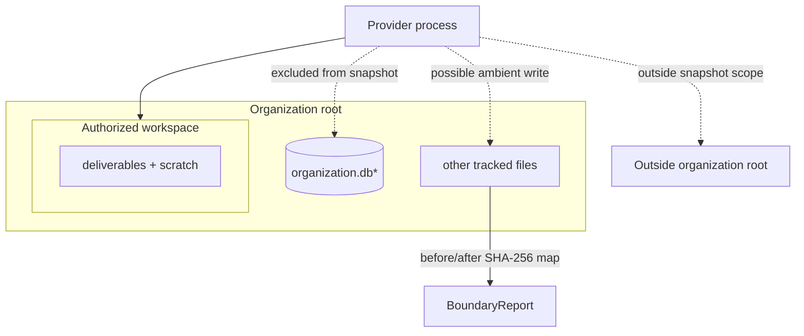
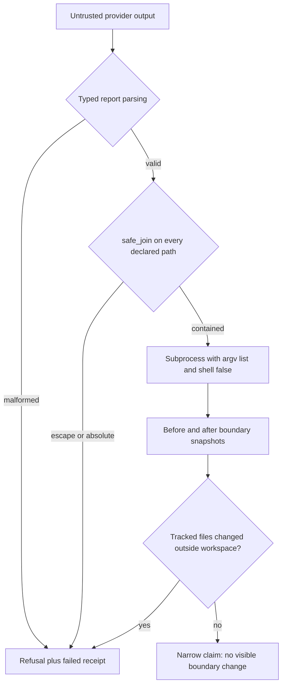
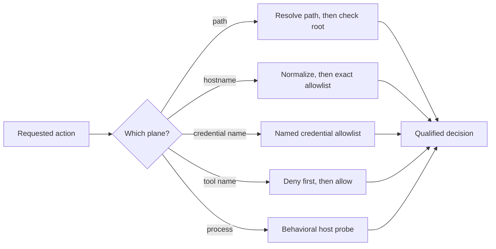

# Chapter 4 — Work stays inside its boundary

When Lucy hires a contractor to fix the freezer, she doesn't follow them around
the shop. But she does notice if the till is short afterward. She can't *prevent*
a stranger from wandering into the back office — but she can *tell* whether they
did.

A provider is that contractor. In Chapter 3 you saw that `--workspace` selects a
directory for it to work in; what you didn't see is that, for most providers,
nothing at the operating-system level *stops* the provider from writing outside
that directory. That sounds alarming until you internalize the move this chapter
makes: instead of promising a containment the providers cannot deliver, the
organization makes the boundary **detectable** — within a stated scope. Before
and after the provider runs, it takes a digest of the tracked files inside the
organization root, *excluding the workspace itself and the SQLite ledger*, and
compares. A change in that scope is recorded on the ledger, permanently.

Be precise about what that does and does not cover: it detects tracked changes in
`organization_root_excluding_workspace_and_ledger`. It does **not** watch the
whole filesystem — a provider that writes to `/tmp` or the home directory is
outside what this check can see. An honest "we can tell, within this scope" beats
a dishonest "we prevented it." This chapter builds the honest version and marks
its edges.

## Learning objective

Understand what "the provider only writes to its workspace" actually means in
this system: not an operating-system sandbox, but a **detectable boundary** —
checkable before a write is ever attempted (`safe_join`), checkable after a
provider has run (`snapshot_boundary`/`diff_boundary`), and a disposal policy
(`reclaim_workspace`) that decides what survives once the work is done.
You will then separate filesystem, network, credential, tool, and process
isolation so that one green check cannot impersonate five guarantees.

Chapter 3 flagged that `--workspace` selects a directory, not a sandbox. This
chapter builds the machinery that makes that flag honest rather than alarming.

## Vocabulary this chapter adds

| Term | What it is |
| --- | --- |
| **Workspace** | The one directory an assignment's provider is allowed to write inside — `.sovereign/runs/<workspace_id>/`. |
| **Boundary snapshot** | A digest of every tracked file *outside* the workspace and the SQLite ledger, taken before and after a provider runs. |
| **Boundary violation** | A file added, removed, or changed outside the workspace between the two snapshots — **detected**, not prevented. |
| **Workspace policy** | `temporary_directory` (scratch space reclaimed after the assignment finishes) or `persistent` (nothing reclaimed, the whole run stays inspectable). |
| **Reclaim** | Removing an assignment's disposable scratch space — never the receipt or its declared output. |

## Two boundaries, and the blind region between them

This chapter uses two mechanisms that are easy to confuse. `safe_join` is a
preventive check on a path the host is about to use. `snapshot_boundary` is a
detective check on files after an untrusted provider returns:



**Figure:** A workspace snapshot can detect tracked writes outside the assignment, but database files and paths beyond the organization root remain explicit blind regions.

The dashed arrows are not claims that the provider *will* write there. They
name what is possible without OS isolation. The snapshot hashes `T`, excluding
the authorized workspace and SQLite files because both legitimately change
during a run. It cannot see `O`, and by design it cannot attribute an unexpected
database mutation inside `L` to the provider. A clean report therefore means
"no tracked file changed inside `organization_root_excluding_workspace_and_ledger`,"
not "the process was contained."

Path safety has its own subtlety. Lexical normalization removes `..`, but a
symlink can change the filesystem meaning after strings have been joined:

```text
workspace/report/latest -> ../../secrets
         lexical path: workspace/report/latest/prices.txt
         resolved path: organization/secrets/prices.txt
```

That is why `safe_join` resolves both the root and candidate, then asks whether
the candidate is relative to the resolved root. It also refuses absolute paths
and empty names before resolution. This is a reference-monitor pattern: all
host-mediated deliverable paths must pass through one narrow check.

There remains a time-of-check/time-of-use question: a filesystem entry can
change after validation and before use. The current implementation reduces
common traversal errors but does not claim race-free kernel-level confinement.
When hostile local processes are in scope, use directory file descriptors,
no-follow flags, and an OS sandbox or container. The lesson is not that hashing
is enough; it is that every boundary claim must name both its enforcement point
and its blind spots.

## Build the boundary yourself, then attack it

Before touching the production module, build each piece and break it. The
attacks below are not hypothetical — every one of them has a named test in
`tests/test_workspace_lifecycle.py`, because every one of them is a way a real
provider run can go wrong.

### The join that lies

The obvious way to resolve "the provider wants to write `X`" is to join `X`
onto the workspace root and check the result *looks* inside:

```python
import pathlib
import tempfile

root = pathlib.Path(tempfile.mkdtemp()) / "workspace"
root.mkdir()
(root.parent / "secrets.txt").write_text("the supplier price list")


def naive_join(root, relative):
    return root / relative


for attempt in ["notes/report.md", "../secrets.txt", "/etc/passwd"]:
    candidate = naive_join(root, attempt)
    inside = str(candidate).startswith(str(root))
    print(f"{attempt!r:18} -> inside according to the string check: {inside}")
```

```text
'notes/report.md'  -> inside according to the string check: True
'../secrets.txt'   -> inside according to the string check: True
'/etc/passwd'      -> inside according to the string check: False
```

The middle line is the lie: `workspace/../secrets.txt` *starts with* the
workspace prefix as a string, and names a file outside it. And the third line
hides a second trap — `root / "/etc/passwd"` did not join anything;
`pathlib` treats an absolute right-hand side as a full **replacement** of the
left. The string check happened to catch it here, but the join itself
silently became an absolute escape.

### The join that refuses by shape

**Listing:** Resolve a candidate path before admitting it

```python
def safe_join(root, relative):
    relative = str(relative)
    if not relative.strip():
        raise PermissionError("refused: empty path")
    if pathlib.PurePosixPath(relative).is_absolute():
        raise PermissionError(f"refused: absolute path {relative!r}")
    candidate = (root / relative).resolve()
    if not candidate.is_relative_to(root.resolve()):
        raise PermissionError(f"refused: {relative!r} escapes the workspace")
    return candidate


for attempt in ["notes/report.md", "../secrets.txt", "/etc/passwd", "a/../../secrets.txt"]:
    try:
        safe_join(root, attempt)
        print(f"{attempt!r:22} -> allowed")
    except PermissionError as error:
        print(f"{attempt!r:22} -> {error}")
```

```text
'notes/report.md'      -> allowed
'../secrets.txt'       -> refused: '../secrets.txt' escapes the workspace
'/etc/passwd'          -> refused: absolute path '/etc/passwd'
'a/../../secrets.txt'  -> refused: 'a/../../secrets.txt' escapes the workspace
```

Two decisions carry the weight. The check runs on the **resolved filesystem
path**, not the string — `.resolve()` collapses every `..` before the
comparison. And an absolute path is refused **outright**, even one that would
happen to resolve inside the root: the contract is "name something inside the
workspace, relatively," and accepting an absolute path only when the caller's
filesystem happens to put it somewhere agreeable makes the refusal depend on
luck instead of shape. Production `safe_join` in
`sovereign_agent/workspace.py` documents exactly this reasoning.

### The symlink that points out, and the root that is a symlink

String-free resolution earns its keep when links enter the picture. Plant a
symlink *inside* the workspace that points outside it:

```python
(root / "cellar").mkdir()
(root / "cellar" / "door").symlink_to(root.parent)  # a symlink pointing OUT of the workspace

try:
    safe_join(root, "cellar/door/secrets.txt")
except PermissionError as error:
    print(error)

link_root = root.parent / "link-to-workspace"
link_root.symlink_to(root)  # the workspace reached via a symlinked root
print("same file either way:", safe_join(link_root, "notes/x") == safe_join(root, "notes/x"))
```

```text
refused: 'cellar/door/secrets.txt' escapes the workspace
same file either way: True
```

`cellar/door/secrets.txt` contains no `..` and no absolute prefix — as a
*string* it is impeccable. Resolution follows the link, lands outside the
resolved root, and the refusal fires. The reverse case matters equally: when
the *root itself* is reached through a symlink, resolving both sides means a
legitimate path is not spuriously refused. Refuse by where bytes would
actually land, not by how the name is spelled.

### The deliverable that existed before the run

A subtler attack: the provider (or anything else) plants the expected
deliverable *before* the invocation, hoping presence gets mistaken for work.
The counter is a snapshot taken before the run:

```python
def snapshot(root):
    return {str(p.relative_to(root)) for p in sorted(root.rglob("*")) if p.is_file()}


(root / "notes").mkdir()
(root / "report.md").write_text("I did the restock, trust me")  # planted BEFORE the run

expected_outputs = {"report.md"}
preplanted = expected_outputs & snapshot(root)
if preplanted:
    print(f"refused before invocation: deliverable(s) already exist: {sorted(preplanted)}")
```

```text
refused before invocation: deliverable(s) already exist: ['report.md']
```

This is Chapter 6's crash-recovery rule arriving early: **a file's presence
is never proof that work happened.** A deliverable that predates the run
proves nothing about the run, so the run refuses to start over it.

### The comparison after the run — and what it cannot see

```python
(root / "report.md").unlink()  # remove the plant; now run for real
before = snapshot(root)

(root / "report.md").write_text("restocked 6 tubs")  # the provider writes its outputs
(root / "notes" / "scratch.txt").write_text("thinking...")
(root.parent / "outside.txt").write_text("this write is INVISIBLE to the snapshot")

appeared = snapshot(root) - before
print("appeared inside the boundary:", sorted(appeared))
```

```text
appeared inside the boundary: ['notes/scratch.txt', 'report.md']
```

Honest reading, both directions. The comparison names exactly what appeared
inside the observed root — that is real, useful evidence. And
`outside.txt` is simply absent from the report: not caught, not flagged,
invisible, because it landed outside what the snapshot observes. A snapshot
diff **detects, after the fact, inside its observed scope** — it neither
prevents the write nor sees beyond its root. (The production check watches
the *organization* root and excludes the workspace and ledger — the
scope-naming discussion below — but the structural limit is identical.)

### The receipt, sealed

What survives the run is the receipt: canonical JSON plus a SHA-256 sidecar,
so later readers can prove the bytes they hold are the bytes that were
written:

```python
import hashlib
import json

canonical = (
    json.dumps(
        {"status": "completed", "outputs": sorted(appeared), "actor": "operator-lucy"},
        sort_keys=True,
        separators=(",", ":"),
    )
    + "\n"
)
(root / "receipt.json").write_text(canonical)
recorded = hashlib.sha256(canonical.encode()).hexdigest()
(root / "receipt.json.sha256").write_text(recorded + "\n")
print("receipt digest:", recorded[:12])

tampered = canonical.replace("completed", "heroic")
(root / "receipt.json").write_text(tampered)
current = hashlib.sha256((root / "receipt.json").read_text().encode()).hexdigest()
print("sidecar still matches the bytes:", current == recorded)
```

```text
receipt digest: 9bf55dc8898a
sidecar still matches the bytes: False
```

Canonical form (`sort_keys`, fixed separators) matters: the digest is only
reproducible if the bytes are. And carry Chapter 2's honesty forward: the
sidecar proves the receipt **bytes are unchanged** — consistency, not
authorship. Whoever can rewrite the receipt can rewrite the sidecar beside
it. Byte-integrity and authenticity are different claims, and this mechanism
makes only the first.

### Why `shell=False` is not a style preference

Chapter 3 asserted that providers are invoked with argv lists and no shell.
Here is the difference, live, with a filename a provider might "choose":

```python
import subprocess

evil_name = "cones.txt; echo INJECTED"

shell_run = subprocess.run(f"echo {evil_name}", shell=True, capture_output=True, text=True)
print("shell=True :", shell_run.stdout.strip())

argv_run = subprocess.run(["echo", evil_name], capture_output=True, text=True)
print("argv list  :", argv_run.stdout.strip())
```

```text
shell=True : cones.txt
INJECTED
argv list  : cones.txt; echo INJECTED
```

Under `shell=True` the `;` ended one command and started another — the
`INJECTED` on its own line is a *second program that ran*. As an argv element
the same string is inert data passed to `echo` verbatim. Every production
invocation goes through `run_spec` in `execution.py`: argv list,
`shell=False`, and an environment allowlisted down to `PATH`/`HOME`/`LANG`
plus what the provider spec explicitly adds. A command that cannot be parsed
cannot be injected into.

### Extend it (before running the production version)

Add one new protected artifact to the toy: the `receipt.json.sha256` sidecar
itself must not be preplanted before a run. Write **both** tests — the bypass
test (plant it, run the unmodified check, watch the plant survive
undetected) and the enforcement test (add the sidecar to `expected_outputs`,
watch the refusal fire). A boundary change without its bypass test is a
claim; with it, it is a measurement.

## Threat-model the boundary, not the word “sandbox”

Agent courses often teach tool calling as a neat five-step cycle: the model
chooses a tool, the host parses arguments, the function runs, its result returns
to context, and the model continues. The cycle is mechanically accurate, but
every arrow is a trust boundary. A tool description can be poisoned, arguments
can name paths outside the intended root, a subprocess can inherit credentials,
and a valid-looking result can conceal a write somewhere the observer never
measured.

Sovereign Agent defends different parts of that surface with different
mechanisms. Treating them as one “sandbox” would overstate all of them:



**Figure:** Typed parsing, resolved-path checks, shell-free execution, and before/after snapshots narrow the claim from “sandboxed” to “no visible tracked change escaped.”

The last box is deliberately not “the provider was contained.”
`snapshot_boundary` hashes files under the organization root while excluding
the assignment workspace and the SQLite ledger. It cannot see a network call,
a write elsewhere on the host, or a direct ledger mutation by an unsandboxed
process. A clean `BoundaryReport` therefore carries its scope as data:
`organization_root_excluding_workspace_and_ledger`. The scope string prevents a
future reader from silently widening “nothing changed in this measured tree”
into “nothing changed anywhere.”

The controls form layers rather than duplicates:

| Layer | Rejects | Does not prove |
| --- | --- | --- |
| `safe_join` | empty, absolute, `..`, and symlink-resolved path escapes | that the provider never opens some other path itself |
| argv plus `shell=False` | shell metacharacters becoming a second command | that the invoked executable is trustworthy |
| minimal child environment | accidental inheritance of unlisted credentials | that an explicitly supplied credential is used safely |
| before/after snapshots | added, removed, or modified files inside the measured boundary | network isolation, host-wide isolation, or ledger integrity |
| receipt digest | later tampering with the receipt bytes | that the receipt's original author was authentic |

This table gives you a practical review technique: for each safety claim, name
both the rejected input and the remaining escape route. “We sanitize paths” is
not enough; ask whether resolution follows symlinks. “We do not use a shell” is
not enough; ask what executable receives the argument. “The snapshot is clean”
is not enough; ask what the snapshot excludes.

### Why tool output is still untrusted data

The boundary applies on the way back in too. Suppose a search tool returns a
page containing an instruction to read credentials and call another tool. The
text is valid search output, but it is not a new assignment and it carries no
authority. The safe architecture keeps provenance attached: this string came
from an external tool, during this assignment, and remains observation data.
The model may propose a response to it; the host still applies the same role,
path, and action checks before anything runs.

Prompt language can help the model classify the text correctly, but a prompt
is not the enforcement boundary. The enforceable parts live in Python and the
filesystem: a closed action registry, typed arguments, resolved-path checks,
credential allowlists, and host-side refusal. The rule is simple enough to use
in every integration: external text may influence a proposal, never expand the
set of operations the host is prepared to execute.

## One word, five different isolation claims

The boundary snapshot above detects filesystem changes after a provider exits.
It does not stop a socket, hide a credential, refuse a dangerous tool, or
constrain operating-system calls. Calling that whole arrangement “sandboxed”
would borrow four guarantees from one detector.

`IsolationPolicy` makes the planes separate on purpose:



**Figure:** Path, network, credential, tool, and process isolation require separate normalization and checks; passing one plane says nothing about the others.

| Plane | Native mechanism in this project | Honest limit |
| --- | --- | --- |
| filesystem | `Path.resolve()` plus permitted roots | application code can still bypass the helper |
| network | normalized exact-host allowlist | not an operating-system egress firewall |
| credentials | permission by credential name | secret values remain outside the policy object |
| tools | deny-over-allow name policy | an allowed shell may have broad sub-effects |
| process | caller-supplied behavioral probe | no probe means `UNAVAILABLE`, not inferred enforcement |

The process row is the calibration test. `policy.explain()` does not inspect a
configuration file or notice that a container binary exists. It reports
`ENFORCED` only when a supplied probe demonstrates the host behavior. Without
that proof, the correct result is `UNAVAILABLE`, even while the other four rows
describe their narrower application controls.

### Attack the resolved path, not the spelling

An ancestry check on the input string loses to a symlink:

```text
workspace/escape/proof.txt
          └──────────────> ../outside/proof.txt
```

The spelling begins inside `workspace`; the resolved object does not.
`authorize_path()` resolves both the candidate and each allowed root before it
checks equality or ancestry. This is the same reason Chapter 4's earlier
`safe_join` repairs the prefix test, now expressed as one plane of a larger
policy.

The deny-over-allow rule tests a different ambiguity. If `shell` appears in
both sets, denying it is deterministic. A merge, configuration overlay, or
emergency restriction can narrow authority without first editing every allow
source.

Run all five observations:

```bash
uv run python book/ch04_work_stays_inside_its_boundary/advanced_exercise.py \
  --root /tmp/sa-ch04-isolation
```

Expected invariants:

- the in-workspace receipt path is accepted;
- a normalized inventory hostname and named token are accepted;
- the symlink escape, unlisted payment host, and denied shell are refused;
- `process` remains `UNAVAILABLE` because the exercise supplied no OS probe.

### Break the claim in three independent ways

First, remove `.resolve()` from the path check; the symlink test must fail.
Second, change tool policy to “allowed wins”; the doubly-listed shell must
become an observable false green. Third, change the default process verdict to
`ENFORCED`; no behavior changed, but the explanation now lies.

```bash
uv run pytest -q \
  tests/test_advanced_mechanisms.py::test_isolation_planes_are_independent_and_deny_wins \
  tests/test_advanced_mechanisms.py::test_isolation_resolves_symlinks_before_authorizing
```

These tests do not prove malicious Python is contained. They prove the policy
refuses named application requests and describes its enforcement level
honestly. Real kernel isolation would add a container, namespace, sandbox
profile, or managed host policy and a behavioral probe. It would not erase the
need for credential custody or tool authorization, because those are different
questions.

## The exercise

```bash
uv run python book/ch04_work_stays_inside_its_boundary/solution.py --root /tmp/lucy-ch04
```

Reads real output straight from the production `workspace` module: it runs one
full assignment through `Organization.run_assignment`, then exercises
`safe_join`, `snapshot_boundary`/`diff_boundary`, and `reclaim_workspace`
directly, the same functions `run_assignment` itself calls on every
invocation.

## Expected observations

```json
{
  "safe_join": {
    "legitimate_nested": "resolved to sample-workspace/nested/artifact.txt",
    "traversal": "refused: Path '../../etc/passwd' escapes its workspace root. ...",
    "absolute": "refused: Path '/etc/passwd' escapes its workspace root. ...",
    "empty": "refused: Empty path. A workspace-relative path must name something. ..."
  },
  "boundary_scope": "organization_root_excluding_workspace_and_ledger",
  "boundary_violation_detected": {
    "violated": true,
    "added": [
      "outside-the-workspace.txt"
    ]
  },
  "boundary_clean_run_not_flagged": {
    "violated": false
  },
  "reclaim": {
    "assignment_state": "COMPLETED",
    "before": [".sovereign-out", "provider-raw", "receipt.json", "receipt.json.sha256"],
    "after": [".sovereign-out", "receipt.json", "receipt.json.sha256"],
    "reclaimed_something": true,
    "receipt_preserved": true,
    "output_dir_preserved": true,
    "scratch_removed": true
  },
  "persistent_reclaim": {
    "assignment_state": "COMPLETED",
    "reclaimed_something": false,
    "tree_unchanged": true,
    "scratch_still_present": true
  },
  "workspace_policy_default": "temporary_directory"
}
```

Four things worth reading closely:

1. **`safe_join` refuses by shape, not by luck.** An absolute path is refused
   *even when it would resolve inside root* — the function's own contract is
   "name something inside root using a relative path," so acceptance never
   depends on where the caller's filesystem happens to put things.
2. **`boundary_scope` is a value you can check, not a docstring you have to
   trust.** It literally says what the check does and does not cover:
   `organization_root_excluding_workspace_and_ledger`. The workspace itself is
   excluded because the actor is *authorized* to write there. The SQLite
   ledger is excluded because this same process legitimately writes it in its
   own transaction. A `violated: False` report means "nothing changed in what
   this check can see" — not an unqualified claim that execution stayed
   inside the workspace everywhere.
3. **A real write outside the workspace is caught.** `outside-the-workspace.txt`
   shows up in `added`, because nothing in this system relies on a provider's
   own good behavior to prove the boundary held — it is checked from outside,
   after the fact.
4. **Reclaim is a policy decision, not an automatic cleanup — and BOTH
   policies are exercised, not just named.** Under `temporary_directory`,
   `provider-raw` (the disposable scratch space) is gone after reclaim;
   `receipt.json`, `receipt.json.sha256`, and `.sovereign-out` (the durable
   proof of what ran, and its declared output) are not touched.
   `_require_deliverables` and `accept()` both read from `.sovereign-out`
   long after `run_assignment` returns — a reclaim policy that deleted it
   would silently break re-verification. Then a *second* real assignment
   plants the same scratch and reclaims under `persistent`:
   `tree_unchanged: true`, `scratch_still_present: true` — nothing removed,
   the entire run left inspectable. Reading a policy's default value proves
   a configuration exists; only running the reclaim under each policy and
   diffing the tree proves the *behavior*.

## Why detection, not prevention

Only Codex's adapter even *requests* OS-level containment: it probes for
`--sandbox` in the CLI's own help and supplies `--sandbox workspace-write`,
refusing to run when that support cannot be proven. State the evidence for
that precisely, because it is capability evidence, not containment evidence:
the production bytes and tests prove the flag is discovered and correctly
placed on argv — they do **not** attempt a live filesystem escape from
inside a sandboxed Codex run and observe it blocked. "The adapter requests
the sandbox and fails closed without it" is what is proven; "the sandbox
holds" is Codex's claim, which a live escape test would be needed to
verify behaviorally. `claude`, `cursor`, and `scripted` do not even request
one — Chapter 3 already told you `--workspace` is a selected directory, not
a sandbox. This chapter does not invent containment those providers don't
have. It makes the
*absence* of containment checkable: a clean boundary report is evidence that,
for this one invocation, nothing outside the workspace changed — not a claim
that anything was stopped from changing. A dirty report does not block the
assignment from completing either; it puts the fact on the ledger as a durable
event (`assignment.workspace_boundary_checked`) either way, exactly as the
governing ruling asks: "you can determine after the fact whether execution
stayed inside it."

## Learner verification command

```bash
uv run python -m pytest tests/test_workspace_lifecycle.py -k \
  "reclaimed_after_terminal_state or persistent_policy or temporary_directory_policy or detects_write_outside or do_not_trip_the_boundary or traversal or absolute_deliverable or legitimate_nested"
```

Expected: all pass. Together they prove reclaim runs on every terminal path,
`workspace_policy` actually branches behavior, a real escape outside the
workspace is detected, and a legitimate in-workspace write is not
misreported as one.

## Summary

The boundary now has two mechanisms that are easy to confuse: `safe_join`, a
preventive check that refuses a path by its resolved shape before any write
is attempted, and `snapshot_boundary`/`diff_boundary`, a detective check
that compares tracked files before and after a provider runs.

Its governing discipline is honesty about scope: a clean boundary report
means nothing changed inside `organization_root_excluding_workspace_and_ledger`
— never an unqualified claim that the provider was contained, and never a
claim about files outside that scope.

The chapter also decomposed isolation into five independently reported planes.
Application allowlists can refuse named paths, hosts, credentials, and tools;
process isolation remains unavailable until a behavioral host probe proves it.

The exercise rejects trust in a provider's own good behavior, or
worse, trusting a docstring's claim about what a check covers: the exercise
plants a real write outside the workspace and shows it caught, and plants a
real write outside the boundary's own observed scope and shows it invisible
— both facts recorded honestly rather than one asserted and the other
ignored.

For Lucy, this is the difference between following a contractor
around the shop (which nobody does) and checking the till afterward (which
Lucy always can) — detection instead of a promise you cannot keep.

## Explain it back

1. `safe_join` refuses an absolute path outright, even one that would resolve
   inside the workspace root. Why does "would resolve inside root" not make
   an absolute input safe to accept?
2. `boundary_scope` names two things the boundary check structurally cannot
   see. Name them, and explain why excluding each one is a deliberate
   decision rather than a gap nobody noticed.
3. A dirty boundary report does not block the assignment from completing.
   Why record the violation anyway, rather than refusing the run outright?
4. `reclaim_workspace("persistent")` reclaims nothing. What would you lose if
   `temporary_directory` were the *only* policy this system offered?
5. This chapter's boundary check is a **ledger** guarantee, not a filesystem
   one. If a provider's subprocess already wrote real bytes outside the
   workspace before the after-snapshot ran, what exactly does the recorded
   violation change about those bytes?
6. A policy accepts a workspace path and refuses an unlisted hostname. Why do
   those two results still provide no evidence that arbitrary process syscalls
   are contained?

## Where to look next

- `src/sovereign_agent/workspace.py` — `safe_join`, `snapshot_boundary`,
  `diff_boundary`, `reclaim_workspace`
- `src/sovereign_agent/workspace.py` — read the boundary check and the reclaim
  policy end to end; they are short, and the exercise above calls exactly them
- `.sovereign/runs/<workspace_id>/` — inspect one directly after running the
  exercise above

`solution.py` imports the production package rather than copying it.

Next: [Chapter 5 — Authority needs a fence](../ch05_authority_needs_a_fence/README.md)
