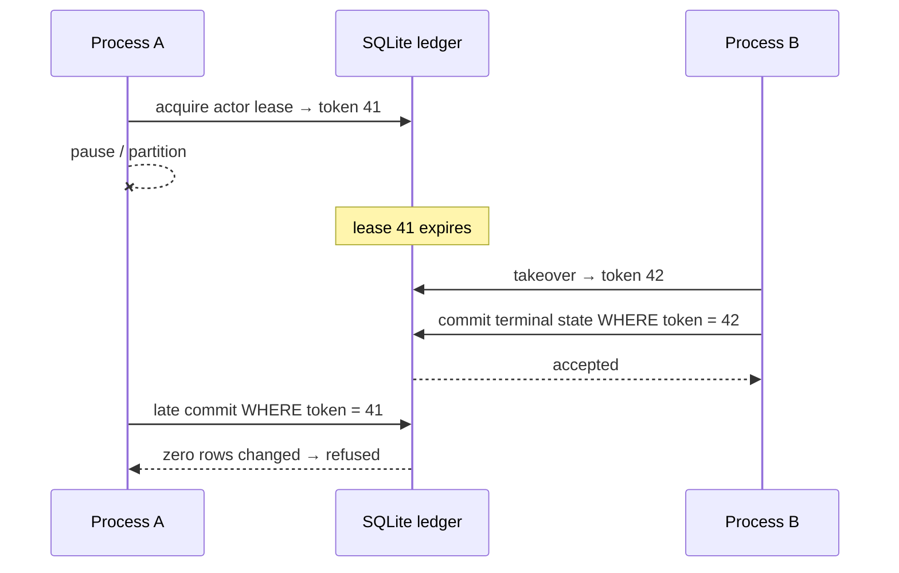
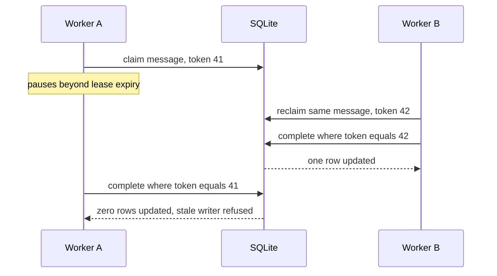
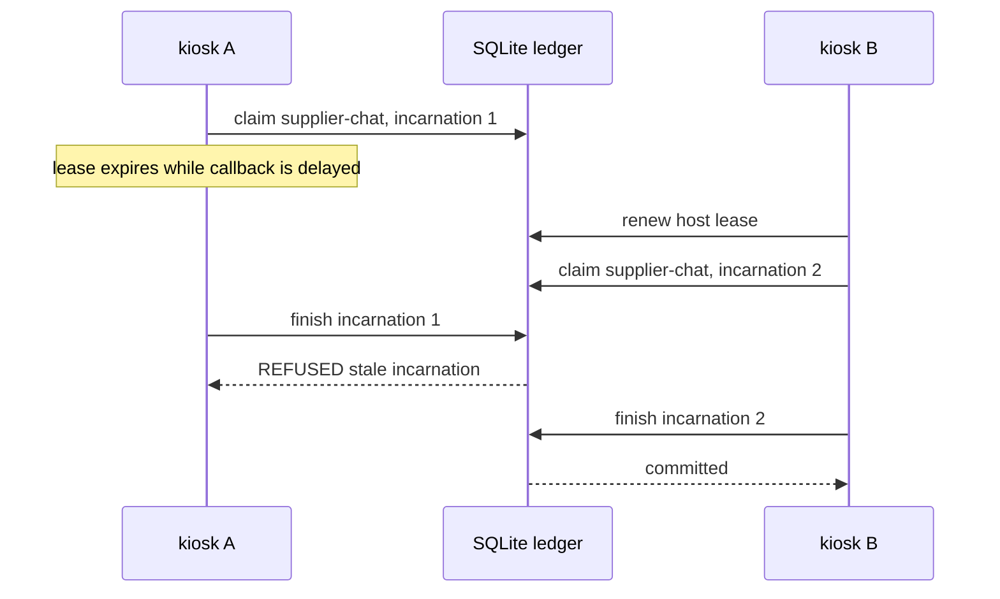

# Chapter 5 — Authority needs a fence

Two of Lucy's staff each believe they are closing tonight. One of them is wrong —
maybe they swapped shifts and forgot, maybe one went home and came back. It does
not matter *why*. What matters is that only one person can count the till, lock
the freezer, and set the alarm, and the shop must never let *both* do it, because
two people each doing "the closing" is how money goes missing and doors get left
open.

Software has exactly this problem, and it is sneakier there. A worker process
crashes and gets restarted; for a moment, *two* processes both believe they are
the same actor, `operator-course`, finishing the same job. If both are allowed to
write "done," the ledger ends up with two conflicting truths. This chapter builds
the fence that makes that impossible — not by trusting workers to behave, but with
a numbered claim (think of it as a numbered key) that only one process can hold at
a time, where every handover mints a *higher* number so a stale worker's old key
simply stops turning.

## Learning objective

Understand the difference between an **actor** (a durable, governed identity)
and a **process** (one running instance of the program), and why the ledger
needs to fence at both levels: two different *processes* claiming to be the
same actor is the ordinary shape of a crashed-and-restarted worker, and
nothing before this chapter's mechanism could tell them apart.
You will extend that argument to multi-host sessions, where a monotonically
increasing incarnation prevents an old callback from finishing a newer claim.

## Vocabulary this chapter adds

| Term | What it is |
| --- | --- |
| **Process identity** | A fresh, random id (`proc_<uuid4>`) minted once per running `Organization` instance — **never a PID**, because PIDs are reused by the operating system. |
| **Actor lease** | A compare-and-set claim that one process identity may host one actor right now. Exclusive, renewable, expires. |
| **Fencing token** | A number drawn from one shared, strictly increasing counter. A takeover always mints a token higher than any the previous holder ever saw, so a resumed stale process can never present a token that still compares as current. |
| **Execution attempt** | A compare-and-set claim that one process may write ONE assignment's terminal state (`COMPLETED`/`BLOCKED`/`FAILED`) — bound to, and re-verified against, the actor lease that was live when it was acquired. |

## The central guarantee, in one sentence

**A worker that no longer holds the current lease may not commit completion,
mutate canonical execution state, acknowledge mailbox work, or reclaim the
active workspace.**

## Why a lease alone is insufficient

A lease answers "who should be working now?" It cannot erase a process that was
paused before expiry and resumes afterward. That stale process still has memory,
open file descriptors, and a sincere belief that it owns the work. The fencing
token makes the *resource* reject it:



**Figure:** A monotonically increasing fencing token lets the database reject Process A's late commit after Process B has acquired newer authority.

The safety property comes from the `WHERE` clause at the terminal write, not
from comparing wall clocks in Python. Time tells the system when takeover is
allowed; monotonic tokens tell the protected resource which generation is
current. This distinction is why fencing remains safe under pause, scheduling
delay, or network partition after a lease expires.

There are three nested claims in production:

| Scope | Identity being fenced | Protected terminal act |
| --- | --- | --- |
| Actor lease | process hosting an actor | acquire/renew/release actor authority |
| Execution attempt | process running one assignment | write assignment terminal state |
| Mailbox claim | actor handling one message | complete or dead-letter the message |

An execution attempt stores the actor-lease token from which it descended. A
caller cannot present an arbitrary integer: `acquire_execution_attempt()` reads
the current actor lease and verifies both actor and token. The terminal
transaction then checks the attempt is still current before it writes success.
The two levels close different races—actor takeover and assignment takeover—and
neither can substitute for the other.

One useful mental model is a versioned capability: possession of token 41 was
authority in generation 41, but authority is never timeless. Renewal preserves
the token because it is the same generation; takeover mints a higher token
because it is a new one. Equality authorizes the write, and monotonic ordering
explains why every older capability is stale.

## Build the mailbox yourself, then break it

The fence is easiest to understand where the organization first needed it: the
**mailbox** — durable messages that workers claim, work, and complete. Build
it on real table rows, wrong version first.

```python
import sqlite3

db = sqlite3.connect(":memory:")
db.executescript("""
    CREATE TABLE messages (id TEXT PRIMARY KEY, body TEXT, state TEXT NOT NULL,
                           claim_owner TEXT, fencing_token INT, retry_count INT DEFAULT 0);
    CREATE TABLE lease_tokens (token INTEGER PRIMARY KEY, kind TEXT);
""")
db.execute("INSERT INTO messages(id, body, state) VALUES ('msg-1', 'Restock vanilla', 'NEW')")
db.commit()
```

`lease_tokens` looks useless — one autoincrement column and a label. It is the
most important table in this chapter: **one shared, strictly increasing
counter**, from which every claim of every kind will draw its number. Hold
that thought.

### The claim that reads, then writes

The obvious claim: read the message's state, and if it is `NEW`, write your
name on it.

```python
def decide_from(state):  # the read half: the worker decides from what it SAW
    return state == "NEW"


def write_claim(db, message_id, actor_id):  # the write half
    db.execute(
        "UPDATE messages SET state = 'CLAIMED', claim_owner = ? WHERE id = ?",
        (actor_id, message_id),
    )
    db.commit()


a_saw = db.execute("SELECT state FROM messages WHERE id = 'msg-1'").fetchone()[0]
b_saw = db.execute("SELECT state FROM messages WHERE id = 'msg-1'").fetchone()[0]
print("worker-a saw:", a_saw, "-> decides to claim:", decide_from(a_saw))
print("worker-b saw:", b_saw, "-> decides to claim:", decide_from(b_saw))
write_claim(db, "msg-1", "worker-a")
write_claim(db, "msg-1", "worker-b")
owner = db.execute("SELECT claim_owner FROM messages WHERE id = 'msg-1'").fetchone()[0]
print("owner on disk:", owner)
```

```text
worker-a saw: NEW -> decides to claim: True
worker-b saw: NEW -> decides to claim: True
owner on disk: worker-b
```

The interleaving is spelled out — both reads happen before either write,
which is exactly what two busy processes produce — and the result is the
disease this chapter exists to cure: **both workers believe they own the
message.** Worker-a is off doing the restock right now, convinced the job is
its; the row says worker-b. Nothing crashed, nothing errored, and the shop
has two people counting one till. The production mailbox paid this exact
bill: the docstring of `relay.claim()` records that an earlier version "read
the message, decided in Python, and wrote it back: two connections both read
NEW, both wrote, and both believed they owned the lease."

### The claim that decides and writes in one statement

The repair is to collapse the read and the write into a single atomic
**compare-and-set**: the `WHERE` clause does the deciding, at the same
instant as the writing, and the row count tells you whether you won.

```python
def mint_token(db):
    return db.execute("INSERT INTO lease_tokens(kind) VALUES ('mailbox_claim')").lastrowid


def claim(db, message_id, actor_id):
    token = mint_token(db)
    cursor = db.execute(
        "UPDATE messages SET state = 'CLAIMED', claim_owner = ?, fencing_token = ?"
        " WHERE id = ? AND state = 'NEW'",
        (actor_id, token, message_id),
    )
    db.commit()
    if cursor.rowcount != 1:
        return f"{actor_id}: refused, not claimable"
    return f"{actor_id}: claimed with token {token}"


db.execute("UPDATE messages SET state = 'NEW', claim_owner = NULL, fencing_token = NULL")
db.commit()
print(claim(db, "msg-1", "worker-a"))
print(claim(db, "msg-1", "worker-b"))
```

```text
worker-a: claimed with token 1
worker-b: refused, not claimable
```

Exactly one winner, and no window in which both can believe otherwise: either
the row was `NEW` at the moment of the `UPDATE` or it was not, and SQLite
serializes the two. Note the claim also stamped a **fencing token** — number
`1`, drawn from the shared counter. That number is about to matter more than
the owner's name.

### Completing under the token, not the name

**Listing:** Complete work only under the current fencing token

```python
def complete(db, message_id, actor_id, fencing_token):
    cursor = db.execute(
        "UPDATE messages SET state = 'DONE' WHERE id = ? AND claim_owner = ?"
        " AND fencing_token IS ?",
        (message_id, actor_id, fencing_token),
    )
    db.commit()
    if cursor.rowcount != 1:
        return f"{actor_id}: refused, stale or wrong token"
    return f"{actor_id}: completed"


print(complete(db, "msg-1", "worker-a", 99))  # a token it was never issued
print(complete(db, "msg-1", "worker-a", 1))  # the token its own claim returned
```

```text
worker-a: refused, stale or wrong token
worker-a: completed
```

Two disciplines hide in these few lines. The token is checked **in the same
statement** that performs the write — never read from the row first and
compared in Python, because the row's own current token always matches
itself, which would make staleness undetectable by construction. And the
caller must *present* its token (production makes the argument keyword-only
with no default, so it cannot be silently skipped): the token must be the one
your own most recent successful claim returned, not something re-derived on
the spot.

### Leases: ownership that expires, and the token that guards the handover

`claim_owner == actor_id` alone is not exclusivity — it is the check that
made the pre-fencing mailbox *actor*-idempotent rather than
*process*-exclusive. Two processes hosting the same actor id both pass it.
The missing ingredients are a **lease** (ownership with an expiry) and the
rule for what happens at every handover:

```python
db.execute("ALTER TABLE messages ADD COLUMN claim_expires_at INT")
db.execute("INSERT INTO messages(id, body, state) VALUES ('msg-2', 'Order cones', 'NEW')")
db.commit()

LEASE_MINUTES = 15


def claim_leased(db, message_id, actor_id, now):
    row = db.execute(
        "SELECT claim_owner, fencing_token, claim_expires_at FROM messages WHERE id = ?",
        (message_id,),
    ).fetchone()
    owner, token, expires = row
    if owner == actor_id and expires is not None and expires > now:
        return f"{actor_id}: still mine, SAME token {token}"  # idempotent -- no new mint
    new_token = mint_token(db)
    cursor = db.execute(
        "UPDATE messages SET state = 'CLAIMED', claim_owner = ?, fencing_token = ?,"
        " claim_expires_at = ?"
        " WHERE id = ? AND (state = 'NEW' OR claim_expires_at <= ?)",
        (actor_id, new_token, now + LEASE_MINUTES, message_id, now),
    )
    db.commit()
    if cursor.rowcount != 1:
        return f"{actor_id}: refused, unexpired lease held by {owner}"
    return f"{actor_id}: claimed with FRESH token {new_token}"


print(claim_leased(db, "msg-2", "worker-a", now=0))
print(claim_leased(db, "msg-2", "worker-a", now=5))
print(claim_leased(db, "msg-2", "worker-b", now=10))
print(claim_leased(db, "msg-2", "worker-b", now=20))
print(claim_leased(db, "msg-2", "worker-a", now=25))
```

```text
worker-a: claimed with FRESH token 3
worker-a: still mine, SAME token 3
worker-b: refused, unexpired lease held by worker-a
worker-b: claimed with FRESH token 5
worker-a: refused, unexpired lease held by worker-b
```

Read the five lines as a timeline of one message's life:

```text
minute  0   worker-a claims ................... token 3, lease until 15
minute  5   worker-a retries .................. SAME token 3 (idempotent)
minute 10   worker-b contends ................. refused, lease still live
minute 15   -- worker-a's lease expires --
minute 20   worker-b takes over ............... FRESH token 5, lease until 35
minute 25   worker-a resumes, tries again ..... refused, worker-b holds it
```

The two claim outcomes for the *same* owner are the heart of the design. A
retry **inside** your own lease window returns the **same** token — that is
what makes retries idempotent rather than a silent takeover of your own
lease (minting a fresh token here would invalidate your own in-flight
completion). But a claim after your lease lapsed — even by *you* — falls
through into the CAS exactly like any contender's, and wins it only by
minting a **fresh, strictly greater** token. The production mailbox got this
wrong the first time: the original same-owner short-circuit fired
unconditionally, even when that owner's lease had already expired, which
made the CAS's expired-lease branch unreachable for the owner — only a
*different* actor could ever take over from a lapsed worker. The gap was
recorded as a named limit in a dated ruling rather than silently patched,
and closed properly once fencing tokens existed to define what a takeover
even means.

### Why the takeover mints a fresh token

Because of what happens next. Worker-a is *still running* — it never crashed,
it just stalled past its lease. It finishes the work and tries to complete
with the token its claim returned:

```python
print(complete(db, "msg-2", "worker-a", 3))  # the token a's lapsed claim returned
print(complete(db, "msg-2", "worker-b", 5))  # the current holder's token
```

```text
worker-a: refused, stale or wrong token
worker-b: completed
```

This is the fence doing its one job. Nothing stopped worker-a from running —
fencing is not an OS sandbox, and a stale worker can burn CPU, write files,
even finish the task. What it cannot do is make its result **canonical**: its
token no longer matches the durable row, and the same-statement check refuses
the write. The tokens work because they come from **one shared counter in the
database** — durable, monotonic, visible to every contender. Tokens from
process memory would restart from zero with the process; timestamps would
tie; and the operating system's PIDs get *reused*, which is why process
identity in production is a fresh `uuid4`, never a PID.

### Retries are budgeted, and the budget ends somewhere honest

A message that keeps failing must neither vanish nor loop forever:

```python
MAX_RETRIES = 3


def dead_letter(db, message_id, presented_token):
    retry = db.execute("SELECT retry_count FROM messages WHERE id = ?", (message_id,)).fetchone()[0]
    if retry < MAX_RETRIES:
        cursor = db.execute(
            "UPDATE messages SET state = 'NEW', claim_owner = NULL, claim_expires_at = NULL,"
            " fencing_token = NULL, retry_count = retry_count + 1"
            " WHERE id = ? AND fencing_token IS ?",
            (message_id, presented_token),
        )
        verdict = "retried"
    else:
        cursor = db.execute(
            "UPDATE messages SET state = 'DEAD' WHERE id = ? AND fencing_token IS ?",
            (message_id, presented_token),
        )
        verdict = "dead-lettered"
    db.commit()
    if cursor.rowcount != 1:
        return "refused: stale in-memory message, re-read before retrying"
    return verdict


db.execute("INSERT INTO messages(id, body, state) VALUES ('msg-3', 'Call the supplier', 'NEW')")
db.commit()
for attempt in range(4):
    claim_leased(db, "msg-3", "worker-a", now=100 + attempt)
    token = db.execute("SELECT fencing_token FROM messages WHERE id = 'msg-3'").fetchone()[0]
    print(f"attempt {attempt}: {dead_letter(db, 'msg-3', token)}")
print("final:", db.execute("SELECT state, retry_count FROM messages WHERE id = 'msg-3'").fetchone())
```

```text
attempt 0: retried
attempt 1: retried
attempt 2: retried
attempt 3: dead-lettered
final: ('DEAD', 3)
```

Even this administrative transition presents the token (`fencing_token IS ?`
— SQLite's null-safe comparison, so it matches correctly when the token is
`NULL`, a never-claimed message's own starting state). A stale in-memory
copy of the message — read before a fresher claim took over the row — must
not be able to drive a retry or a dead-lettering either; the refusal tells
the caller to re-read, not to force. `DEAD` is a terminal parking spot a
human can inspect, not a deletion: the message, its body, and its retry
history all remain on the ledger.

**Two honest limits of this toy, both deliberate.** First, notice the token
numbers in the outputs skip (1, 3, 5…): the toy mints a token *before* the
CAS and commits it even when the claim is refused, burning numbers.
Production mints **inside the same `BEGIN IMMEDIATE` transaction** as the
CAS it fences, so a refused claim's mint rolls back with it. Either way the
guarantee is untouched — what matters is that tokens are *monotonic*, not
*dense*. Second, the toy passes `now` in as a parameter rather than reading
a clock — which is exactly what production does too (`clock:
Callable[[], datetime]`, injectable), because lease-expiry tests that
depend on real `sleep()` are slow and flaky, and a fake clock you can
advance makes every expiry case in this chapter a fast, deterministic
assertion.

The production versions of everything you just built live in
`src/sovereign_agent/relay.py` — `claim()` (the CAS with the same-owner
idempotency and expired-lease takeover), `complete()` (keyword-only
required token, same-statement check), and `dead_letter()` (budget,
null-safe token check, terminal `DEAD`) — with `_mint_claim_token` drawing
from the same `lease_tokens` counter that `fencing.py` uses for actor
leases and execution attempts. One counter, every fence: that is what makes
"a strictly higher token than any minted before it, forever" a property of
the *organization*, not of one table.

## The stale-writer problem, one interleaving at a time

A lease answers “who may work during this interval?” A fencing token answers a
different question: “is this completion still from the newest winning claim?”
You need both because expiry does not stop a process. A paused worker can wake
after its lease expired, still holding the same actor id and the same in-memory
message, and attempt to commit late.



**Figure:** Lease expiry permits takeover, while the token predicate prevents the superseded worker from completing the same message afterward.

Checking only `claim_owner == actor_id` fails when both processes host the same
durable actor. Checking only time fails because clocks do not revoke a process's
memory or file descriptors. The monotonically increasing token makes each
successful takeover a new epoch. The final `UPDATE` compares the caller's token
inside the same SQL statement that performs the state change. It never reads the
current token and hands it back to the caller, because a value re-derived from
the row will always agree with itself and cannot reveal staleness.

This is a small form of the ABA problem. A row can appear to return to a familiar
shape while its ownership history changed underneath a paused reader:

| Moment | Durable state | What worker A remembers | Is A still entitled to commit? |
| --- | --- | --- | --- |
| A claims | `CLAIMED`, A, token 41 | A, token 41 | yes |
| lease expires | `CLAIMED`, A, token 41 | A, token 41 | no new work, but nothing erased its memory |
| B reclaims | `CLAIMED`, B, token 42 | A, token 41 | no |
| B retries to NEW | `NEW`, no owner | A, token 41 | still no |
| A completes late | guarded update matches zero rows | A, token 41 | refused |

The important comparison is not merely A versus B. It is epoch 41 versus epoch
42. The same actor process reclaiming its *own* expired lease also receives a
fresh token; an older instance under that same actor id remains fenced out.

### Retries need an ending state

Fencing prevents stale commits, but it does not decide how many times a failed
message should return to the queue. `dead_letter` owns that policy. It compares
the presented token atomically, increments a bounded retry counter, clears the
claim when another attempt is allowed, and finally moves the message to `DEAD`.
Without the terminal state, a permanently malformed message can keep an
always-on loop busy forever. Without the same token check, a stale in-memory
copy can overwrite a newer claim while “helpfully” scheduling a retry.

Separate the questions when designing a queue:

1. **Eligibility:** is the message new, or has its prior lease expired?
2. **Exclusivity:** did this compare-and-set win at the moment of update?
3. **Freshness:** does the completion present the current fencing token?
4. **Budget:** has the message exhausted its allowed retries?
5. **Terminal truth:** is the final state `DONE` or `DEAD`, and which event
   explains how it got there?

A queue that answers only the first question is a polling table. The other four
are what make it safe under pauses, crashes, retries, and duplicated workers.

## A conversation needs its own incarnation

The actor lease fences organizational work, but a long-lived conversation has
another identity problem. The same actor can resume the same session from a
second host after the first host's lease expires. If a delayed callback from
host A later says “finished,” actor id and session id still match. Neither name
proves that A belongs to the current run.

The coordination layer separates three identities:

| Identity | Example | What it answers |
| --- | --- | --- |
| actor | `operator-course` | which organizational role is acting? |
| host | `kiosk-a` | which runtime currently holds a renewable lease? |
| session incarnation | `supplier-chat`, generation 2 | which continuous claim may finish this session? |

An incarnation is a monotonically increasing generation attached to one
session. A same-host renewal can retain the generation. A takeover by another
host, or any claim after expiry, increments it.



**Figure:** A session incarnation distinguishes successive claims even when the session name repeats, making a delayed completion from the prior incarnation harmless.

`finish_session()` re-reads both rows inside one immediate transaction. It
requires the current session host, exact incarnation, unexpired session lease,
and unexpired host lease before inserting the completion. Checking these facts
before the transaction would reopen the same time-of-check/time-of-use gap the
mailbox exercise repaired earlier.

### Why host id alone still fails

Imagine kiosk A loses its network, its lease expires, and kiosk B takes over.
Later, operations restart the session on kiosk A. The host id is again A, but
the old callback from A's first run is not current. The incarnation distinguishes
two claims that share both host and session names.

The rule is compact:

```text
completion allowed
  iff stored.host == claim.host
  and stored.incarnation == claim.incarnation
  and session_lease > now
  and host_lease > now
```

The database insert and those predicates belong to the same transaction. A
successful stale write cannot be repaired afterward because an external effect
may already have escaped.

Run the takeover experiment:

```bash
uv run python book/ch05_authority_needs_a_fence/advanced_exercise.py \
  --root /tmp/sa-ch05-incarnation
```

It must show incarnations `[1, 2]`, refuse the first completion, and commit only
kiosk B's result under generation 2. Then delete the incarnation comparison in
`finish_session()`. The stale result is now eligible if the remaining fields
happen to line up; the named proof must catch the weakening:

```bash
uv run pytest -q \
  tests/test_advanced_mechanisms.py::test_session_takeover_increments_incarnation_and_fences_stale_finish \
  tests/test_advanced_mechanisms.py::test_expired_session_cannot_finish_without_a_takeover
```

This mechanism is not distributed consensus. SQLite is the one serialization
boundary and host clocks are inputs to lease decisions. The lesson is narrower
and reusable: when continuity can be superseded and later resumed, put a
generation in the terminal-write predicate.

## The exercise

```bash
uv run python book/ch05_authority_needs_a_fence/solution.py --root /tmp/lucy-ch05
```

Exercises `fencing.acquire_actor_lease` and `fencing.acquire_execution_attempt`
directly, then proves the decisive property end to end: two genuinely
separate `Organization` instances — standing in for two separate operating
system processes — contend for the *same actor* through the real,
unmodified `run_assignment` path every other caller uses.

## Expected observations

```json
{
  "actor_lease_cas": {
    "process_a_acquired": "token=1",
    "process_b_while_a_holds_it": "refused: actor_lease_held",
    "process_a_released": "True",
    "process_b_now_acquires_cleanly": "token=2"
  },
  "execution_attempt_fencing": {
    "acquired": "attempt_id=att_...",
    "second_attempt_same_assignment": "refused: execution_attempt_held",
    "stale_lease_token": "refused: actor_lease_lost"
  },
  "second_process_same_actor_different_assignment": {
    "outcome": "refused",
    "category": "actor_lease_held"
  },
  "assignment_never_reached_running": "CREATED",
  "same_actor_next_assignment_after_release": "COMPLETED"
}
```

Read this in order:

1. **The actor lease is a compare-and-set, not a courtesy.** Process B is
   refused outright — `actor_lease_held` — while process A's lease is live,
   with no window where both believe they hold it. Once A releases, B
   acquires cleanly, minting a fresh, strictly higher token (`2`, not `1`
   reused).
2. **An execution attempt requires a *current* actor lease, re-verified
   inside its own transaction.** Presenting a stale token (`-1`, standing in
   for one that no longer matches any real row) is refused — the check is
   never merely "trust the caller's earlier acquisition."
3. **The decisive property: two DIFFERENT assignments for the SAME actor,
   two SEPARATE processes.** This is the gap an ordinary message queue leaves
   open: it can prove two distinct *actors* contending for one message produce
   one winner, but says nothing about two *processes* both claiming to be the
   same actor. `second_process_same_actor_different_
   assignment` shows the refusal happening through the ordinary
   `run_assignment` call, before the provider is ever invoked —
   `assignment_never_reached_running` confirms the second assignment stayed
   `CREATED`, not merely that its result was discarded afterward.
4. **Once the lease is free, the same actor's next assignment runs
   cleanly** under a fresh process — the fence is about exclusivity at a
   moment in time, not a permanent lockout.

## Fencing is not an OS sandbox

Every guarantee here is a **ledger** guarantee, not a filesystem one. A
process that has lost its lease can still be running; if it already started
a provider subprocess, nothing in this chapter kills it, and it may run to
completion and write files. What fencing guarantees is narrower: **those
bytes never become canonical.** The terminal transaction that would write
`COMPLETED`/`BLOCKED`/`FAILED` checks the caller's execution-attempt token
atomically, in the same SQL statement that performs the write — a stale
token means the write is refused, not silently accepted.

## Learner verification command

```bash
uv run python -m pytest tests/test_fencing.py -k \
  "acquire_actor_lease_succeeds_with_no_prior_lease or acquire_execution_attempt_succeeds_for_a_fresh_assignment or acquire_execution_attempt_refuses_without_a_live_actor_lease or actor_lease_blocks_a_second_assignment_for_the_same_actor_before_invocation or the_ordinary_run_assignment_path_cannot_bypass_the_actor_lease"
```

Expected: all pass. Together they prove the actor-lease CAS, the
execution-attempt fencing bound to it, and that the ordinary CLI path
cannot bypass either.

## Summary

Authority now carries a fencing token drawn from one shared, strictly
increasing counter, layered under an actor lease: every claim's terminal
write is a compare-and-set (CAS) whose `WHERE` clause checks the caller's
token in the same statement that performs the write, never a value read
earlier and trusted.

For resumable conversations, the same idea appears as a session incarnation:
completion checks the host, generation, session lease, and host lease in the
same transaction that records the result.

The resulting invariant is that a worker who no longer holds the
current lease may still be running, but its writes can never become
canonical — the resource, not the worker's good behavior, is what refuses a
stale token.

This closes the case where two processes both believe they are the same
actor — the ordinary shape of a crash-and-restart, not an attack — which the
naive read-then-write claim let through silently, and which the CAS with a
monotonic token refuses by construction, even when the stale process is
still alive and finishes its work.

At Lucy's shop, this is the numbered key that only turns for the
current holder, so two staff who each believe they are closing tonight can
never both count the till, no matter which one actually still has a key in
hand.

## Explain it back

1. Why is a fencing token drawn from one shared, strictly increasing
   counter, rather than each lease type keeping its own?
2. `new_process_identity()` explicitly never uses the operating system's
   PID. What specific failure would using a PID reintroduce?
3. An execution attempt requires a *current* actor lease and re-verifies
   its token inside its own transaction, rather than trusting the caller's
   earlier acquisition. What real race does that re-verification close?
4. The second process's assignment never reached `RUNNING`. Why does that
   matter more than merely "the result was discarded"?
5. "A worker that no longer holds the current lease may still be running."
   What, precisely, does the fence guarantee stop that worker from doing,
   and what does it explicitly *not* stop?
6. The naive claim read the state and then wrote. Explain why no amount of
   "reading faster" or "reading again right before writing" fixes it, and
   what the CAS changes structurally.
7. A retry inside your own unexpired lease returns the SAME token; a claim
   after your lease lapsed mints a FRESH one. Swap those two behaviors and
   describe the concrete failure each swap causes.
8. The toy's token numbers skip (1, 3, 5…) because refused claims burn a
   mint. Why does this not weaken the guarantee, and what property of the
   counter is actually load-bearing?
9. Kiosk A owns incarnation 1, expires, and later hosts the session again under
   incarnation 3. Why can a host-id check not distinguish its old callback from
   its current one?

## Where to look next

- `src/sovereign_agent/fencing.py` — process identity, actor leases, and the
  execution-attempt compare-and-set. Note that the lease is released on every
  refusal path, not only on success — a leak there would strand an actor after
  any failure.

`solution.py` imports the production package rather than copying it.

Next: [Chapter 6 — The organization recovers](../ch06_the_organization_recovers/README.md)
