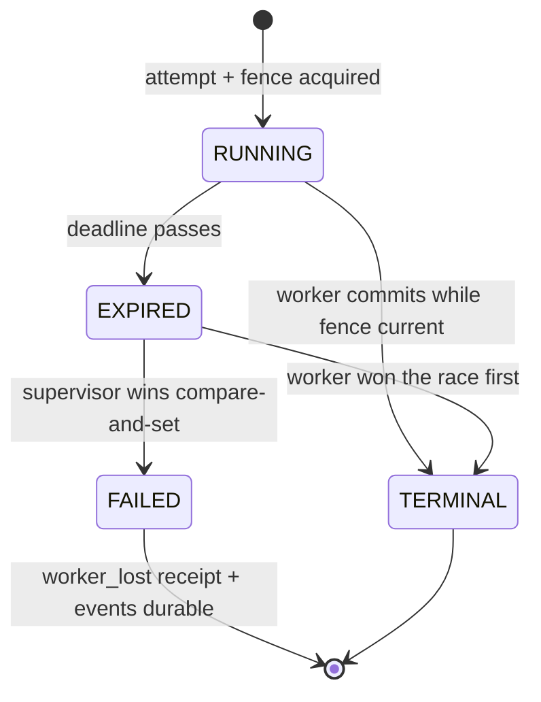
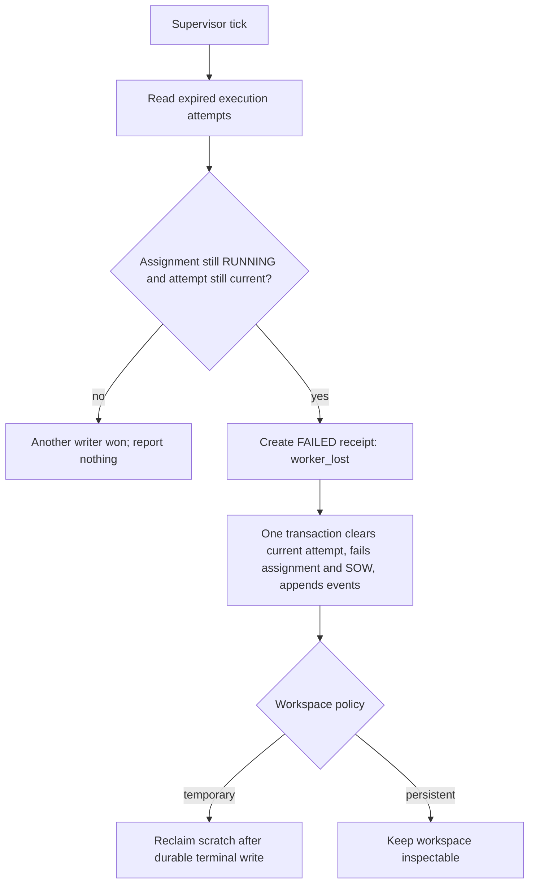

# Chapter 6 — The organization recovers

Imagine the worker who was closing Lucy's shop collapses mid-count and is rushed
out the door. The till is half-counted, the freezer maybe locked, maybe not.
Nobody can ask *them* what got done — they're gone. So someone else has to walk
in, notice the shift never properly ended, and write down the only honest thing
that can be written: *we don't know it was finished, so it wasn't.* Not "probably
fine." Not "looked done to me." Unknown is not success.

That is recovery, and it is subtler than it sounds, because the tempting move —
"the worker got most of the way, let's call it done" — is exactly the lie a
governed organization must never tell. In Chapter 5 you built the fence that
decides who holds authority *right now*. This chapter is about what happens when
the process holding it simply stops existing, and why a *different* process must
be the one to record its death — because a process, like that collapsed worker,
cannot certify its own.

## Learning objective

Understand why "a process cannot record its own death" forces a *second*
process to own recovery, and see the supervisor do exactly
that: recover a genuinely, violently killed worker's assignment — never
guessing that it might have succeeded.

Chapter 5 fenced who may hold authority right now. This chapter is about what
happens when the process holding it simply stops existing.

## Vocabulary this chapter adds

| Term | What it is |
| --- | --- |
| **Supervisor tick** | One deterministic reconciliation pass: report expired actor leases, sweep expired mailbox claims, recover abandoned running assignments. Creates no new work. |
| **Hard-kill recovery** | The supervisor writing a durable `FAILED` receipt for an assignment whose execution attempt expired with no worker left to finish it — `failure_category="worker_lost"`. |
| **Worker lost** | The one failure category this recovery path ever writes. Never inferred success, however far the dead subprocess might actually have gotten. |

## Recovery is reconciliation, not resurrection

The supervisor does not continue the dead process's computation. It reconciles
durable facts after authority expires:



**Figure:** After a deadline, worker and supervisor race through compare-and-set; exactly one terminal state wins and both outcomes remain explainable.

The apparent fork at `EXPIRED` is intentional. Expiry makes recovery eligible;
it does not itself prove the worker is dead. A late worker and the supervisor may
race. The ledger's compare-and-set on `current_execution_attempt` selects one
canonical terminal writer. If the worker completed first, recovery changes zero
rows and reports nothing. If the supervisor won, the stale worker's fence can no
longer commit completion.

The order of recovery operations is a correctness argument:

1. Read the expired attempt and current assignment.
2. Construct a `FAILED` receipt with `failure_category="worker_lost"`.
3. In one database transaction, persist the receipt, move assignment/SOW state,
   release the attempt, and append recovery events.
4. Reproject the outcome.
5. Only then apply workspace reclamation policy.

Reclaiming first would destroy diagnostic evidence before the durable ledger
admits the failure. Guessing success from a `report.json` would let an
untrusted, half-written artifact outrank the fence and transaction. Recovery is
conservative because uncertainty is asymmetric: a false failure can be retried;
a false success can move money or hide unfinished work.

### Failure detector versus heartbeat

An expired lease is a **timeout-based failure suspicion**, not proof of process
death. The current supervisor loops and reconciles lease/attempt deadlines, but
workers do not periodically publish liveness samples. A heartbeat would add a
new observation—"this process reported alive at time *t*"—and a freshness
policy. It would improve diagnosis and responsiveness, but it would not replace
fencing: delayed heartbeats and partitions can still create ambiguity, so only
the token at the protected write establishes safety.

## Build the recovery yourself, then watch it almost lie

Before the real supervisor and the real `SIGKILL`, build recovery small
enough to see every decision — including the one that goes wrong.

The scene: assignment `run-9` went `RUNNING` with fencing token 41 and an
execution attempt that expired at minute 115. It is now minute 130 and the
worker has not been heard from. Crucially, its workspace is **not empty** —
there is diagnostic scratch, and there is a `report.json` that says
`completed`:

```python
import pathlib
import sqlite3
import tempfile

db = sqlite3.connect(":memory:")
db.executescript("""
    CREATE TABLE assignments (id TEXT PRIMARY KEY, state TEXT NOT NULL,
                              fencing_token INT, attempt_expires_at INT);
    CREATE TABLE receipts (assignment_id TEXT PRIMARY KEY, status TEXT,
                           failure_category TEXT);
""")
workspace = pathlib.Path(tempfile.mkdtemp())
(workspace / "provider-raw").mkdir()
(workspace / "provider-raw" / "stream.log").write_text("...half a stream...")
(workspace / "report.json").write_text('{"status": "completed"}')  # the TRAP

db.execute("INSERT INTO assignments VALUES ('run-9', 'RUNNING', 41, 115)")
db.commit()
```

### The recoverer that wants to be kind

The tempting recovery logic looks *diligent*: before declaring failure, check
whether the worker actually finished — and if a valid-looking completed
report is sitting right there, honor the poor worker's last act.

```python
import json


def recover_naive(db, assignment_id, workspace, now):
    state, expires = db.execute(
        "SELECT state, attempt_expires_at FROM assignments WHERE id = ?", (assignment_id,)
    ).fetchone()
    if state != "RUNNING" or expires > now:
        return "nothing to recover"
    report = workspace / "report.json"
    if report.is_file() and json.loads(report.read_text()).get("status") == "completed":
        db.execute("UPDATE assignments SET state = 'COMPLETED' WHERE id = ?", (assignment_id,))
        db.commit()
        return "worker left a completed report -- marked COMPLETED"
    db.execute("UPDATE assignments SET state = 'FAILED' WHERE id = ?", (assignment_id,))
    db.commit()
    return "marked FAILED"


print(recover_naive(db, "run-9", workspace, now=130))
```

```text
worker left a completed report -- marked COMPLETED
```

The ledger now says `COMPLETED`, and nobody decided that — a *file* did. Ask
what that file actually proves. Chapter 3 taught that a report is a
**proposal** the host validates: no terminal event was seen, no session
identity extracted, no protocol completed. Chapter 4 taught that **presence
is not work**: that file could be preplanted, half-written-but-parseable, or
written by a stale process that is *still running somewhere* and about to do
who-knows-what. The killed worker might genuinely have been one line from
finishing correctly — and the organization has no way to know. Blessing the
file converts "unknown" into "success" on zero evidence, which is precisely
the lie a governed ledger exists to make unwritable.

### The recoverer that refuses to guess

The honest version writes the only thing that is actually known — *we don't
know it finished, so it didn't* — and does all of its writes in **one
transaction**:

**Listing:** Reconcile an expired attempt without guessing success

```python
def recover(db, assignment_id, now):
    cursor = db.execute(
        "UPDATE assignments SET state = 'FAILED', fencing_token = NULL,"
        " attempt_expires_at = NULL"
        " WHERE id = ? AND state = 'RUNNING' AND attempt_expires_at <= ?",
        (assignment_id, now),
    )
    if cursor.rowcount != 1:
        db.commit()
        return "nothing to recover"
    db.execute("INSERT INTO receipts VALUES (?, 'failed', 'worker_lost')", (assignment_id,))
    db.commit()  # ONE commit: terminal state, cleared fence, receipt -- together
    return "recovered: FAILED, category worker_lost, fence cleared"


db.execute(
    "UPDATE assignments SET state = 'RUNNING', fencing_token = 41, attempt_expires_at = 115"
    " WHERE id = 'run-9'"
)
db.commit()
print(recover(db, "run-9", now=130))
print(recover(db, "run-9", now=131))  # the second tick
row = db.execute(
    "SELECT status, failure_category FROM receipts WHERE assignment_id = 'run-9'"
).fetchone()
print("receipt:", row)
```

```text
recovered: FAILED, category worker_lost, fence cleared
nothing to recover
receipt: ('failed', 'worker_lost')
```

Three deliberate choices, each doing real work:

- **The `WHERE` clause is the detector.** `state = 'RUNNING' AND
  attempt_expires_at <= now` — recovery is a compare-and-set, the exact
  pattern Chapter 5 built, aimed at a different table. Expiry alone is not a
  fault; it just makes the row *recoverable*.
- **The fence clears in the same transaction as the terminal write.** So
  there is never a moment when the assignment is terminal but still fenced
  (stranding the workspace) or unfenced but still `RUNNING` (inviting a
  second writer). And it is why the second tick finds *nothing*: idempotency
  falls out of the CAS, rather than needing a "did I already recover this?"
  memory.
- **`worker_lost` is the only category this path ever writes**, and
  production names it exactly once, as a module constant — so no receipt
  reader ever reconciles two spellings of "the worker never came back."
  Richer failure taxonomy (timeout vs. nonzero exit vs. interruption, and
  which wins when several are observed at once) is decided at *execution*
  time by the host that watched the process die; the supervisor never
  re-litigates it. It handles only the case where nobody was left to decide.

### Two supervisors, one recovery

Nothing above assumed the supervisor is unique — and it must not, because
supervisors crash too, and someone restarts them. Run two against the same
abandoned assignment:

```python
db.execute("INSERT INTO assignments VALUES ('run-10', 'RUNNING', 55, 220)")
db.commit()

print("supervisor-1:", recover(db, "run-10", now=230))
print("supervisor-2:", recover(db, "run-10", now=230))
count = db.execute("SELECT COUNT(*) FROM receipts WHERE assignment_id = 'run-10'").fetchone()[0]
print("receipts written:", count)
```

```text
supervisor-1: recovered: FAILED, category worker_lost, fence cleared
supervisor-2: nothing to recover
receipts written: 1
```

One winner, one receipt, no coordination protocol between the supervisors —
the same CAS that made one tick idempotent makes two supervisors safe. This
is the payoff of Chapter 5 generalizing: every "exactly once against shared
state" problem in this system is solved by the same shape.

### Reclaim comes last, and keeps the evidence

The workspace still holds the dead worker's scratch — and the trap file.
Reclaiming is a *policy* act, gated on the durable terminal state:

```python
def reclaim(db, assignment_id, workspace):
    state = db.execute("SELECT state FROM assignments WHERE id = ?", (assignment_id,)).fetchone()[0]
    if state == "RUNNING":
        return "refused: assignment not terminal, scratch may still be in use"
    scratch = workspace / "provider-raw"
    if scratch.is_dir():
        for item in sorted(scratch.rglob("*")):
            item.unlink()
        scratch.rmdir()
    return f"reclaimed scratch; kept: {sorted(p.name for p in workspace.iterdir())}"


db.execute("INSERT INTO assignments VALUES ('run-11', 'RUNNING', 60, 320)")
db.commit()
print(reclaim(db, "run-11", workspace))
print(recover(db, "run-11", now=330))
print(reclaim(db, "run-11", workspace))
```

```text
refused: assignment not terminal, scratch may still be in use
recovered: FAILED, category worker_lost, fence cleared
reclaimed scratch; kept: ['report.json']
```

Order is everything: reclaim before the terminal state is durable and you
might delete the scratch of a worker that turns out to be alive; production
applies workspace policy strictly **after** the recovery transaction
commits. And notice what survived: `report.json` — the trap — is *kept*. Not
as a result (its assignment is `FAILED`, permanently, whatever the file
says) but as **evidence** a human can inspect when they ask what the dead
worker was doing. Deleting it would be laundering the crash; blessing it
would be laundering the guess. Keeping it, attached to an honest `FAILED`,
is the only move that lies about nothing.

The production versions live in `src/sovereign_agent/supervisor.py`: a
`tick` does exactly four things in a fixed order — report expired actor
leases (read-only), sweep expired mailbox claims back to `NEW`, recover
abandoned assignments as you just built, and *nothing else*. The governing
contract is explicit that the supervisor never creates work, never reads a
Pulse signal, never installs itself as a service — because "a process cannot
record its own death" cuts both ways: the one process allowed to declare
others dead must itself stay too simple to need declaring.

## A note on realism, before you run this

This exercise does not simulate a crash with a caught exception. It starts a
**real** child process, waits until that process has genuinely acquired its
execution attempt and moved the assignment to `RUNNING`, then sends it a
**real** `SIGKILL` — the one signal a Python program cannot catch or clean up
after. No receipt gets written by the dying process, because a `SIGKILL`
gives it no chance to run any code at all. This is the same fixture and
polling discipline `tests/test_supervisor.py`'s own hard-kill proof matrix
uses, not a weaker teaching stand-in: the failure mode a supervisor has to
recover from is a real one, and a caught, pre-classified exception would
prove something narrower than what actually happens when a worker's process
disappears.

## Liveness is evidence, not a timeout-shaped guess

The course that led to this book used a useful production comparison: a
long-running tool, a worker waiting for human approval, and a dead worker can
all be silent for the same number of seconds. Wall-clock silence alone cannot
classify them. A sound liveness decision combines a durable claim, evidence of
recent process life, and the operation's declared tolerance.

Sovereign Agent currently exposes those ingredients as separate mechanisms.
Execution attempts have acquired and expiry times plus fencing tokens. The
heartbeat table records that a runtime reached the database at a moment in
time. The supervisor recovers expired execution attempts. It does **not** yet
compose heartbeat freshness with per-tool declared timeouts, and this chapter
must not draw the richer course design as if production already implemented it.
The actual decision path is narrower:



**Figure:** Recovery first commits failure evidence and clears current work atomically, then reclaims only temporary workspaces while preserving persistent ones for inspection.

There are two compare-and-set moments hidden in that flow. The first is the
re-read of the assignment after the expired-attempt scan: the worker may have
finished between observation and decision. The second is the guarded update
whose `WHERE` clause names both the assignment and the current attempt. If
another supervisor or the worker wins first, `rowcount` is zero and this
supervisor records no competing history.

### What a heartbeat can and cannot add

`record_heartbeat` appends a row; it does not update a mutable “last seen” cell.
`heartbeat_status` reads the newest row and returns one of three honest
verdicts: `ALIVE`, `STALE`, or `NO_BEATS`. `ALIVE` means only that the process
recorded a beat within the chosen window while the database was reachable.
`STALE` means no beat was recorded in that window. It does not prove death: the
recorder may be paused, partitioned from the database, or intentionally idle.

That narrow claim is valuable because it prevents a common observability error:
turning absence of evidence into evidence of absence. Compare the signals:

| Signal | Positive evidence | Silence leaves ambiguous |
| --- | --- | --- |
| heartbeat row | this runtime reached this database at this time | crash, pause, partition, or disabled recorder |
| current execution attempt | this assignment granted one fenced execution epoch | whether the process is still computing |
| expired attempt | the lease window ended without a terminal replacement | whether the worker finished an external side effect |
| provider receipt | the host recorded a terminal provider result | whether the business outcome is true now |
| acceptance evidence | named checks observed the required world facts | what may change after the observation |

Recovery uses the expired attempt to revoke authority, not the heartbeat to
infer success. Even if a report file exists, the supervisor writes a failed
`worker_lost` receipt because the process that owned the attempt did not finish
the governed terminal transition. A file's presence cannot prove which writes
committed or whether the provider was still writing it when the process died.

### Why recovery order is part of correctness

Consider the tempting order: delete the temporary workspace, then mark the
assignment failed. A crash between those steps loses the only artifacts while
the ledger still says `RUNNING`. The next tick sees an expired attempt but has
less evidence than the previous one. Production reverses the order:

1. construct the failure receipt;
2. atomically clear the execution fence, fail the assignment and SOW, and append
   `assignment.finished` plus `assignment.recovered`;
3. reproject the outcome;
4. only then apply the workspace policy.

If the process dies after step 2, the ledger is already truthful and later
cleanup is safe. If cleanup itself fails, the worst residue is extra evidence,
not missing truth. “Finish forward, clean up afterward” is a broadly reusable
recovery rule: make the authoritative state correct before touching disposable
resources.

### A decision table for a future composite detector

The richer three-signal detector from the course remains a useful design
exercise, provided you label it as a target rather than shipped behavior:

| Claim age | Heartbeat since claim | Declared long operation | Defensible decision |
| --- | --- | --- | --- |
| young | any | any | wait |
| old | yes | no | work is alive; wait |
| old | no | yes, still inside declared window | wait, but surface the long operation |
| old | no | no | candidate for fenced recovery |
| extremely old | no | declared window also exceeded | recover after the guarded re-read |

The pure part of such a detector should return a decision and reasons; the
caller should own kill, retry, and ledger side effects. Keeping the decision
pure makes every row in the table testable without sleeping. Until that
composition exists in production, the supervisor's only authorization is the
expired execution attempt and its guarded transaction.

## The exercise

```bash
uv run python book/ch06_the_organization_recovers/solution.py --root /tmp/lucy-ch06
```

Takes a few seconds — it genuinely waits for a real subprocess to reach
`RUNNING`, kills it, and runs two real supervisor ticks.

## Expected observations

```json
{
  "worker_reached_running_before_sigkill": true,
  "worker_died_abnormally": true,
  "before_recovery": {
    "assignment_state": "RUNNING",
    "execution_attempt_still_referenced": true
  },
  "first_tick": {
    "recovered_count": 1
  },
  "second_tick_is_idempotent": {
    "recovered_count": 0
  },
  "after_recovery": {
    "assignment_state": "FAILED",
    "receipt_status": "failed",
    "receipt_failure_category": "worker_lost"
  }
}
```

Four things worth reading closely:

1. **The ledger tells the truth about the moment of death.** Immediately
   after the kill, the assignment still reads `RUNNING`, with its execution
   attempt still referenced — the dead process never got to write anything,
   so the ledger honestly reflects "still going" until something else says
   otherwise.
2. **The supervisor decides, not the dead process.** `first_tick` recovers
   exactly one assignment — using a far-future clock in place of waiting out
   the real execution-attempt TTL (15 minutes), so this exercise finishes in
   seconds without weakening what the recovery logic itself does.
3. **Recovery is idempotent.** The second tick recovers nothing more — the
   fence was cleared inside the same transaction as the terminal write, so
   there is nothing left for a later tick to find.
4. **The recovered receipt is always `failed`, never a guess.** However far
   the killed subprocess might actually have gotten — it might have been
   about to write a valid `report.json` — the organization has no way to know
   that, and the rule you met in Chapter 5 — nothing is ever a guessed success —
   extends here without exception.

## Why this is not a cancellation

No new `AssignmentState` was introduced for this. Recovery reuses the
existing `FAILED` state — a hard kill is not treated as though someone
decided to stop the work; it is treated as though the work's outcome is
simply unknown, and unknown is not success. Retrying is a fresh, explicit,
governed act (`assign` → `run_assignment` again), never automatic.

## Learner verification command

```bash
uv run python -m pytest tests/test_supervisor.py -k \
  "sigkilled or recovers_a_real or idempotent or never_guesses_success or workspace_reclaim"
```

Expected: all pass. Together they prove a real hard-kill leaves the ledger
honest, the supervisor (not the dead process) recovers it, recovery is
idempotent, the receipt is always `failed`, and workspace reclaim happens
only after the recovery transaction is durable.

## Summary

The supervisor now recovers through a compare-and-set on
`state = 'RUNNING' AND attempt_expires_at <= now` that writes a `FAILED`
receipt with `failure_category="worker_lost"`, clears the fence, and only
afterward applies workspace reclamation — all in the order that makes a
second tick, or a second supervisor, find nothing left to do.

The recovery rule is that unknown is never success: a genuinely
`SIGKILL`ed worker's ledger stays honestly `RUNNING` until the supervisor
says otherwise, and what it says is always `worker_lost`, never a guess
based on whatever the dead process happened to leave behind.

The rejected design is the tempting, more "diligent"-looking recovery
logic that checks for a `report.json` claiming `completed` and honors it —
built and shown converting a real hard-kill into a false success on the
strength of a file that could have been preplanted, half-written, or left
by a process that was never going to finish correctly.

At Lucy's shop, this is someone else walking in on a collapsed
worker's half-counted till and writing down "we don't know it was
finished," not "looked done to me" — because the second sentence is how
real money goes missing.

## Explain it back

1. Why does `SIGKILL` specifically matter here — what would change if this
   chapter used a caught exception instead?
2. The assignment still read `RUNNING` immediately after the kill. Why is
   that the *correct* thing for the ledger to say at that moment, rather
   than a bug?
3. "Nothing is ever a guessed success" — what is the dangerous alternative
   this rule forbids, concretely, for a killed worker that might have been
   one line away from finishing correctly?
4. Recovery clears the fence in the *same* transaction as the terminal
   write. What would go wrong on a second tick if those were two separate
   transactions instead?
5. No new `AssignmentState` was added for a recovered assignment — it reuses
   `FAILED`. What would a dedicated `RECOVERED` state let a reader assume
   that they should not be allowed to assume?
6. `recover_naive` looked *more* diligent than `recover` — it checked the
   report before deciding. Explain precisely why the extra check made it
   less honest, not more.
7. Two supervisors recovered `run-10` with no coordination protocol between
   them, yet wrote exactly one receipt. Name the mechanism, and say where
   you built it before.
8. Reclaim kept `report.json` on a `FAILED` assignment. Defend keeping a
   file whose contents the ledger explicitly refuses to believe.

## Where to look next

- `src/sovereign_agent/supervisor.py` — `tick`, `recover_abandoned_assignments`
- `tests/fixtures/hard_kill_worker.py` — the real child process this
  exercise's own `solution.py` reuses
- `tests/test_supervisor.py` — the hard-kill proof matrix, if you want to see
  every recovery property exercised at once

`solution.py` imports the production package rather than copying it.

Next: [Chapter 7 — The organization wakes itself](../ch07_the_organization_wakes_itself/README.md)
