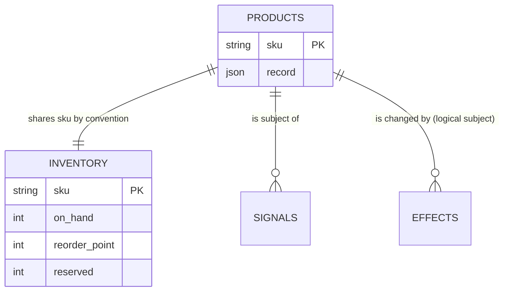
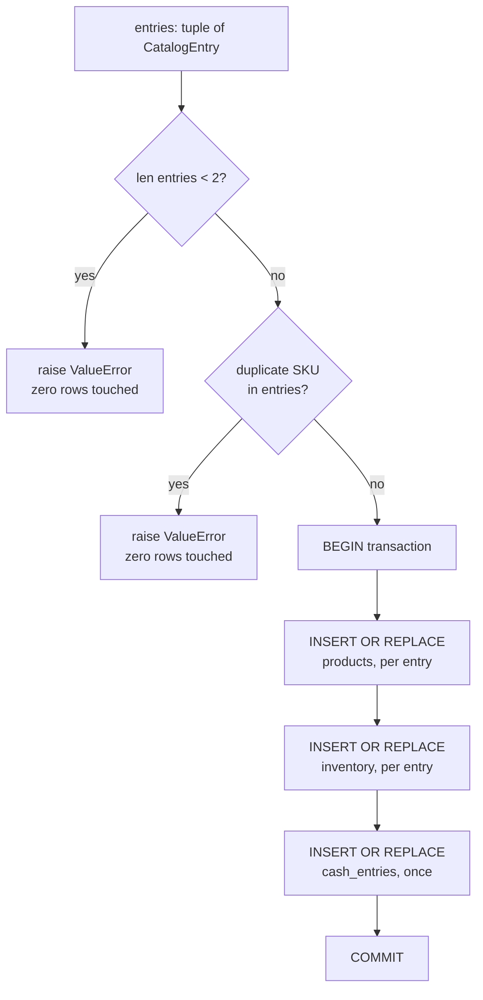
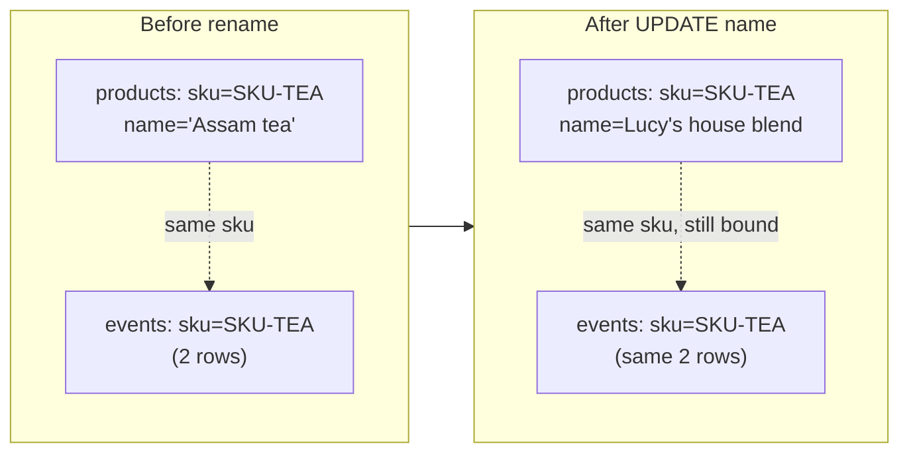

# Chapter 8 — The Store becomes a catalog

Up to now Lucy's shop has sold exactly one thing. That was a convenient lie — it
let us build memory, judgement, boundaries, fencing, recovery, and Pulse
without the distraction of a second product. But a real ice cream shop has
vanilla *and* chocolate, and the moment there are two, a new question appears that
never existed with one: **when something happens to one product, does it stay
contained to that product?** A run on vanilla must not quietly change the
chocolate count. A low-stock signal for one flavor must not reorder the other.

This chapter is the smallest possible version of that step — turning the single
product into a genuine *catalog* of independent SKUs — because independence is
easiest to get right at the very beginning, at the schema, before any sale or
signal can blur the lines. (The shipped catalog uses two example SKUs to make the
mechanics concrete; they behave exactly as Lucy's vanilla and chocolate would.)

## Learning objective

See the Store's single-product fixture become a genuine catalog: two
distinct SKUs, each with its own row in `products` and its own row in
`inventory`, seeded by one production function call — and learn what
"independent" means at the schema level, before any sale or signal is
involved.

Chapters 0-7 all called `reference_organizations.store.seed`, which creates
exactly one product, `SKU-TEA`. That function still exists, unchanged — every
chapter and test written before this one depends on its exact shape. This
chapter uses the new function alongside it, `seed_catalog`, which is what a
real store with more than one product on the shelf actually needs.

## Vocabulary this chapter adds

| Term | What it is |
| --- | --- |
| **Catalog** | More than one `Product`, each with its own `products` row and its own `inventory` row — not one product repeated, not a single row carrying a list. |
| **`CatalogEntry`** | One SKU's own opening position: the product itself, plus its own starting `on_hand` and `reorder_point`, independent of every other entry in the same catalog. |
| **`seed_catalog`** | The production function that writes a whole catalog in one transaction. Additive alongside `seed`, never a replacement for it. |

## The data model is where isolation begins

A catalog is not "a list of names." It is a set of stable identities joined to
independent operational state:



**Figure:** Stable SKU identity binds products to inventory, signals, and effects even though each table owns a different part of the product's state.

**What this figure shows:** three logical subject relationships, all keyed
by the same opaque `sku`. The schema does not enforce a foreign key or a
one-to-one relationship between `products.sku` and `inventory.sku` — SQLite
would happily let a product exist with no matching inventory row, or vice
versa, if a write path skipped writing one of the pair. `seed_catalog`'s
own loop is what actually keeps them paired in practice, one `INSERT`
into each table per entry, inside the same transaction; the diagram states
the intended shape, the code enforces it.

The SKU is an identity, not a label. If Lucy renames "Vanilla Bean" to
"Madagascar Vanilla," references do not move. If code joins on `display_name`, a
marketing edit becomes a referential-integrity event and historical records can
detach from the product they described.

Migrating a populated single-product store therefore has four proof obligations:

| Obligation | What it requires |
| --- | --- |
| **Preservation** | The original inventory quantity and thresholds survive. |
| **Identity** | The legacy row maps to exactly one stable SKU. |
| **Totality** | Every inventory row references an existing product. |
| **Atomicity** | Schema, backfill, and migration stamp become visible together. |

The two subject columns in the figure above are not symmetric, either:
`effects.subject` is a structured, `NOT NULL` SQL column (`MIGRATION_7`);
a signal's `subject_ref` is a Pydantic field serialized inside
`signals.record` as JSON, with no matching column at all — see "Break it"
below for why that distinction matters to what a schema can enforce on its
own.

The production migration runner wraps migration statements and the version stamp
in one explicit transaction. `seed_catalog` validates the catalog-wide
cardinality and duplicate-SKU rules before entering its transaction, then writes
each product and inventory pair atomically. This ordering matters: a duplicate
found after earlier commits could leave half a catalog. "Validate the batch,
then mutate atomically" is the batch equivalent of Chapter 1's transaction
lesson. Individual numeric fields are not comprehensively validated here; that
is a contract edge, not a guarantee to infer from the two checks that exist.

The second SKU is also a diagnostic instrument. With one product, code that
forgets a `WHERE sku = ?` clause often appears correct because every row is the
right row. Two distinguishable products turn accidental global state into a
visible cross-talk failure. Cardinality is therefore part of the test design,
not merely more sample data.

## Build the migration yourself: one product becomes a catalog, without losing the shop

"Add a SKU" sounds like data entry. It is a **schema evolution on populated
data** — the exact discipline Chapter 1 built — and the shop that needs it
is already running, with money in the till and history in the ledger. Start
from the tempting one-product schema most systems begin with:

```python
import sqlite3

db = sqlite3.connect(":memory:")
db.executescript("""
    CREATE TABLE shop (id INTEGER PRIMARY KEY CHECK (id = 1),
                       product_name TEXT, on_hand INT, reorder INT);
    CREATE TABLE events (seq INTEGER PRIMARY KEY, kind TEXT, sku TEXT);
""")
db.execute("INSERT INTO shop VALUES (1, 'Assam tea', 4, 3)")
db.execute("INSERT INTO events(kind, sku) VALUES ('sale.committed', 'SKU-TEA')")
db.execute("INSERT INTO events(kind, sku) VALUES ('replenishment.committed', 'SKU-TEA')")
db.commit()
print(db.execute("SELECT * FROM shop").fetchone())
print("history rows:", db.execute("SELECT COUNT(*) FROM events").fetchone()[0])
```

```text
(1, 'Assam tea', 4, 3)
history rows: 2
```

The `CHECK (id = 1)` is the one-product assumption made structural: this
table *cannot* hold a second product. Before reading further, design the
replacement yourself — you need product **identity**, product **display
name**, and stock **quantities**, and the design question is which of those
are the same concern. Predict what goes wrong if the name is the key. Then
compare with what follows.

### The migration, on live data, in one transaction

Three separate concerns get three separate homes: identity (`sku`, the
primary key — opaque, stable, never shown to customers), the display name
(mutable prose *about* the identity), and quantities (their own row, with a
constraint that makes negative stock unrepresentable):

**Listing:** Migrate live singleton data into a catalog transactionally

```python
def migrate_to_catalog(db):
    db.execute("BEGIN IMMEDIATE")
    try:
        db.execute("""
            CREATE TABLE products (sku TEXT PRIMARY KEY, name TEXT NOT NULL,
                                   price_cents INT NOT NULL)
        """)
        db.execute("""
            CREATE TABLE inventory (sku TEXT PRIMARY KEY REFERENCES products(sku),
                                    on_hand INT NOT NULL CHECK (on_hand >= 0),
                                    reserved INT NOT NULL DEFAULT 0,
                                    reorder INT NOT NULL)
        """)
        name, on_hand, reorder = db.execute(
            "SELECT product_name, on_hand, reorder FROM shop WHERE id = 1"
        ).fetchone()
        db.execute("INSERT INTO products VALUES ('SKU-TEA', ?, 400)", (name,))
        db.execute(
            "INSERT INTO inventory(sku, on_hand, reorder) VALUES ('SKU-TEA', ?, ?)",
            (on_hand, reorder),
        )
        migrated = db.execute("SELECT COUNT(*) FROM inventory").fetchone()[0]
        original = db.execute("SELECT COUNT(*) FROM shop").fetchone()[0]
        if migrated != original:
            raise RuntimeError(f"row count mismatch: {original} became {migrated}")
        db.execute("DROP TABLE shop")
        db.execute("COMMIT")
        return "migrated: singleton shop is now a catalog"
    except BaseException:
        db.execute("ROLLBACK")
        raise


print(migrate_to_catalog(db))
print(db.execute("SELECT sku, name, price_cents FROM products").fetchone())
print(db.execute("SELECT sku, on_hand, reserved, reorder FROM inventory").fetchone())
print("history rows survived:", db.execute("SELECT COUNT(*) FROM events").fetchone()[0])
```

```text
migrated: singleton shop is now a catalog
('SKU-TEA', 'Assam tea', 400)
('SKU-TEA', 4, 0, 3)
history rows survived: 2
```

Everything from Chapter 1 is load-bearing here: the copy, the count check,
the `DROP`, and the version stamp of a real migration all ride one
`BEGIN IMMEDIATE` — and the count check is the migration verifying *itself*
before it burns the bridge. The four on-hand tubs and both history rows
crossed intact. This is a guest arriving in a house where data already
lives, exactly as the production schema's own sixteen forward-only
migrations each had to be.

### Seeding a catalog is a validated act, not a loop of inserts

```python
def seed_catalog(db, entries):
    if len(entries) < 2:
        return "refused: a catalog needs at least two distinct SKUs"
    skus = [sku for sku, _, _, _, _ in entries]
    if len(set(skus)) != len(skus):
        return f"refused: duplicate SKUs in catalog: {skus}"
    if any(on_hand < 0 for _, _, _, on_hand, _ in entries):
        return "refused: negative opening stock is unrecorded debt, not inventory"
    db.execute("BEGIN IMMEDIATE")
    try:
        for sku, name, price, on_hand, reorder in entries:
            db.execute("INSERT OR REPLACE INTO products VALUES (?, ?, ?)", (sku, name, price))
            db.execute(
                "INSERT OR REPLACE INTO inventory(sku, on_hand, reorder) VALUES (?, ?, ?)",
                (sku, on_hand, reorder),
            )
        db.execute("COMMIT")
        return f"seeded {len(entries)} SKUs"
    except BaseException:
        db.execute("ROLLBACK")
        raise


print(seed_catalog(db, [("SKU-TEA", "Assam tea", 400, 4, 3)]))
print(seed_catalog(db, [("SKU-TEA", "Assam tea", 400, 4, 3), ("SKU-TEA", "Also tea", 500, 9, 6)]))
print(
    seed_catalog(
        db, [("SKU-TEA", "Assam tea", 400, 4, 3), ("SKU-COFFEE", "Kenyan coffee", 650, -2, 6)]
    )
)
print(
    seed_catalog(
        db, [("SKU-TEA", "Assam tea", 400, 4, 3), ("SKU-COFFEE", "Kenyan coffee", 650, 10, 6)]
    )
)
rows = db.execute("SELECT sku, on_hand, reorder FROM inventory ORDER BY sku").fetchall()
print(rows)
```

```text
refused: a catalog needs at least two distinct SKUs
refused: duplicate SKUs in catalog: ['SKU-TEA', 'SKU-TEA']
refused: negative opening stock is unrecorded debt, not inventory
seeded 2 SKUs
[('SKU-COFFEE', 10, 6), ('SKU-TEA', 4, 3)]
```

Three refusals, three different edge cases the map warned about. A
one-entry "catalog" is the singleton assumption sneaking back in a list
costume. Duplicate SKUs would make `INSERT OR REPLACE` silently collapse
two products into one — validated *before* the transaction opens, so the
refusal costs nothing. And negative opening stock is refused twice over:
once by the seed's own validation, and structurally by the `CHECK
(on_hand >= 0)` the migration installed — belt because the error message is
better, suspenders because a seed that skipped validation still cannot
write the lie. Production's `seed_catalog` carries the first two refusals
almost verbatim (`a catalog needs at least two distinct SKUs`,
`duplicate SKUs in catalog`), seeds everything in one transaction, and adds
the one deliberate shared resource — a single opening cash balance, because
a store has one till, not one per SKU.

## Break it: what "validate the batch, then mutate atomically" is actually preventing

The claim above — "duplicate SKUs would make `INSERT OR REPLACE` silently
collapse two products into one" — is exactly the kind of sentence a chapter
can get away with asserting and never proving. This section proves it,
against the real production function, not the toy above.

`seed_catalog` (`src/reference_organizations/store/__init__.py`) runs its
two checks — cardinality, then duplicate SKUs — as plain Python `if`
statements *before* `with db.transaction():` ever opens. That ordering is
the whole safety property: a refusal that happens before a transaction
opens cannot leave a half-written catalog, because nothing has been
written yet. The diagram below is the hardened contract this section
verifies against real execution, not an aspiration:



**Figure:** The entire catalog batch is validated before the transaction begins, so a short or duplicate batch touches no rows and an admitted batch commits every dependent table together.

**What this figure shows:** both refusal paths (`C1`, `C2`) exit *before*
`BEGIN transaction`, so a refused call and a call that never happened are
indistinguishable from the database's point of view — zero rows change
either way. Only a call that survives both checks ever reaches a write.

Run the real function against a three-entry batch where entries 1 and 2
share a SKU:

```python
import pathlib
import tempfile

from reference_organizations.store import CatalogEntry, Product, seed_catalog
from sovereign_agent.database import Database
from sovereign_agent.events import append_event

root = pathlib.Path(tempfile.mkdtemp())
db_ch08 = Database(root / "catalog.db")

entries = (
    CatalogEntry(
        product=Product(sku="SKU-TEA", name="Assam tea", unit_cost_cents=120, price_cents=400),
        on_hand=4,
        reorder_point=3,
    ),
    CatalogEntry(
        product=Product(sku="SKU-TEA", name="Impostor tea", unit_cost_cents=999, price_cents=999),
        on_hand=99,
        reorder_point=99,
    ),
    CatalogEntry(
        product=Product(
            sku="SKU-COFFEE", name="Kenyan coffee", unit_cost_cents=210, price_cents=650
        ),
        on_hand=10,
        reorder_point=6,
    ),
)

try:
    seed_catalog(db_ch08, entries)
    print("real seed_catalog: did not raise")
except ValueError as error:
    print("real seed_catalog refused:", error)

rows_after_refusal = db_ch08.connection.execute("SELECT COUNT(*) c FROM products").fetchone()["c"]
print("product rows after refusal:", rows_after_refusal)
```

```text
real seed_catalog refused: duplicate SKUs in catalog: ['SKU-TEA', 'SKU-TEA', 'SKU-COFFEE']
product rows after refusal: 0
```

That is the real function behaving as claimed. Now the mutation: a
`seed_catalog` with the duplicate-SKU check deleted, and *only* the
cardinality check left. Every other line — the transaction, the three
`INSERT OR REPLACE` statements, the return value — is copied verbatim from
production, so the only variable between this and the real function is the
one missing `if`:

```python
import json


def seed_catalog_missing_duplicate_check(db, entries):
    if len(entries) < 2:
        raise ValueError("a catalog needs at least two distinct SKUs")
    with db.transaction():
        for entry in entries:
            db.connection.execute(
                "INSERT OR REPLACE INTO products(sku, record) VALUES (?, ?)",
                (entry.product.sku, json.dumps(entry.product.__dict__)),
            )
            db.connection.execute(
                "INSERT OR REPLACE INTO inventory("
                "sku, on_hand, reserved, reorder_point, record) VALUES (?, ?, ?, ?, ?)",
                (
                    entry.product.sku,
                    entry.on_hand,
                    0,
                    entry.reorder_point,
                    json.dumps({"sku": entry.product.sku}),
                ),
            )
            append_event(db, "store.seeded", {"sku": entry.product.sku})
        db.connection.execute(
            "INSERT OR REPLACE INTO cash_entries(id, amount_cents, record) VALUES (?, ?, ?)",
            ("cash-opening", 10_000, json.dumps({"reason": "opening"})),
        )
    return tuple(entry.product for entry in entries)


mutated_result = seed_catalog_missing_duplicate_check(db_ch08, entries)
print("mutated function's return value claims:", len(mutated_result), "products seeded")

actual_rows = db_ch08.connection.execute("SELECT sku, record FROM products ORDER BY sku").fetchall()
print("actual product rows in the database:", len(actual_rows))
tea_row = db_ch08.connection.execute("SELECT record FROM products WHERE sku = 'SKU-TEA'").fetchone()
print("SKU-TEA's surviving name:", json.loads(tea_row["record"])["name"])
```

```text
mutated function's return value claims: 3 products seeded
actual product rows in the database: 2
SKU-TEA's surviving name: Impostor tea
```

This is the false green: the mutated function does **not** raise. It
returns a 3-tuple of `Product` objects — the exact shape a caller would
check to confirm "I seeded 3 products" — while the database underneath it
holds only 2 product rows. `INSERT OR REPLACE` did precisely what its name
says: the second `SKU-TEA` row overwrote the first, silently, mid-loop,
inside the transaction that later committed successfully. The real
opening tea data (`Assam tea`, `on_hand=4`) is gone, replaced by
`Impostor tea` at `on_hand=99` — and nothing in the mutated function's own
return value reveals that a product was lost. A caller trusting `len(result)`
instead of re-reading the table would ship believing it has three
products.

| | Real `seed_catalog` | Mutated (duplicate check removed) |
| --- | --- | --- |
| Duplicate `SKU-TEA` entry | Refused, `ValueError` | Silently accepted |
| Rows written on the duplicate input | 0 | 2 (not 3) |
| Return value | Never returned — raised first | `(Product, Product, Product)`, length 3 |
| What the caller would believe | Nothing happened (correct) | 3 products seeded (false) |

`tests/test_store_catalog_seeding.py` pins both halves of this as a
regression: `test_seed_catalog_refuses_duplicate_skus_and_writes_nothing`
proves the real function's zero-rows-on-refusal guarantee, and
`test_removing_the_duplicate_check_makes_the_return_value_overclaim_rows_written`
runs the identical mutation shown above and asserts the identical
overclaim — so if a future refactor of `seed_catalog` ever moved the
duplicate check to the wrong side of `db.transaction()`, this is the test
that would catch it, not a chapter's prose.

**Why this mutation is even possible here, and would not be on `events`.**
`products` and `inventory` carry no append-only guard at all — `INSERT OR
REPLACE` is not merely *allowed* to overwrite a matching primary key, it is
the *intended* mechanism, because both tables hold current operational
state, not history. Compare `events`: `sovereign_agent/database.py`'s
`MIGRATION_2` and `MIGRATION_3` install three triggers on that table
specifically —`events_no_update`, `events_no_delete`, and
`events_no_replace` — because an event is a historical fact, and
`INSERT OR REPLACE` silently overwriting one would let a caller rewrite
what already happened. The comment on `events_no_replace` names the exact
failure this chapter's mutation reproduces one layer up: "append-only holds
from ANY client. Enforcement now matches the claim." `seed_catalog`'s
duplicate-SKU check is that same claim, enforced one layer higher, in
Python instead of a trigger — and this section just showed what happens
when that layer is the *only* layer and it goes missing. A catalog's
`products`/`inventory` rows are deliberately not append-only (a real store
needs to correct a mis-seeded price), so nothing in the schema itself would
have caught the duplicate-SKU collapse; the pre-transaction Python check is
the entire guarantee.

### The fault, again, because populated data raises the stakes

```python
db2 = sqlite3.connect(":memory:")
db2.executescript("""
    CREATE TABLE shop (id INTEGER PRIMARY KEY CHECK (id = 1),
                       product_name TEXT, on_hand INT, reorder INT);
    CREATE TABLE events (seq INTEGER PRIMARY KEY, kind TEXT, sku TEXT);
""")
db2.execute("INSERT INTO shop VALUES (1, 'Assam tea', 4, 3)")
db2.commit()


def migrate_but_crash(db):
    db.execute("BEGIN IMMEDIATE")
    try:
        db.execute("CREATE TABLE products (sku TEXT PRIMARY KEY, name TEXT, price_cents INT)")
        db.execute("INSERT INTO products VALUES ('SKU-TEA', 'Assam tea', 400)")
        raise RuntimeError("power cut before inventory was copied and shop dropped")
    except RuntimeError as error:
        db.execute("ROLLBACK")
        return f"fault: {error}"


print(migrate_but_crash(db2))
tables = [
    r[0] for r in db2.execute("SELECT name FROM sqlite_master WHERE type='table' ORDER BY name")
]
print("tables after the fault:", tables)
print("the shop row, untouched:", db2.execute("SELECT * FROM shop").fetchone())
```

```text
fault: power cut before inventory was copied and shop dropped
tables after the fault: ['events', 'shop']
the shop row, untouched: (1, 'Assam tea', 4, 3)
```

No `products` table left behind, no half-copied catalog, and the running
shop exactly as it was — the second half of Chapter 1's migration lesson,
now with live inventory on the line. A migration that can strand a shop
between two schemas is worse than no migration.

### The payoff of identity: the name is free to change

```python
db.execute("UPDATE products SET name = 'Lucy''s house blend' WHERE sku = 'SKU-TEA'")
db.commit()
print(db.execute("SELECT sku, name FROM products WHERE sku = 'SKU-TEA'").fetchone())
linked = db.execute("SELECT COUNT(*) FROM events WHERE sku = 'SKU-TEA'").fetchone()[0]
print("history rows still bound to the identity:", linked)
```

```text
('SKU-TEA', "Lucy's house blend")
history rows still bound to the identity: 2
```

Lucy rebrands the tea; every sale, signal, and replenishment in the history
still points at `SKU-TEA`, untouched. Had the *name* been the key, that
rename would have orphaned the entire history — or been forbidden forever.
Identity is what the ledger binds to; the display name is prose about it.



**Figure:** Renaming a product changes its presentation while the stable SKU preserves its event history and every relationship keyed to that identity.

**What this figure shows:** the `UPDATE` above changed exactly one column
(`name`) on exactly one row. `sku` never appeared on the left side of that
`UPDATE`, so every `events` row that references `SKU-TEA` stays correctly
joined across the rename — the two event rows in `After` are the identical
rows from `Before`, not new ones. If `product_name` had been the primary
key instead, the same `UPDATE` would have had to either rewrite every
historical `events.sku` value it touched (a mass rewrite of supposedly
immutable history) or refuse the rename outright; the schema in this
chapter makes that choice moot by never putting the mutable column where
the stable identity belongs.

One more design note worth carrying from production: `seed_catalog` is
*additive alongside* the old single-product `seed`, never a replacement —
every chapter and test written before the catalog existed still relies on
the old contract, and breaking it out from under them is exactly the
revert-what-works move this book's Chapter 1 warned against. Schemas grow
the way ledgers do: forward.

## The exercise

```bash
uv run python book/ch08_the_store_becomes_a_catalog/solution.py --root /tmp/lucy-ch08
```

Read the file first. `seed_catalog` is called once, with the default
two-SKU catalog (`SKU-TEA` and `SKU-COFFEE`) — no loop written by this
chapter, no manual `INSERT`, nothing that copies what `seed_catalog` already
does inside the production package.

## Expected observations

```json
{
  "catalog_size": {
    "distinct_skus_seeded": 2,
    "skus": ["SKU-COFFEE", "SKU-TEA"],
    "at_least_two": true
  },
  "products_table": [
    {
      "sku": "SKU-COFFEE",
      "record": {
        "sku": "SKU-COFFEE",
        "name": "Kenyan coffee",
        "unit_cost_cents": 210,
        "price_cents": 650
      }
    },
    {
      "sku": "SKU-TEA",
      "record": {
        "sku": "SKU-TEA",
        "name": "Assam tea",
        "unit_cost_cents": 120,
        "price_cents": 400
      }
    }
  ],
  "inventory_table": [
    { "sku": "SKU-COFFEE", "on_hand": 10, "reserved": 0, "reorder_point": 6 },
    { "sku": "SKU-TEA", "on_hand": 4, "reserved": 0, "reorder_point": 3 }
  ],
  "independent_reorder_points": {
    "distinct_reorder_points": [3, 6],
    "not_all_the_same": true
  },
  "default_catalog_entry_count": 2
}
```

Three facts this run proves, not merely states:

1. **`distinct_skus_seeded: 2`.** Two real rows in `products`, read back
   from the database after `seed_catalog` returns — not the length of a
   Python list this chapter's own code built.
2. **`not_all_the_same: true`.** `SKU-TEA`'s reorder point (3) and
   `SKU-COFFEE`'s reorder point (6) are genuinely different numbers, seeded
   from two different `CatalogEntry` values. A catalog where every SKU
   happened to share one threshold would not prove independence; this one
   cannot be mistaken for that.
3. **`SKU-TEA` unchanged.** Compare this chapter's `SKU-TEA` row to Chapter
   0's: same cost, same price, same opening stock. `seed_catalog` did not
   invent a new tea fixture — it seeded the SAME `SKU-TEA` the rest of this
   book already knows, alongside a second, genuinely new product.

Confirm it yourself, independent of this exercise's own summary:

```bash
sqlite3 /tmp/lucy-ch08/.sovereign/organization.db <<'SQL'
SELECT sku, on_hand, reorder_point FROM inventory ORDER BY sku;
SQL
```

Expected: two rows, `SKU-COFFEE` and `SKU-TEA`, with different
`reorder_point` values.

## Learner verification command

```bash
uv run python -m pytest tests/test_store_multi_sku.py -k "sales_isolation or a_sale_of_one_sku"
uv run python scripts/verify_curriculum.py
```

Expected: all pass. The pytest selection proves a sale of one SKU cannot
touch another SKU's own row — this chapter only seeds the catalog, but the
isolation the next chapters rely on starts here, at the schema.

## Summary

The store has moved from a `CHECK (id = 1)` singleton to a
real multi-SKU catalog: separate `products` and `inventory` tables keyed by
a stable, opaque `sku`, plus `seed_catalog`, a validated batch write that
refuses fewer than two SKUs, duplicate SKUs, and negative opening stock
before it ever opens its transaction.

The schema now makes identity and display name
different concerns: the ledger binds to `sku`, so renaming a product never
orphans a single row of its history, and every migration proof obligation
from Chapter 1 — preservation, identity, totality, atomicity — applies to a
populated shop, not an empty one.

The principal failure case is a migration that strands a shop mid-schema:
built and crashed on purpose, after `products` existed but before
`inventory` was copied and the old table dropped, and shown to leave the
original singleton row completely untouched rather than half-migrated. A
second, narrower failure — the mutated `seed_catalog` in "Break it" — showed
that removing just one pre-transaction check turns an ordinary
`INSERT OR REPLACE` into a silent data-loss bug: no exception, a return
value that overclaims what was written, and a real product's opening data
gone. `products` and `inventory` have no database-level append-only guard
the way `events` does; the Python check this chapter traces is the entire
guarantee against that specific loss.

At Lucy's shop, vanilla and chocolate finally get their own
rows instead of sharing one, so a run on one flavor can never quietly change
the other's count — the schema-level guarantee the rest of the book from
here on depends on.

## Explain it back

1. `seed` and `seed_catalog` both exist in the same module. Why keep `seed`
   at all, instead of just widening it to take a list of products?
2. `CatalogEntry` carries `on_hand` and `reorder_point` per entry, not as
   catalog-wide defaults. What real bug would a single shared `reorder_point`
   for every SKU cause, once a sale is involved?
3. This chapter's own database has two `products` rows and two `inventory`
   rows. Where does `cash_entries` NOT get one row per SKU — and why is that
   the correct design, not a gap?
4. What would make this chapter's own "at least two independent SKUs" claim
   FALSE, even if `distinct_skus_seeded` still printed `2`?
5. The migration's count check runs BEFORE `DROP TABLE shop`, inside the
   same transaction. Explain what each of those two placement decisions
   protects, separately.
6. Negative opening stock is refused twice — by the seed's validation and
   by the `CHECK` constraint. Why keep both, when either alone would stop
   the write?
7. The rename demo changed the display name and every history row survived.
   Walk through exactly what would have broken, table by table, if
   `product_name` had been the primary key instead of `sku`.
8. `CHECK (id = 1)` made the one-product assumption structural. Was that a
   mistake? Argue both sides in a sentence each, then say which this book's
   own migration discipline favors and why.
9. The mutated `seed_catalog` in "Break it" does not raise on a duplicate
   SKU, yet its own return value still claims 3 products. Name the exact
   line where the loss becomes irreversible, and explain why checking
   `len(result)` after the call could never have caught it.
10. `events` has three append-only triggers; `products` and `inventory`
    have none. Give one legitimate, non-buggy reason a real store would
    need to overwrite a `products` row — something that must stay possible
    even after this section's mutation is fixed.

## Where to look next

- `src/reference_organizations/store/__init__.py` — `seed_catalog`,
  `CatalogEntry`, `DEFAULT_CATALOG`
- `tests/test_store_multi_sku.py` — the full multi-SKU isolation proof matrix:
  every way one SKU's row could leak into another's, and the proof it cannot
- `tests/test_store_catalog_seeding.py` — `seed_catalog`'s own validation
  contract: cardinality, duplicate-SKU refusal, zero-rows-on-refusal, and
  the exact mutation this chapter's "Break it" section reproduces
- `src/sovereign_agent/database.py` — `MIGRATION_2`/`MIGRATION_3`, the
  `events` append-only triggers this chapter's edge-case analysis contrasts
  with `products`/`inventory`'s deliberately mutable rows

`solution.py` imports the production package rather than copying it.

Next: [Chapter 9 — Each product has its own threshold](../ch09_each_product_has_its_own_threshold/README.md)
