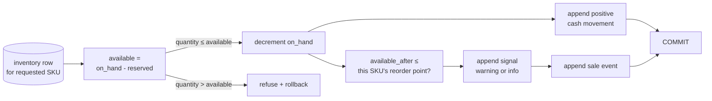
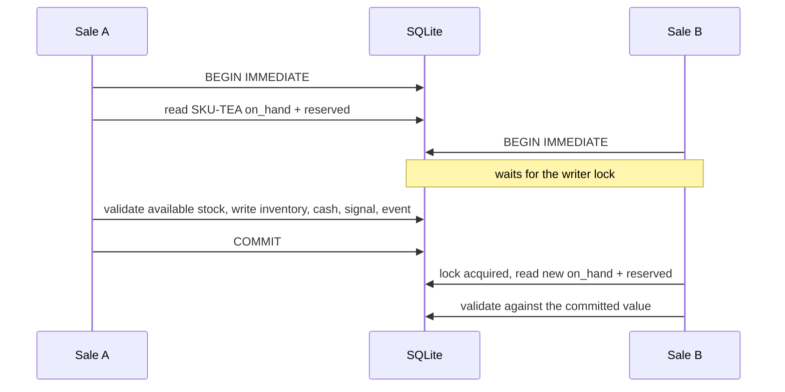

# Chapter 9 — Each product has its own threshold

Lucy sells a *lot* of vanilla and only a little of her weird lavender-honey
flavor. If both had the same "reorder when you hit 3 tubs" rule, one of two bad
things would happen: either she'd run out of vanilla constantly (3 is far too low
for something that flies out the door), or she'd drown in lavender-honey (3 is far
too high for something nobody buys). Different products need different thresholds.
That is obvious in a shop and surprisingly easy to get wrong in code, where it is
tempting to reach for one tidy constant.

Chapter 8 seeded a catalog where each SKU *had* its own reorder point, sitting in
its own row. This chapter proves that number actually *does its job* once real
sales start moving — that selling one product past its own line never trips
another's, and that the very same sale can be an alarm for one product and a
shrug for another.

## Learning objective

Prove, with real sales, that "independent reorder point" from Chapter 8
means what it says once a sale actually happens: selling tea past its own
threshold never flags coffee, and a small coffee sale that stays above
coffee's own (higher) threshold is correctly left alone — even though the
exact same-shaped sale already flagged tea.

## Vocabulary this chapter adds

| Term | What it is |
| --- | --- |
| **Per-SKU threshold** | `below_reorder` evaluates EACH SKU's `on_hand` against THAT SKU's own `reorder_point` — never a catalog-wide number. |
| **Signal severity** | `record_sale`'s own `warning`/`info` distinction, now shown to depend on the selling SKU's own threshold, not a shared one. |

## One transaction, two derived quantities, five durable effects

The sale path is a compact lesson in transactional domain modeling. The diagram
shows the **hardened version you build in this chapter**, not an unqualified map
of the shipped function:



**Figure:** One sale transaction derives availability and the SKU-specific reorder decision, then commits inventory, cash, signal, and event effects together or none at all.

`available` and `total` are derived inside the toy operation rather than passed
as precomputed values. The unit price is still caller-supplied; a stronger
production contract would look it up from the product record. The inventory row
is read after `BEGIN IMMEDIATE`, so the decision and decrement are serialized
against competing writers. Checking before the transaction creates a classic
check-then-act race: two sellers can both observe one remaining tub and both
decide it is available.

The threshold predicate is evaluated against `available_after`, not the opening
quantity or physical stock alone. It is also local to the selected row. Write
it mathematically:

```text
available(sku) = on_hand(sku) - reserved(sku)
sale allowed    ⇔ quantity > 0 ∧ quantity ≤ available(sku)
warning         ⇔ available_after(sku) ≤ reorder_point(sku)
```

That notation exposes boundary choices prose can hide. Equality produces a
warning in this implementation. Reserved units reduce sellable stock without
changing physical on-hand. An unknown SKU is refused rather than implicitly
created. A non-positive quantity cannot be used as a disguised return. Each is a
domain policy, and each needs an explicit test because SQLite constraints alone
do not express the full predicate.

The signal is written even at `info` severity. This makes the sale auditable
while allowing the wake gate to decline work. Recording facts broadly and
creating work narrowly is cleaner than suppressing facts merely because they do
not yet require action.

### Contract audit: where the teaching model and production differ

Read `src/reference_organizations/store/__init__.py::record_sale` before
assuming the exercise describes it exactly:

| Rule | Chapter implementation | Current production implementation |
| --- | --- | --- |
| Concurrent read/write | `BEGIN IMMEDIATE` | `db.immediate()`—same guarantee |
| Reservation-aware availability | checks `on_hand - reserved` | same rule, inside the transaction |
| Positive quantity | explicitly refused | same refusal before any write |
| Price authority | caller supplies unit price | caller also supplies unit price; catalog price is not consulted |
| Atomic durable effects | inventory, cash, signal, event | same four classes of write in one transaction |

The remaining mismatch is operationally real: accepting a caller-supplied price
is a deliberate teaching seam, not catalog-authoritative commerce. Reservations
show a different lesson. A schema field became a guarantee only when the
mutation path consumed it and fault-injection tests proved refusal left every
table unchanged. The chapter and production now share that stronger contract.

## Build the sale yourself, then oversell the freezer

A sale looks like one act. It is at least **five writes that must be true
together**: inventory down, cash up, a severity-judged signal, a committed
event, and the total derived — never trusted. Build it whole, then watch the
one-line shortcut sell ice cream that does not exist.

```python
import sqlite3

db = sqlite3.connect(":memory:")
db.executescript("""
    CREATE TABLE inventory (sku TEXT PRIMARY KEY, on_hand INT NOT NULL,
                            reserved INT NOT NULL DEFAULT 0, reorder INT NOT NULL);
    CREATE TABLE cash_entries (id INTEGER PRIMARY KEY, amount_cents INT NOT NULL);
    CREATE TABLE events (seq INTEGER PRIMARY KEY, kind TEXT NOT NULL);
    CREATE TABLE signals (id TEXT PRIMARY KEY, dedupe_key TEXT UNIQUE, severity TEXT);
""")
db.execute("INSERT INTO inventory VALUES ('SKU-TEA', 4, 0, 3)")
db.execute("INSERT INTO inventory VALUES ('SKU-COFFEE', 10, 0, 6)")
db.commit()
```

### One exact sale, traced through every write

**Listing:** Record a sale and its five effects atomically

```python
def record_sale(db, sku, quantity, unit_price_cents):
    if quantity <= 0:
        return "refused: quantity must be positive"
    db.execute("BEGIN IMMEDIATE")
    row = db.execute(
        "SELECT on_hand, reserved, reorder FROM inventory WHERE sku = ?", (sku,)
    ).fetchone()
    if row is None:
        db.execute("ROLLBACK")
        return "refused: unknown SKU -- actors cannot invent inventory"
    on_hand, reserved, reorder = row
    available = on_hand - reserved
    if quantity > available:
        db.execute("ROLLBACK")
        return f"refused: only {available} available ({on_hand} on hand, {reserved} reserved)"
    new_on_hand = on_hand - quantity
    available_after = new_on_hand - reserved
    total = quantity * unit_price_cents
    db.execute("UPDATE inventory SET on_hand = ? WHERE sku = ?", (new_on_hand, sku))
    db.execute("INSERT INTO cash_entries(amount_cents) VALUES (?)", (total,))
    severity = "warning" if available_after <= reorder else "info"
    count = db.execute("SELECT COUNT(*) FROM signals").fetchone()[0]
    sig_id = f"sig-{count}"
    db.execute(
        "INSERT INTO signals VALUES (?, ?, ?)",
        (sig_id, f"inventory:{sku}:{new_on_hand}:{sig_id}", severity),
    )
    db.execute("INSERT INTO events(kind) VALUES ('sale.committed')")
    db.execute("COMMIT")
    return f"sold {quantity} {sku} for {total}c -> on_hand {new_on_hand}, signal {severity}"


print(record_sale(db, "SKU-TEA", 2, 400))
print(record_sale(db, "SKU-COFFEE", 2, 500))  # the SAME quantity, deliberately
```

```text
sold 2 SKU-TEA for 800c -> on_hand 2, signal warning
sold 2 SKU-COFFEE for 1000c -> on_hand 8, signal info
```

The two sales are **genuinely identical in shape** — two units each — and
their signals still split `warning`/`info`. That is the chapter's thesis
made mechanical: severity is not a property of how much sold, but of where
each SKU landed **relative to its own line** (tea: 2 ≤ 3; coffee: 8 > 6).
Note also the total: `quantity * unit_price_cents`, *derived* inside the
sale — a caller-supplied total would be a self-graded number, the boolean-
authority mistake from Chapter 3 wearing a price tag. And the signal's
`dedupe_key` carries the signal's own id as a suffix: production learned
this the hard way when an older key of just `inventory:{sku}:{on_hand}` let
two *different* sales that happened to land on the same stock level collide
— and `INSERT OR REPLACE` silently **deleted the first sale's signal row**,
history a Pulse origin might already reference. The per-occurrence suffix
plus a plain `INSERT` under a `UNIQUE` constraint makes that failure loud
instead of silent.

### The refusals, each for its own reason

```python
print(record_sale(db, "SKU-TEA", -1, 400))
print(record_sale(db, "SKU-PISTACHIO", 1, 400))
print(record_sale(db, "SKU-TEA", 5, 400))
```

```text
refused: quantity must be positive
refused: unknown SKU -- actors cannot invent inventory
refused: only 2 available (2 on hand, 0 reserved)
```

A negative quantity is not a small sale, it is a disguised restock that
bypasses purchasing. An unknown SKU is not an empty shelf, it is inventory
being invented. And the oversell refusal reads **availability**, not
`on_hand` — hold that distinction two sections.

### Break it: the sale that checks first and writes later

The tempting optimization: check availability once, up front, then just
decrement. Two sales arrive; both check before either writes:

```python
def sell_naive(db, sku, quantity, available_seen):
    if quantity > available_seen:
        return "refused"
    db.execute("UPDATE inventory SET on_hand = on_hand - ? WHERE sku = ?", (quantity, sku))
    db.commit()
    return f"sold {quantity} {sku}"


seen = db.execute("SELECT on_hand FROM inventory WHERE sku = 'SKU-TEA'").fetchone()[0]
print("both sales saw availability:", seen)
print(sell_naive(db, "SKU-TEA", 2, seen))
print(sell_naive(db, "SKU-TEA", 2, seen))
on_hand = db.execute("SELECT on_hand FROM inventory WHERE sku = 'SKU-TEA'").fetchone()[0]
print("on hand now:", on_hand)
```

```text
both sales saw availability: 2
sold 2 SKU-TEA
sold 2 SKU-TEA
on hand now: -2
```

Minus two tubs of tea. Two customers paid for four units of a stock of two,
and the ledger — the thing whose whole job is refusing unrecorded stock —
now promises ice cream that does not exist. This is Chapter 5's
read-then-write race selling groceries: the check was true *when it ran*,
and stale *when it mattered*.

### Repair: the read moves inside the transaction

`record_sale` already contains the fix — look back at its shape. The
`SELECT` happens **after** `BEGIN IMMEDIATE`, inside the same transaction as
the writes, so no second sale can sneak between the check and the decrement:

```python
db.execute("UPDATE inventory SET on_hand = 2 WHERE sku = 'SKU-TEA'")  # undo the lie
db.commit()
print(record_sale(db, "SKU-TEA", 2, 400))
print(record_sale(db, "SKU-TEA", 2, 400))
on_hand = db.execute("SELECT on_hand FROM inventory WHERE sku = 'SKU-TEA'").fetchone()[0]
print("on hand now:", on_hand)
```

```text
sold 2 SKU-TEA for 800c -> on_hand 0, signal warning
refused: only 0 available (0 on hand, 0 reserved)
on hand now: 0
```

Production's `record_sale` states this rule in its own docstring: "The read
of current stock happens INSIDE the immediate transaction. Reading first and
writing later lets two concurrent sales both see enough stock and both sell
it." One honest note about the toy: these two calls run on one connection,
so what you watched is the *logic* refusing on a re-read, not two OS
processes colliding — `BEGIN IMMEDIATE`'s reserved lock is what serializes
genuinely concurrent connections, and the production suite proves that case
with real separate connections.

### Available is not on-hand

Chapter 2's acceptance checks count reservations; a consistent sale contract
must too. Build the rule in the chapter model to see the behavior precisely:
six tubs
physically in the freezer, five promised to a wedding order:

```python
db.execute("UPDATE inventory SET on_hand = 6, reserved = 5 WHERE sku = 'SKU-TEA'")
db.commit()
print(record_sale(db, "SKU-TEA", 2, 400))
print(record_sale(db, "SKU-TEA", 1, 400))
```

```text
refused: only 1 available (6 on hand, 5 reserved)
sold 1 SKU-TEA for 400c -> on_hand 5, signal warning
```

Selling from `on_hand` alone can double-promise the wedding's tubs to a
walk-in customer — both truths recorded, both impossible to honor.
`available = on_hand - reserved` is one subtraction, and it is the entire
difference between a ledger that models commitments and one that models
shelves. Production now performs that subtraction inside `db.immediate()`,
refuses before any write, and computes signal severity from the remaining
available stock—not the physically present stock.

### All five writes, or none

Finally, the crash test every multi-write act in this book must pass:

```python
def record_sale_but_crash(db, sku, quantity, unit_price_cents):
    db.execute("BEGIN IMMEDIATE")
    on_hand = db.execute("SELECT on_hand FROM inventory WHERE sku = ?", (sku,)).fetchone()[0]
    db.execute("UPDATE inventory SET on_hand = ? WHERE sku = ?", (on_hand - quantity, sku))
    db.execute("INSERT INTO cash_entries(amount_cents) VALUES (?)", (quantity * unit_price_cents,))
    raise RuntimeError("power cut before the signal and event were written")


def snapshot(db):
    on_hand = db.execute("SELECT on_hand FROM inventory WHERE sku = 'SKU-TEA'").fetchone()[0]
    cash = db.execute("SELECT COUNT(*) FROM cash_entries").fetchone()[0]
    events = db.execute("SELECT COUNT(*) FROM events").fetchone()[0]
    return f"on_hand={on_hand} cash_rows={cash} events={events}"


print("before:", snapshot(db))
try:
    record_sale_but_crash(db, "SKU-TEA", 1, 400)
except RuntimeError as error:
    db.execute("ROLLBACK")
    print("failed:", error)
print("after: ", snapshot(db))
```

```text
before: on_hand=5 cash_rows=4 events=4
failed: power cut before the signal and event were written
after:  on_hand=5 cash_rows=4 events=4
```

Inventory and cash had already been written when the power died — and the
rollback took both back. A sale that decrements stock but records no cash,
or takes cash but emits no signal for Pulse to wake on, is not a partial
sale; it is a ledger at war with itself. The production version—`record_sale`
in `src/reference_organizations/store/__init__.py`—shares the
inside-the-transaction read, reservation and quantity guards,
caller-price multiplication, per-SKU severity, per-occurrence dedupe key, and
all-or-nothing commit. It deliberately does not resolve the caller-price seam.
Similarity of transaction shape must not be inflated into equality of every
domain policy.

## Numeric state belongs in the transaction, not in the prompt

Language models are poor places to enforce arithmetic invariants. Even a model
that subtracts correctly cannot know whether another sale committed between its
read and its proposed write. The trusted calculation therefore sits beside the
rows it protects, inside `BEGIN IMMEDIATE`:



**Figure:** `BEGIN IMMEDIATE` serializes competing sales so the second writer validates against the first writer's committed inventory rather than a stale read.

The lock is not protecting subtraction as a CPU operation. It protects the
relationship between the read, the decision, and all five writes. Move the read
above the transaction and both sellers can observe the same stock. Move cash or
the signal below the commit and a crash can sell an item without recording the
money or the need to replenish it.

Production also refuses to let the provider invent values the ledger already
knows. A `RestockProposal` contains only `sku` and `quantity`; unit cost comes
from the product row. The sale path accepts price as an input because the demo
models a point-of-sale event, but it stores signed integer cents rather than a
floating-point balance. The cash balance is derived by summing movements, so no
writer can overwrite “the current total” and erase another entry.

Use this ownership table whenever a tool call contains numbers:

| Value | Authoritative owner | Why the model must not be final authority |
| --- | --- | --- |
| quantity requested | proposal, then host range checks | intent may originate with the actor, but zero, negative, or excessive quantities must refuse |
| current on-hand | inventory row read under the write lock | a value read earlier can be stale before mutation |
| available stock | host computes `on_hand - reserved` | ignoring reservations oversells stock that is already promised |
| unit cost | product record | accepting a proposed cost lets the actor choose how much cash leaves |
| cash movement | host computes quantity times integer cents | generated arithmetic and floating-point money are both avoidable risks |
| low-stock severity | host compares the post-sale level to this SKU's threshold | a global threshold destroys product isolation |

### One transaction, five independently checkable facts

`record_sale` writes more than an inventory number. Its output can be traced
through five durable surfaces:

1. the SKU's `on_hand` decreases;
2. one positive cash movement records quantity times sale price;
3. a fresh signal id records the observation for this occurrence;
4. the signal's dedupe key includes SKU, post-sale level, and that fresh id;
5. `sale.committed` binds SKU, quantity, cash id, signal id, and resulting stock.

The fresh signal id is subtle. Two separate sales can leave the same numeric
level at different times, especially after a restock. A dedupe key made only
from SKU and level would call those distinct events identical. Earlier code used
`INSERT OR REPLACE`, which could delete the first signal while a Pulse origin
still referenced it. Production now uses a per-occurrence key and plain
`INSERT`; a collision raises and rolls back instead of rewriting history.

This is the broader lesson from defensive parsing in the course material:
structural data should be created and validated by tools. Ask the model to name
the intended SKU and quantity. Let deterministic code expand identities, read
current rows, calculate money, classify severity, and bind the event graph. The
model remains useful where judgment is needed without becoming the arithmetic
or concurrency boundary.

### Test the boundary cases before the happy path

For any sale function, write the edge matrix before implementation:

| Starting available | Quantity | Required result |
| ---: | ---: | --- |
| 5 | 0 | refuse as an invalid sale request |
| 5 | -1 | refuse; a negative sale must not become a restock |
| 5 | 5 | commit, leaving exactly zero |
| 5 | 6 | refuse with every table unchanged |
| 5 on hand, 3 reserved | 3 | refuse if the contract sells only available stock |
| missing SKU | 1 | refuse; actors cannot invent inventory |

The current Store demo's `record_sale` guards positive quantity, unknown SKUs,
and `on_hand - reserved` inside the same immediate transaction. That still does
not imply a complete reservation lifecycle: this example begins with an
existing reservation value and protects it during sale. It does not create,
expire, allocate, or fulfill reservations. Never infer a complete subsystem
from one correctly consumed column.

## The exercise

```bash
uv run python book/ch09_each_product_has_its_own_threshold/solution.py --root /tmp/lucy-ch09
```

Read the file first. Two sales happen: 2 units of tea (4 on hand, reorder at
3 — this crosses it), then 1 unit of coffee (10 on hand, reorder at 6 — this
does not). Both are genuine calls to the same `record_sale` Chapter 0
already used.

## Expected observations

```json
{
  "opening_positions": {
    "SKU-COFFEE": { "on_hand": 10, "reorder_point": 6 },
    "SKU-TEA": { "on_hand": 4, "reorder_point": 3 }
  },
  "tea_sale": {
    "signal_severity": "warning",
    "on_hand_after": 2,
    "coffee_on_hand_unaffected": true
  },
  "below_reorder_after_tea_sale": ["SKU-TEA"],
  "small_coffee_sale": {
    "signal_severity": "info",
    "on_hand_after": 9
  },
  "below_reorder_after_small_coffee_sale": ["SKU-TEA"],
  "each_sku_evaluated_against_its_own_threshold": {
    "tea_flagged_at_its_own_lower_threshold": true,
    "coffee_not_flagged_by_a_sale_still_above_its_own_higher_threshold": true
  }
}
```

(`signal_id` values are omitted above — they are fresh, timestamp-prefixed
identifiers on every run; the exercise itself prints the real ones.)

The two facts this run proves:

1. **`coffee_on_hand_unaffected: true`.** Selling tea changed exactly one
   row in `inventory` — coffee's own `on_hand` is untouched, read back after
   the tea sale, not merely assumed.
2. **`signal_severity` is judged per SKU, against that SKU's own line.** The tea
   sale leaves 2 on hand, at-or-below tea's reorder point of 3, so its signal is
   `warning`. The coffee sale leaves 9, still above coffee's reorder point of 6,
   so its signal is `info`. These are two different-sized sales — that is the
   point: severity is not a property of how much sold, but of where each SKU
   landed relative to *its own* threshold. (Try editing the exercise to sell the
   *same* quantity from both — selling 2 of each still warns tea and leaves coffee
   at `info`, because 8 is above coffee's line of 6. The split follows the
   thresholds, not the quantities.)

Confirm it yourself:

```bash
sqlite3 /tmp/lucy-ch09/.sovereign/organization.db <<'SQL'
SELECT sku, on_hand, reorder_point, on_hand <= reorder_point AS below FROM inventory ORDER BY sku;
SQL
```

Expected: `SKU-TEA` shows `below = 1`; `SKU-COFFEE` shows `below = 0`.

## Learner verification command

```bash
uv run python -m pytest tests/test_store_multi_sku.py -k "threshold or wake_gate_never_fires"
uv run python scripts/verify_curriculum.py
```

Expected: all pass.

## Summary

A sale now enters `record_sale` as five writes inside one transaction:
inventory down, cash up, a severity-judged signal, a committed event, and a
derived total — with the read of current stock happening *inside* the same
`BEGIN IMMEDIATE` block as the decrement, and the reorder-point comparison
evaluated per SKU, against that SKU's own row.

The governing rule is that severity is a property of where a SKU
lands relative to its *own* threshold, never a property of how much sold:
two genuinely identical two-unit sales on tea and coffee produced a
`warning` and an `info` signal respectively, because the two SKUs' reorder
points differ.

The prevented failure is an oversell: a check-then-act race where two
sales both read "2 available" before either writes, and the naive version
built here drove `on_hand` to `-2`, promising ice cream that does not exist.
Moving the read inside the transaction closes it.

For Lucy, this is why vanilla, which flies off the shelf, and
lavender-honey (which nobody buys) each get their own reorder line instead
of one shared number — and why a sale of either one is checked against
reality at the instant it happens, not against what the till believed a
moment earlier.

## Explain it back

1. `below_reorder` takes no SKU argument — it scans the whole `inventory`
   table. Where does the per-SKU comparison actually happen, in the SQL
   itself or in Python?
2. Why does this chapter sell only 1 unit of coffee, not 2 (the same
   quantity as the tea sale)? What would selling 2 units of coffee instead
   have shown, or failed to show?
3. If `CatalogEntry.reorder_point` were removed and replaced with one
   module-level constant shared by every SKU, which specific line of this
   chapter's own JSON output would become false first?
4. `sell_naive` produced `on_hand = -2` without any bug in its arithmetic.
   Name the exact property the check had at decision time but lacked at
   write time, and where `record_sale` relocates the check to fix it.
5. The sale's total is derived (`quantity * unit_price_cents`), never
   accepted from the caller. Which earlier chapter's lesson is this, and
   what lie does a caller-supplied total enable?
6. Six on hand, five reserved, and a two-unit sale is refused. Who is being
   protected — the walk-in customer, the wedding order, or the ledger — and
   why is "all three" the right answer?
7. The old dedupe key `inventory:{sku}:{on_hand}` plus `INSERT OR REPLACE`
   silently deleted an earlier sale's signal. Explain who downstream was
   harmed (name the mechanism from Chapter 7) and why the fix adds the
   signal's own id to the key instead of just switching to plain INSERT.

## Where to look next

- `src/reference_organizations/store/__init__.py` — `record_sale`,
  `below_reorder`
- `tests/test_store_multi_sku.py` — the signal-isolation and
  wake-decision-isolation tests this chapter's proof extends into Chapter 10

`solution.py` imports the production package rather than copying it.

Next: [Chapter 10 — One signal wakes one need](../ch10_one_signal_wakes_one_need/README.md)
