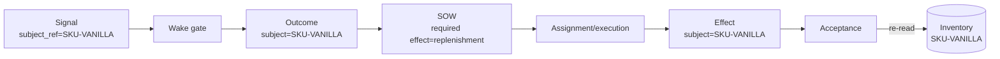
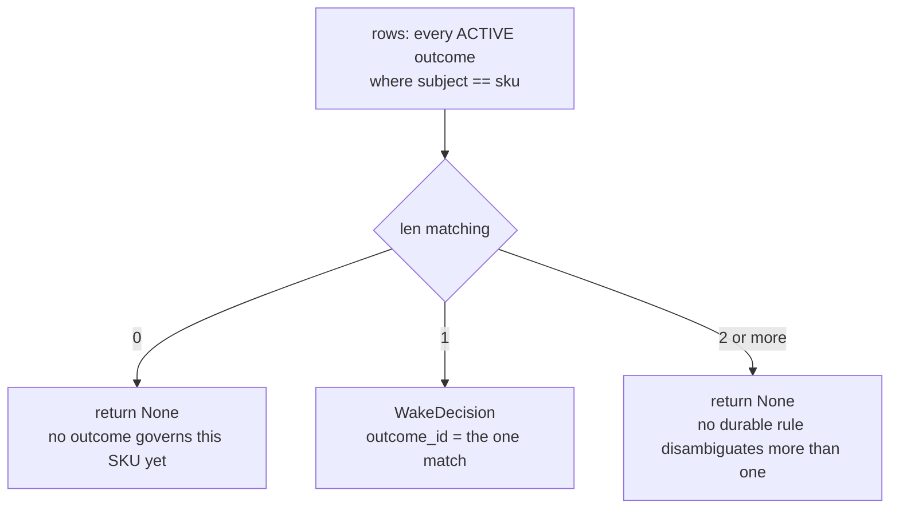
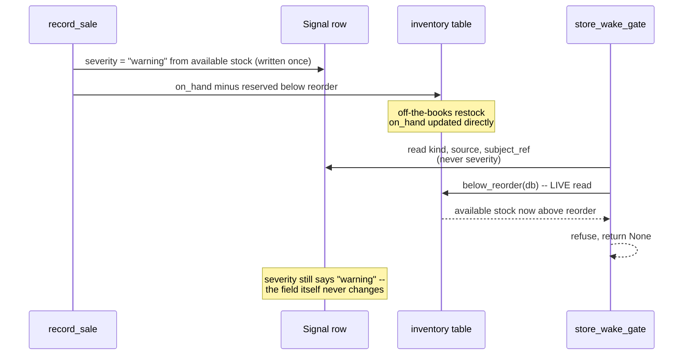

# Chapter 10 — One signal wakes one need

It's a busy Saturday. Lucy's vanilla drops below its line at 2:00 and her
chocolate drops below its line at 2:05. Two alarms, close together. The one thing
that must never happen is a crossed wire: the vanilla alarm starting a chocolate
reorder, or both alarms collapsing into a single order that restocks one flavor
twice and the other not at all. Each signal has to wake *its own* need, and only
its own.

This sounds trivial — of course a vanilla alarm is about vanilla — but "which
signal is about which product" is precisely the kind of thing that goes wrong
when work is created from events rather than from a human pointing at a form. In
Chapter 7 you watched one signal correctly wake one need. This chapter makes sure
that stays true when two needs are in flight at once, by pinning the decision to a
fact carried *on the signal itself*, not to timing or arrival order.

## Learning objective

Watch the Store's own wake gate (`store_wake_gate`, the exact mechanism
Chapter 7 exercised for one SKU) correctly bind each of two DIFFERENT
signals to its own SKU's own outcome — never the other SKU's, and never
both — using nothing but the signal's own `subject_ref`.

Chapter 7 proved the gate correctly decides for one SKU. This chapter is
the smallest possible extension of that proof: two SKUs, two outcomes, two
signals, and the requirement that the gate never confuses which signal
belongs to which outcome.

## Vocabulary this chapter adds

| Term | What it is |
| --- | --- |
| **Signal-to-SKU binding** | A signal's own `subject_ref` field is what the wake gate reads to decide which outcome it is about — not the order signals arrive in, not which one was created first. |

## Trace identity end to end

Isolation is not achieved by putting `sku` on one table. The same subject must
survive every edge from observation to accepted effect:



**Figure:** Subject identity must survive every edge from signal through outcome, work, execution, effect, and fresh inventory verification for acceptance to be causal.

At each arrow, ask whether identity is **derived** from the preceding durable
record or supplied again by a caller. Re-supplying `sku="vanilla"` at acceptance
creates a confused-deputy opportunity: a caller can present a real effect for
coffee while asking the verifier to inspect vanilla. Production instead follows
the ledger chain and compares the effect kind and subject required by the SOW.

This is stronger than corroboration. Suppose vanilla is already full because a
delivery arrived outside the organization. A world-state check passes, but it
does not prove this execution replenished vanilla. Conversely, a real vanilla
effect does not justify accepting a chocolate outcome. Causal binding requires
both the correct world predicate and the correct provenance path.

Use a binding matrix to reason about the four possibilities:

| World state | Effect binding | Verdict |
| --- | --- | --- |
| wrong | wrong | refuse |
| right | wrong or absent | refuse: no causal credit |
| wrong | right | refuse: action did not achieve outcome |
| right | right | eligible, subject to review/evidence rules |

The two-signal experiment is therefore not merely a feature demonstration. It
is a non-interference test: changing the arrival order or state of coffee must
not change which vanilla outcome the vanilla signal selects.

## Three different questions that all sound like "is it done?"

Before building anything, split one innocent question into the three it
actually contains, because the whole chapter turns on refusing to let them
blur:

- **Authentication** — *who or what produced this artifact?* (Out of scope
  for this ledger, honestly and explicitly — Chapter 2's Exercise 6.)
- **Corroboration** — *do independent observations agree the world is in
  the right state?* (Chapter 2's re-run-the-checks discipline.)
- **Causal binding** — *did THIS exact execution contribute the required
  effect to THIS exact subject and outcome?*

The third is the deepest idea in this system, and the easiest to fake:
"the world looks right" is necessary — and radically insufficient — for
"this work made it right." Build the check that only asks the second
question, and watch what it credits.

## Build the acceptance check yourself, five generations of it

```python
import sqlite3

db = sqlite3.connect(":memory:")
db.executescript("""
    CREATE TABLE inventory (sku TEXT PRIMARY KEY, on_hand INT, reorder INT);
    CREATE TABLE outcomes (id TEXT PRIMARY KEY, subject TEXT);
    CREATE TABLE sows (id TEXT PRIMARY KEY, outcome_id TEXT, required_kind TEXT);
    CREATE TABLE executions (id TEXT PRIMARY KEY, sow_id TEXT, actor TEXT);
    CREATE TABLE effects (id TEXT PRIMARY KEY, execution_id TEXT, kind TEXT, subject TEXT);
""")
db.execute("INSERT INTO inventory VALUES ('SKU-TEA', 8, 3)")
db.execute("INSERT INTO inventory VALUES ('SKU-COFFEE', 9, 6)")
db.execute("INSERT INTO outcomes VALUES ('out-tea', 'SKU-TEA')")
db.execute("INSERT INTO outcomes VALUES ('out-coffee', 'SKU-COFFEE')")
db.execute("INSERT INTO sows VALUES ('sow-tea', 'out-tea', 'replenishment')")
db.execute("INSERT INTO sows VALUES ('sow-coffee', 'out-coffee', 'replenishment')")
db.execute("INSERT INTO executions VALUES ('run-t', 'sow-tea', 'operator-lucy')")
db.commit()
```

Note the opening state carefully: tea is at 8 against a reorder point of 3 —
**comfortably stocked** — and `run-t`, the execution assigned to keep it
that way, has done *nothing yet*. The freezer is full because the delivery
driver restocked it this morning, off the books.

### Generation 1: the check that sees a full freezer

```python
def world_is_right(db, sku):
    on_hand, reorder = db.execute(
        "SELECT on_hand, reorder FROM inventory WHERE sku = ?", (sku,)
    ).fetchone()
    return on_hand >= reorder


def accept_v1(db, sku, execution_id):
    if world_is_right(db, sku):
        return f"ACCEPTED: {sku} is stocked, crediting {execution_id}"
    return "refused: condition false"


print(accept_v1(db, "SKU-TEA", "run-t"))
count = db.execute("SELECT COUNT(*) FROM effects WHERE execution_id = 'run-t'").fetchone()[0]
print("effects recorded by run-t:", count)
```

```text
ACCEPTED: SKU-TEA is stocked, crediting run-t
effects recorded by run-t: 0
```

Accepted, with a straight face, on **zero recorded effects**. The condition
is true — for reasons that have nothing to do with the execution being
credited. v1 asked the corroboration question and then answered the causal
one. Every downstream consumer of this acceptance — payment, reputation,
Chapter 12's release evidence — now believes `run-t` did work it never did.

### Generation 2: "did it do anything?" — the wrong repair

```python
def accept_v2(db, sku, execution_id):
    if not world_is_right(db, sku):
        return "refused: condition false"
    effects = db.execute(
        "SELECT COUNT(*) FROM effects WHERE execution_id = ?", (execution_id,)
    ).fetchone()[0]
    if effects == 0:
        return f"refused: {sku} is stocked, but {execution_id} contributed nothing"
    return f"ACCEPTED: {sku} stocked AND {execution_id} did something"


print(accept_v2(db, "SKU-TEA", "run-t"))
db.execute("INSERT INTO effects VALUES ('eff-1', 'run-t', 'replenishment', 'SKU-COFFEE')")
db.commit()
print(accept_v2(db, "SKU-TEA", "run-t"))
```

```text
refused: SKU-TEA is stocked, but run-t contributed nothing
ACCEPTED: SKU-TEA stocked AND run-t did something
```

The first refusal is progress. Then `run-t` records one effect — a
replenishment of **coffee** — and v2 accepts the **tea** outcome on the
strength of it. "Did something" is a nonzero row count; "did *the* thing"
is a binding. Activity is not contribution.

### Generation 3: the right effect — presented by the wrong hands

```python
def accept_v3(db, sku, execution_id, required_kind):
    if not world_is_right(db, sku):
        return "refused: condition false"
    match = db.execute(
        "SELECT COUNT(*) FROM effects WHERE execution_id = ? AND kind = ? AND subject = ?",
        (execution_id, required_kind, sku),
    ).fetchone()[0]
    if match == 0:
        return f"refused: no {required_kind} effect on {sku} by {execution_id}"
    return f"ACCEPTED: {execution_id} caused a {required_kind} on {sku}"


print(accept_v3(db, "SKU-TEA", "run-t", "replenishment"))
db.execute("INSERT INTO executions VALUES ('run-x', 'sow-coffee', 'operator-mo')")
db.execute("INSERT INTO effects VALUES ('eff-2', 'run-x', 'replenishment', 'SKU-TEA')")
db.commit()
print(accept_v3(db, "SKU-TEA", "run-x", "replenishment"))  # crediting sow-tea with run-x's work
```

```text
refused: no replenishment effect on SKU-TEA by run-t
ACCEPTED: run-x caused a replenishment on SKU-TEA
```

v3 binds kind and subject correctly — and is defeated by its own argument
list. `run-x` belongs to `sow-coffee`; it happened to restock tea; and
because the *caller* chooses which execution id to present, tea's SOW just
took credit for the coffee crew's work. Chapter 2 met this exact disease:
**a caller-supplied fact is a fact the caller chose.** The execution must be
*derived* from the SOW under judgment, never handed in beside it.

### Generation 4: derive the execution — and meet the swapped subject

```python
def accept_v4(db, sow_id, sku, required_kind):
    if not world_is_right(db, sku):
        return "refused: condition false"
    row = db.execute("SELECT id FROM executions WHERE sow_id = ?", (sow_id,)).fetchone()
    if row is None:
        return f"refused: {sow_id} has no execution of its own"
    execution_id = row[0]
    match = db.execute(
        "SELECT COUNT(*) FROM effects WHERE execution_id = ? AND kind = ? AND subject = ?",
        (execution_id, required_kind, sku),
    ).fetchone()[0]
    if match == 0:
        return f"refused: {sow_id}'s own {execution_id} produced no {required_kind} on {sku}"
    return f"ACCEPTED: {sow_id} -> {execution_id} -> {required_kind} on {sku}"


print(accept_v4(db, "sow-tea", "SKU-TEA", "replenishment"))
db.execute("INSERT INTO effects VALUES ('eff-3', 'run-t', 'replenishment', 'SKU-TEA')")
db.commit()
print(accept_v4(db, "sow-tea", "SKU-TEA", "replenishment"))
```

```text
refused: sow-tea's own run-t produced no replenishment on SKU-TEA
ACCEPTED: sow-tea -> run-t -> replenishment on SKU-TEA
```

The refusal fires on the borrowed-credit attack — and then, at last, `run-t`
actually restocks tea (`eff-3`) and the chain accepts honestly. Done? One
argument is still caller-supplied. Watch:

```python
print(accept_v4(db, "sow-tea", "SKU-COFFEE", "replenishment"))
```

```text
ACCEPTED: sow-tea -> run-t -> replenishment on SKU-COFFEE
```

The crossed wire this chapter opened with, in its purest form: tea's SOW,
**accepted against coffee's condition**, credited by `eff-1` — that stray
coffee side-effect from Generation 2. Every individual binding held; the
caller simply pointed the whole apparatus at the wrong subject.

### Generation 5: the caller supplies one fact only

**Listing:** Derive causal acceptance from the statement of work

```python
def accept_v5(db, sow_id):
    outcome_id, required_kind = db.execute(
        "SELECT outcome_id, required_kind FROM sows WHERE id = ?", (sow_id,)
    ).fetchone()
    sku = db.execute("SELECT subject FROM outcomes WHERE id = ?", (outcome_id,)).fetchone()[0]
    if not world_is_right(db, sku):
        return "refused: condition false"
    row = db.execute("SELECT id FROM executions WHERE sow_id = ?", (sow_id,)).fetchone()
    if row is None:
        return f"refused: {sow_id} has no execution of its own"
    execution_id = row[0]
    match = db.execute(
        "SELECT COUNT(*) FROM effects WHERE execution_id = ? AND kind = ? AND subject = ?",
        (execution_id, required_kind, sku),
    ).fetchone()[0]
    if match == 0:
        return f"refused: {sow_id}'s own {execution_id} produced no {required_kind} on {sku}"
    return f"ACCEPTED: {outcome_id}[{sku}] <- {sow_id} <- {execution_id} <- {required_kind}"


print(accept_v5(db, "sow-tea"))
print(accept_v5(db, "sow-coffee"))
```

```text
ACCEPTED: out-tea[SKU-TEA] <- sow-tea <- run-t <- replenishment
refused: sow-coffee's own run-x produced no replenishment on SKU-COFFEE
```

The caller names the SOW. *Everything else* — outcome, subject, required
kind, execution — is read from the ledger's own bindings. And the final
refusal is this chapter's quiet masterpiece: `sow-coffee` is refused because
its execution, `run-x`, spent its one effect restocking **tea**. Doing
*someone else's* work does not satisfy *your own* SOW — the sibling that
donated its labor in Generation 3 cannot claim it back for itself either.
Causal binding cuts in both directions.

The chain v5 walks is worth seeing as a graph — each arrow is a foreign key
the caller cannot forge, plus the one live check:

```text
Outcome  out-tea  (subject: SKU-TEA) ......... world_is_right(SKU-TEA), NOW
   ^  sows.outcome_id
SOW      sow-tea  (required_kind: replenishment)
   ^  executions.sow_id
Execution run-t
   ^  effects.execution_id  AND  effects.kind = required_kind
      AND  effects.subject = outcome's subject
Effect   eff-3   (replenishment on SKU-TEA)
```

Production's `accept()` walks exactly this graph — "Subject is read from the
outcome, not supplied" is a literal comment in `organization.py`, the
`required_effect_kind` clause carries the no-vacuous-guard rule Chapter 2
quoted, and `tests/test_causal_binding.py` attacks every arrow above the
same way this section did. What the graph still does *not* prove is
authentication: an actor with raw database access could forge every row in
it, agreeing with itself perfectly. Chapter 2 drew that boundary; Chapter 12
will price it.

## Break it: what the gate's ambiguity refusal is actually preventing

`store_wake_gate`'s docstring makes a claim this chapter has not yet
proven: a qualifying signal must map "to EXACTLY one ACTIVE outcome naming
that subject." Every run so far has quietly kept that true by construction
(one outcome per SKU, seeded once, never duplicated). This section breaks
that assumption on purpose and watches the gate's own code decide what to
do about it, against the real production function, not a paraphrase of it.

`store_wake_gate` (`src/reference_organizations/store/pulse_gate.py`)
builds `matching` by scanning every row in `outcomes` and keeping the ones
whose `subject` equals the signal's SKU *and* whose `state` is `ACTIVE`.
The one line that decides everything downstream is `if len(matching) != 1:
return None`. Read literally, that line refuses two shapes of input for
the same reason: a SKU nobody governs yet (zero matches), and a SKU two
outcomes both claim to govern (two or more matches). Both refusals are
`None` — no exception, no partial decision, nothing durable recorded.



**Figure:** The caller supplies only the SKU fact; durable outcomes determine ownership, and any cardinality other than exactly one produces refusal rather than a guess.

**What this figure shows:** the gate has exactly one branch that fires,
flanked by two refusal branches that look nothing alike in cause — one is
under-coverage, the other is over-coverage — but collapse to the identical
observable outcome. A caller reading only "did it fire?" cannot tell which
refusal happened, and the gate's own contract says it should not have to:
either way, nothing governs this signal well enough to act.

Prove the ambiguous branch against the real function. Seed one SKU with
*two* ACTIVE outcomes both naming it (the shape a human could produce by
activating a second "keep the tea stocked" outcome without noticing the
first was never closed), then run a real qualifying sale against it:

```python
import tempfile
from pathlib import Path

from reference_organizations.store import record_sale, seed_catalog
from reference_organizations.store.pulse_gate import store_wake_gate
from sovereign_agent.organization import Organization
from sovereign_agent.pulse import run_pulse_once

root_ch10 = Path(tempfile.mkdtemp())
org_ch10 = Organization.init(root_ch10)
seed_catalog(org_ch10.db)

outcome_original = org_ch10.create_outcome(
    "Keep the tea jar stocked (original)",
    "On-hand SKU-TEA is at or above the reorder point.",
    ["inventory_at_or_above_reorder_point"],
    "principal-human",
    "SKU-TEA",
)
org_ch10.activate(outcome_original.id, "master-course")

outcome_duplicate = org_ch10.create_outcome(
    "Keep the tea jar stocked (accidental duplicate)",
    "On-hand SKU-TEA is at or above the reorder point.",
    ["inventory_at_or_above_reorder_point"],
    "principal-human",
    "SKU-TEA",
)
org_ch10.activate(outcome_duplicate.id, "master-course")

tea_signal = record_sale(org_ch10.db, "SKU-TEA", 2, 400)

real_decision = store_wake_gate(org_ch10, tea_signal)
print("real gate, two ACTIVE outcomes for one SKU:", real_decision)

real_report = run_pulse_once(org_ch10, store_wake_gate)
print(
    "real gate, pulse pass status:", real_report.items[0].status, "-", real_report.items[0].detail
)
sows_real = org_ch10.db.connection.execute("SELECT COUNT(*) c FROM sows").fetchone()["c"]
print("real gate, sows created:", sows_real)
```

```text
real gate, two ACTIVE outcomes for one SKU: None
real gate, pulse pass status: skipped - wake gate did not fire
real gate, sows created: 0
```

The real function does exactly what its docstring claims: two matches
refuse as cleanly as zero would. No SOW, no assignment, no wake decision
row — the signal stays durably recorded and unevaluated, waiting for a
human to close the duplicate outcome and let the next Pulse pass resolve
it cleanly.

Now the mutation: a `store_wake_gate` with the `len(matching) != 1` check
weakened to `if not matching: return None` — it still refuses the
zero-match case, but silently accepts the ambiguous one by taking whichever
row `matching[0]` happens to be. Every other line is copied verbatim from
production, so the only variable is that one refusal condition:

```python
import json

from reference_organizations.store import below_reorder
from sovereign_agent.models import OutcomeState, Role
from sovereign_agent.pulse import WakeDecision


def store_wake_gate_picks_first_on_ambiguity(org, signal):
    if signal.kind != "inventory.changed" or signal.source != "sale":
        return None
    sku = signal.subject_ref
    if sku not in below_reorder(org.db):
        return None
    rows = org.db.connection.execute("SELECT record FROM outcomes").fetchall()
    matching = []
    for row in rows:
        record = json.loads(row["record"])
        if record.get("subject") == sku and record.get("state") == OutcomeState.ACTIVE.value:
            matching.append(record)
    if not matching:
        return None  # BUG: was `if len(matching) != 1`, so ambiguity is no longer refused
    outcome_id = str(matching[0]["id"])
    return WakeDecision(
        outcome_id=outcome_id,
        scope=f"Pulse-dispatched replenishment after signal {signal.id}",
        role=Role.OPERATOR,
        planner_id="master-course",
        worker_id="operator-course",
        required_effect_kind="replenishment",
    )


mutated_decision = store_wake_gate_picks_first_on_ambiguity(org_ch10, tea_signal)
print("mutated gate fired:", mutated_decision is not None)
print(
    "mutated gate picked the OLDER outcome (created first):",
    mutated_decision.outcome_id == outcome_original.id,
)
print(
    "mutated gate picked the NEWER outcome (the actual duplicate):",
    mutated_decision.outcome_id == outcome_duplicate.id,
)
```

```text
mutated gate fired: True
mutated gate picked the OLDER outcome (created first): True
mutated gate picked the NEWER outcome (the actual duplicate): False
```

This is the false green. The mutated gate does not crash and does not
notice anything is wrong. It fires, builds a real `WakeDecision`, and a
full Pulse pass would create an ordinary-looking SOW, assignment, and
eventually a replenishment effect against `outcome_original` — a choice
determined entirely by which row SQLite happened to return first, which is
*never* a governed fact. `sows.outcome_id` would look perfectly ordinary: one row,
one signal, one outcome, no trace anywhere that a second outcome was
silently discarded. Nothing downstream (Chapter 9's threshold checks,
Chapter 12's release evidence) can tell "the gate resolved a real tie
correctly" apart from "the gate ignored a real conflict and got lucky,"
because both produce the identical shape of record.

| | Real `store_wake_gate` | Mutated (`if not matching`) |
| --- | --- | --- |
| Zero ACTIVE outcomes for the SKU | Refuses, `None` | Refuses, `None` (unchanged) |
| Two ACTIVE outcomes for the SKU | Refuses, `None` | Fires, picks row order |
| SOWs created on the duplicate-outcome input | 0 | 1 (arbitrary target) |
| What a caller would believe | Nothing governs this yet (correct) | The right outcome fired (unverifiable) |

`tests/test_store_multi_sku.py::test_wake_gate_refuses_when_two_active_outcomes_name_the_same_sku`
pins this as a regression against the real function, and a paired test
runs the exact mutation shown above and asserts it fires when the real
gate would not — so a future refactor that weakens the cardinality check
the way this section did is caught by the test suite, not by a chapter's
prose.

**Why "exactly one," not "at least one."** A gate that fired on the first
match rather than refusing on more than one would still pass every test
this book has run before this section, because every prior exercise seeds
precisely one ACTIVE outcome per SKU — the bug is invisible until the
precondition it silently assumes stops holding. A rule that is correct
under an assumption the code never states, let alone verifies, is a rule
waiting for the day the assumption breaks. `store_wake_gate` states it and
verifies it in the same line.

## The signal is a snapshot; the gate re-checks live

The two-outcome case is one way the gate refuses to trust an assumption.
There is a second, quieter one, named directly in `store_wake_gate`'s own
docstring: a qualifying trigger's subject must be "CURRENTLY below its
reorder point (re-checked now, not trusted from the signal's own
`severity` at the time it was written — stock may have already been
replenished since)." A `Signal` row's `severity` field is written once, at
`record_sale`'s moment of creation, and never updated again — it is a
snapshot, not a live view. If the gate trusted it, a signal born as
`"warning"` would stay a reason to fire forever, even long after the shelf
it described was quietly restocked.



**Figure:** A signal preserves the historical warning, while the gate re-reads live inventory and refuses obsolete work after an off-path restock.

**What this figure shows:** everything the gate reads from the signal
object — `kind`, `source`, `subject_ref` — is identity and provenance, set
once and never expected to change. `severity` is the one field on the same
object that describes the *world*, not the signal, and the gate never
reads it at all: every freshness question — is this SKU still below
reorder, right now — is answered by a second, independent read against
`inventory`. The frozen `severity` field and the live `below_reorder` read
can disagree, and when they do, the gate trusts the live read every time.

Prove it against the real gate. Record a real qualifying sale, then
restock the SKU off the books — direct SQL, exactly the "delivery driver
restocked it this morning" scene this chapter opened with, never touching
the signal row itself — and run the same signal through the gate again:

```python
tea_signal_2 = record_sale(org_ch10.db, "SKU-COFFEE", 5, 650)
print("signal severity at creation:", tea_signal_2.severity)

org_ch10.db.connection.execute("UPDATE inventory SET on_hand = 20 WHERE sku = 'SKU-COFFEE'")
org_ch10.db.connection.commit()

decision_after_restock = store_wake_gate(org_ch10, tea_signal_2)
print("gate decision after an off-the-books restock:", decision_after_restock)
print("signal severity is still:", tea_signal_2.severity, "(the field itself never changes)")
```

```text
signal severity at creation: warning
gate decision after an off-the-books restock: None
signal severity is still: warning (the field itself never changes)
```

The signal's own `severity` field is frozen at `"warning"` forever — reading
it in isolation would say this SKU still needs attention. The gate ignores
that frozen field entirely and re-reads `below_reorder(org.db)` against the
inventory table as it stands right now, so the restock the signal never
learned about still refuses the decision correctly. Two different fields
carry two different kinds of truth here: `severity` answers "how urgent did
this look the moment it was recorded," a fact about the past that a caller
might reasonably want for triage or an alert dashboard; `below_reorder`'s
live query answers "does this still need action," the only fact
`store_wake_gate` is allowed to act on. Confusing the two would make the
gate's decision depend on how long a signal sat unevaluated rather than on
the world's current state — the same durable-fact-versus-live-decision
separation Chapter 7's four-clocks table drew for signals, ticks,
supervisor sweeps, and heartbeats, applied here to a single field instead
of a whole mechanism.

## The exercise

```bash
uv run python book/ch10_one_signal_wakes_one_need/solution.py --root /tmp/lucy-ch10
```

Read the file first. Two outcomes are created, one per SKU. Two sales
happen, each crossing its own SKU's reorder point. `store_wake_gate` is
called directly, once per signal, so you can see each individual decision
before the aggregate Pulse pass runs.

## Expected observations

```json
{
  "two_signals_two_outcomes": {
    "tea_outcome_id": "out_...",
    "coffee_outcome_id": "out_..."
  },
  "gate_decisions": {
    "tea_signal_maps_to_tea_outcome": true,
    "coffee_signal_maps_to_coffee_outcome": true,
    "decisions_never_cross": true
  },
  "pulse_pass_result": {
    "tea_status": "created",
    "coffee_status": "created",
    "each_signal_got_its_own_sow": true
  }
}
```

Three facts this run proves:

1. **`tea_signal_maps_to_tea_outcome: true`, `coffee_signal_maps_to_
   coffee_outcome: true`.** Each signal's own gate decision names the
   CORRECT outcome, read back from the decision object the production gate
   actually returned — never assumed from which sale ran first.
2. **`decisions_never_cross: true`.** The two decisions' `outcome_id`
   values are different — the gate did not, even by coincidence, hand both
   signals the same outcome.
3. **`each_signal_got_its_own_sow: true`.** The full Pulse pass, run after
   the direct gate calls, independently confirms the same binding survives
   all the way through canonical creation: two signals, two SOWs, never one
   shared SOW standing in for both SKUs' work.

Confirm it yourself:

```bash
sqlite3 /tmp/lucy-ch10/.sovereign/organization.db <<'SQL'
SELECT wd.source_signal_id, wd.subject, po.sow_id
FROM pulse_wake_decisions wd JOIN pulse_origins po ON po.wake_decision_id = wd.id
ORDER BY wd.decided_at;
SQL
```

Expected: two rows, one `subject = SKU-TEA`, one `subject = SKU-COFFEE`,
each naming a different `sow_id`.

## Learner verification command

```bash
uv run python -m pytest tests/test_store_multi_sku.py -k "wake_decision or pulse_origins_trace"
uv run python scripts/verify_curriculum.py
```

Expected: all pass.

## Summary

Acceptance now requires two things at once: the world predicate is true, and
the proof path from outcome to SOW to execution to effect is the path that made
it true. The five generations progressively stopped accepting caller-supplied
facts and derived them from the ledger instead. A right-shaped effect from the
wrong execution, or the right execution credited to the wrong SKU, refuses.

The wake gate applies the same discipline earlier. It fires only when one
ACTIVE outcome names the signal's subject. Zero matches and multiple matches
both mean that governance cannot select one outcome, so both return no
decision. A cached warning is not enough either: the gate re-reads available
inventory before it creates work.

At Lucy's shop, vanilla's alarm and chocolate's alarm can arrive minutes apart
without crossing. Each wakes only its own restock. If a forgotten second
vanilla outcome remains ACTIVE, the gate refuses rather than let database row
order make a governance decision.

## Explain it back

1. `store_wake_gate` takes a `Signal`, not a SKU string, as its argument.
   Where inside the gate does it decide WHICH outcome the signal is about?
2. "Break it" proved what `store_wake_gate` does when TWO active outcomes
   both name the same SKU. State the exact one-line change that turns the
   real gate into the mutated one, and say why the mutated version's return
   value gives a caller no way to tell it fired on an arbitrary pick rather
   than a governed decision.
3. `decisions_never_cross` compares two `outcome_id` strings for
   inequality. Why is that a meaningful proof of isolation, rather than an
   accident of how identifiers happen to be generated?
4. State the three questions (authentication, corroboration, causal
   binding) and say which one each of accept_v1 through accept_v5 actually
   answers. Which generation is the first to answer the causal one at all?
5. Generation 4 had every individual binding right and was still defeated.
   What single design rule closes it, and where else in this book have you
   seen the same rule?
6. `sow-coffee` was refused even though its execution restocked a real
   SKU. Explain why "causal binding cuts in both directions" is a feature
   and not bureaucratic cruelty — what would crediting `run-x`'s tea work
   to `sow-coffee` corrupt downstream?
7. Every arrow in the proof graph is a foreign key. Name the one claim in
   the graph that is NOT a stored row but a live act, and say why it cannot
   be replaced by a stored row.
8. `Signal.severity` and `store_wake_gate`'s live `below_reorder` read can
   disagree. Name a legitimate use for the frozen `severity` field (one
   this chapter says a caller "might reasonably want") that does NOT
   require it to match the live inventory state.
9. Both of the gate's refusal branches — zero matching outcomes, and more
   than one — return the identical value: `None`. What does the chapter's
   own diagram of this branch (the flowchart, not the sequence diagram)
   say a caller loses by that collapse, and why does the gate's contract
   treat that loss as acceptable rather than as a defect to fix?

## Where to look next

- `src/reference_organizations/store/pulse_gate.py` — `store_wake_gate`, the
  same gate from Chapter 7, now proven across two SKUs and one ambiguous
  case at once
- `tests/test_store_multi_sku.py` — the wake-decision-isolation and
  Pulse-origin-isolation tests this chapter's proof extends, including
  `test_wake_gate_refuses_when_two_active_outcomes_name_the_same_sku` and
  `test_removing_the_cardinality_check_makes_the_gate_fire_on_ambiguity`,
  the pinned regressions for this chapter's "Break it" section

`solution.py` imports the production package rather than copying it.

Next: [Chapter 11 — Replenishment scales without losing governance](../ch11_replenishment_scales_without_losing_governance/README.md)
