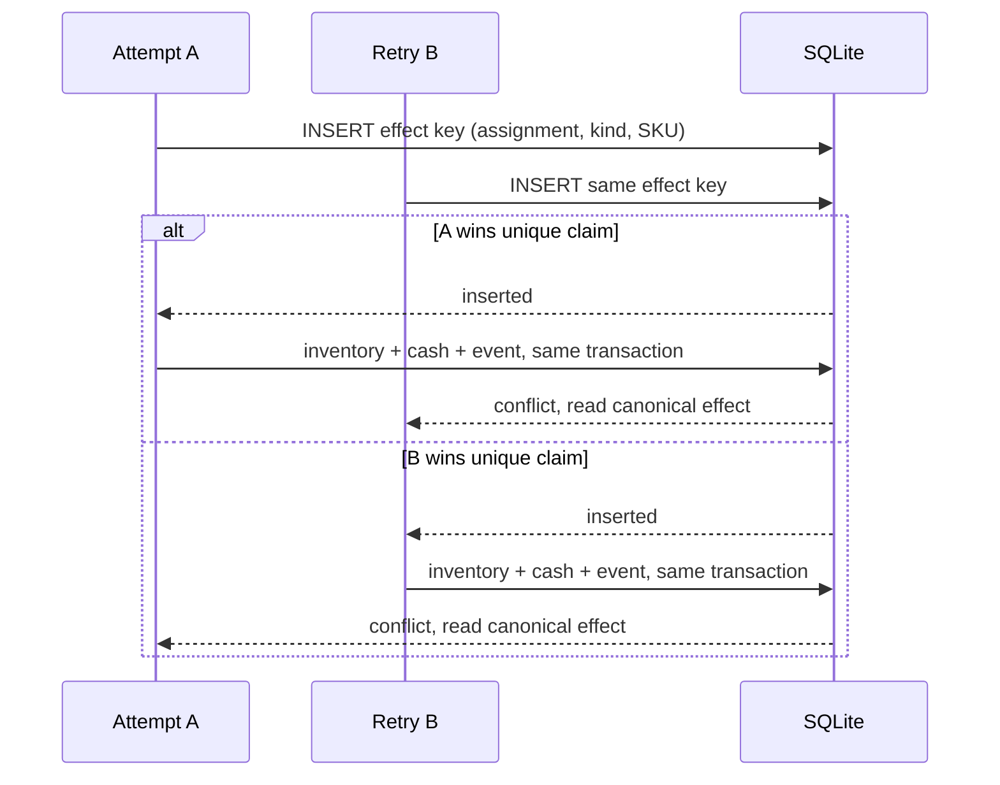
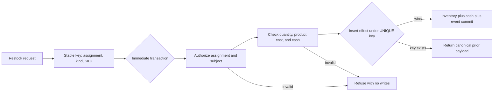

# Chapter 11 — Replenishment scales without losing governance

Here is the failure mode that ends most "it works!" demos: the guarantee that
held beautifully for one order quietly breaks the first time two orders run at
once. Two restocks in flight, and an effect meant for vanilla lands on chocolate;
or a retried order double-charges because "we already did this" was checked in
Python a heartbeat too late. A guarantee that only holds when the shop is quiet is
worse than no guarantee at all, because you will have learned to trust it.

So this chapter does the unglamorous, essential thing: it runs *two* complete
governed replenishment chains — every step you have built, from the self-woken
signal all the way to acceptance — and checks that every property still holds with
two SKUs in play. Nothing new is introduced. That is the point: scaling should
add products, not exceptions.

One honest caveat about *how* it checks. This chapter's own exercise runs the two
chains **sequentially**, one after the other — enough to prove the ledger keeps
each SKU's effects, idempotency, and acceptance separate. The sharper property —
that two chains running *genuinely at the same time*, on two database connections,
still produce exactly one canonical effect each — is proven by a dedicated
two-connection concurrency test named in the verification command below, not by
this sequential run. The referenced test is where the race actually happens; the
prose here does not pretend the sequential exercise demonstrates simultaneity.

## Learning objective

Run TWO full governed replenishment chains to completion — Pulse-created
SOW, assignment, provider proposal, `apply_restock`, verification, review,
acceptance — and prove that scaling from one SKU to two loses none of the
governance properties Chapters 0-7 already established: no effect can be
attributed to the wrong assignment, and `apply_restock`'s own idempotency
holds independently for each SKU's own assignment.

## Vocabulary this chapter adds

None new — this chapter combines every mechanism Chapters 0-10 already
named (outcome, SOW, assignment, effect, verification, review, acceptance,
wake gate, Pulse) and proves they compose correctly at more than one SKU.

## Exactly once is a ledger property, not an execution count

Distributed and retried systems rarely execute a function exactly once. The
useful guarantee is that repeated attempts converge on one canonical effect:



**Figure:** Competing attempts may both execute, but a unique effect key admits one transactional winner and makes every retry return the same canonical result.

The idempotency key names the **logical operation**, not the process attempt. In
production it is `(assignment_id, kind, subject)`. A retry of the same
assignment and SKU is the same operation and must return the canonical result. A
different assignment for the same SKU is new authorized work. The same
assignment aimed at a different SKU must not collide. Choosing only `sku` would
suppress future legitimate restocks; choosing an attempt UUID would allow every
retry to charge again.

Atomic placement of the unique claim matters. A preflight `SELECT` followed by
an `INSERT` leaves a gap in which both callers observe absence. The uniqueness
constraint must arbitrate at the write boundary, and inventory, cash, event, and
effect must share the transaction so no caller can win the claim without also
committing the business effect.

### Three scaling dimensions

| Dimension | Failure exposed | Required evidence |
| --- | --- | --- |
| More subjects | vanilla work mutates chocolate | two distinguishable SKUs and subject assertions |
| More attempts | retry double-charges | same logical key replayed |
| More processes | check-then-act race | separate connections synchronized at the contested write |

The chapter exercise covers subjects and retries sequentially. The named
two-connection test covers process concurrency. Being explicit about which
dimension an experiment varies is how a demonstration becomes evidence rather
than theater.

## Build the restock yourself, then double-order under retry

Production paid a specific bill here, and its own docstring names it: "An
earlier version scanned the event log and validated cash before opening its
transaction, so two concurrent retries both passed the scan and both
ordered: on_hand went to 14 with two purchase entries." Reproduce that exact
failure, to the digit, then repair it.

```python
import sqlite3

db = sqlite3.connect(":memory:")
db.executescript("""
    CREATE TABLE inventory (sku TEXT PRIMARY KEY, on_hand INT, reorder INT);
    CREATE TABLE cash_entries (id INTEGER PRIMARY KEY, amount_cents INT NOT NULL);
    CREATE TABLE assignments (id TEXT PRIMARY KEY);
    CREATE TABLE effects (id INTEGER PRIMARY KEY, assignment_id TEXT, kind TEXT,
                          subject TEXT, payload TEXT,
                          UNIQUE(assignment_id, kind, subject));
""")
db.execute("INSERT INTO inventory VALUES ('SKU-TEA', 2, 3)")
db.execute("INSERT INTO cash_entries(amount_cents) VALUES (4000)")  # opening cash
db.execute("INSERT INTO assignments VALUES ('asg-1')")
db.execute("INSERT INTO assignments VALUES ('asg-2')")
db.execute("INSERT INTO assignments VALUES ('asg-3')")
db.commit()


def state(db):
    on_hand = db.execute("SELECT on_hand FROM inventory WHERE sku = 'SKU-TEA'").fetchone()[0]
    entries = db.execute("SELECT COUNT(*) FROM cash_entries WHERE amount_cents < 0").fetchone()[0]
    cash = db.execute("SELECT SUM(amount_cents) FROM cash_entries").fetchone()[0]
    return f"on_hand={on_hand} purchase_entries={entries} cash={cash}c"


print(state(db))
```

```text
on_hand=2 purchase_entries=0 cash=4000c
```

The `UNIQUE(assignment_id, kind, subject)` on `effects` is the chapter's
protagonist. It looks like a data-hygiene constraint. It is a concurrency
mechanism.

### Break it: scan first, order later

The tempting shape: check whether this restock already happened, and if
not, do it. Two retries of the same assignment arrive close together — both
scan **before** either writes:

```python
def restock_naive(db, sku, quantity, unit_cost, already_done_seen):
    if already_done_seen:
        return "skipped: already restocked"
    db.execute("UPDATE inventory SET on_hand = on_hand + ? WHERE sku = ?", (quantity, sku))
    db.execute("INSERT INTO cash_entries(amount_cents) VALUES (?)", (-quantity * unit_cost,))
    db.commit()
    return f"ordered {quantity} {sku}"


done_a = db.execute("SELECT COUNT(*) FROM effects WHERE assignment_id = 'asg-1'").fetchone()[0] > 0
done_b = db.execute("SELECT COUNT(*) FROM effects WHERE assignment_id = 'asg-1'").fetchone()[0] > 0
print("retry-a scanned first, saw done:", done_a, "| retry-b scanned too, saw done:", done_b)
print(restock_naive(db, "SKU-TEA", 6, 250, done_a))
print(restock_naive(db, "SKU-TEA", 6, 250, done_b))
print(state(db))
```

```text
retry-a scanned first, saw done: False | retry-b scanned too, saw done: False
ordered 6 SKU-TEA
ordered 6 SKU-TEA
on_hand=14 purchase_entries=2 cash=1000c
```

`on_hand=14 purchase_entries=2` — the production docstring's exact numbers,
resurrected. Lucy paid twice, twelve tubs arrive for a freezer that needed
six, and both retries behaved "correctly" against what they saw. Chapter 9's
oversell race, mirrored: there stale reads sold stock twice; here they
*bought* it twice.

### Repair: the claim is a row, not a scan

Everything that decides — the idempotency claim, the authorization, the cash
check — moves **inside** the transaction that acts, and the claim itself
becomes an insert under the `UNIQUE` constraint:

**Listing:** Converge retries on one canonical restock effect

```python
db.execute("UPDATE inventory SET on_hand = 2 WHERE sku = 'SKU-TEA'")
db.execute("DELETE FROM cash_entries WHERE amount_cents < 0")
db.commit()


def apply_restock(db, sku, quantity, unit_cost, assignment_id):
    db.execute("BEGIN IMMEDIATE")
    existing = db.execute(
        "SELECT payload FROM effects WHERE assignment_id = ? AND kind = 'replenishment'"
        " AND subject = ?",
        (assignment_id, sku),
    ).fetchone()
    if existing is not None:
        db.execute("COMMIT")
        return f"idempotent replay: {existing[0]}"
    known = db.execute(
        "SELECT COUNT(*) FROM assignments WHERE id = ?", (assignment_id,)
    ).fetchone()[0]
    if not known:
        db.execute("ROLLBACK")
        return f"refused: {assignment_id} is not an authorized assignment"
    total = quantity * unit_cost
    cash = db.execute("SELECT SUM(amount_cents) FROM cash_entries").fetchone()[0]
    if total > cash:
        db.execute("ROLLBACK")
        return f"refused: costs {total}c, only {cash}c on hand"
    db.execute("UPDATE inventory SET on_hand = on_hand + ? WHERE sku = ?", (quantity, sku))
    db.execute("INSERT INTO cash_entries(amount_cents) VALUES (?)", (-total,))
    payload = f"{quantity} {sku} for {total}c"
    db.execute(
        "INSERT INTO effects(assignment_id, kind, subject, payload)"
        " VALUES (?, 'replenishment', ?, ?)",
        (assignment_id, sku, payload),
    )
    db.execute("COMMIT")
    return f"ordered {payload}"


print(apply_restock(db, "SKU-TEA", 6, 250, "asg-1"))
print(apply_restock(db, "SKU-TEA", 6, 250, "asg-1"))
print(state(db))
```

```text
ordered 6 SKU-TEA for 1500c
idempotent replay: 6 SKU-TEA for 1500c
on_hand=8 purchase_entries=1 cash=2500c
```

The retry does not fail, and does not re-order: it returns the **canonical
prior result** — the same payload the winner committed — which is exactly
what a confused retry mechanism needs to hear. In the toy the replay is
caught by the read inside `BEGIN IMMEDIATE`; under genuine two-connection
contention the second claimant's *insert itself* collides with the `UNIQUE`
constraint inside the transaction that does the work, and production
converts that `IntegrityError` into the same canonical replay — the
database refuses the duplicate, so nothing depends on timing.

### The key must name the operation, not the attempt

Idempotency is only as good as the key's identity. Suppose the retry
infrastructure mints a *fresh assignment id per attempt* — or keys the claim
on a timestamp, or a process id:

```python
print(apply_restock(db, "SKU-TEA", 6, 250, "asg-2"))  # same logical restock, fresh id per retry
print(state(db))
```

```text
ordered 6 SKU-TEA for 1500c
on_hand=14 purchase_entries=2 cash=1000c
```

Fourteen again — the naive failure, walked straight back in through the
front door, past a perfectly functioning `UNIQUE` constraint. The mechanism
held; the *key* lied. An idempotency key must be derived from the
operation's **stable identity** — this assignment, this kind, this subject —
never from anything that changes per attempt (time, attempt counters,
process ids), because a key that varies across retries is a key that never
matches, which is no key at all.

### Only once is not the same as allowed

Two more refusals, because idempotency answers "*again*?" and says nothing
about "*may you at all*?":

```python
print(apply_restock(db, "SKU-TEA", 6, 250, "asg-invented"))
print(apply_restock(db, "SKU-TEA", 60, 250, "asg-3"))
print(state(db))
```

```text
refused: asg-invented is not an authorized assignment
refused: costs 15000c, only 1000c on hand
on_hand=14 purchase_entries=2 cash=1000c
```

A fabricated assignment is refused before any money moves — production does
this with `_authorize_effect` plus a foreign key, so an invented assignment
*cannot be named at all* — and a restock the till cannot cover is refused by
a cash check that runs inside the same lock as the writes. Both checks
live **inside** `BEGIN IMMEDIATE` with everything else, because a check
outside the transaction is a scan, and this chapter opened with what scans
are worth.

### One shape, many tools: what each mechanism actually prevents

You have now built five exactly-once-flavored mechanisms across four
chapters. They are not interchangeable:

| Mechanism | Prevents | Does NOT prevent |
| --- | --- | --- |
| Exclusive lock (`BEGIN IMMEDIATE`) | two writers interleaving mid-transaction | a retry re-running the whole transaction later |
| `UNIQUE` constraint | a duplicate row ever existing | the duplicate *attempt* — it only makes it fail loudly |
| Compare-and-set (`WHERE` + rowcount) | acting on a state that already changed | a stale actor acting under a still-matching old state |
| Lease (expiry) | a dead holder blocking forever | a slow holder acting after expiry |
| Fencing token | a stale holder's write becoming canonical | the stale holder from running at all |
| Idempotency key | the same operation charging twice | an *unauthorized* operation charging once |

Read the right column as carefully as the left: every row's gap is filled by
another row. `apply_restock` composes four of them in one function — the
lock serializes, the unique key claims, the derived key names the operation,
and authorization gates the act — which is why the production docstring can
promise that two concurrent retries produce one order *without depending on
timing*.

## Exactly once is a result contract, not an execution count

Distributed systems cannot generally promise that a function body executes
once. A caller can time out after the database commits and retry because it
never saw the response. Two processes can enter the same code. A worker can
crash after an external supplier accepted an order but before the local receipt
was written. The useful promise is narrower: every retry of one stable logical
operation resolves to one canonical effect.



**Figure:** Authorization and business checks precede the unique effect claim; a winner commits inventory, cash, and event changes together, while repeats converge on its stored payload.

Returning the prior payload matters. A duplicate response that merely says
“already done” forces the caller to guess what done means. Returning the
canonical quantity, SKU, cash id, and effect identity lets the retry converge on
the winner's result. Idempotency is not only duplicate suppression; it is a
protocol for making ambiguous delivery converge.

### Classify the crash window

The placement of the key determines which failures it can close:

| Failure moment | If effect and business writes share one transaction | If the supplier is an external API |
| --- | --- | --- |
| before key claim | retry may attempt normally | retry may attempt normally |
| after key claim, before inventory/cash | rollback removes the key and partial writes | a locally claimed key may exist before the remote call; recovery needs an explicit state |
| after inventory/cash, before event | rollback restores every local row | remote side effect may already exist even if local rows roll back |
| after commit, before response | retry reads canonical effect and returns it | retry must query by the same idempotency key, not submit a new order |
| after response | caller has the canonical result | same, provided the supplier honors the key |

The Store reference organization proves the left column. SQLite owns every
business effect involved, so one immediate transaction can make the claim,
inventory, cash, and append-only event indivisible. It does **not** prove the
right column. A real supplier crosses a system boundary. The supplier must
accept a stable idempotency key or expose a lookup that lets recovery reconcile
an ambiguous call. Otherwise exactly-once language is unjustified.

This distinction prevents a common production error: adding a local `effects`
row and assuming it deduplicates an external purchase. If the process crashes
after the supplier accepts but before the local row commits, the retry still
orders twice. The key has to cross the boundary and mean the same logical
operation on both sides.

### Stable identity is designed upstream

The key `(assignment_id, kind, subject)` works because an assignment is the
stable identity of governed work, `kind` distinguishes effect families, and
`subject` separates products. Change any of those per retry and the database
will correctly accept a new row. That is not a constraint failure; it is an
identity-design failure.

Check candidate keys with this table:

| Candidate | Stable across retry? | Separates legitimate operations? | Verdict |
| --- | --- | --- | --- |
| process id | no | accidentally | never |
| timestamp | no | yes | never |
| provider session id | not guaranteed | often | transport identity, not business identity |
| assignment only | yes | no, one assignment may affect more than one subject | too broad |
| assignment + kind + subject | yes | yes for this contract | suitable |
| hash of all request bytes | only if semantically irrelevant fields are normalized | usually | useful only with a canonical request schema |

An idempotency key should be boring to recompute after a crash. If recovery
needs the dead process's memory to reconstruct it, it is not a durable key.

### Idempotency, authorization, and sufficiency are independent

A duplicate-safe operation can still be forbidden. Production therefore runs
`_authorize_effect` inside the same lock: the assignment exists, completed, has
a completed receipt, belongs to an actor with the needed authority, and targets
the same subject as its outcome. Then `_validate_restock_locked` checks the
proposal and current cash. Only after both sets of questions pass may the
effect claim and business writes commit.

Keep the predicates separate in tests:

- same authorized assignment, same SKU, same proposal twice: one effect and the
  canonical prior result;
- same authorized assignment, different SKU: a distinct subject that must also
  agree with the outcome;
- invented assignment: refuse before an effect row exists;
- completed assignment with a failed receipt: refuse;
- authorized assignment with insufficient cash: refuse with inventory and cash
  unchanged;
- two real connections racing the same key: one canonical effect.

If a test asserts only that the final effect count is one, it misses whether the
loser received the correct prior result, whether money moved once, and whether
an unauthorized caller could have been the winner. Exactly once is a graph of
invariants, not one row count.

## The exercise

```bash
uv run python book/ch11_replenishment_scales_without_losing_governance/solution.py --root /tmp/lucy-ch11
```

Read the file first. Both SKUs' signals fire, both get their own canonical
SOW and assignment through the same `run_pulse_once` Chapter 10 already
used, both run through `apply_restock` TWICE each (proving replay
idempotency per SKU), and both reach `ACCEPTED`.

## Expected observations

```json
{
  "both_assignments_completed": { "tea": true, "coffee": true },
  "idempotent_replay_per_sku": {
    "SKU-TEA": {
      "first_call_idempotent_replay": false,
      "second_call_idempotent_replay": true,
      "on_hand_after": 8
    },
    "SKU-COFFEE": {
      "first_call_idempotent_replay": false,
      "second_call_idempotent_replay": true,
      "on_hand_after": 11
    }
  },
  "effects_never_cross_assignments": {
    "each_assignment_authorizes_only_its_own_sku": true,
    "exactly_two_effect_rows": true
  },
  "both_outcomes_accepted": {
    "tea": "out_... ACCEPTED Keep the tea jar stocked",
    "coffee": "out_... ACCEPTED Keep the coffee tin stocked"
  }
}
```

Three facts this run proves:

1. **`second_call_idempotent_replay: true`, for BOTH SKUs.** Calling
   `apply_restock` a second time with the SAME assignment id never moves
   inventory or cash twice — `effects`' own `UNIQUE(assignment_id, kind,
   subject)` constraint (the same constraint from the single-SKU case) refuses the
   second write and returns the first call's own recorded payload instead.
   This is not new behavior; this chapter proves it still holds with two
   assignments in play, not one.
2. **`each_assignment_authorizes_only_its_own_sku: true`.** Reading the
   `effects` table directly: the tea assignment's own effect row names
   `SKU-TEA`; the coffee assignment's own effect row names `SKU-COFFEE`.
   Neither assignment's id appears next to the other SKU anywhere in the
   ledger.
3. **Both outcomes reach `ACCEPTED` independently.** Each SKU's own outcome
   goes through its OWN verify/review/accept sequence — accepting one never
   implicitly accepts or blocks the other.

Confirm it yourself:

```bash
sqlite3 /tmp/lucy-ch11/.sovereign/organization.db <<'SQL'
SELECT assignment_id, subject, kind FROM effects ORDER BY created_at;
SELECT id, state FROM outcomes ORDER BY id;
SQL
```

Expected: two `effects` rows, one per SKU; two `outcomes` rows, both
`ACCEPTED`.

## Learner verification command

```bash
uv run python -m pytest tests/test_store_multi_sku.py -k "assignment_isolation or replenishment_effect or multiple_qualifying"
uv run python -m pytest tests/test_store_multi_sku.py -k "two_real_connections"
uv run python scripts/verify_curriculum.py
```

Expected: all pass. The second command is the REAL two-connection
concurrency proof — two genuinely separate database connections racing two
different SKUs' canonical creation — which this chapter's own sequential
exercise cannot demonstrate by itself.

## Summary

Restocking now depends on `apply_restock`'s idempotency key: `UNIQUE(assignment_id,
kind, subject)` on the `effects` table — and ran two complete governed
replenishment chains, each restocked twice under the same assignment id, to
show every guarantee from Chapters 0-10 composes at more than one SKU
without exception.

The resulting invariant is that "exactly once" is a ledger property,
not an execution count: a retry of the same logical operation returns the
canonical prior result rather than failing or repeating it, because the key
names the operation's stable identity (this assignment, this kind, this
subject), never a per-attempt value like a timestamp or a fresh id.

The chapter reproduces and prevents the double-order to the
digit — `on_hand=14, purchase_entries=2` from one intended restock — by
building the naive "scan first, then act" version and watching two retries
that each saw "not done yet" both place the order.

At Lucy's shop, this guarantee survives past the demo:
two restocks in flight, one for vanilla and one for chocolate, and neither
a retried order nor a busy Saturday can make either SKU's effect land on the
other or get charged twice.

## Explain it back

1. This chapter calls `apply_restock` twice for each SKU, on purpose. What
   specific database constraint makes the second call safe, and where is
   it declared?
2. `effects_never_cross_assignments` reads the `effects` table with one
   plain `SELECT`, no `WHERE assignment_id = ...` filter. Why does reading
   ALL rows, unfiltered, make this a stronger proof than checking one
   assignment's own rows in isolation?
3. This chapter's own exercise runs the two SKUs' chains SEQUENTIALLY, one
   after the other in Python. What property does the concurrency test
   (`test_two_real_connections_racing_two_different_skus_create_two_
   canonical_sows`) prove that this chapter's own sequential run cannot?
4. The wrong-key demo reached `on_hand=14` past a perfectly functioning
   `UNIQUE` constraint. State the rule for what an idempotency key may be
   derived from, and give two things it must never be derived from.
5. The retry received the canonical prior payload rather than an error.
   Which Chapter 7 behavior is this the twin of, and what would a raised
   exception cause a retry loop to do instead?
6. Pick two rows of the mechanism table whose right-column gaps are filled
   by each other, and explain the pairing in one sentence each.
7. "Only once is not the same as allowed." Which check in `apply_restock`
   enforces each half, and why must both run inside `BEGIN IMMEDIATE`
   rather than before it?

## Where to look next

- `src/reference_organizations/store/__init__.py` — `apply_restock`, the
  `UNIQUE(assignment_id, kind, subject)` idempotency constraint
- `tests/test_store_multi_sku.py` — the full isolation matrix, including
  the real two-connection concurrency proof this chapter's own exercise
  cannot show by itself
- `tests/test_store_multi_sku.py::...racing_two_different_skus...` — the
  canonical-creation transaction under genuine concurrent pressure

`solution.py` imports the production package rather than copying it.

Next: [Chapter 12 — The pilot begins with a receipt](../ch12_the_pilot_begins_with_a_receipt/README.md)
