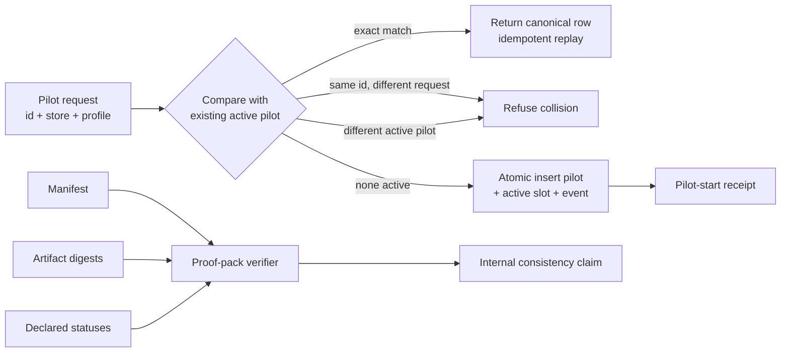
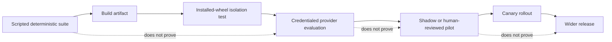

# Chapter 12 — The pilot begins with a receipt

Lucy is ready to let the organization run her shop for real — a trial period, a
pilot. It is the moment everything has been building toward, and it is exactly the
moment a lesser system would start lying. "Pilot started!" it would announce, and
a week later nobody could say for sure whether it actually had, or whether it had
quietly finished, or stalled, or half-begun twice.

This final chapter builds the smallest, most careful version of that first step —
and spends as much energy on what it *doesn't* prove as on what it does. Starting
a pilot leaves a receipt: a durable, queryable record that it began. That receipt
says nothing about whether the pilot has *finished*, and — crucially — the system
does not pretend otherwise, because the machinery to check completion does not
exist. A book about telling the truth ends by drawing the exact line between what
has been proven and what has not.

## Learning objective

Run the pilot-start mechanism, against a disposable
exercise identity, and read back the durable record and event it produces —
then understand precisely why that record proves the pilot **started** and
proves nothing at all about whether it has **finished**.

**A precise word on safety, because this is a book about not overstating things.**
The identity this exercise uses, `book-ch12-exercise-pilot`, carries a reserved
`book-ch12-exercise-` prefix, so it **cannot be confused with the real named
pilot** — the ids are distinguishable by inspection. What the exercise does *not*
do is constrain where it writes: `solution.py` opens whatever `--root` you give
it. The documented command below uses a throwaway `/tmp` path, and you should keep
it that way — point it at a real organization's database and it would write this
exercise pilot there. The safety here is "the id is unmistakable and the default
path is disposable," not "it is impossible by construction." The real pilot start
is a separate, later, separately-authorized act, entirely outside this book.

## Vocabulary this chapter adds

| Term | What it is |
| --- | --- |
| **Pilot-start mechanism** | `start_pilot`: one atomic transaction that writes a queryable `pilots` row and an append-only `pilot.started` event, together or not at all. |
| **Idempotent replay** | Calling `start_pilot` again with the SAME pilot identity never creates a second row or a second event — it returns the first call's own record. |
| **Fail-closed refusal** | A DIFFERENT pilot identity, while one is already active, is refused outright — never silently ignored, never silently allowed to proceed. |
| **Started vs. finished** | This mechanism proves a pilot BEGAN. Nothing in this project claims, or could currently check, that a pilot has ENDED — there is no completion mechanism yet. |

## Two proof boundaries at release time

The final chapter contains two related but distinct proofs. The pilot-start
transaction proves a state transition in one ledger. The proof pack proves that
a collection of release artifacts is internally consistent:



**Figure:** Pilot-start uniqueness and proof-pack consistency are separate boundaries: one governs the live slot, while the other proves only that declared artifacts agree internally.

The left side is a compare-and-set state machine. Replay equality covers the
whole request identity, not only `pilot_id`; otherwise a colliding customer can
receive another customer's canonical record. The single active slot makes
"only one pilot" a database invariant rather than a query performed just before
an insert.

The right side is deliberately weaker than external attestation. A digest proves
that bytes match the manifest. A closed status vocabulary prevents invented
labels. Cross-field rules can reject `NOT_RUN` paired with success language. But
if one untrusted author fabricates both an artifact and the digest describing
it, internal consistency still passes. Authenticity requires an independent
root of trust—such as a CI identity, signed provenance, or credentialed provider
record—that this verifier does not manufacture.

Use this ladder when reading any release claim:

| Level | Claim | Evidence needed |
| --- | --- | --- |
| 1 | Request was received | input record |
| 2 | Pilot start committed | pilot row + active slot + append-only event |
| 3 | Repeated request was the same request | full identity comparison |
| 4 | Pack is internally consistent | schema, cross-field checks, real digests |
| 5 | External action really occurred | independent authenticated provenance |
| 6 | Pilot achieved its outcome | a completion protocol and outcome checks—not implemented |

Stopping at the level actually proven is the final governance skill. A receipt
is valuable precisely because it is narrow enough to be true.

## From local consistency to release provenance

The course material separates deterministic evaluation from deployment in
stages: scripted offline runs, regression fixtures, credentialed provider runs,
shadow traffic, canary exposure, and finally a wider rollout. Each stage answers
a different question. Collapsing them into one green badge creates the release
equivalent of a status file claiming the freezer is full.



**Figure:** Each release environment adds evidence the rung below cannot supply; no deterministic suite, provider evaluation, or reviewed pilot silently proves wider rollout.

The arrows are promotions of evidence, not automatic transitions. A scripted
provider is ideal for reproducibility and fault injection, but cannot prove a
live CLI accepts the same flags. A credentialed run proves one provider call,
not that a human workflow is usable. A pilot start proves the trial began, not
that the trial achieved its outcome. The proof pack should preserve each stage's
status separately so a missing stage remains visible as `NOT_RUN`, never absorbed
into the success of an earlier stage.

For each release claim, bind four identities:

| Identity | Question it answers | Example evidence |
| --- | --- | --- |
| source commit | Which code was reviewed? | full 40-hex commit id |
| built artifact | Which bytes were installed? | wheel filename and SHA-256 |
| execution environment | Where did the check run? | clean environment record and installed package version |
| verifier/result | Which question was answered? | command, exit code, artifact, and status vocabulary |

If the source commit is reviewed but the wheel was built from another tree, the
review does not bind the release. If tests run by importing the checkout instead
of the installed wheel, they do not prove packaging. If a live-provider record
lacks authentication provenance, it may be internally consistent without being
credible. Release evidence is a chain; the weakest missing edge limits the
claim.

### Evaluation should measure trajectories, not only final prose

An agent can produce the correct final answer through an unsafe path. It might
call an unapproved tool first, retry an external mutation, or skip the required
completion record and then write convincing prose. A release evaluation should
therefore inspect the trajectory:

- ordered tool calls and their normalized arguments;
- which role and assignment authorized each effect;
- retry count and stable idempotency identity;
- terminal receipt plus any failure category;
- evidence bindings from check to outcome, assignment, and observed state;
- final world state, re-read independently of the provider's report.

Gold trajectories should not require byte-identical model language. Normalize
the durable structural events and compare the properties that matter: forbidden
tools never appear, the effect graph has one authorized contributor, and every
required terminal step exists. Final-answer grading alone is prompt-only
evaluation in another costume.

### Rollout changes the blast radius, not the proof standard

Shadow mode lets the system propose while a human path remains authoritative.
A canary gives a small real population the new behavior. Both limit damage, but
neither makes a false claim true. Continue to use the same acceptance checks and
incident receipts; add cohort identity so every result can be attributed to the
rollout stage. If the canary fails, stop promotion and preserve its evidence
rather than rewriting the release report around it.

## Build the pilot start yourself, then hand Mo's diner Lucy's data

A pilot start looks like an INSERT. It is a **contract**: the same request
replayed must return the canonical original, a *colliding id with a
different request behind it* must be refused, only one pilot may be active,
and a failed start must strand nothing. Build the version that skips the
second clause and watch what it hands out:

```python
import sqlite3

db = sqlite3.connect(":memory:")
db.executescript("""
    CREATE TABLE pilots (pilot_id TEXT PRIMARY KEY, store_org TEXT, profile TEXT);
    CREATE TABLE active_pilot (slot_id INTEGER PRIMARY KEY CHECK (slot_id = 1),
                               pilot_id TEXT);
""")


def start_naive(db, pilot_id, store_org, profile):
    existing = db.execute(
        "SELECT store_org, profile FROM pilots WHERE pilot_id = ?", (pilot_id,)
    ).fetchone()
    if existing is not None:
        return f"replay: pilot {pilot_id} already started"
    db.execute("INSERT INTO pilots VALUES (?, ?, ?)", (pilot_id, store_org, profile))
    db.commit()
    return f"started pilot {pilot_id} for {store_org}"


print(start_naive(db, "pilot-1", "lucys-shop", "standard"))
print(start_naive(db, "pilot-1", "mos-diner", "premium"))  # a DIFFERENT request, same id
row = db.execute("SELECT store_org, profile FROM pilots WHERE pilot_id = 'pilot-1'").fetchone()
print("who pilot-1 actually belongs to:", row)
```

```text
started pilot pilot-1 for lucys-shop
replay: pilot pilot-1 already started
who pilot-1 actually belongs to: ('lucys-shop', 'standard')
```

Mo's diner asked to start *its* premium pilot, was told "already started,"
and will now read Lucy's standard pilot as if it were its own. The naive
version treated **id collision** as **identity match** — but an id is a
name, and a replay is only a replay when *the whole request* matches.
Same-id-different-request is not a retry; it is a different customer
holding the same ticket number.

### Replay on exact identity; refuse everything else

**Listing:** Start or replay one pilot identity atomically

```python
def start_pilot(db, pilot_id, store_org, profile):
    db.execute("BEGIN IMMEDIATE")
    try:
        db.execute("INSERT INTO pilots VALUES (?, ?, ?)", (pilot_id, store_org, profile))
    except sqlite3.IntegrityError:
        db.execute("ROLLBACK")
        existing_store, existing_profile = db.execute(
            "SELECT store_org, profile FROM pilots WHERE pilot_id = ?", (pilot_id,)
        ).fetchone()
        if (existing_store, existing_profile) != (store_org, profile):
            return (
                f"refused: {pilot_id} already exists with DIFFERENT identity"
                f" ({existing_store}/{existing_profile})"
            )
        return f"replay: {pilot_id} is canonical, identity matches exactly"
    try:
        db.execute("INSERT INTO active_pilot VALUES (1, ?)", (pilot_id,))
    except sqlite3.IntegrityError:
        db.execute("ROLLBACK")
        active = db.execute("SELECT pilot_id FROM active_pilot").fetchone()[0]
        return f"refused: {active} is already the active pilot (one at a time)"
    db.execute("COMMIT")
    return f"started {pilot_id}, now active"


db.execute("DELETE FROM pilots")
db.commit()
print(start_pilot(db, "pilot-1", "lucys-shop", "standard"))
print(start_pilot(db, "pilot-1", "lucys-shop", "standard"))  # the exact same request again
print(start_pilot(db, "pilot-1", "mos-diner", "premium"))  # the collision
print(start_pilot(db, "pilot-2", "mos-diner", "premium"))  # a second active pilot
```

```text
started pilot-1, now active
replay: pilot-1 is canonical, identity matches exactly
refused: pilot-1 already exists with DIFFERENT identity (lucys-shop/standard)
refused: pilot-1 is already the active pilot (one at a time)
```

Four calls, four different verdicts, each earned by a different clause. The
collision path reads the **canonical durable row first** and compares every
identity-defining field before trusting anything as a replay — production's
`start_pilot` does exactly this, with its refusal explaining that a reused
id with different fields "is an incompatible start under a reused id, not a
replay." The singleton `active_pilot` slot (`CHECK (slot_id = 1)`) is
Chapter 8's structural-assumption trick used *on purpose*: here, one-at-a-
time is the requirement, so the schema enforces it.

And the fourth call hides the fourth clause. `pilot-2`'s start had already
written its `pilots` row when the slot refused it — where did that row go?

```python
count = db.execute("SELECT COUNT(*) FROM pilots WHERE pilot_id = 'pilot-2'").fetchone()[0]
print("orphaned pilot-2 rows after the refusal:", count)
```

```text
orphaned pilot-2 rows after the refusal: 0
```

The `ROLLBACK` in the slot-refusal path took the pilot row with it — one
transaction, so a refused start strands nothing. A pilot that exists but
was never allowed to activate would be exactly the half-woken orphan
Chapter 7's creation transaction refused to leave behind.

## Build the proof pack yourself, then forge one

The pilot ran; the release ships; and what travels with it is a **proof
pack**: artifacts plus a manifest binding each to a digest and an honest
status. Build a small one, honestly — including the honest `NOT_RUN` for
what this environment genuinely cannot run:

```python
import hashlib
import json
import pathlib
import tempfile

pack = pathlib.Path(tempfile.mkdtemp())
(pack / "gates.txt").write_text("pytest: 413 passed\nruff: clean\n")
(pack / "live-provider.txt").write_text("NOT RUN: no credentials in this environment\n")


def digest(path):
    return hashlib.sha256(path.read_bytes()).hexdigest()


manifest = {
    "artifacts": [
        {"path": "gates.txt", "sha256": digest(pack / "gates.txt"), "status": "PASS"},
        {
            "path": "live-provider.txt",
            "sha256": digest(pack / "live-provider.txt"),
            "status": "NOT_RUN",
            "note": "no credentials in this environment",
        },
    ]
}
(pack / "manifest.json").write_text(json.dumps(manifest, indent=2))


def verify_pack(pack):
    problems = []
    manifest = json.loads((pack / "manifest.json").read_text())
    for artifact in manifest["artifacts"]:
        path = pack / artifact["path"]
        if not path.is_file():
            problems.append(f"missing artifact: {artifact['path']}")
            continue
        if digest(path) != artifact["sha256"]:
            problems.append(f"digest mismatch: {artifact['path']}")
        note = artifact.get("note", "").lower()
        if artifact["status"].startswith("NOT_RUN") and ("pass" in note or "success" in note):
            problems.append(f"dishonest NOT_RUN: {artifact['path']} claims success in prose")
    return problems or ["pack internally consistent"]


print(verify_pack(pack))
```

```text
['pack internally consistent']
```

### The lies it catches

```python
(pack / "gates.txt").write_text("pytest: 999999 passed, definitely\n")  # a quiet edit
print(verify_pack(pack))

(pack / "gates.txt").write_text("pytest: 413 passed\nruff: clean\n")  # restore the bytes
manifest["artifacts"][1]["note"] = "not run but it definitely would pass"
(pack / "manifest.json").write_text(json.dumps(manifest))
print(verify_pack(pack))
```

```text
['digest mismatch: gates.txt']
['dishonest NOT_RUN: live-provider.txt claims success in prose']
```

The first lie is tampering: bytes changed after the manifest bound them.
The second is subtler and important enough that the production verifier
names it explicitly: **"NOT_RUN means PASS" prose** — an honest status
wearing dishonest commentary. `NOT_RUN` with a reason is one of the most
truthful things a release can say; `NOT_RUN` with "it would definitely
pass" is a claim of success with the evidence requirement quietly deleted.
The production `verify_proof_pack.py` checks the same families and more:
allowed status vocabularies, path containment, secret-shaped content, and
this exact lie-scan.

### The lie it structurally cannot catch

Now forge properly. Change the artifact **and** its manifest digest,
together, and keep every status-note pair honest-looking:

```python
(pack / "gates.txt").write_text("pytest: 999999 passed, definitely\n")
manifest["artifacts"][0]["sha256"] = digest(pack / "gates.txt")  # forge BOTH sides together
manifest["artifacts"][1]["note"] = "no credentials in this environment"
(pack / "manifest.json").write_text(json.dumps(manifest))
print(verify_pack(pack))
```

```text
['pack internally consistent']
```

A fully fabricated pack, and the verifier — *correctly executing every one
of its checks* — calls it consistent. This is not a bug to fix with a
fourth check inside the pack: any check that lives in the pack can be
forged along with the pack, agreeing with itself perfectly. It is the
boundary this whole book has been drawing since Chapter 2's Exercise 6:
**internal consistency is not authenticity.** The digests prove the
manifest and the bytes agree; they cannot prove *who* made them agree, or
that the gates ever ran. What closes that gap lives *outside* the pack, or
it does not close: a signing key the packer never holds, or a third party
independently re-running the gates and comparing. The production verifier
says this about itself, in its own docstring: it exits 0 when the manifest
is "well-formed and internally truthful," and it "does NOT claim the
manifest is COMPLETE" — a named refusal to overclaim, and the most
load-bearing sentence in it. A release process that understands exactly which door is
open is safer than one that believes every door is shut. That is where
this book ends, because it is where honest engineering begins.

## The exercise

```bash
uv run python book/ch12_the_pilot_begins_with_a_receipt/solution.py --root /tmp/lucy-ch12
```

Read the file first, and read `EXERCISE_PILOT_ID`'s own comment before running
anything: the exercise id is unmistakable and the documented path is disposable —
keep the `/tmp` root so this writes only to a throwaway database.

## Lab: falsify the release chain

This lab tests the edges between source, artifact, and claim rather than adding
another happy-path pilot. Work on a copy of a proof pack, never the release
record itself:

1. run `scripts/verify_proof_pack.py` and record the clean result;
2. change one artifact byte without updating its digest, then confirm the
   verifier refuses the mismatch;
3. restore the artifact, change a provider status to a `NOT_RUN` value, and add
   success-shaped prose beside it; confirm the lie scan refuses it;
4. update both an artifact and its digest together and observe that internal
   consistency can pass;
5. write down the external evidence that would be needed to distinguish the
   forged pair from an authentic run.

The expected result is not “every forgery fails.” Step 4 is the important
counterexample: it should teach you the verifier's boundary. If it fails only
because you accidentally broke schema shape, repair the schema and repeat until
the forged artifact-digest pair is internally consistent. Then explain why a CI
identity, signature, or independent rerun changes the trust boundary while one
more self-authored checksum does not.

## Expected observations

```json
{
  "disposable_identity": {
    "exercise_pilot_id": "book-ch12-exercise-pilot",
    "structurally_distinct_prefix": true
  },
  "first_start": { "idempotent_replay": false },
  "replay": { "idempotent_replay": true, "same_started_at_as_first": true },
  "durable_record": {
    "pilot_row_exists": true,
    "store_org_id": "book-ch12-exercise-store-org",
    "pilot_profile_id": "book-ch12-exercise-profile",
    "evidence_namespace": "book-ch12-exercise-evidence-ns"
  },
  "durable_event": {
    "pilot_started_event_count": 1,
    "exactly_one_despite_the_replay_above": true
  },
  "no_duplicate_pilot_row": { "pilots_row_count": 1 },
  "active_pilot": { "pilot_id": "book-ch12-exercise-pilot" },
  "started_is_not_finished": {
    "no_completion_table_exists": true
  }
}
```

Four facts this run proves:

1. **`idempotent_replay: false` then `true`.** The first call genuinely
   creates the pilot; the second call, with the identical identity, is
   recognized as a replay and returns the SAME record — never a second one.
2. **`exactly_one_despite_the_replay_above: true`.** Two calls to
   `start_pilot`, only one `pilot.started` event in the append-only log.
   This is the CAS discipline this project has used throughout
   (`relay.claim()`, `fencing.acquire_actor_lease()`), applied here to a
   pilot's own identity.
3. **`pilots_row_count: 1`.** Not a count this exercise computed in Python
   — read directly from the `pilots` table after both calls.
4. **`no_completion_table_exists: true`.** Read this claim exactly as narrow as
   it is: *no table whose name matches the completion pattern exists* in this
   database. That is a weak check on purpose, and worth being honest about — a
   completion mechanism hiding in a status column, an event kind, or a
   differently-named table would slip right past a table-name search. What this
   chapter can say truthfully is that it starts a pilot and makes no claim about
   finishing one, because it implements no completion step. Proving the *absence*
   of a capability rigorously would need an explicit supported-capabilities
   contract, not a name match — a good example of not letting a detector claim
   more than it measures.

Confirm it yourself:

```bash
sqlite3 /tmp/lucy-ch12/.sovereign/organization.db <<'SQL'
SELECT pilot_id, started_at, store_org_id FROM pilots;
SELECT pilot_id FROM active_pilot;
SELECT COUNT(*) FROM events WHERE kind = 'pilot.started';
SQL
```

Expected: one `pilots` row, one `active_pilot` row, and `1` for the event
count.

## Learner verification command

```bash
uv run python -m pytest tests/test_pilot.py
uv run python scripts/verify_curriculum.py
```

Expected: all pass. `tests/test_pilot.py` is where this mechanism's
idempotency, fail-closed refusal, atomicity, and REAL two-connection
concurrency are proven exhaustively — this chapter's own exercise shows you
one slice of that proof matrix, running.

## Summary

The final mechanism makes `start_pilot` a compare-and-set state machine: exact
identity replay returns the canonical row, a colliding id with a different
request refuses outright, a singleton `active_pilot` slot enforces one
pilot at a time as a schema constraint, and a refused start strands nothing
because the pilot row and the active-slot claim share one transaction — and
a proof-pack verifier that checks a manifest's digests and status
vocabulary for internal consistency.

Its sharpest invariant is that internal
consistency is not authenticity. A forged pack that rewrites both an
artifact and its manifest digest together passes every check this
verifier can run, and the chapter proves that by forging one and watching
it pass.

Where it can, it prevents the confident half-truth: "pilot
started" standing in for "pilot finished," or a `NOT_RUN` status dressed in
success-shaped prose — and it prevents the failure it cannot yet check
(a completion protocol does not exist) by refusing to claim it can, which is
itself the load-bearing act.

For Lucy, this is the difference between a receipt that says the
delivery truck left the warehouse and a receipt that says the ice cream
arrived — the book ends by handing you the first receipt, honestly labeled,
and refusing to forge the second.

## Explain it back

1. This chapter calls `start_pilot` twice with the SAME identity. What
   would happen, concretely — which table, which constraint — if you
   instead called it a second time with a DIFFERENT pilot identity?
2. `EXERCISE_PILOT_ID` carries a `book-ch12-exercise-` prefix. What makes
   this a STRUCTURAL guarantee against ever touching a real pilot, rather
   than merely a naming convention a careless caller could ignore?
3. `no_completion_table_exists` checks for a table matching
   `%pilot%complet%`. Why does this chapter check for the ABSENCE of a
   mechanism, rather than simply not mentioning completion at all?
4. `tests/test_pilot.py` proves fail-closed refusal and real two-connection
   concurrency — properties this chapter's own single-process exercise does
   not exercise. Why does this chapter still count as proof that the
   mechanism WORKS, even though it does not run those tests itself?
5. The naive `start_naive` answered Mo's diner with "replay: pilot pilot-1
   already started." Name the exact comparison the honest `start_pilot`
   performs before it is allowed to say the word "replay," and say why
   comparing the id alone can never be enough.
6. After `start_pilot(db, "pilot-2", ...)` was refused by the singleton
   `active_pilot` slot, the orphan check found zero `pilot-2` rows — yet
   the function HAD already inserted one. Trace where that row went, and
   name the chapter-7 failure mode that would exist if it hadn't.
7. The forge-both-sides mutation rewrote `gates.txt` AND its manifest
   digest together, and `verify_pack` reported the pack internally
   consistent. Why can no additional check ADDED INSIDE THE PACK ever
   close this hole, and what are the two things named in this chapter
   that live outside the pack and could?

## Where to look next

- `src/reference_organizations/store/pilot.py` — `start_pilot`,
  `active_pilot_id`, the full mechanism
- `src/sovereign_agent/database.py` — migration 16, the `pilots` and
  `active_pilot` schema
- `tests/test_pilot.py` — the full pilot-start proof matrix: the
  different-identity refusal and the two-connection race, which together show
  the pilot's identity is claimed exactly once, atomically, or not at all

`solution.py` imports the production package rather than copying it.

You have now completed all twelve chapters — and built, from an empty
directory, an organization that remembers, refuses, fences, recovers, wakes
itself, scales, and can begin a pilot without lying about it. That last verb is
the one that matters. At every boundary this book named exactly what it had not
yet done, and it ends the same way: the real, live 30-day pilot has not started
here — only a disposable exercise identity has. Starting it for real, running it,
and judging whether it succeeded are the next work, beyond this book. Knowing
precisely where the proven part ends is not a limitation of the system. It is the
system.
